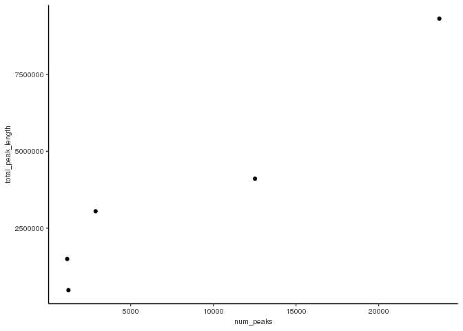
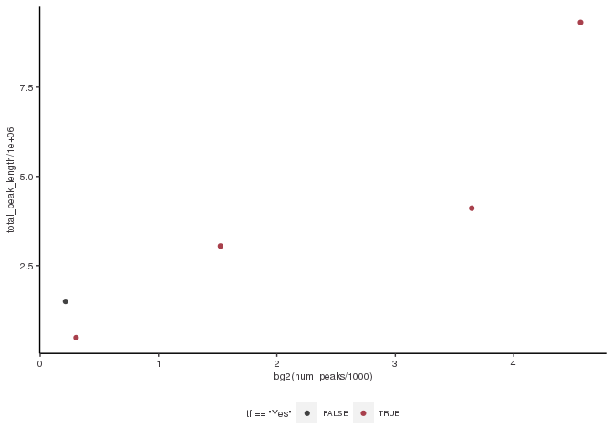
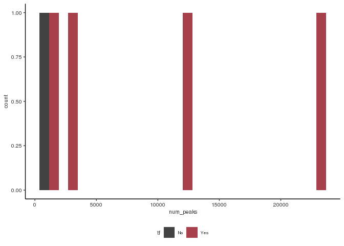
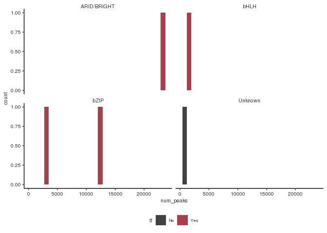

Class\_exercise
================
Dakota Hunt
3/16/2023

# Load the libraries you need

# Load functions you need “my\_class\_functions”

# load in your peak files for each replicate of each protein

# Here I am starting to analyze my data for my proteins of interest: ARID3A, ATF3, BHLHE40, BRCA1, CEBPB

# First I will read in each replicate file

``` r
# filepath to import peaks
broadpeakfilepath <- "/scratch/Shares/rinnclass/CLASS_2023/kurt/CLASS_2023/group_chip/Dakota/results/bwa/mergedLibrary/macs/broadPeak"
# import peaks to peak_list object
peak_list <- import_peaks(consensus_file_path = broadpeakfilepath)
# printing out a table of the number of peaks in each file:
peak_num <- sapply(peak_list, length) %>% as.data.frame(row.names = T)
```

    ## Warning in as.data.frame.integer(., row.names = T): 'row.names' is not a
    ## character vector of length 18 -- omitting it. Will be an error!

``` r
# label column
names(peak_num) <- c("num_peaks")
peak_num
```

    ##            num_peaks
    ## ARID3A_R1      47962
    ## ARID3A_R2      30842
    ## ATF3_R1         3848
    ## ATF3_R2        35018
    ## ATF3_R3        49209
    ## ATF3_R4        60518
    ## BHLHE40_R1     18183
    ## BHLHE40_R2      2618
    ## BHLHE40_R3     10119
    ## BHLHE40_R4      8074
    ## BRCA1_R1        2212
    ## BRCA1_R2        4073
    ## BRCA1_R3       44978
    ## BRCA1_R4       44173
    ## CEBPB_R1       47888
    ## CEBPB_R2       26625
    ## CEBPB_R3       53316
    ## CEBPB_R4      187109

# Now I am going to create consensus peaks for each protein

``` r
dbps <- unique(sapply(names(peak_list), function(x) {
   unlist(strsplit(x, "_"))[1]
}))

consensus_list <- lapply(dbps, consensus_from_reduced, peak_list)
names(consensus_list) <- dbps

# Exporting consensus peaks to results folder
basepath <- "/scratch/Shares/rinnclass/CLASS_2023/dahu3610"
consensus_path <- "CLASS_2023/CLASSES/05_R_analyses/DH_class_exercise/results/consensus_peaks/"
exportpath <- file.path(basepath, consensus_path)

for(i in 1:length(consensus_list)) {
rtracklayer::export(consensus_list[[i]], paste0(exportpath, names(consensus_list)[i], "_consensus_peaks.bed") )}
```

# Now I am going to make my consensus peaks compatible with UCSC genome browser

``` r
consensus_file_list <- list.files("/scratch/Shares/rinnclass/CLASS_2023/dahu3610/CLASS_2023/CLASSES/05_R_analyses/DH_class_exercise/results/consensus_peaks", full.names = T, pattern = ".bed")

peaks <- lapply(consensus_file_list, read.table, col.names = c("chr", "start", "end", "name", "score", "strand"))
names(peaks) <- dbps

# Make canonical chromosomes object
canonical_chr <- c(paste0("chr", 1:22), "chrM", "chrX", "chrY")
# Use lapply with filter function to canonical_chr
peaks <- lapply(peaks, function(x) x %>% filter(chr %in% canonical_chr))
new_filenames <- paste0("results/consensus_peaks/", names(peaks), "_consensus.bed")

# Write to results folder
for(i in 1:length(peaks)) {
  write.table(peaks[[i]], new_filenames[[i]],
              sep = "\t", col.names = FALSE, row.names = FALSE,
              quote = FALSE, append = TRUE)
}

# print out consensus peak files in a results/UCSC directory
headers <- paste0("track type=bed name=", names(peaks))
headers
```

    ## [1] "track type=bed name=ARID3A"  "track type=bed name=ATF3"   
    ## [3] "track type=bed name=BHLHE40" "track type=bed name=BRCA1"  
    ## [5] "track type=bed name=CEBPB"

``` r
# Creating a path to export after adding header, putting in UCSC_consensus_peaks folder
new_filenames <- paste0("results/UCSC_consensus_peaks/", names(peaks), ".bed")
new_filenames
```

    ## [1] "results/UCSC_consensus_peaks/ARID3A.bed" 
    ## [2] "results/UCSC_consensus_peaks/ATF3.bed"   
    ## [3] "results/UCSC_consensus_peaks/BHLHE40.bed"
    ## [4] "results/UCSC_consensus_peaks/BRCA1.bed"  
    ## [5] "results/UCSC_consensus_peaks/CEBPB.bed"

``` r
# Add headers and write table
for(i in 1:length(peaks)) {
  # Write the header line
  writeLines(headers[[i]], new_filenames[[i]])
  # Append the broadPeak table data
  
  write.table(peaks[[i]], new_filenames[[i]],
              sep = "\t", col.names = FALSE, row.names = FALSE,
              quote = FALSE, append = TRUE)
}
```

# I am curious if my proteins are transcription factors so I will use the annotations

# in a cell paper I found and see

``` r
url <- "https://www.cell.com/cms/10.1016/j.cell.2018.01.029/attachment/ede37821-fd6f-41b7-9a0e-9d5410855ae6/mmc2.xlsx"

# Download file from url to results folder
destination_for_url <- "results/TF_annotations.xlsx"
download.file(url, destination_for_url)


human_tfs <- readxl::read_excel("results/TF_annotations.xlsx",
                                sheet = 2, skip = 1)
```

    ## Warning: Expecting logical in M1006 / R1006C13: got 'Contains a SANT and
    ## multiple DNA-binding C2H2 domains. Motif is 99% AA ID from mouse (Transfac).'

    ## Warning: Expecting logical in M1021 / R1021C13: got 'Close ortholog (PP1RA)
    ## binds to mRNA; single-stranded DNA (ssDNA); poly(A) and poly(G) homopolymers
    ## (Uniprot)'

    ## Warning: Expecting logical in M1542 / R1542C13: got 'Contains 1 SANT domain'

    ## Warning: Expecting logical in M1543 / R1543C13: got 'Contains 2 Myb DBDs.
    ## Sources of Hocomoco/Transfac motifs are unclear. However these sequences look
    ## similar to in vitro sites selected by SELEX (PMID:11082045)'

    ## Warning: Expecting logical in M1544 / R1544C13: got 'Although CHD2 has weak
    ## similarity to a Myb domain (PMID:9326634), it's more closely related to the
    ## non-DNA-binding SANT domain based on our alignment analysis. The data showing
    ## that show that CHD2 binding histone H3.3 (PMID:22569126) further support the
    ## conclusion that the Myb domain is probably a SANT domain facilitating the
    ## histone interaction'

    ## Warning: Expecting logical in M1545 / R1545C13: got 'Contains a single SANT
    ## domain, no evidence for sequence-specific DNA binding'

    ## Warning: Expecting logical in M1546 / R1546C13: got 'Contains 2 Myb DBDs'

    ## Warning: Expecting logical in M1547 / R1547C13: got 'Contains 2 SANT domains,
    ## and no other putative DNA-binding domains'

    ## Warning: Expecting logical in M1548 / R1548C13: got 'Contains 2 SANT domains,
    ## and no other putative DNA-binding domains'

    ## Warning: Expecting logical in M1549 / R1549C13: got 'Contains a single SANT
    ## domain, no evidence for sequence-specific DNA binding'

    ## Warning: Expecting logical in M1550 / R1550C13: got 'Domain is truncated, and
    ## there is nothing known about this gene'

    ## Warning: Expecting logical in M1551 / R1551C13: got 'Contains a single SANT
    ## domain, no evidence for sequence-specific DNA binding'

    ## Warning: Expecting logical in M1552 / R1552C13: got 'MIER2's Myb domain is more
    ## similar to the non-DNA-binding SANT domain'

    ## Warning: Expecting logical in M1553 / R1553C13: got 'MIER3's Myb domain is more
    ## similar to the non-DNA-binding SANT domain'

    ## Warning: Expecting logical in M1554 / R1554C13: got 'Contains 1 SANT domain,
    ## and a SANTA domain'

    ## Warning: Expecting logical in M1555 / R1555C13: got 'Contains a single Myb-like
    ## domain with an insertion in the middle. It is ambiguous whether Myb-like
    ## domains are DNA or protein binding. Since it has a single domain it's likely
    ## non-specific, but future experiments should be performed to assay it's
    ## specificity'

    ## Warning: Expecting logical in M1556 / R1556C13: got 'Contains 3 Myb DBDs'

    ## Warning: Expecting logical in M1557 / R1557C13: got 'Contains 3 Myb DBDs'

    ## Warning: Expecting logical in M1558 / R1558C13: got 'Contains 3 Myb DBDs'

    ## Warning: Expecting logical in M1559 / R1559C13: got 'Contains a single Myb-like
    ## domain. Mouse ortholog has motif'

    ## Warning: Expecting logical in M1560 / R1560C13: got 'MYSM1 has been shown to
    ## bind DNA ? interaction with DNA requires the MYSM1 Myb but not the SWIRM domain
    ## (PMID:17428495). Domain sequence alignment places it near DNA-binding Myb
    ## domains but scores slightly higher as a SANT rather than Myb domain based on
    ## Prosite patterns. Given that most Myb proteins that bind DNA sequence
    ## specifically have multiple Myb domains in an array this protein could bind DNA
    ## sequence non-specifically with it?s single Myb domain. Future experiments
    ## should assay MYSM1?s specificity'

    ## Warning: Expecting logical in M1561 / R1561C13: got 'Contains 2 SANT domains,
    ## and no other putative DNA-binding domains'

    ## Warning: Expecting logical in M1562 / R1562C13: got 'Contains 2 SANT domains,
    ## and no other putative DNA-binding domains'

    ## Warning: Expecting logical in M1564 / R1564C13: got 'Contains 2 SANT domains,
    ## and no other putative DNA-binding domains'

    ## Warning: Expecting logical in M1565 / R1565C13: got 'Contains 2 SANT domains,
    ## and no other putative DNA-binding domains'

    ## Warning: Expecting logical in M1566 / R1566C13: got 'Contains 2 SANT domains,
    ## and no other putative DNA-binding domains. RCOR3 SANT domains are known to
    ## facilitate PPIs'

    ## Warning: Expecting logical in M1567 / R1567C13: got 'SMARCA1 contains a
    ## truncated Myb-like and SANT domain. Given the presence of the Myb-like domain,
    ## and other domains known to associated with DNA (DEAD box helicase) it likely
    ## associates with DNA non-sequence-specifically'

    ## Warning: Expecting logical in M1568 / R1568C13: got 'Contains a SANT, and
    ## Myb-like domain'

    ## Warning: Expecting logical in M1569 / R1569C13: got 'Contains 1 SANT domain,
    ## and no other putative DNA-binding domains. Motif logos look like bZIP dimeric
    ## binding sites, and are thus likely specificifities of SMARCC1 interactors'

    ## Warning: Expecting logical in M1570 / R1570C13: got 'Contains 1 SANT domain,
    ## and no other putative DNA-binding domains. Motif logos ares likely
    ## specificifities of SMARCC2 interactors'

    ## Warning: Expecting logical in M1571 / R1571C13: got 'Contains only Myb DBDs'

    ## Warning: Expecting logical in M1572 / R1572C13: got 'Contains 1 SANT domain'

    ## Warning: Expecting logical in M1573 / R1573C13: got 'TADA2B contains a single
    ## SANT domain and is thus unlikely to bind DNA'

    ## Warning: Expecting logical in M1574 / R1574C13: got 'Contains a single Myb
    ## domain (with slightly less simialrity to a SANT domain.) This domain has been
    ## shown to be involved in PPIs but this may not be mutually exclusive with
    ## DNA-binding. The sequence-specificity of CCDC79 should be investigated in the
    ## future'

    ## Warning: Expecting logical in M1575 / R1575C13: got 'Contains 1 Myb domain, and
    ## has structural evidence of DNA-binding'

    ## Warning: Expecting logical in M1576 / R1576C13: got 'Motif is inferred from
    ## mouse (92% DBD AA ID)'

    ## Warning: Expecting logical in M1577 / R1577C13: got 'TERF2IP contains a single
    ## Myb-like domain. While it's unclear if TERF2IP (Human Rap1) contacts DNA
    ## directly it has been shown to affect the DNA binding activity of TRF2'

    ## Warning: Expecting logical in M1578 / R1578C13: got 'This protein contains Myb,
    ## and Myb-like domains and is annotated as a Pol1 terminator. TTF1 DNA-binding
    ## has been demonstrated in vitro (PMID: 7597036), but it's specificity has not
    ## been determined'

    ## Warning: Expecting logical in M1579 / R1579C13: got 'Contains 1 Myb DBD'

    ## Warning: Expecting logical in M1580 / R1580C13: got 'Contains a GATA and SANT
    ## domain. Unclear whether the GATA domain is a bona fide DBD as the MTA/RERE
    ## family domains are atypical to human GATA domains (see alignment). In CIS-BP
    ## there is one protein from C.elegans that shares domain homology and binds a
    ## GATA motif (elg-27, ChIP-seq). The GATA ZnF domain of MTA1 is required for it's
    ## interaction with RBBP4 and RBBP7 (PMID:18067919). Full-length protein has been
    ## tried in HT-SELEX and did not yield a motif'

    ## Warning: Expecting logical in M1581 / R1581C13: got 'Contains a GATA and SANT
    ## domain. Unclear whether the GATA domain is a bona fide DBD as the MTA/RERE
    ## family domains are atypical to human GATA domains (see alignment). In CIS-BP
    ## there is one protein from C.elegans that shares domain homology and binds a
    ## GATA motif (elg-27, ChIP-seq). Full-length protein has been tried in HT-SELEX,
    ## and DBD has been tried on PBM - neither yielded motifs'

    ## Warning: Expecting logical in M1582 / R1582C13: got 'Contains a GATA and SANT
    ## domain. Unclear whether the GATA domain is a bona fide DBD as the MTA/RERE
    ## family domains are atypical to human GATA domains (see alignment). In CIS-BP
    ## there is one protein from C.elegans that shares domain homology and binds a
    ## GATA motif (elg-27, ChIP-seq). Hasn't been tried in any in vitro assays'

    ## Warning: Expecting logical in M1583 / R1583C13: got 'Contains a GATA and SANT
    ## domain. Unclear whether the GATA domain is a bona fide DBD as the MTA/RERE
    ## family domains are atypical to human GATA domains (see alignment). In CIS-BP
    ## there is one protein from C.elegans that shares domain homology and binds a
    ## GATA motif (elg-27, ChIP-seq). Has been tried as a DBD in HT-SELEX but did not
    ## yield a motif'

    ## Warning: Expecting logical in M1791 / R1791C13: got 'CNOT3 is a part of the
    ## CCR4-NOT complex involved in mRNA decay'

    ## Warning: Expecting logical in M1932 / R1932C13: got '"Prosite identifies a
    ## low-confidence Myb-like domain (e.g. can?t decide between Myb and SANT) so it?s
    ## probably not a TF"'

    ## New names:
    ## • `` -> `...4`

``` r
# Renamee the 4th column to indicate if it is a TF.
names(human_tfs)[4] <- "is_tf"

consensus_peak_path <- "/scratch/Shares/rinnclass/CLASS_2023/dahu3610/CLASS_2023/CLASSES/05_R_analyses/DH_class_exercise/results/consensus_peaks"
consensus_peaks_files <- list.files(consensus_peak_path, 
                                             pattern = "*_consensus.bed",
                                             full.names = TRUE)
# lapply with import function to make a list of GRanges
consensus_peaks <- lapply(consensus_peaks_files, rtracklayer::import)

# adding DBP name to each list of GRanges from the file name
# note gsub requires no space around or argument ( | )
names(consensus_peaks) <- gsub("/scratch/Shares/rinnclass/CLASS_2023/dahu3610/CLASS_2023/CLASSES/05_R_analyses/DH_class_exercise/results/consensus_peaks/|_consensus.bed","", consensus_peaks_files)

# Intersect gene names that are in  ChIP data and have TF identity.

num_peaks_df <- data.frame("dbp" = names(consensus_peaks),
                           "num_peaks" = sapply(consensus_peaks, length))
length(which(tolower(num_peaks_df$dbp) %in% tolower(human_tfs$Name)))
```

    ## [1] 5

``` r
human_tfs <- human_tfs[tolower(human_tfs$Name) %in% tolower(num_peaks_df$dbp), 1:4]


# Add new column names
names(human_tfs) <- c("ensembl_id",
                      "dbp",
                      "dbd",
                      "tf")

num_peaks_df <- merge(num_peaks_df, human_tfs, all.x = T)
num_peaks_df$total_peak_length <- sapply(consensus_peaks, function(x) sum(width(x)))


# Write csv
write_csv(num_peaks_df, "results/num_peaks_df.csv")
```

# Now I want to compare a protein with a previous analysis

``` r
# The consensus peaks for CEBPB align well with the preaks from previous analyses!
```

# Now I am going to determine how my peaks for each protein overlap annotations of the genome

# First I will find the overlaps between my consensus peaks with promoters of lncRNA and mRNA promoters

``` r
gencode_gr <- rtracklayer::import("/scratch/Shares/rinnclass/CLASS_2023/data/data/genomes/gencode.v32.annotation.gtf")

# Creating gencode_genes
gencode_genes <- gencode_gr[gencode_gr$type == "gene"] 
table(gencode_gr$type)
```

    ## 
    ##           gene     transcript           exon            CDS    start_codon 
    ##          60609         227462        1372308         761508          87662 
    ##     stop_codon            UTR Selenocysteine 
    ##          79913         310193            119

``` r
# Exporg genes gtf file to gene annotations folder
rtracklayer::export(gencode_genes, "results/gene_annotations/gencode_genes.gtf")

# create mRNA gtf and export
mrna_genes <- gencode_genes[gencode_genes$gene_type %in% "protein_coding"] 

rtracklayer::export(mrna_genes, "results/gene_annotations/mrna_genes.gtf")

# create lncRNA gtf and export
lncrna_genes <- gencode_genes[gencode_genes$gene_type %in% "lncRNA"] 

rtracklayer::export(lncrna_genes, "results/gene_annotations/lncrna_genes.gtf")

# create both mRNA and lncRNA annotations together.
mrna_lncrna_genes <- gencode_genes[gencode_genes$gene_type %in% c("protein_coding","lncRNA")]
rtracklayer::export(mrna_lncrna_genes, "results/gene_annotations/mrna_lncrna_genes.gtf")

lncrna_mrna_promoters <- promoters(mrna_lncrna_genes, upstream = 1000, downstream = 1000)
rtracklayer::export(lncrna_mrna_promoters, "results/gene_annotations/lncrna_mrna_promoters.gtf")


# Create annonation of lncRNA and mRNA gene IDs to subset
lncrna_gene_ids <- mrna_lncrna_genes$gene_id[mrna_lncrna_genes$gene_type == "lncRNA"]
mrna_gene_ids <-mrna_lncrna_genes$gene_id[mrna_lncrna_genes$gene_type == "protein_coding"]

# find overlaps of promoters for each protein
promoter_peak_counts <- count_peaks_per_feature(lncrna_mrna_promoters, consensus_peaks, type = "counts")

#Add number of promoter peak overlaps to num_peaks_df
num_peaks_df$peaks_overlapping_promoters <- rowSums(promoter_peak_counts)
```

## results:

\#1) What can you determine from these overlaps? The number of peaks
overlapping lncRNA/mRNA promoters for each protein. Some promoters may
have multiple peaks or a peak may overlap multiple promoters. The ratio
of peaks overlapping promoters to total peaks varies greatly from
protein to protein.

# Now I want to compare the overlaps with lncRNA and mRNA promoters seperately

``` r
# lncRNA promoter overlaps
num_peaks_df$peaks_overlapping_lncrna_promoters <- rowSums(promoter_peak_counts[,lncrna_gene_ids])

# mRNA promoter overlaps
num_peaks_df$peaks_overlapping_mrna_promoters <- rowSums(promoter_peak_counts[,mrna_gene_ids])

# Write to num_peaks_df.csv
write_csv(num_peaks_df, "results/num_peaks_df.csv")
```

## results:

# 1) What is the difference in overlaps between mRNA and lncRNA promoters

For each protein, the majority of peaks overlap mRNA promoters compared
to lncRNA promoters, which makes senses as I believe there are
significantly more mRNa promoters than lncRNA promoters int he genome.

# Now I am going to test if there is more binding over gene bodies than promoters

# I will seperate lncRNA and mRNA gene bodies to find the overlaps

``` r
genebody_peak_counts <- count_peaks_per_feature(mrna_lncrna_genes, 
                                                consensus_peaks, 
                                                type = "counts")


# All gene bodies
num_peaks_df$peaks_overlapping_genebody <- 
  rowSums(genebody_peak_counts)

# lncRNA gene bodies 
num_peaks_df$peaks_overlapping_lncrna_genebody <- rowSums(genebody_peak_counts[,lncrna_gene_ids])

# mRNA gene bodies
num_peaks_df$peaks_overlapping_mrna_genebody <- 
  rowSums(genebody_peak_counts[,mrna_gene_ids])

# Writing csv
write_csv(num_peaks_df, "results/num_peaks_df.csv")

num_peaks_df
```

    ##       dbp num_peaks      ensembl_id         dbd  tf total_peak_length
    ## 1  ARID3A     23669 ENSG00000116017 ARID/BRIGHT Yes           9316873
    ## 2    ATF3      2876 ENSG00000162772        bZIP Yes           3049787
    ## 3 BHLHE40      1234 ENSG00000134107        bHLH Yes            481839
    ## 4   BRCA1      1160 ENSG00000012048     Unknown  No           1496055
    ## 5   CEBPB     12519 ENSG00000172216        bZIP Yes           4109415
    ##   peaks_overlapping_promoters peaks_overlapping_lncrna_promoters
    ## 1                        4601                               1259
    ## 2                        2659                                532
    ## 3                         628                                159
    ## 4                        1481                                286
    ## 5                        1742                                529
    ##   peaks_overlapping_mrna_promoters peaks_overlapping_genebody
    ## 1                             3342                      19847
    ## 2                             2127                       3719
    ## 3                              469                       1162
    ## 4                             1195                       1731
    ## 5                             1213                      10065
    ##   peaks_overlapping_lncrna_genebody peaks_overlapping_mrna_genebody
    ## 1                              4527                           15320
    ## 2                               722                            2997
    ## 3                               233                             929
    ## 4                               306                            1425
    ## 5                              2291                            7774

## results:

# 1) Do my proteins have more overlaps with promoters or genebodies?

Each peak has more overlaps with gene bodies compared to promoters,
however the ratio varies greatly between proteins. CEBPB and ARID3A
vastly favor gene bodies whereas the other 3 proteins have closer to a
50:50 ratio.

# It is nice and all to find overlaps, but I am interested in how many proteins

# bind a specific promoter. I will use my handy “occurence” parameter in

# " count peaks per feature"

``` r
promoter_peak_occurence <- count_peaks_per_feature(lncrna_mrna_promoters, consensus_peaks, 
                                               type = "occurrence")

# Checking that all lncrna & mrna genes are accounted for and writing table
stopifnot(all(colnames(promoter_peak_occurence) == lncrna_mrna_promoters$gene_id))

write.table(promoter_peak_occurence, "results/lncrna_mrna_promoter_peak_occurence_matrix.tsv")

#Creating peak occurence data frame
peak_occurence_df <- data.frame("gene_id" = colnames(promoter_peak_occurence),
                                "gene_name" = lncrna_mrna_promoters$gene_name,
                                "gene_type" = lncrna_mrna_promoters$gene_type,
                                "chr" = lncrna_mrna_promoters@seqnames,   
                                "1kb_up_tss_start" = lncrna_mrna_promoters@ranges@start,
                                "strand" = lncrna_mrna_promoters@strand,
                                "number_of_dbp" = colSums(promoter_peak_occurence))
```

## results: I find the max number of proteins on a promoter to be 5, (which would be all of the proteins I am looking at.)

# Now I want to start plotting my results

# First I will see if there is a realtionship between peak number and total DNA covered

``` r
ggplot(num_peaks_df, aes(x = num_peaks, 
                         y = total_peak_length)) +
  geom_point() 
```

<!-- -->

# Now I want to color my plot by whether the protein is a TF or not.

``` r
ggplot(num_peaks_df, aes(x = log2(num_peaks/1e3), 
                 y = total_peak_length/1e6,
                 color = tf == "Yes")) +
  geom_point()
```

<!-- -->

# I want to make a histogram of the number of peaks for each of my proteins. For such few proteins being assessed, a histogram may not be the best type of plot to use here.

``` r
ggplot(num_peaks_df, aes(x = num_peaks, fill = tf)) +
  geom_histogram(bins = 30)
```

<!-- -->

# Now I want to facet this by the type of DNA binding domain my protein has.

``` r
ggplot(num_peaks_df, aes(x = num_peaks, fill = tf)) +
  facet_wrap(dbd ~ .) +
  geom_histogram()
```

    ## `stat_bin()` using `bins = 30`. Pick better value with `binwidth`.

<!-- -->

# Cool now I am ready to send my result to my collaborator as a

# Knitted document
