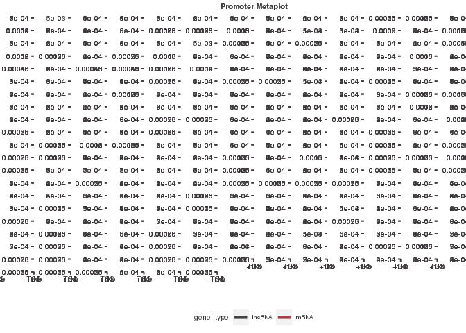
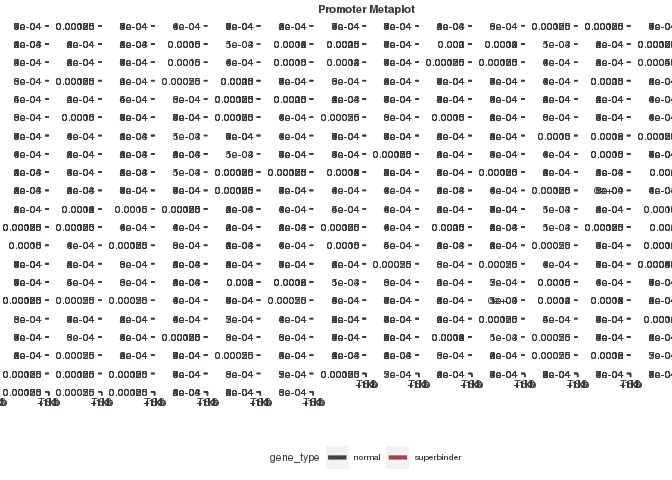

final\_knit
================
Dakota Hunt
4/30/2023

# Loading in all .broadPeak files for all dbps and their replicates

``` r
# using import peaks to import broadPeak files (~10min)
peak_list <- import_peaks(consensus_file_path = broadpeakfilepath)
```

# Creating consensus peaks

``` r
# Create dbp object
dbp <- unique(sapply(names(peak_list), function(x) {
   unlist(strsplit(x, "_"))[1]
}))

# Create consensus_list object from dbp 
consensus_list <- lapply(dbp, consensus_from_reduced, peak_list)

# adding names to consensus_list
names(consensus_list) <- dbp

# saving consensus_list
save(consensus_list, file = "results/consensus_list.RData")

load("../01_consensus_peaks/results/consensus_list.RData", verbose = T)
```

    ## Loading objects:
    ##   consensus_list

# Creating num\_peaks\_df

``` r
# Create dataframe with dbp name and number of consensus peaks for that dbp
num_consensus_peaks <- sapply(consensus_list, length) %>% 
  as.data.frame() %>%
  rownames_to_column( var = "dbp") %>%
  dplyr::rename(number_consensus_peaks = ".")

# saving 
write_csv(num_consensus_peaks, "results/num_peaks_df.csv")
```

# Histogram of peak number for all dbps

``` r
# creating list of num_peaks per dbp
num_peaks <- sapply(consensus_list, length)
# plotting
hist(num_peaks, breaks = 1000)
```

<!-- -->

# filtering consensus\_list to dbps with &gt; 1000 peaks

``` r
# filtering to 1000 peaks
filtered_consensus_list <- consensus_list[sapply(consensus_list, length) > 1000]

# saving 
save(filtered_consensus_list, file = "results/filtered_consensus_list.RData")
#load("results/filtered_consensus_list.RData", verbose = T)

# make object and csv for DBPs excluded for having 1000 or fewer peaks
excluded_dbps <- names(consensus_list[sapply(consensus_list, length) < 1000]) %>% as.data.frame()
# saving 
write.table(excluded_dbps, "results/excluded_dbps.csv")
```

# loading in genome features and creating annotation objects

``` r
gencode_gr <- rtracklayer::import("/scratch/Shares/rinnclass/CLASS_2023/data/data/genomes/gencode.v32.annotation.gtf")

# gencode genes
gencode_genes <- gencode_gr[gencode_gr$type == "gene"] 

# mrna_genes
mrna_genes <- gencode_genes[gencode_genes$gene_type %in% "protein_coding"]

# lncrna_genes
lncrna_genes <- gencode_genes[gencode_genes$gene_type %in% "lncRNA"] 

# mrna_lncrna_genes
mrna_lncrna_genes <- gencode_genes[gencode_genes$gene_type %in% c("protein_coding","lncRNA")]

# lncrna_mrna_promoters
lncrna_mrna_promoters <- promoters(mrna_lncrna_genes, upstream = 1000, downstream = 1000)

# lncrna_gene_ids
lncrna_gene_ids <- mrna_lncrna_genes$gene_id[mrna_lncrna_genes$gene_type == "lncRNA"]

# mrna_gene_ids
mrna_gene_ids <-mrna_lncrna_genes$gene_id[mrna_lncrna_genes$gene_type == "protein_coding"]
```

# making num\_peaks\_df data frame of filtered\_consensus\_peak info

``` r
num_peaks_df <- data.frame("dbp" = names(filtered_consensus_list),
                           "num_peaks" = sapply(filtered_consensus_list, length))

# counting promoter overlaps
promoter_peak_counts <- count_peaks_per_feature(lncrna_mrna_promoters, filtered_consensus_list, type = "counts")

# add total genome covered by peaks to num_peaks_df
num_peaks_df$total_peak_length <- sapply(filtered_consensus_list, function(x) sum(width(x)))

# sum rows to get total number of promoter overlaps
num_peaks_df$peaks_overlapping_promoters <- rowSums(promoter_peak_counts)

# lncrna promoter overlaps 
num_peaks_df$peaks_overlapping_lncrna_promoters <- rowSums(promoter_peak_counts[,lncrna_gene_ids])

# mrna promoter overlaps
num_peaks_df$peaks_overlapping_mrna_promoters <- rowSums(promoter_peak_counts[,mrna_gene_ids])

# Find overlaps with gene_bodies 
genebody_peak_counts <- count_peaks_per_feature(mrna_lncrna_genes, 
                                                filtered_consensus_list, 
                                                type = "counts")

# Count all gene body overlaps and add to num_peaks_df
num_peaks_df$peaks_overlapping_genebody <- rowSums(genebody_peak_counts)

# Count lncRNA gene body overlaps and add to num_peaks_df
num_peaks_df$peaks_overlapping_lncrna_genebody <- rowSums(genebody_peak_counts[,lncrna_gene_ids])

# Count mRNA gene body overlaps and add to num_peaks_df
num_peaks_df$peaks_overlapping_mrna_genebody <- rowSums(genebody_peak_counts[,mrna_gene_ids])
```

# adding TF type annotations for DBPs

``` r
#This didn't work so I just copied file from previous directory used in class.

# reading in TF annotations 
human_tfs <- readxl::read_excel("results/TF_annotations.xlsx",
                                sheet = 2, skip = 1)
```

    ## Warning: Expecting logical in M1006 / R1006C13: got 'Contains a SANT and
    ## multiple DNA-binding C2H2 domains. Motif is 99% AA ID from mouse (Transfac).'

    ## Warning: Expecting logical in M1021 / R1021C13: got 'Close ortholog (PP1RA)
    ## binds to mRNA; single-stranded DNA (ssDNA); poly(A) and poly(G) homopolymers
    ## (Uniprot)'

    ## Warning: Expecting logical in M1542 / R1542C13: got 'Contains 1 SANT domain'

    ## Warning: Expecting logical in M1543 / R1543C13: got 'Contains 2 Myb DBDs.
    ## Sources of Hocomoco/Transfac motifs are unclear. However these sequences look
    ## similar to in vitro sites selected by SELEX (PMID:11082045)'

    ## Warning: Expecting logical in M1544 / R1544C13: got 'Although CHD2 has weak
    ## similarity to a Myb domain (PMID:9326634), it's more closely related to the
    ## non-DNA-binding SANT domain based on our alignment analysis. The data showing
    ## that show that CHD2 binding histone H3.3 (PMID:22569126) further support the
    ## conclusion that the Myb domain is probably a SANT domain facilitating the
    ## histone interaction'

    ## Warning: Expecting logical in M1545 / R1545C13: got 'Contains a single SANT
    ## domain, no evidence for sequence-specific DNA binding'

    ## Warning: Expecting logical in M1546 / R1546C13: got 'Contains 2 Myb DBDs'

    ## Warning: Expecting logical in M1547 / R1547C13: got 'Contains 2 SANT domains,
    ## and no other putative DNA-binding domains'

    ## Warning: Expecting logical in M1548 / R1548C13: got 'Contains 2 SANT domains,
    ## and no other putative DNA-binding domains'

    ## Warning: Expecting logical in M1549 / R1549C13: got 'Contains a single SANT
    ## domain, no evidence for sequence-specific DNA binding'

    ## Warning: Expecting logical in M1550 / R1550C13: got 'Domain is truncated, and
    ## there is nothing known about this gene'

    ## Warning: Expecting logical in M1551 / R1551C13: got 'Contains a single SANT
    ## domain, no evidence for sequence-specific DNA binding'

    ## Warning: Expecting logical in M1552 / R1552C13: got 'MIER2's Myb domain is more
    ## similar to the non-DNA-binding SANT domain'

    ## Warning: Expecting logical in M1553 / R1553C13: got 'MIER3's Myb domain is more
    ## similar to the non-DNA-binding SANT domain'

    ## Warning: Expecting logical in M1554 / R1554C13: got 'Contains 1 SANT domain,
    ## and a SANTA domain'

    ## Warning: Expecting logical in M1555 / R1555C13: got 'Contains a single Myb-like
    ## domain with an insertion in the middle. It is ambiguous whether Myb-like
    ## domains are DNA or protein binding. Since it has a single domain it's likely
    ## non-specific, but future experiments should be performed to assay it's
    ## specificity'

    ## Warning: Expecting logical in M1556 / R1556C13: got 'Contains 3 Myb DBDs'

    ## Warning: Expecting logical in M1557 / R1557C13: got 'Contains 3 Myb DBDs'

    ## Warning: Expecting logical in M1558 / R1558C13: got 'Contains 3 Myb DBDs'

    ## Warning: Expecting logical in M1559 / R1559C13: got 'Contains a single Myb-like
    ## domain. Mouse ortholog has motif'

    ## Warning: Expecting logical in M1560 / R1560C13: got 'MYSM1 has been shown to
    ## bind DNA ? interaction with DNA requires the MYSM1 Myb but not the SWIRM domain
    ## (PMID:17428495). Domain sequence alignment places it near DNA-binding Myb
    ## domains but scores slightly higher as a SANT rather than Myb domain based on
    ## Prosite patterns. Given that most Myb proteins that bind DNA sequence
    ## specifically have multiple Myb domains in an array this protein could bind DNA
    ## sequence non-specifically with it?s single Myb domain. Future experiments
    ## should assay MYSM1?s specificity'

    ## Warning: Expecting logical in M1561 / R1561C13: got 'Contains 2 SANT domains,
    ## and no other putative DNA-binding domains'

    ## Warning: Expecting logical in M1562 / R1562C13: got 'Contains 2 SANT domains,
    ## and no other putative DNA-binding domains'

    ## Warning: Expecting logical in M1564 / R1564C13: got 'Contains 2 SANT domains,
    ## and no other putative DNA-binding domains'

    ## Warning: Expecting logical in M1565 / R1565C13: got 'Contains 2 SANT domains,
    ## and no other putative DNA-binding domains'

    ## Warning: Expecting logical in M1566 / R1566C13: got 'Contains 2 SANT domains,
    ## and no other putative DNA-binding domains. RCOR3 SANT domains are known to
    ## facilitate PPIs'

    ## Warning: Expecting logical in M1567 / R1567C13: got 'SMARCA1 contains a
    ## truncated Myb-like and SANT domain. Given the presence of the Myb-like domain,
    ## and other domains known to associated with DNA (DEAD box helicase) it likely
    ## associates with DNA non-sequence-specifically'

    ## Warning: Expecting logical in M1568 / R1568C13: got 'Contains a SANT, and
    ## Myb-like domain'

    ## Warning: Expecting logical in M1569 / R1569C13: got 'Contains 1 SANT domain,
    ## and no other putative DNA-binding domains. Motif logos look like bZIP dimeric
    ## binding sites, and are thus likely specificifities of SMARCC1 interactors'

    ## Warning: Expecting logical in M1570 / R1570C13: got 'Contains 1 SANT domain,
    ## and no other putative DNA-binding domains. Motif logos ares likely
    ## specificifities of SMARCC2 interactors'

    ## Warning: Expecting logical in M1571 / R1571C13: got 'Contains only Myb DBDs'

    ## Warning: Expecting logical in M1572 / R1572C13: got 'Contains 1 SANT domain'

    ## Warning: Expecting logical in M1573 / R1573C13: got 'TADA2B contains a single
    ## SANT domain and is thus unlikely to bind DNA'

    ## Warning: Expecting logical in M1574 / R1574C13: got 'Contains a single Myb
    ## domain (with slightly less simialrity to a SANT domain.) This domain has been
    ## shown to be involved in PPIs but this may not be mutually exclusive with
    ## DNA-binding. The sequence-specificity of CCDC79 should be investigated in the
    ## future'

    ## Warning: Expecting logical in M1575 / R1575C13: got 'Contains 1 Myb domain, and
    ## has structural evidence of DNA-binding'

    ## Warning: Expecting logical in M1576 / R1576C13: got 'Motif is inferred from
    ## mouse (92% DBD AA ID)'

    ## Warning: Expecting logical in M1577 / R1577C13: got 'TERF2IP contains a single
    ## Myb-like domain. While it's unclear if TERF2IP (Human Rap1) contacts DNA
    ## directly it has been shown to affect the DNA binding activity of TRF2'

    ## Warning: Expecting logical in M1578 / R1578C13: got 'This protein contains Myb,
    ## and Myb-like domains and is annotated as a Pol1 terminator. TTF1 DNA-binding
    ## has been demonstrated in vitro (PMID: 7597036), but it's specificity has not
    ## been determined'

    ## Warning: Expecting logical in M1579 / R1579C13: got 'Contains 1 Myb DBD'

    ## Warning: Expecting logical in M1580 / R1580C13: got 'Contains a GATA and SANT
    ## domain. Unclear whether the GATA domain is a bona fide DBD as the MTA/RERE
    ## family domains are atypical to human GATA domains (see alignment). In CIS-BP
    ## there is one protein from C.elegans that shares domain homology and binds a
    ## GATA motif (elg-27, ChIP-seq). The GATA ZnF domain of MTA1 is required for it's
    ## interaction with RBBP4 and RBBP7 (PMID:18067919). Full-length protein has been
    ## tried in HT-SELEX and did not yield a motif'

    ## Warning: Expecting logical in M1581 / R1581C13: got 'Contains a GATA and SANT
    ## domain. Unclear whether the GATA domain is a bona fide DBD as the MTA/RERE
    ## family domains are atypical to human GATA domains (see alignment). In CIS-BP
    ## there is one protein from C.elegans that shares domain homology and binds a
    ## GATA motif (elg-27, ChIP-seq). Full-length protein has been tried in HT-SELEX,
    ## and DBD has been tried on PBM - neither yielded motifs'

    ## Warning: Expecting logical in M1582 / R1582C13: got 'Contains a GATA and SANT
    ## domain. Unclear whether the GATA domain is a bona fide DBD as the MTA/RERE
    ## family domains are atypical to human GATA domains (see alignment). In CIS-BP
    ## there is one protein from C.elegans that shares domain homology and binds a
    ## GATA motif (elg-27, ChIP-seq). Hasn't been tried in any in vitro assays'

    ## Warning: Expecting logical in M1583 / R1583C13: got 'Contains a GATA and SANT
    ## domain. Unclear whether the GATA domain is a bona fide DBD as the MTA/RERE
    ## family domains are atypical to human GATA domains (see alignment). In CIS-BP
    ## there is one protein from C.elegans that shares domain homology and binds a
    ## GATA motif (elg-27, ChIP-seq). Has been tried as a DBD in HT-SELEX but did not
    ## yield a motif'

    ## Warning: Expecting logical in M1791 / R1791C13: got 'CNOT3 is a part of the
    ## CCR4-NOT complex involved in mRNA decay'

    ## Warning: Expecting logical in M1932 / R1932C13: got '"Prosite identifies a
    ## low-confidence Myb-like domain (e.g. can?t decide between Myb and SANT) so it?s
    ## probably not a TF"'

    ## New names:
    ## • `` -> `...4`

``` r
# let's rename the 4th column to indicate if it is a TF.
names(human_tfs)[4] <- "is_tf"

# now let's intersect gene names that are in our ChIP data and has TF identity.
length(which(tolower(num_peaks_df$dbp) %in% tolower(human_tfs$Name)))
```

    ## [1] 407

``` r
# 407 of the 430 have matching gene_names 

human_tfs <- human_tfs[tolower(human_tfs$Name) %in% tolower(num_peaks_df$dbp), 1:4]
# adding new column names
names(human_tfs) <- c("ensembl_id",
                      "dbp",
                      "dbd",
                      "tf")

# merging into num_peaks_df so that we get dbd and is.tf information in there
num_peaks_df <- merge(num_peaks_df, human_tfs, all.x = T)
```

# creating promoter peak occurence matrix

This makes a matrix where promoters are columns Each will have a 1 if
overlapped by a given dbp and a 0 if no overlap

``` r
# running count_peaks_per_feature
promoter_peak_occurence <- count_peaks_per_feature(lncrna_mrna_promoters, filtered_consensus_list, 
                                               type = "occurrence")

# Let's double check that all lncrna & mrna genes are accounted for:
stopifnot(all(colnames(promoter_peak_occurence) == lncrna_mrna_promoters$gene_id))

# saving
write.table(promoter_peak_occurence, "results/promoter_peak_occurence_matrix.tsv")

# Now let's use the 'data.frame()' fucntion. Set up a bunch of colnames and populate them.
peak_occurence_df <- data.frame("gene_id" = colnames(promoter_peak_occurence),
                                "gene_name" = lncrna_mrna_promoters$gene_name,
                                "gene_type" = lncrna_mrna_promoters$gene_type,
                                "chr" = lncrna_mrna_promoters@seqnames,   
                                "1kb_up_tss_start" = lncrna_mrna_promoters@ranges@start,
                                "strand" = lncrna_mrna_promoters@strand,
                                "number_of_dbp" = colSums(promoter_peak_occurence))

# saving
write_csv(peak_occurence_df, "results/peak_occurence_dataframe.csv")
```

# saving important environment objects

``` r
save(filtered_consensus_list, gencode_genes, lncrna_gene_ids, mrna_gene_ids, num_peaks_df, peak_occurence_df, promoter_peak_occurence, lncrna_mrna_promoters, mrna_lncrna_genes, file = "results/peak_features.RData")
```

##################################### 

# loading in environment objects previously created

``` r
load("results/peak_features.RData", verbose = T)
```

    ## Loading objects:
    ##   filtered_consensus_list
    ##   gencode_genes
    ##   lncrna_gene_ids
    ##   mrna_gene_ids
    ##   num_peaks_df
    ##   peak_occurence_df
    ##   promoter_peak_occurence
    ##   lncrna_mrna_promoters
    ##   mrna_lncrna_genes

# Peaks per dbp histogram

``` r
 ggplot(num_peaks_df, aes(x = num_peaks)) + 
  geom_histogram(bins = 100)
```

<!-- -->

``` r
# Save figure
ggsave("figures/num_peaks_hist.pdf")
```

    ## Saving 7 x 5 in image

# Plot genome coverage (total peak length) against the number of peaks for each DBP

``` r
ggplot(num_peaks_df, aes(x = num_peaks, y = total_peak_length)) +
  geom_point() + 
  ylab("BP covered") +
  xlab("Number of peaks") +
  ggtitle("Peak count vs. Genome Coverage")
```

<!-- -->

``` r
# Save figure
ggsave("figures/peak_num_vs_coverage.pdf")
```

    ## Saving 7 x 5 in image

Result: there is an approximately linear relationship between the number
of peaks and total coverage, which is to be expected.

# What is the distribution of promoter overlaps versus gene-bodies?

``` r
# Histogram for promoters
 ggplot(num_peaks_df, aes(x = peaks_overlapping_promoters)) + 
  geom_histogram(bins =25)
```

<!-- -->

``` r
# Histogram for gene bodies
 ggplot(num_peaks_df, aes(x = peaks_overlapping_genebody)) + 
  geom_histogram(bins =25)
```

<!-- -->

``` r
 # Double histogram
 
ggplot(num_peaks_df) +
  labs(fill="Variable name",x="Peaks overlapping feature",y="Count (# of DBPs)")+
  geom_histogram(aes(x=peaks_overlapping_genebody, fill= "Gene bodies",  color = "blue"), alpha = 0.2 ) + 
  geom_histogram(aes(x=peaks_overlapping_lncrna_promoters, fill= "Promoters", color = "red"), alpha = 0.2) +
  scale_fill_manual(values = c("blue","red"))+
  scale_colour_manual(values = c("blue","red"), guide=FALSE)
```

    ## `stat_bin()` using `bins = 30`. Pick better value with `binwidth`.
    ## `stat_bin()` using `bins = 30`. Pick better value with `binwidth`.

    ## Warning: The `guide` argument in `scale_*()` cannot be `FALSE`. This was deprecated in
    ## ggplot2 3.3.4.
    ## ℹ Please use "none" instead.
    ## This warning is displayed once every 8 hours.
    ## Call `lifecycle::last_lifecycle_warnings()` to see where this warning was
    ## generated.

<!-- -->

``` r
ggsave("figures/promoter_vs_genebody_overlap.pdf")
```

    ## Saving 7 x 5 in image
    ## `stat_bin()` using `bins = 30`. Pick better value with `binwidth`.
    ## `stat_bin()` using `bins = 30`. Pick better value with `binwidth`.

# plotting num peaks on promoters vs number of peaks total for each DBP

``` r
# Plotting x as num_peaks and y  as the number overlapping promoters.

ggplot(num_peaks_df,
       aes(x = num_peaks, y = peaks_overlapping_promoters)) +
  geom_point() +
  
  geom_abline(slope = 1, linetype="dashed") +
  geom_smooth(method = "lm", se=F, formula = 'y ~ x',
              color = "#a8404c") +
  ylim(0,60100) +
  xlim(0,60100) +

  # adding labels
xlab("Peaks per DBP") +
  ylab("Number of peaks overlapping promoters") +
  ggtitle("Relationship Between Number of DBP Peaks and Promoter Overlaps")
```

    ## Warning: Removed 25 rows containing non-finite values (`stat_smooth()`).

    ## Warning: Removed 25 rows containing missing values (`geom_point()`).

<!-- -->

``` r
ggsave("figures/peak_num_vs_promoter_coverage.pdf")
```

    ## Saving 7 x 5 in image

    ## Warning: Removed 25 rows containing non-finite values (`stat_smooth()`).
    ## Removed 25 rows containing missing values (`geom_point()`).

Result: there appears to be a saturation point at which there is no
longer an increase in the number of peaks overlapping promoters even as
total peak number for the DBP increases.

# plotting num peaks over gene bodies vs number of peaks total for each DBP

``` r
ggplot(num_peaks_df,
       aes(x = num_peaks, y = peaks_overlapping_genebody)) +
  xlab("Peaks per DBP") +
  ylab("Number of peaks overlapping genes") +
  ggtitle("Relationship Between Number of DBP Peaks and Gene Body Overlaps")+
  geom_point() +
  geom_abline(slope = 1, linetype="dashed") +
  geom_smooth(method = "lm", se=F, formula = 'y ~ x',
              color = "#a8404c") +
  ylim(0,60100) +
  xlim(0,60100)
```

    ## Warning: Removed 25 rows containing non-finite values (`stat_smooth()`).

    ## Warning: Removed 25 rows containing missing values (`geom_point()`).

<!-- -->

``` r
# saving
ggsave("figures/peak_num_vs_gene_body_coverage.pdf")
```

    ## Saving 7 x 5 in image

    ## Warning: Removed 25 rows containing non-finite values (`stat_smooth()`).
    ## Removed 25 rows containing missing values (`geom_point()`).

Result: Gene bodies make up almost all the places of binding in the
genome. There is almost a 1:1 correlation between total peak number and
peaks overlapping promoters for these DBPs.

# Density plot of binding events

Making a density plot of number of DBPs bound per promoter

``` r
ggplot(peak_occurence_df, aes(x = number_of_dbp)) +
geom_density(alpha = 0.2, color = "#424242", fill = "#424242") +
  xlab(expression("Number of DBPs")) +
  ylab(expression("Density")) +
  ggtitle("Promoter binding events",
          subtitle = "mRNA and lncRNA genes") 
```

<!-- -->

``` r
# saving
ggsave("figures/num_binding_events_per_promoter.pdf")
```

    ## Saving 7 x 5 in image

``` r
# Colored by gene_type
# Density plot
ggplot(peak_occurence_df, aes(x = number_of_dbp, fill = gene_type)) +
geom_density(alpha = 0.2) +
  xlab(expression("Number of DBPs")) +
  ylab(expression("Density")) +
  ggtitle("Promoter binding events",
          subtitle = "mRNA and lncRNA genes") 
```

<!-- -->

``` r
# saving
ggsave("figures/num_binding_events_per_promoter_by_genetype.pdf")
```

    ## Saving 7 x 5 in image

Result: promoter binding is bimodal. Most promoters have less than 50
DBPs but there is a group that has more than 200 DBPs bound! It is clear
that mRNA genes are more likely appear in this superbinding group than
lncRNA genes.

# promoters without binding events

Finding promoters that don’t have any DBPs bound

``` r
unbound_promoters <- peak_occurence_df %>% 
  filter(peak_occurence_df$number_of_dbp < 1)

# how many unbound promoters are there?
nrow(unbound_promoters)
```

    ## [1] 9448

``` r
# so there are 9448 promoters that don't have any DBPs bound
write_csv(unbound_promoters, "results/unbound_promoters.csv")
```

# lncRNA versus mRNA promoter binding

Comparing the binding patterns of lncRNA vs mRNA promoters.

``` r
ggplot(num_peaks_df, aes(x = num_peaks)) +
  geom_point(aes(y = peaks_overlapping_lncrna_promoters), color = "red") +
  geom_point(aes(y = peaks_overlapping_mrna_promoters), color = "black") +
  geom_smooth(aes(y = peaks_overlapping_lncrna_promoters), method = "lm", se = FALSE, formula = "y ~ x") +
  geom_smooth(aes(y = peaks_overlapping_mrna_promoters), method = "lm", se = FALSE, formula = "y ~ x")
```

<!-- -->

``` r
# saving
ggsave("figures/lncRNA-mRNA-promoter_binding.pdf")
```

    ## Saving 7 x 5 in image

``` r
# lncRNA in red, mRNA in black
```

# How many of these 430 DBPs are TFs? What is the most represented type of DBD?

``` r
#How many proteins are TFs?
peak_TF_table <- table(num_peaks_df$tf, useNA = "always")
peak_TF_table
```

    ## 
    ##   No  Yes <NA> 
    ##   63  344   23

``` r
#What is the most represented type of DBD?
peak_DBD_table <- table(num_peaks_df$dbd, useNA = "always")
peak_DBD_table
```

    ## 
    ##      ARID/BRIGHT          AT hook           BED ZF             bHLH 
    ##                5                3                2               14 
    ##             bZIP          C2H2 ZF C2H2 ZF; AT hook  C2H2 ZF; BED ZF 
    ##               25              169                2                1 
    ##         CBF/NF-Y          CCCH ZF            CENPB             CG-1 
    ##                1                5                2                1 
    ##              CSL CUT; Homeodomain             CxxC    CxxC; AT hook 
    ##                1                3                2                2 
    ##              E2F              Ets     Ets; AT hook         Forkhead 
    ##                6                8                1                9 
    ##             GATA          HMG/Sox      Homeodomain              HSF 
    ##                3                9               19                1 
    ##              IRF             MADF         MADS box         Myb/SANT 
    ##                3                1                3                8 
    ##   Myb/SANT; GATA      MYM-type ZF       Ndt80/PhoG Nuclear receptor 
    ##                2                1                1               14 
    ##              p53        Pipsqueak              Rel              RFX 
    ##                1                2                4                2 
    ##             SAND             SMAD             STAT            T-box 
    ##                3                6                2                1 
    ##              TBP          TCR/CxC              TEA      THAP finger 
    ##                1                1                2                3 
    ##          Unknown             <NA> 
    ##               52               23

Result: 344 proteins are TFs, 63 are not, and 23 have a value of NA.
Result: C2H2 zinc fingers are the most common type of DNA-binding
domain, representing 169 of the 430 DBPs.

################################### 

# SUPERBINDER ANALYSIS

# Create superbinder\_promoters\_df object and table of super-binding promoters

``` r
#Defining superbinding promoters as those with over 200 DBPs bound
superbinder_promoters_df <- peak_occurence_df %>% 
  filter(peak_occurence_df$number_of_dbp > 200)

# how many are there?
nrow(superbinder_promoters_df)
```

    ## [1] 11689

``` r
# so there are 11,689 promoters that have over 200 binding events

#  let's put it in a folder called results. We will always use this folder structure
write_csv(superbinder_promoters_df, "results/superbinder_promoters.csv")
```

# Create normal\_promoters object and table of normal promoters

``` r
# Defining normal promoters as those with between 1 and 200 DBPs bound. 
# Promoters with zero DBPS bound were previously classified as unbound promoters. 
normal_promoters_df <- peak_occurence_df %>% 
  filter(peak_occurence_df$number_of_dbp <= 200 & peak_occurence_df$number_of_dbp >= 1)

# how many are there?
nrow(normal_promoters_df)
```

    ## [1] 15677

``` r
# so there are 15677 promoters that have between 1 to 200 binding events.

#  let's put it in a folder called results. We will always use this folder structure
write_csv(normal_promoters_df, "results/normal_promoters.csv")
```

Result: 9448 unbound promoters, 15677 normal promoters, 11689
superbinder promoters.

# Gene ontology analysis via Enrichr

``` r
# 1. Download superbinder_promoters.csv via Cyberduck 
# 2. Open in Excel
# 3. Copy list of gene names and paste into Enrichr (https://maayanlab.cloud/Enrichr)
```

Results: Superbinder promoters:

GO Biological Processes (sorted by p-value) 1. Ribosome biogenesis 2.
rRNA processing 3. mRNA processing 4. Gene expression 5.
Nuclear-transcribed mRNA catabolic process

GO Molecular Function (sorted by p-value) 1. RNA binding 2. rRNA binding
3. Endoribonuclease activity 4. mRNA binding 5. DNA replication origin
binding

This is really interesting as it seems as if a lot of genes associated
with regulation of gene expression have lots of DBPs bound at there
promotes and thus likely undergo complex regulation themselves.

# mRNA vs lncRNA superbinder promoters

``` r
# Look at how many superbinders are lncRNA vs mRNA genes
superbinder_type <- table(superbinder_promoters_df$gene_type)
superbinder_type
```

    ## 
    ##         lncRNA protein_coding 
    ##           2512           9177

``` r
#Create new obejcts containing just mRNA and lncRNA superbinders
mRNA_superbinder_promoters <- superbinder_promoters_df %>% 
  filter(superbinder_promoters_df$gene_type == 'protein_coding')

lncRNA_superbinder_promoters <- superbinder_promoters_df %>% 
  filter(superbinder_promoters_df$gene_type == 'lncRNA')
```

Result: I found 9177 mRNA superbinder promoters and 2512 lncRNA
superbinder promoters. This suggest the majority of superbinders are
mRNA (protein-coding) genes.

######################################## 

# loading in promoter\_peak\_occurence\_matrix

``` r
# Read in promoter peak occurence matrix 
promoter_peak_occurence_matrix <- read.table("results/promoter_peak_occurence_matrix.tsv")

# Converting to a matrix format for correlation analysis
promoter_peak_occurence_matrix <- as.matrix(promoter_peak_occurence_matrix)
# This is a large matrix with a value of 1 if a DBP is bound to a promoter and 0 if it is not.
```

# creating distance matrix & dendrogram

``` r
# creating distance matrix
peak_occurence_dist <- dist(promoter_peak_occurence_matrix, method = "binary")

# clustering distance values
bin_hier <- hclust(peak_occurence_dist, method = "complete")

# This is a lot of ggplot -- on purpose
# please read through what is happening and parameter usage

 ggdendro::ggdendrogram(bin_hier, rotate = FALSE,  size = 3, 
                       theme_dendro = TRUE) +
   # 90 degree rotation to right
   coord_flip() +
   scale_y_continuous() +
   # adds label
   scale_x_continuous(position = "top") +
   # subsection to labels in order of clustering
   # ? seq_along
   scale_x_continuous(breaks = seq_along(bin_hier$labels[bin_hier$order]),
                      
                      # adding labels that are in the order 'column'
             labels = bin_hier$labels[bin_hier$order], position = "top",
             expand = c(0,0)) +
   theme(axis.text.x = element_text(angle = 90, hjust  = 1)) + 
   theme(axis.text.y = element_text(angle = 0,hjust = 1)) +
   scale_y_reverse(expand = c(0.01, 0)) +
   theme(
     plot.background = element_blank(),
     panel.grid.major = element_blank(),
   panel.grid.minor = element_blank(),
     panel.border = element_blank()
   )
```

    ## Scale for y is already present.
    ## Adding another scale for y, which will replace the existing scale.
    ## Scale for x is already present.
    ## Adding another scale for x, which will replace the existing scale.
    ## Scale for x is already present.
    ## Adding another scale for x, which will replace the existing scale.
    ## Scale for y is already present.
    ## Adding another scale for y, which will replace the existing scale.

<!-- -->

``` r
ggsave("figures/ggdendro_plot.pdf", height = 50, width = 12, limitsize = F)
```

Result: One interesting example is that ATF5 clusters closely with ZNF34
and ZNF343. ATF5 is highly abundant in the liver and is a member of the
ATF/cAMP response element-binding protein family, which has been
associated with differentiation, proliferation, and survival in several
tissues and cell types. ATF5 is upregulated in response to various
stress conditions, suggesting these two zinc fingers may also play a
role in stress response in the liver by working with ATF5. ATF5 is also
thought to stimulate differentiation of liver cells, and so these ZNFs
may be involved in hepatocyte differentiation.

# Clustering of lncRNA and mRNA seperately

# lncRNA promoters ggdendro

``` r
# Create annotation for just lncRNA promoters
lncrna_promoters <- lncrna_mrna_promoters[lncrna_mrna_promoters$gene_type %in% "lncRNA"] 

# Now use indexing to separate peak_occurrence_matrix into just lncRNA and mRNA
lncrna_peak_occurence <- promoter_peak_occurence_matrix[,lncrna_promoters$gene_id]

# Clustering
bin_hier_lncrna <- hclust(dist(lncrna_peak_occurence, method = "binary"))

# Now plotting with ggdendro
ggdendro::ggdendrogram(bin_hier_lncrna, rotate = T,  size = 3)
```

<!-- -->

``` r
# Saving
ggsave("figures/lncrna_hclust_binary_dist.pdf", height = 49, width = 6)
```

# mRNA promter ggdendro

``` r
# Create annotation for just mRNA promoters
mrna_promoters <- lncrna_mrna_promoters[lncrna_mrna_promoters$gene_type %in% "protein_coding"] 

# Create peak occurence matrix for just mRNA promoters
mrna_peak_occurence <- promoter_peak_occurence_matrix[,mrna_promoters$gene_id]

# getting the distance matrix for only mRNA promoters  
bin_hier_mrna <- hclust(dist(mrna_peak_occurence, method = "binary"))
 
# plotting with ggdendro
ggdendro::ggdendrogram(bin_hier, rotate = TRUE,  size = 3)
```

<!-- -->

``` r
# saving
ggsave("figures/mrna_hclust_binary_dist.pdf", height = 44, width = 6)
```

Results: ATF5 still clusters with ZNF34 and ZNF343 even when we cluster
just by lncRNA or mRNA promoters. Overall clustering appears to be
generally the same with some minor differences. There may be significant
differences that I am missing due to size of dendrogram.

# Using profile\_tss for all 430 DBPs

``` r
# establishing DF
metaplot_df <- data.frame(x = integer(), dens = numeric(), dbp = character())

# for loop to populate DF 
for(i in 1:length(filtered_consensus_list)) {
  print(names(filtered_consensus_list)[[i]])
  tmp_df <- profile_tss(filtered_consensus_list[[i]], lncrna_mrna_promoters)
  tmp_df$dbp <- names(filtered_consensus_list)[[i]]
  metaplot_df <- bind_rows(metaplot_df, tmp_df)
  
}
```

    ## [1] "ADNP"

    ## Warning in .Seqinfo.mergexy(x, y): Each of the 2 combined objects has sequence levels not in the other:
    ##   - in 'x': chrY
    ##   - in 'y': GL000214.1, GL000218.1, GL000220.1, GL000252.2, KI270438.1, KI270442.1, KI270467.1, KI270733.1, KI270767.1, KI270857.1, KI270878.1, KN196487.1, KQ031389.1, KV575244.1, ML143377.1, ML143380.1, GL000194.1, GL000216.2, GL000219.1, GL000224.1, GL000225.1, GL383577.2, KI270712.1, KI270728.1, KI270729.1, KI270861.1, KQ458384.1, KZ208915.1, ML143372.1
    ##   Make sure to always combine/compare objects based on the same reference
    ##   genome (use suppressWarnings() to suppress this warning).

    ## [1] "AFF4"
    ## [1] "AHDC1"

    ## Warning in .Seqinfo.mergexy(x, y): Each of the 2 combined objects has sequence levels not in the other:
    ##   - in 'x': chrM
    ##   - in 'y': GL000194.1, GL000218.1, GL000219.1, GL000251.2, GL000252.2, GL000254.2, GL339449.2, GL383527.1, GL383556.1, GL383563.3, GL383577.2, GL877875.1, KI270467.1, KI270713.1, KI270721.1, KI270744.1, KI270782.1, KI270803.1, KI270829.1, KI270857.1, KI270861.1, KI270862.1, KI270878.1, KI270879.1, KI270908.1, KN196484.1, KQ458384.1, KV575244.1, KV880768.1, KZ208915.1, ML143371.1, ML143377.1, ML143381.1, GL000224.1, KI270712.1, KI270728.1, KI270733.1, KI270830.1, KI270853.1, KI270869.1, KN538372.1, KV766196.1, KV880764.1
    ##   Make sure to always combine/compare objects based on the same reference
    ##   genome (use suppressWarnings() to suppress this warning).

    ## [1] "AHR"
    ## [1] "AKAP8"
    ## [1] "ARID3A"
    ## [1] "ARID4A"
    ## [1] "ARID4B"
    ## [1] "ARID5B"
    ## [1] "ARNTL"
    ## [1] "ASH2L"

    ## Warning in .Seqinfo.mergexy(x, y): Each of the 2 combined objects has sequence levels not in the other:
    ##   - in 'x': chrM
    ##   - in 'y': GL000219.1, GL383577.2, GL383581.2, KI270713.1, KI270729.1, KI270879.1, KI270904.1, KQ458384.1, KV880768.1, KZ208922.1, GL000218.1, GL000251.2, KZ208915.1
    ##   Make sure to always combine/compare objects based on the same reference
    ##   genome (use suppressWarnings() to suppress this warning).

    ## [1] "ATAD3A"
    ## [1] "ATF2"
    ## [1] "ATF3"
    ## [1] "ATF5"
    ## [1] "ATF6"
    ## [1] "ATF7"

    ## Warning in .Seqinfo.mergexy(x, y): Each of the 2 combined objects has sequence levels not in the other:
    ##   - in 'x': chrM
    ##   - in 'y': GL000009.2, GL000194.1, GL000208.1, GL000214.1, GL000216.2, GL000218.1, GL000219.1, GL000220.1, GL000221.1, GL000224.1, GL000225.1, GL000252.2, GL000255.2, GL000256.2, GL339449.2, GL383522.1, GL383542.1, GL383563.3, GL383577.2, GL383581.2, JH159146.1, KI270442.1, KI270706.1, KI270711.1, KI270712.1, KI270713.1, KI270714.1, KI270718.1, KI270719.1, KI270721.1, KI270722.1, KI270723.1, KI270725.1, KI270726.1, KI270728.1, KI270731.1, KI270732.1, KI270733.1, KI270734.1, KI270736.1, KI270742.1, KI270743.1, KI270744.1, KI270745.1, KI270750.1, KI270751.1, KI270754.1, KI270762.1, KI270764.1, KI270772.1, KI270805.1, KI270819.1, KI270830.1, KI270832.1, KI270846.1, KI270847.1, KI270850.1, KI270853.1, KI270861.1, KI270862.1, KI270865.1, KI270868.1, KI270869.1, KI270879.1, KI270894.1, KI270896.1, KI270903.1, KI270905.1, KI270907.1, KI270908.1, KI270913.1, KI270936.1, KN196484.1, KN196487.1, KN538372.1, KQ031389.1, KQ090026.1, KQ090028.1, KQ759762.1, KV575244.1, KV766193.1, KV880764.1, KV880768.1, KZ208908.1, KZ208915.1, KZ208921.1, KZ208922.1, KZ559100.1, ML143353.1, ML143364.1, ML143365.1, ML143371.1, ML143372.1, ML143375.1, ML143377.1, ML143380.1, GL000008.2, GL000195.1, GL000251.2, GL000254.2, GL383556.1, KI270438.1, KI270866.1, KI270878.1
    ##   Make sure to always combine/compare objects based on the same reference
    ##   genome (use suppressWarnings() to suppress this warning).

    ## [1] "BCL3"
    ## [1] "BCL6"
    ## [1] "BHLHE40"
    ## [1] "BRCA1"
    ## [1] "CAMTA2"
    ## [1] "CBFB"
    ## [1] "CBX5"
    ## [1] "CEBPA"
    ## [1] "CEBPB"
    ## [1] "CEBPD"
    ## [1] "CEBPG"
    ## [1] "CERS6"

    ## Warning in .Seqinfo.mergexy(x, y): Each of the 2 combined objects has sequence levels not in the other:
    ##   - in 'x': chrY
    ##   - in 'y': GL000224.1, GL877875.1, KI270438.1, KI270712.1, KI270713.1, KI270733.1, KI270744.1, KN196487.1, KV880768.1
    ##   Make sure to always combine/compare objects based on the same reference
    ##   genome (use suppressWarnings() to suppress this warning).

    ## [1] "CHD2"
    ## [1] "CREB3"
    ## [1] "CREM"
    ## [1] "CTCF"
    ## [1] "DBP"

    ## Warning in .Seqinfo.mergexy(x, y): Each of the 2 combined objects has sequence levels not in the other:
    ##   - in 'x': chrY
    ##   - in 'y': KI270438.1, KI270466.1, KI270467.1, KI270713.1, KI270830.1, KI270869.1, KI270879.1, KN196487.1, KV880768.1, ML143380.1, KI270712.1
    ##   Make sure to always combine/compare objects based on the same reference
    ##   genome (use suppressWarnings() to suppress this warning).

    ## [1] "DDIT3"

    ## Warning in .Seqinfo.mergexy(x, y): Each of the 2 combined objects has sequence levels not in the other:
    ##   - in 'x': chrY
    ##   - in 'y': GL000214.1, GL000216.2, GL000220.1, GL000224.1, GL000225.1, KI270330.1, KI270333.1, KI270336.1, KI270337.1, KI270438.1, KI270442.1, KI270466.1, KI270467.1, KI270713.1, KI270729.1, KI270733.1, KI270879.1, KN196487.1, KV880768.1, ML143380.1, GL383577.2
    ##   Make sure to always combine/compare objects based on the same reference
    ##   genome (use suppressWarnings() to suppress this warning).

    ## [1] "DLX6"
    ## [1] "DMAP1"
    ## [1] "DMTF1"
    ## [1] "DNMT1"

    ## Warning in .Seqinfo.mergexy(x, y): Each of the 2 combined objects has sequence levels not in the other:
    ##   - in 'x': chrM
    ##   - in 'y': GL000009.2, GL000194.1, GL000205.2, GL000213.1, GL000214.1, GL000216.2, GL000218.1, GL000219.1, GL000220.1, GL000221.1, GL000224.1, GL000225.1, GL000252.2, GL000253.2, GL000254.2, GL000255.2, GL000256.2, GL339449.2, GL383563.3, GL383566.1, GL383574.1, GL383577.2, JH159146.1, JH159147.1, KI270442.1, KI270512.1, KI270519.1, KI270538.1, KI270706.1, KI270709.1, KI270711.1, KI270712.1, KI270713.1, KI270714.1, KI270718.1, KI270719.1, KI270721.1, KI270722.1, KI270723.1, KI270724.1, KI270725.1, KI270728.1, KI270731.1, KI270732.1, KI270733.1, KI270734.1, KI270735.1, KI270736.1, KI270742.1, KI270743.1, KI270744.1, KI270745.1, KI270749.1, KI270750.1, KI270751.1, KI270753.1, KI270754.1, KI270762.1, KI270767.1, KI270772.1, KI270780.1, KI270782.1, KI270791.1, KI270792.1, KI270795.1, KI270797.1, KI270805.1, KI270815.1, KI270816.1, KI270819.1, KI270821.1, KI270830.1, KI270831.1, KI270832.1, KI270846.1, KI270847.1, KI270850.1, KI270853.1, KI270854.1, KI270856.1, KI270857.1, KI270860.1, KI270861.1, KI270862.1, KI270865.1, KI270868.1, KI270869.1, KI270870.1, KI270871.1, KI270872.1, KI270875.1, KI270877.1, KI270878.1, KI270879.1, KI270894.1, KI270896.1, KI270901.1, KI270903.1, KI270905.1, KI270908.1, KI270913.1, KI270937.1, KN196484.1, KN538361.1, KN538364.1, KN538368.1, KN538372.1, KN538373.1, KQ031389.1, KQ090026.1, KQ090028.1, KQ458383.1, KQ458386.1, KQ759759.1, KQ759762.1, KV575244.1, KV766196.1, KV880764.1, KV880768.1, KZ208904.1, KZ208906.1, KZ208915.1, KZ208918.1, KZ208919.1, KZ208921.1, KZ208922.1, KZ559100.1, KZ559109.1, ML143341.1, ML143353.1, ML143355.1, ML143358.1, ML143364.1, ML143365.1, ML143366.1, ML143371.1, ML143372.1, ML143375.1, ML143377.1, ML143378.1, ML143379.1, ML143380.1, GL000258.2, KI270589.1, KI270876.1, KI270907.1, KI270936.1, KQ090022.1, KZ208908.1, KZ208916.1, ML143370.1
    ##   Make sure to always combine/compare objects based on the same reference
    ##   genome (use suppressWarnings() to suppress this warning).

    ## [1] "DPF2"
    ## [1] "DRAP1"
    ## [1] "DZIP1"

    ## Warning in .Seqinfo.mergexy(x, y): Each of the 2 combined objects has sequence levels not in the other:
    ##   - in 'x': chrM
    ##   - in 'y': GL000214.1, GL000218.1, GL000219.1, GL000225.1, GL383577.2, KI270713.1, KI270721.1, KI270733.1, KI270869.1, KI270879.1, KI270908.1, KZ208915.1, GL000008.2, GL000009.2, GL000194.1, GL000208.1, GL000216.2, GL000220.1, GL000221.1, GL000224.1, GL000251.2, GL000252.2, GL000253.2, GL000254.2, GL000256.2, GL339449.2, GL383522.1, GL383533.1, GL383563.3, GL383566.1, GL383574.1, GL877875.1, KI270330.1, KI270442.1, KI270706.1, KI270709.1, KI270711.1, KI270712.1, KI270714.1, KI270718.1, KI270719.1, KI270720.1, KI270722.1, KI270723.1, KI270724.1, KI270725.1, KI270728.1, KI270731.1, KI270732.1, KI270734.1, KI270742.1, KI270743.1, KI270744.1, KI270745.1, KI270746.1, KI270750.1, KI270751.1, KI270753.1, KI270754.1, KI270762.1, KI270764.1, KI270772.1, KI270787.1, KI270791.1, KI270805.1, KI270819.1, KI270821.1, KI270824.1, KI270830.1, KI270831.1, KI270832.1, KI270845.1, KI270847.1, KI270853.1, KI270854.1, KI270857.1, KI270861.1, KI270868.1, KI270871.1, KI270872.1, KI270877.1, KI270878.1, KI270894.1, KI270902.1, KI270903.1, KI270905.1, KI270907.1, KN196484.1, KN196487.1, KN538372.1, KQ031389.1, KQ090020.1, KQ090026.1, KQ458386.1, KV575244.1, KV766196.1, KV880768.1, KZ208904.1, KZ208906.1, KZ208918.1, KZ208921.1, KZ208922.1, KZ559100.1, ML143353.1, ML143364.1, ML143365.1, ML143366.1, ML143367.1, ML143371.1, ML143372.1, ML143373.1, ML143374.1, ML143377.1
    ##   Make sure to always combine/compare objects based on the same reference
    ##   genome (use suppressWarnings() to suppress this warning).

    ## [1] "E2F1"
    ## [1] "E2F2"
    ## [1] "E2F4"
    ## [1] "E2F5"
    ## [1] "EEA1"
    ## [1] "EED"

    ## Warning in .Seqinfo.mergexy(x, y): Each of the 2 combined objects has sequence levels not in the other:
    ##   - in 'x': chrM
    ##   - in 'y': GL000194.1, GL000219.1, GL000224.1, KI270712.1, KI270713.1, KI270721.1, KI270728.1, KI270733.1, KI270744.1, KI270869.1, KI270879.1, KI270894.1, KI270908.1, KZ208915.1, GL000009.2, GL000214.1, GL000216.2, GL000218.1, GL000225.1, GL000252.2, GL000255.2, GL339449.2, GL383533.1, GL383557.1, GL877875.1, JH159146.1, KI270442.1, KI270709.1, KI270711.1, KI270714.1, KI270718.1, KI270719.1, KI270722.1, KI270725.1, KI270734.1, KI270745.1, KI270750.1, KI270754.1, KI270772.1, KI270830.1, KI270847.1, KI270871.1, KI270877.1, KI270878.1, KI270903.1, KI270907.1, KN196484.1, KN538372.1, KQ090026.1, KV880768.1, KZ208908.1, KZ208921.1, KZ208922.1, ML143345.1, ML143364.1
    ##   Make sure to always combine/compare objects based on the same reference
    ##   genome (use suppressWarnings() to suppress this warning).

    ## [1] "EGR1"
    ## [1] "ELF1"
    ## [1] "ELF3"
    ## [1] "ELF4"

    ## Warning in .Seqinfo.mergexy(x, y): Each of the 2 combined objects has sequence levels not in the other:
    ##   - in 'x': chrY, chrM
    ##   - in 'y': GL000194.1, GL000219.1, GL339449.2, GL383577.2, KI270713.1, KI270879.1, GL000254.2
    ##   Make sure to always combine/compare objects based on the same reference
    ##   genome (use suppressWarnings() to suppress this warning).

    ## [1] "ELK1"
    ## [1] "ERF"
    ## [1] "ESRRA"
    ## [1] "ETS1"
    ## [1] "ETV5"
    ## [1] "ETV6"
    ## [1] "EZH2"

    ## Warning in .Seqinfo.mergexy(x, y): Each of the 2 combined objects has sequence levels not in the other:
    ##   - in 'x': chrY, chrM
    ##   - in 'y': KI270712.1, KI270729.1, KI270824.1, KI270830.1, KI270894.1, KQ090026.1, ML143364.1, KI270733.1, KI270845.1, KI270871.1
    ##   Make sure to always combine/compare objects based on the same reference
    ##   genome (use suppressWarnings() to suppress this warning).

    ## [1] "FOSL2"
    ## [1] "FOXA1"

    ## Warning in .Seqinfo.mergexy(x, y): Each of the 2 combined objects has sequence levels not in the other:
    ##   - in 'x': chrM
    ##   - in 'y': GL000218.1, GL000219.1, GL000251.2, GL000254.2, GL000256.2, GL000257.2, GL383556.1, GL383577.2, GL383580.2, KI270713.1, KI270721.1, KI270744.1, KI270772.1, KI270827.1, KI270830.1, KI270853.1, KI270857.1, KI270861.1, KI270862.1, KI270878.1, KI270879.1, KI270904.1, KI270905.1, KQ031389.1, KQ090028.1, KQ458383.1, KV880768.1, KZ208915.1, KZ208918.1, KZ208919.1, ML143343.1, ML143381.1, GL339449.2, GL383527.1, GL383555.2, GL949742.1, KI270734.1, KI270801.1, KI270908.1, KN196474.1, KN196483.1, KN196484.1, KQ458384.1, KZ208922.1, KZ559105.1, ML143360.1, ML143366.1, ML143371.1, GL000253.2, KI270803.1, KN196487.1, GL383552.1, KI270733.1, KI270751.1, KI270850.1, KV575244.1, GL000214.1, GL000216.2, GL000224.1, GL000225.1, KI270330.1, KI270438.1, KI270712.1, KI270730.1, KI270754.1, ML143372.1, ML143377.1, ML143380.1, GL000194.1, KI270442.1, KI270709.1, KI270723.1, KI270735.1, KI270745.1, KI270782.1, KI270821.1, KI270896.1, KQ031384.1
    ##   Make sure to always combine/compare objects based on the same reference
    ##   genome (use suppressWarnings() to suppress this warning).

    ## [1] "FOXA2"

    ## Warning in .Seqinfo.mergexy(x, y): Each of the 2 combined objects has sequence levels not in the other:
    ##   - in 'x': chrM
    ##   - in 'y': GL000205.2, GL000219.1, GL000251.2, GL000254.2, GL000257.2, GL339449.2, GL383526.1, GL383552.1, GL383556.1, GL383563.3, GL383571.1, GL383577.2, GL383580.2, GL383581.2, KI270713.1, KI270721.1, KI270723.1, KI270734.1, KI270744.1, KI270782.1, KI270801.1, KI270822.1, KI270827.1, KI270830.1, KI270853.1, KI270857.1, KI270861.1, KI270862.1, KI270878.1, KI270879.1, KI270896.1, KI270904.1, KI270905.1, KN196484.1, KQ031389.1, KQ090022.1, KQ090026.1, KQ090028.1, KQ458383.1, KV575244.1, KV880768.1, KZ208915.1, KZ208918.1, KZ208919.1, KZ559105.1, ML143343.1, ML143360.1, ML143371.1, ML143377.1, ML143381.1, KI270333.1, KI270337.1, KI270466.1, KI270467.1, KN196487.1, ML143380.1, GL000214.1, GL000216.2, GL000224.1, GL000225.1, GL000252.2, KI270330.1, KI270438.1, KI270709.1, KI270729.1, KI270730.1, KI270735.1, KI270751.1, KI270754.1, ML143366.1, GL000194.1, GL000195.1, GL000218.1, GL000253.2, GL000255.2, KI270442.1, KI270519.1, KI270720.1, KI270733.1, KI270803.1, KI270908.1, KQ458384.1, KQ759762.1, KZ208922.1
    ##   Make sure to always combine/compare objects based on the same reference
    ##   genome (use suppressWarnings() to suppress this warning).

    ## [1] "FOXA3"
    ## [1] "FOXJ3"
    ## [1] "FOXK1"
    ## [1] "FOXM1"
    ## [1] "FOXO1"
    ## [1] "FOXP1"
    ## [1] "FOXP4"
    ## [1] "FUBP1"

    ## Warning in .Seqinfo.mergexy(x, y): Each of the 2 combined objects has sequence levels not in the other:
    ##   - in 'x': chrM
    ##   - in 'y': GL000219.1, GL000252.2, GL000255.2, GL339449.2, GL383563.3, GL383577.2, GL383580.2, KI270713.1, KI270721.1, KI270734.1, KI270736.1, KI270744.1, KI270773.1, KI270830.1, KI270850.1, KI270857.1, KI270861.1, KI270862.1, KI270869.1, KI270878.1, KI270879.1, KI270905.1, KQ090026.1, KQ458383.1, KQ458384.1, KV880768.1, ML143365.1, ML143377.1, ML143380.1
    ##   Make sure to always combine/compare objects based on the same reference
    ##   genome (use suppressWarnings() to suppress this warning).

    ## [1] "FUBP3"
    ## [1] "GABPA"

    ## Warning in .Seqinfo.mergexy(x, y): Each of the 2 combined objects has sequence levels not in the other:
    ##   - in 'x': chrM
    ##   - in 'y': GL000219.1, GL000251.2, GL000255.2, GL339449.2, KI270816.1, KI270830.1, KI270879.1, KV880768.1, ML143371.1, ML143377.1, ML143380.1, GL000194.1, GL000218.1, GL000254.2, KZ208915.1, ML143364.1
    ##   Make sure to always combine/compare objects based on the same reference
    ##   genome (use suppressWarnings() to suppress this warning).

    ## [1] "GABPB1"
    ## [1] "GATA2"
    ## [1] "GATAD1"
    ## [1] "GATAD2A"
    ## [1] "GLI4"
    ## [1] "GMEB1"
    ## [1] "GMEB2"
    ## [1] "GPN1"
    ## [1] "GTF2F1"
    ## [1] "GTF3A"

    ## Warning in .Seqinfo.mergexy(x, y): Each of the 2 combined objects has sequence levels not in the other:
    ##   - in 'x': chrM
    ##   - in 'y': KI270713.1, KI270733.1, KI270879.1, KZ208906.1, GL000194.1, GL000251.2, GL339449.2, GL383577.2, KI270712.1, KI270721.1, KI270728.1, KI270905.1, KN196484.1, KV880768.1, ML143377.1
    ##   Make sure to always combine/compare objects based on the same reference
    ##   genome (use suppressWarnings() to suppress this warning).

    ## [1] "GZF1"
    ## [1] "H2AFZ"

    ## Warning in .Seqinfo.mergexy(x, y): Each of the 2 combined objects has sequence levels not in the other:
    ##   - in 'x': chrM
    ##   - in 'y': KI270442.1, KI270729.1
    ##   Make sure to always combine/compare objects based on the same reference
    ##   genome (use suppressWarnings() to suppress this warning).

    ## [1] "H3K27ac"

    ## Warning in .Seqinfo.mergexy(x, y): Each of the 2 combined objects has sequence levels not in the other:
    ##   - in 'x': chrM
    ##   - in 'y': GL000218.1, GL000251.2, GL000254.2, GL000255.2, GL000257.2, GL339449.2, GL383563.3, GL383574.1, KI270713.1, KI270721.1, KI270729.1, KI270744.1, KI270782.1, KI270857.1, KI270878.1, KI270879.1, KI270903.1, KI270904.1, KN196484.1, KQ458384.1, KV575244.1, KV880768.1, KZ208915.1, ML143366.1, ML143372.1, ML143377.1, ML143380.1, GL000194.1, GL000219.1, GL383577.2, GL383581.2, KI270861.1, KQ759762.1
    ##   Make sure to always combine/compare objects based on the same reference
    ##   genome (use suppressWarnings() to suppress this warning).

    ## [1] "H3K36me3"

    ## Warning in .Seqinfo.mergexy(x, y): Each of the 2 combined objects has sequence levels not in the other:
    ##   - in 'x': chrM
    ##   - in 'y': GL000194.1, GL000225.1, GL383557.1, KI270442.1, KI270711.1, KI270729.1, KI270736.1, KI270801.1, KI270853.1, KI270866.1, KI270879.1, KQ090028.1, KV575244.1, KZ559109.1, GL000218.1, GL000219.1, KI270467.1, KI270728.1, GL383522.1, KN196474.1, KV766194.1, ML143377.1
    ##   Make sure to always combine/compare objects based on the same reference
    ##   genome (use suppressWarnings() to suppress this warning).

    ## [1] "H3K4me1"

    ## Warning in .Seqinfo.mergexy(x, y): Each of the 2 combined objects has sequence levels not in the other:
    ##   - in 'x': chrM
    ##   - in 'y': GL000194.1, GL000218.1, GL000219.1, GL000257.2, GL383574.1, GL383577.2, GL383581.2, KI270442.1, KI270713.1, KI270729.1, KI270744.1, KI270829.1, KI270830.1, KI270847.1, KI270856.1, KI270861.1, KI270877.1, KI270878.1, KI270879.1, KI270903.1, KN196484.1, KQ090026.1, KQ458383.1, KQ458384.1, KV880764.1, KZ208919.1, KZ208922.1, ML143360.1, ML143366.1, ML143377.1, ML143380.1, KZ208915.1
    ##   Make sure to always combine/compare objects based on the same reference
    ##   genome (use suppressWarnings() to suppress this warning).

    ## [1] "H3K4me2"

    ## Warning in .Seqinfo.mergexy(x, y): Each of the 2 combined objects has sequence levels not in the other:
    ##   - in 'x': chrM
    ##   - in 'y': GL000194.1, GL000205.2, GL000214.1, GL000218.1, GL000219.1, GL000220.1, GL000251.2, GL000252.2, GL000253.2, GL000254.2, GL000255.2, GL000256.2, GL339449.2, GL383552.1, GL383563.3, GL383574.1, GL383577.2, GL383580.2, KI270706.1, KI270712.1, KI270713.1, KI270714.1, KI270729.1, KI270744.1, KI270782.1, KI270803.1, KI270809.1, KI270821.1, KI270830.1, KI270831.1, KI270832.1, KI270853.1, KI270856.1, KI270857.1, KI270860.1, KI270861.1, KI270878.1, KI270879.1, KI270903.1, KI270904.1, KI270905.1, KI270908.1, KN196481.1, KN196484.1, KN538364.1, KQ090026.1, KQ458383.1, KQ458384.1, KQ759762.1, KV575244.1, KV880764.1, KV880768.1, KZ208904.1, KZ208906.1, KZ208915.1, KZ208921.1, KZ208922.1, KZ559105.1, ML143360.1, ML143366.1, ML143367.1, ML143372.1, ML143377.1, ML143380.1, KV766196.1, ML143371.1
    ##   Make sure to always combine/compare objects based on the same reference
    ##   genome (use suppressWarnings() to suppress this warning).

    ## [1] "H3K4me3"

    ## Warning in .Seqinfo.mergexy(x, y): Each of the 2 combined objects has sequence levels not in the other:
    ##   - in 'x': chrM
    ##   - in 'y': GL000194.1, GL000218.1, GL000219.1, GL000220.1, GL000251.2, GL000252.2, GL000253.2, GL000254.2, GL000255.2, GL000256.2, GL339449.2, GL383563.3, KI270712.1, KI270713.1, KI270714.1, KI270717.1, KI270721.1, KI270744.1, KI270762.1, KI270816.1, KI270824.1, KI270830.1, KI270832.1, KI270847.1, KI270849.1, KI270850.1, KI270853.1, KI270857.1, KI270861.1, KI270872.1, KI270879.1, KI270894.1, KI270897.1, KI270904.1, KI270905.1, KI270908.1, KN538364.1, KQ031389.1, KQ090026.1, KQ759762.1, KV575244.1, KV880764.1, KV880768.1, KZ208906.1, KZ208915.1, KZ208922.1, KZ559105.1, KZ559109.1, ML143366.1, ML143371.1, ML143372.1, ML143377.1, ML143380.1, KI270765.1, KI270848.1, KI270856.1, KZ208917.1, KI270333.1, KI270337.1, KI270466.1, KI270467.1, KI270878.1, KI270336.1, KI270438.1, KI270442.1, KI270515.1, KI270729.1, KI270735.1, KI270736.1, KI270750.1, KN196487.1, GL000216.2, GL000224.1, GL000225.1, KI270435.1, KI270509.1, KI270519.1, KI270588.1, KI270591.1, KI270709.1, KI270746.1, KI270751.1, KI270757.1, GL383556.1, GL383574.1, KI270745.1, KI270815.1
    ##   Make sure to always combine/compare objects based on the same reference
    ##   genome (use suppressWarnings() to suppress this warning).

    ## [1] "H3K79me2"

    ## Warning in .Seqinfo.mergexy(x, y): Each of the 2 combined objects has sequence levels not in the other:
    ##   - in 'x': chrM
    ##   - in 'y': GL383557.1, KI270729.1, KI270744.1, KI270830.1, KI270832.1, KI270866.1, KI270879.1, KI270904.1, KN538364.1, KQ458384.1, KV575244.1, KV880768.1, KZ208915.1, ML143366.1, ML143377.1, ML143380.1
    ##   Make sure to always combine/compare objects based on the same reference
    ##   genome (use suppressWarnings() to suppress this warning).

    ## [1] "H3K9ac"

    ## Warning in .Seqinfo.mergexy(x, y): Each of the 2 combined objects has sequence levels not in the other:
    ##   - in 'x': chrM
    ##   - in 'y': GL000194.1, GL000218.1, GL000219.1, GL000220.1, GL000251.2, GL000252.2, GL339449.2, GL383563.3, GL383574.1, KI270713.1, KI270721.1, KI270729.1, KI270736.1, KI270744.1, KI270745.1, KI270830.1, KI270857.1, KI270879.1, KI270904.1, KI270908.1, KN196484.1, KQ458384.1, KV575244.1, KV880768.1, KZ208915.1, ML143377.1, ML143380.1, GL000254.2, GL000255.2, KI270866.1, KI270872.1, KI270903.1, KQ090026.1, KV880764.1
    ##   Make sure to always combine/compare objects based on the same reference
    ##   genome (use suppressWarnings() to suppress this warning).

    ## [1] "H3K9me3"

    ## Warning in .Seqinfo.mergexy(x, y): Each of the 2 combined objects has sequence levels not in the other:
    ##   - in 'x': chrM
    ##   - in 'y': GL000008.2, GL000009.2, GL000208.1, GL000216.2, GL000224.1, GL000225.1, KI270435.1, KI270438.1, KI270442.1, KI270468.1, KI270511.1, KI270512.1, KI270515.1, KI270516.1, KI270517.1, KI270519.1, KI270522.1, KI270538.1, KI270584.1, KI270587.1, KI270589.1, KI270590.1, KI270591.1, KI270709.1, KI270716.1, KI270718.1, KI270719.1, KI270720.1, KI270722.1, KI270723.1, KI270725.1, KI270729.1, KI270730.1, KI270732.1, KI270735.1, KI270736.1, KI270746.1, KI270747.1, KI270749.1, KI270750.1, KI270751.1, KI270753.1, KI270756.1, KI270757.1, KN196487.1, KN538372.1, KQ031387.1, KV766197.1, ML143354.1, ML143364.1, ML143378.1, GL000194.1, GL000218.1, GL000219.1, GL000221.1, KI270320.1, KI270322.1, KI270333.1, KI270337.1, KI270429.1, KI270448.1, KI270465.1, KI270466.1, KI270467.1, KI270507.1, KI270508.1, KI270509.1, KI270510.1, KI270518.1, KI270521.1, KI270580.1, KI270583.1, KI270588.1, KI270593.1, KI270710.1, KI270712.1, KI270724.1, KI270728.1, KI270733.1, KI270738.1, KI270742.1, KI270743.1, KI270775.1, KI270839.1, KI270881.1, KI270907.1, KN538360.1, KN538367.1, KN538368.1, KQ031384.1, KV766199.1, KZ208924.1, ML143359.1
    ##   Make sure to always combine/compare objects based on the same reference
    ##   genome (use suppressWarnings() to suppress this warning).

    ## [1] "H4K20me1"

    ## Warning in .Seqinfo.mergexy(x, y): Each of the 2 combined objects has sequence levels not in the other:
    ##   - in 'x': chrM
    ##   - in 'y': KI270333.1, KI270729.1, KI270819.1, KI270866.1
    ##   Make sure to always combine/compare objects based on the same reference
    ##   genome (use suppressWarnings() to suppress this warning).

    ## [1] "HCFC1"
    ## [1] "HDAC1"

    ## Warning in .Seqinfo.mergexy(x, y): Each of the 2 combined objects has sequence levels not in the other:
    ##   - in 'x': chrM
    ##   - in 'y': GL000194.1, GL000195.1, GL000218.1, GL000219.1, GL000251.2, GL000252.2, GL000253.2, GL000254.2, GL000255.2, GL000256.2, GL339449.2, GL383556.1, GL383563.3, GL383577.2, KI270466.1, KI270467.1, KI270712.1, KI270713.1, KI270714.1, KI270721.1, KI270733.1, KI270734.1, KI270744.1, KI270750.1, KI270751.1, KI270782.1, KI270816.1, KI270830.1, KI270832.1, KI270850.1, KI270853.1, KI270857.1, KI270860.1, KI270861.1, KI270862.1, KI270869.1, KI270872.1, KI270878.1, KI270879.1, KI270897.1, KI270904.1, KI270905.1, KI270908.1, KN196484.1, KN196487.1, KQ090026.1, KQ458384.1, KQ759762.1, KV575244.1, KV766196.1, KV880764.1, KV880768.1, KZ208915.1, KZ208921.1, KZ208922.1, KZ559109.1, ML143371.1, ML143377.1, ML143380.1, KI270745.1, KI270842.1
    ##   Make sure to always combine/compare objects based on the same reference
    ##   genome (use suppressWarnings() to suppress this warning).

    ## [1] "HDAC2"
    ## [1] "HINFP"
    ## [1] "HIVEP1"

    ## Warning in .Seqinfo.mergexy(x, y): Each of the 2 combined objects has sequence levels not in the other:
    ##   - in 'x': chrM
    ##   - in 'y': GL000009.2, GL000194.1, GL000214.1, GL000218.1, GL000219.1, GL000220.1, GL000221.1, GL000224.1, GL000225.1, GL000251.2, GL000252.2, GL000253.2, GL000254.2, GL000255.2, GL000257.2, GL339449.2, GL383522.1, GL383542.1, GL383563.3, GL383574.1, GL383577.2, GL383581.2, GL877875.1, JH159146.1, KI270442.1, KI270706.1, KI270709.1, KI270711.1, KI270712.1, KI270713.1, KI270719.1, KI270721.1, KI270722.1, KI270723.1, KI270728.1, KI270731.1, KI270733.1, KI270734.1, KI270743.1, KI270744.1, KI270745.1, KI270751.1, KI270754.1, KI270772.1, KI270791.1, KI270810.1, KI270816.1, KI270819.1, KI270827.1, KI270830.1, KI270832.1, KI270842.1, KI270846.1, KI270850.1, KI270853.1, KI270854.1, KI270857.1, KI270861.1, KI270862.1, KI270869.1, KI270878.1, KI270879.1, KI270894.1, KI270901.1, KI270903.1, KI270905.1, KI270907.1, KI270908.1, KI270913.1, KN196484.1, KN538364.1, KN538372.1, KQ090026.1, KQ759762.1, KV575244.1, KV766196.1, KV880764.1, KV880768.1, KZ208906.1, KZ208908.1, KZ208915.1, KZ208918.1, KZ208921.1, KZ208922.1, KZ559105.1, KZ559109.1, ML143343.1, ML143364.1, ML143371.1, ML143372.1, ML143377.1, ML143380.1, GL000205.2, GL000208.1, GL000216.2, GL000256.2, GL000258.2, GL383533.1, GL383550.2, GL383566.1, GL949742.1, KI270707.1, KI270714.1, KI270724.1, KI270725.1, KI270729.1, KI270732.1, KI270742.1, KI270749.1, KI270750.1, KI270753.1, KI270762.1, KI270765.1, KI270781.1, KI270792.1, KI270805.1, KI270824.1, KI270831.1, KI270856.1, KI270860.1, KI270868.1, KI270871.1, KI270872.1, KI270896.1, KI270902.1, KN196480.1, KN196487.1, KQ090022.1, KQ458383.1, KQ458386.1, KZ208914.1, KZ559103.1, ML143358.1, ML143367.1, ML143374.1
    ##   Make sure to always combine/compare objects based on the same reference
    ##   genome (use suppressWarnings() to suppress this warning).

    ## [1] "HMG20A"
    ## [1] "HMG20B"
    ## [1] "HMGXB3"
    ## [1] "HMGXB4"
    ## [1] "HNF1A"

    ## Warning in .Seqinfo.mergexy(x, y): Each of the 2 combined objects has sequence levels not in the other:
    ##   - in 'x': chrM
    ##   - in 'y': GL000194.1, GL000218.1, GL000219.1, GL000251.2, GL000252.2, GL000254.2, GL000257.2, GL339449.2, GL383563.3, GL383577.2, KI270442.1, KI270713.1, KI270721.1, KI270744.1, KI270782.1, KI270819.1, KI270830.1, KI270832.1, KI270853.1, KI270857.1, KI270861.1, KI270862.1, KI270872.1, KI270878.1, KI270879.1, KI270905.1, KI270907.1, KN196484.1, KQ031389.1, KQ983256.1, KV575244.1, KV880768.1, KZ208915.1, KZ208921.1, KZ208922.1, ML143343.1, ML143371.1, ML143372.1, ML143377.1, ML143380.1, GL000008.2, GL000009.2, GL000195.1, GL000205.2, GL000214.1, GL000216.2, GL000220.1, GL000224.1, GL000225.1, GL000258.2, GL383533.1, KI270438.1, KI270589.1, KI270591.1, KI270709.1, KI270712.1, KI270718.1, KI270719.1, KI270720.1, KI270722.1, KI270723.1, KI270725.1, KI270728.1, KI270730.1, KI270732.1, KI270733.1, KI270734.1, KI270735.1, KI270736.1, KI270745.1, KI270746.1, KI270750.1, KI270751.1, KI270753.1, KI270754.1, KI270756.1, KI270757.1, KI270762.1, KI270816.1, KI270821.1, KI270846.1, KI270869.1, KI270894.1, KI270913.1, KN538372.1, KV880764.1, ML143364.1, ML143379.1
    ##   Make sure to always combine/compare objects based on the same reference
    ##   genome (use suppressWarnings() to suppress this warning).

    ## [1] "HNF1B"

    ## Warning in .Seqinfo.mergexy(x, y): Each of the 2 combined objects has sequence levels not in the other:
    ##   - in 'x': chrM
    ##   - in 'y': GL000194.1, GL000195.1, GL000218.1, GL000219.1, GL000224.1, GL000251.2, GL000252.2, GL000253.2, GL000254.2, GL000255.2, GL339449.2, GL383555.2, GL383556.1, GL383557.1, GL383563.3, GL383574.1, GL383577.2, GL383580.2, GL877875.1, KI270442.1, KI270711.1, KI270713.1, KI270714.1, KI270721.1, KI270728.1, KI270731.1, KI270734.1, KI270744.1, KI270751.1, KI270781.1, KI270782.1, KI270803.1, KI270809.1, KI270830.1, KI270832.1, KI270845.1, KI270846.1, KI270850.1, KI270853.1, KI270856.1, KI270857.1, KI270861.1, KI270869.1, KI270872.1, KI270878.1, KI270879.1, KI270894.1, KI270903.1, KI270904.1, KI270905.1, KI270907.1, KI270908.1, KN196483.1, KN196484.1, KQ090026.1, KQ458383.1, KQ458384.1, KQ759762.1, KQ983256.1, KV575244.1, KV880763.1, KV880764.1, KV880768.1, KZ208906.1, KZ208915.1, KZ208918.1, KZ208921.1, KZ208922.1, KZ559105.1, ML143360.1, ML143367.1, ML143372.1, ML143377.1, GL000205.2, GL000225.1, GL000256.2, GL383578.2, KI270762.1, KI270862.1, KI270875.1, KI270896.1, KV766197.1, ML143371.1, ML143380.1
    ##   Make sure to always combine/compare objects based on the same reference
    ##   genome (use suppressWarnings() to suppress this warning).

    ## [1] "HNF4A"
    ## [1] "HNF4G"
    ## [1] "HOMEZ"
    ## [1] "HOXA3"
    ## [1] "HOXA5"
    ## [1] "HOXD1"
    ## [1] "HSF2"
    ## [1] "IKZF4"
    ## [1] "IKZF5"
    ## [1] "IRF1"
    ## [1] "IRF2"
    ## [1] "IRF5"

    ## Warning in .Seqinfo.mergexy(x, y): Each of the 2 combined objects has sequence levels not in the other:
    ##   - in 'x': chrM
    ##   - in 'y': GL000218.1, GL000219.1, GL000220.1, GL339449.2, KI270712.1, KI270713.1, KI270721.1, KI270728.1, KI270733.1, KI270744.1, KI270821.1, KI270830.1, KI270861.1, KI270869.1, KI270879.1, KI270903.1, KI270908.1, KV880768.1, KZ208915.1, ML143377.1, GL383577.2, KI270442.1, KI270857.1, KI270878.1, KI270894.1, ML143372.1
    ##   Make sure to always combine/compare objects based on the same reference
    ##   genome (use suppressWarnings() to suppress this warning).

    ## [1] "ISL2"
    ## [1] "ISX"
    ## [1] "JUN"
    ## [1] "JUND"
    ## [1] "KAT7"
    ## [1] "KAT8"
    ## [1] "KDM1A"

    ## Warning in .Seqinfo.mergexy(x, y): Each of the 2 combined objects has sequence levels not in the other:
    ##   - in 'x': chrM
    ##   - in 'y': GL000219.1, GL000252.2, GL383563.3, GL383577.2, KI270713.1, KI270853.1, KI270857.1, KI270861.1, KI270878.1, KV880768.1, ML143377.1, GL000216.2, GL000218.1, GL000224.1, GL000225.1, KI270330.1, KI270467.1, KI270733.1, KI270879.1, KI270442.1, KI270729.1, KN196480.1, KN196484.1, KN538361.1, KQ031389.1, KV880764.1
    ##   Make sure to always combine/compare objects based on the same reference
    ##   genome (use suppressWarnings() to suppress this warning).

    ## [1] "KDM2A"
    ## [1] "KDM3A"
    ## [1] "KDM4B"
    ## [1] "KDM5B"

    ## Warning in .Seqinfo.mergexy(x, y): Each of the 2 combined objects has sequence levels not in the other:
    ##   - in 'x': chrM
    ##   - in 'y': GL000194.1, GL000214.1, GL000218.1, GL000219.1, GL000255.2, GL000256.2, GL383563.3, KI270706.1, KI270712.1, KI270713.1, KI270714.1, KI270721.1, KI270728.1, KI270731.1, KI270733.1, KI270734.1, KI270744.1, KI270830.1, KI270832.1, KI270857.1, KI270862.1, KI270869.1, KI270879.1, KI270894.1, KI270903.1, KI270904.1, KI270905.1, KI270908.1, KN196484.1, KN538364.1, KQ090026.1, KV880768.1, KZ208915.1, KZ208921.1, KZ208922.1, ML143353.1, ML143372.1, GL000008.2, GL000195.1, GL000205.2, GL000220.1, GL000224.1, GL000225.1, GL000251.2, GL000252.2, GL000253.2, GL000254.2, GL000258.2, GL339449.2, GL383522.1, GL383533.1, GL383555.2, GL383556.1, GL383557.1, GL383566.1, GL383574.1, GL383577.2, GL383580.2, GL383581.2, GL877875.1, JH159146.1, JH159148.1, KI270442.1, KI270707.1, KI270709.1, KI270711.1, KI270719.1, KI270723.1, KI270726.1, KI270745.1, KI270746.1, KI270750.1, KI270751.1, KI270754.1, KI270762.1, KI270772.1, KI270780.1, KI270782.1, KI270791.1, KI270804.1, KI270809.1, KI270816.1, KI270819.1, KI270820.1, KI270821.1, KI270824.1, KI270831.1, KI270835.1, KI270842.1, KI270846.1, KI270847.1, KI270850.1, KI270853.1, KI270854.1, KI270856.1, KI270860.1, KI270861.1, KI270868.1, KI270870.1, KI270872.1, KI270877.1, KI270878.1, KI270896.1, KI270897.1, KI270907.1, KI270927.1, KI270936.1, KI270937.1, KN196480.1, KN196487.1, KN538372.1, KQ031389.1, KQ090021.1, KQ458383.1, KQ458386.1, KQ759762.1, KV575244.1, KV766193.1, KV766196.1, KV880764.1, KZ208904.1, KZ208906.1, KZ208908.1, KZ208919.1, KZ559105.1, KZ559109.1, ML143341.1, ML143358.1, ML143364.1, ML143365.1, ML143366.1, ML143367.1, ML143371.1, ML143377.1, ML143380.1
    ##   Make sure to always combine/compare objects based on the same reference
    ##   genome (use suppressWarnings() to suppress this warning).

    ## [1] "KDM6A"
    ## [1] "KLF11"
    ## [1] "KLF12"
    ## [1] "KLF13"
    ## [1] "KLF16"
    ## [1] "KLF6"
    ## [1] "KLF9"
    ## [1] "KMT2A"
    ## [1] "KMT2B"
    ## [1] "LBX2"
    ## [1] "LCOR"
    ## [1] "LCORL"
    ## [1] "LIN54"
    ## [1] "LRRFIP1"

    ## Warning in .Seqinfo.mergexy(x, y): Each of the 2 combined objects has sequence levels not in the other:
    ##   - in 'x': chrY
    ##   - in 'y': GL000216.2, GL000224.1, GL000225.1, KI270438.1, KI270442.1, KI270466.1, KI270467.1, KI270713.1, KI270729.1, KI270733.1, KI270744.1, KI270869.1, KN196487.1, KV880768.1, ML143380.1, GL000219.1, GL383563.3, GL383577.2, KI270330.1, KI270731.1, KI270879.1, KN196484.1
    ##   Make sure to always combine/compare objects based on the same reference
    ##   genome (use suppressWarnings() to suppress this warning).

    ## [1] "MAF1"
    ## [1] "MAFF"
    ## [1] "MAFG"

    ## Warning in .Seqinfo.mergexy(x, y): Each of the 2 combined objects has sequence levels not in the other:
    ##   - in 'x': chrM
    ##   - in 'y': GL000224.1, GL000254.2, KI270712.1, KI270728.1, KI270733.1, KI270744.1, KI270762.1, KI270853.1, KI270908.1, KN196483.1, KN538372.1, KZ559100.1, ML143377.1, GL000220.1, KI270330.1, KI270754.1
    ##   Make sure to always combine/compare objects based on the same reference
    ##   genome (use suppressWarnings() to suppress this warning).

    ## [1] "MAFK"
    ## [1] "MATR3"

    ## Warning in .Seqinfo.mergexy(x, y): Each of the 2 combined objects has sequence levels not in the other:
    ##   - in 'x': chrY
    ##   - in 'y': GL000008.2, GL000194.1, GL000214.1, GL000216.2, GL000218.1, GL000219.1, GL000220.1, GL000224.1, GL000225.1, GL877875.1, KI270330.1, KI270438.1, KI270442.1, KI270589.1, KI270709.1, KI270712.1, KI270713.1, KI270718.1, KI270719.1, KI270723.1, KI270728.1, KI270729.1, KI270730.1, KI270733.1, KI270734.1, KI270735.1, KI270736.1, KI270744.1, KI270754.1, KI270756.1, KI270757.1, KI270762.1, KI270772.1, KI270830.1, KI270878.1, KI270879.1, KI270894.1, KN196487.1, KN538372.1, KV880768.1, ML143377.1, ML143380.1, KI270731.1, KI270819.1, KQ031384.1, KQ031389.1, KQ090026.1, KZ208915.1, KZ208922.1
    ##   Make sure to always combine/compare objects based on the same reference
    ##   genome (use suppressWarnings() to suppress this warning).

    ## [1] "MAX"
    ## [1] "MAZ"
    ## [1] "MED1"
    ## [1] "MED13"
    ## [1] "MEF2A"
    ## [1] "MEF2D"
    ## [1] "MIER2"
    ## [1] "MIER3"
    ## [1] "MIXL1"
    ## [1] "MLX"
    ## [1] "MNX1"

    ## Warning in .Seqinfo.mergexy(x, y): Each of the 2 combined objects has sequence levels not in the other:
    ##   - in 'x': chrM
    ##   - in 'y': GL000194.1, GL000214.1, GL000218.1, GL000219.1, GL000224.1, GL000251.2, GL000252.2, GL000253.2, GL000254.2, GL000255.2, GL000256.2, GL339449.2, GL383556.1, GL383563.3, GL383574.1, GL383577.2, GL383581.2, KI270442.1, KI270712.1, KI270713.1, KI270714.1, KI270719.1, KI270721.1, KI270728.1, KI270733.1, KI270734.1, KI270744.1, KI270745.1, KI270754.1, KI270782.1, KI270816.1, KI270821.1, KI270830.1, KI270832.1, KI270850.1, KI270853.1, KI270857.1, KI270861.1, KI270862.1, KI270869.1, KI270872.1, KI270877.1, KI270878.1, KI270879.1, KI270894.1, KI270905.1, KI270907.1, KI270908.1, KN196484.1, KN538364.1, KN538372.1, KQ090026.1, KQ458384.1, KQ759762.1, KV575244.1, KV766196.1, KV880768.1, KZ208915.1, KZ208922.1, KZ559109.1, ML143371.1, ML143372.1, ML143377.1, ML143380.1, GL000009.2, GL000205.2, GL000216.2, GL000225.1, GL383527.1, GL383533.1, GL383550.2, GL383557.1, GL877875.1, JH159146.1, JH159147.1, KI270706.1, KI270709.1, KI270711.1, KI270717.1, KI270722.1, KI270723.1, KI270726.1, KI270729.1, KI270731.1, KI270748.1, KI270762.1, KI270765.1, KI270772.1, KI270780.1, KI270791.1, KI270802.1, KI270804.1, KI270813.1, KI270819.1, KI270827.1, KI270835.1, KI270845.1, KI270846.1, KI270847.1, KI270854.1, KI270856.1, KI270868.1, KI270871.1, KI270897.1, KI270903.1, KI270904.1, KI270913.1, KQ090021.1, KQ090022.1, KQ458383.1, KQ458386.1, KZ208904.1, KZ208906.1, KZ208909.1, KZ208914.1, KZ208921.1, KZ559105.1, ML143355.1, ML143358.1, ML143364.1, ML143366.1
    ##   Make sure to always combine/compare objects based on the same reference
    ##   genome (use suppressWarnings() to suppress this warning).

    ## [1] "MTA1"

    ## Warning in .Seqinfo.mergexy(x, y): Each of the 2 combined objects has sequence levels not in the other:
    ##   - in 'x': chrM
    ##   - in 'y': GL000216.2, GL000218.1, GL000219.1, GL000252.2, GL383563.3, GL383577.2, KI270438.1, KI270442.1, KI270713.1, KI270714.1, KI270718.1, KI270721.1, KI270754.1, KI270782.1, KI270857.1, KI270861.1, KI270869.1, KI270878.1, KI270905.1, KN196484.1, KV880768.1, KZ208915.1, ML143377.1, GL000009.2, GL000194.1, GL000208.1, GL000214.1, GL000220.1, GL000221.1, GL000224.1, GL000225.1, GL000251.2, GL000253.2, GL000254.2, GL000255.2, GL000256.2, GL000258.2, GL339449.2, GL383522.1, GL383533.1, GL383550.2, GL383555.2, GL383557.1, GL383574.1, GL383581.2, GL877875.1, GL949742.1, JH159146.1, JH159147.1, KI270508.1, KI270519.1, KI270706.1, KI270707.1, KI270709.1, KI270712.1, KI270719.1, KI270720.1, KI270722.1, KI270723.1, KI270724.1, KI270725.1, KI270726.1, KI270728.1, KI270729.1, KI270731.1, KI270732.1, KI270733.1, KI270734.1, KI270735.1, KI270742.1, KI270743.1, KI270744.1, KI270745.1, KI270746.1, KI270749.1, KI270750.1, KI270751.1, KI270753.1, KI270762.1, KI270764.1, KI270765.1, KI270767.1, KI270772.1, KI270791.1, KI270792.1, KI270795.1, KI270797.1, KI270804.1, KI270805.1, KI270810.1, KI270813.1, KI270816.1, KI270819.1, KI270821.1, KI270824.1, KI270827.1, KI270830.1, KI270831.1, KI270832.1, KI270835.1, KI270842.1, KI270845.1, KI270846.1, KI270847.1, KI270850.1, KI270853.1, KI270854.1, KI270856.1, KI270860.1, KI270862.1, KI270868.1, KI270870.1, KI270871.1, KI270872.1, KI270876.1, KI270877.1, KI270879.1, KI270894.1, KI270897.1, KI270901.1, KI270902.1, KI270903.1, KI270907.1, KI270908.1, KI270910.1, KI270913.1, KI270927.1, KI270936.1, KI270937.1, KN196481.1, KN196487.1, KN538364.1, KN538372.1, KQ031389.1, KQ090017.1, KQ090022.1, KQ090026.1, KQ458384.1, KQ458386.1, KQ759759.1, KQ759762.1, KV575244.1, KV766193.1, KV766196.1, KV880764.1, KZ208904.1, KZ208906.1, KZ208908.1, KZ208909.1, KZ208917.1, KZ208918.1, KZ208919.1, KZ208921.1, KZ208922.1, KZ559100.1, KZ559105.1, KZ559109.1, KZ559113.1, ML143353.1, ML143355.1, ML143358.1, ML143361.1, ML143364.1, ML143365.1, ML143366.1, ML143367.1, ML143370.1, ML143371.1, ML143372.1, ML143373.1, ML143374.1, ML143378.1, ML143380.1
    ##   Make sure to always combine/compare objects based on the same reference
    ##   genome (use suppressWarnings() to suppress this warning).

    ## [1] "MTF2"

    ## Warning in .Seqinfo.mergexy(x, y): Each of the 2 combined objects has sequence levels not in the other:
    ##   - in 'x': chrM
    ##   - in 'y': GL000195.1, GL000251.2, GL000252.2, GL000255.2, GL000256.2, GL339449.2, GL383563.3, KI270712.1, KI270713.1, KI270717.1, KI270731.1, KI270765.1, KI270824.1, KI270829.1, KI270830.1, KI270850.1, KI270857.1, KI270862.1, KI270869.1, KI270879.1, KI270894.1, KI270905.1, KI270908.1, KQ458383.1, KV880768.1, KZ208906.1, KZ208915.1, KZ559113.1
    ##   Make sure to always combine/compare objects based on the same reference
    ##   genome (use suppressWarnings() to suppress this warning).

    ## [1] "MXD1"

    ## Warning in .Seqinfo.mergexy(x, y): Each of the 2 combined objects has sequence levels not in the other:
    ##   - in 'x': chrM
    ##   - in 'y': GL000194.1, GL000214.1, GL000216.2, GL000218.1, GL000219.1, GL000220.1, GL000224.1, GL000225.1, GL000252.2, GL000254.2, GL000255.2, GL339449.2, GL383533.1, GL383563.3, GL383574.1, GL383577.2, JH159147.1, KI270435.1, KI270438.1, KI270442.1, KI270589.1, KI270591.1, KI270706.1, KI270709.1, KI270712.1, KI270713.1, KI270714.1, KI270719.1, KI270721.1, KI270722.1, KI270723.1, KI270726.1, KI270728.1, KI270733.1, KI270734.1, KI270744.1, KI270745.1, KI270750.1, KI270754.1, KI270762.1, KI270781.1, KI270782.1, KI270813.1, KI270816.1, KI270821.1, KI270830.1, KI270832.1, KI270846.1, KI270850.1, KI270853.1, KI270857.1, KI270861.1, KI270862.1, KI270868.1, KI270869.1, KI270879.1, KI270894.1, KI270896.1, KI270897.1, KI270904.1, KI270905.1, KI270908.1, KI270927.1, KN196484.1, KN538364.1, KN538372.1, KQ458383.1, KQ458386.1, KQ759762.1, KV575244.1, KV766193.1, KV766196.1, KV880768.1, KZ208906.1, KZ208915.1, KZ208921.1, KZ559113.1, ML143364.1, ML143371.1, ML143377.1, ML143380.1, GL000256.2, KI270872.1
    ##   Make sure to always combine/compare objects based on the same reference
    ##   genome (use suppressWarnings() to suppress this warning).

    ## [1] "MXD3"
    ## [1] "MXD4"
    ## [1] "MXI1"

    ## Warning in .Seqinfo.mergexy(x, y): Each of the 2 combined objects has sequence levels not in the other:
    ##   - in 'x': chrM
    ##   - in 'y': GL000225.1, KI270438.1, KI270467.1, KI270713.1, KI270729.1, KI270733.1, KI270879.1, KN196487.1, GL000194.1, GL000219.1, GL000252.2, GL339449.2, GL383563.3, GL383577.2, KI270830.1, KI270857.1, KI270861.1, KI270862.1, KQ759762.1, KV575244.1, KV880768.1, KZ208915.1, ML143367.1, ML143377.1, ML143380.1, KI270466.1
    ##   Make sure to always combine/compare objects based on the same reference
    ##   genome (use suppressWarnings() to suppress this warning).

    ## [1] "MYNN"
    ## [1] "MYRF"
    ## [1] "NAIF1"

    ## Warning in .Seqinfo.mergexy(x, y): Each of the 2 combined objects has sequence levels not in the other:
    ##   - in 'x': chrM
    ##   - in 'y': GL000219.1, KI270713.1, KI270908.1, KN196487.1, KI270466.1, KI270467.1
    ##   Make sure to always combine/compare objects based on the same reference
    ##   genome (use suppressWarnings() to suppress this warning).

    ## [1] "NFAT5"
    ## [1] "NFATC3"

    ## Warning in .Seqinfo.mergexy(x, y): Each of the 2 combined objects has sequence levels not in the other:
    ##   - in 'x': chrM
    ##   - in 'y': GL000194.1, GL000214.1, GL000219.1, GL000255.2, GL383577.2, KI270713.1, KI270721.1, KI270733.1, KI270744.1, KI270745.1, KI270830.1, KI270862.1, KI270879.1, KN196484.1, KQ090026.1, KV880768.1, ML143377.1, KI270711.1, KQ458383.1, KZ208915.1
    ##   Make sure to always combine/compare objects based on the same reference
    ##   genome (use suppressWarnings() to suppress this warning).

    ## [1] "NFE2L1"
    ## [1] "NFE2L2"
    ## [1] "NFIA"
    ## [1] "NFIC"
    ## [1] "NFIL3"
    ## [1] "NFKB2"
    ## [1] "NFKBIZ"
    ## [1] "NFYA"
    ## [1] "NFYB"
    ## [1] "NFYC"
    ## [1] "NKX3-1"
    ## [1] "NR0B2"

    ## Warning in .Seqinfo.mergexy(x, y): Each of the 2 combined objects has sequence levels not in the other:
    ##   - in 'x': chrM
    ##   - in 'y': GL000194.1, GL000208.1, GL000214.1, GL000216.2, GL000218.1, GL000219.1, GL000220.1, GL000224.1, GL000225.1, GL339449.2, GL383566.1, KI270435.1, KI270442.1, KI270589.1, KI270712.1, KI270713.1, KI270721.1, KI270723.1, KI270725.1, KI270728.1, KI270731.1, KI270733.1, KI270744.1, KI270754.1, KI270816.1, KI270830.1, KI270832.1, KI270857.1, KI270869.1, KI270879.1, KI270894.1, KI270908.1, KN538360.1, KN538372.1, KV766196.1, KV880768.1, KZ208915.1, KZ208922.1, KZ559105.1, ML143343.1, ML143367.1, ML143377.1, ML143380.1, GL000008.2, GL000009.2, GL000205.2, GL000251.2, GL000252.2, GL000255.2, GL000256.2, GL383522.1, GL383527.1, GL383533.1, GL383563.3, GL383574.1, GL383577.2, GL383581.2, JH159147.1, KI270714.1, KI270719.1, KI270722.1, KI270724.1, KI270750.1, KI270753.1, KI270772.1, KI270791.1, KI270802.1, KI270821.1, KI270831.1, KI270842.1, KI270847.1, KI270850.1, KI270853.1, KI270856.1, KI270861.1, KI270868.1, KI270878.1, KI270903.1, KI270904.1, KI270907.1, KI270936.1, KN196484.1, KN538364.1, KQ090028.1, KQ458386.1, KV575244.1, KV766193.1, KZ208906.1, KZ208916.1, KZ208921.1, ML143353.1, ML143355.1, ML143360.1, ML143364.1, ML143372.1
    ##   Make sure to always combine/compare objects based on the same reference
    ##   genome (use suppressWarnings() to suppress this warning).

    ## [1] "NR2C2"
    ## [1] "NR2F1"
    ## [1] "NR2F6"
    ## [1] "NR5A1"
    ## [1] "NRF1"

    ## Warning in .Seqinfo.mergexy(x, y): Each of the 2 combined objects has sequence levels not in the other:
    ##   - in 'x': chrY
    ##   - in 'y': KI270438.1, KI270466.1, KI270467.1, KI270857.1, KN196487.1, ML143380.1
    ##   Make sure to always combine/compare objects based on the same reference
    ##   genome (use suppressWarnings() to suppress this warning).

    ## [1] "NRL"

    ## Warning in .Seqinfo.mergexy(x, y): Each of the 2 combined objects has sequence levels not in the other:
    ##   - in 'x': chrM
    ##   - in 'y': GL000009.2, GL000194.1, GL000195.1, GL000208.1, GL000214.1, GL000216.2, GL000218.1, GL000219.1, GL000220.1, GL000224.1, GL000225.1, GL000252.2, GL000253.2, GL000254.2, GL000255.2, GL000256.2, GL339449.2, GL383563.3, GL383574.1, GL383577.2, GL877875.1, JH159146.1, KI270442.1, KI270706.1, KI270709.1, KI270712.1, KI270713.1, KI270714.1, KI270717.1, KI270719.1, KI270721.1, KI270722.1, KI270723.1, KI270724.1, KI270728.1, KI270731.1, KI270732.1, KI270733.1, KI270734.1, KI270742.1, KI270743.1, KI270744.1, KI270745.1, KI270746.1, KI270748.1, KI270750.1, KI270751.1, KI270754.1, KI270772.1, KI270782.1, KI270791.1, KI270810.1, KI270816.1, KI270819.1, KI270830.1, KI270831.1, KI270832.1, KI270845.1, KI270846.1, KI270847.1, KI270850.1, KI270853.1, KI270856.1, KI270857.1, KI270861.1, KI270862.1, KI270868.1, KI270869.1, KI270872.1, KI270878.1, KI270879.1, KI270894.1, KI270903.1, KI270905.1, KI270907.1, KI270908.1, KN196484.1, KN196487.1, KN538364.1, KN538372.1, KQ090020.1, KQ090026.1, KQ458383.1, KQ458386.1, KQ759762.1, KV575244.1, KV766196.1, KV880768.1, KZ208915.1, KZ208918.1, KZ208921.1, KZ208922.1, KZ559105.1, KZ559109.1, ML143372.1, ML143373.1, ML143374.1, ML143377.1, ML143380.1, GL000221.1, GL000251.2, GL383527.1, GL383531.1, GL383542.1, GL383550.2, GL383566.1, JH159147.1, KI270438.1, KI270519.1, KI270711.1, KI270718.1, KI270720.1, KI270725.1, KI270726.1, KI270729.1, KI270735.1, KI270753.1, KI270762.1, KI270795.1, KI270804.1, KI270805.1, KI270824.1, KI270876.1, KI270877.1, KI270901.1, KI270904.1, KQ031389.1, KQ759759.1, KZ208908.1, KZ559100.1, ML143341.1, ML143353.1, ML143364.1, ML143365.1, ML143366.1, ML143367.1
    ##   Make sure to always combine/compare objects based on the same reference
    ##   genome (use suppressWarnings() to suppress this warning).

    ## [1] "ONECUT1"
    ## [1] "ONECUT2"
    ## [1] "PAF1"
    ## [1] "PATZ1"
    ## [1] "PAWR"

    ## Warning in .Seqinfo.mergexy(x, y): Each of the 2 combined objects has sequence levels not in the other:
    ##   - in 'x': chrM
    ##   - in 'y': KI270713.1, KI270862.1, KV880768.1, KI270728.1, KI270733.1, KI270846.1
    ##   Make sure to always combine/compare objects based on the same reference
    ##   genome (use suppressWarnings() to suppress this warning).

    ## [1] "PAXIP1"
    ## [1] "PHF20"
    ## [1] "PHF21A"
    ## [1] "PHF5A"
    ## [1] "PHF8"
    ## [1] "PITX1"

    ## Warning in .Seqinfo.mergexy(x, y): Each of the 2 combined objects has sequence levels not in the other:
    ##   - in 'x': chrM
    ##   - in 'y': GL000194.1, GL000195.1, GL000205.2, GL000214.1, GL000218.1, GL000219.1, GL000220.1, GL000251.2, GL000252.2, GL000253.2, GL000254.2, GL000255.2, GL339449.2, GL383556.1, GL383563.3, GL383574.1, GL383577.2, GL383580.2, KI270442.1, KI270711.1, KI270712.1, KI270713.1, KI270714.1, KI270721.1, KI270726.1, KI270728.1, KI270731.1, KI270733.1, KI270744.1, KI270745.1, KI270751.1, KI270754.1, KI270782.1, KI270803.1, KI270829.1, KI270830.1, KI270832.1, KI270842.1, KI270846.1, KI270847.1, KI270850.1, KI270853.1, KI270857.1, KI270861.1, KI270862.1, KI270869.1, KI270877.1, KI270878.1, KI270879.1, KI270894.1, KI270903.1, KI270904.1, KI270905.1, KI270907.1, KI270908.1, KN196484.1, KN538364.1, KQ090026.1, KQ090028.1, KQ458383.1, KQ458384.1, KQ759762.1, KV575244.1, KV880768.1, KZ208906.1, KZ208908.1, KZ208915.1, KZ208921.1, KZ208922.1, KZ559105.1, ML143367.1, ML143371.1, ML143377.1, ML143380.1, ML143381.1, GL000224.1, GL000256.2, KI270722.1, KI270734.1, KI270816.1, KI270821.1, ML143353.1, ML143366.1, ML143375.1
    ##   Make sure to always combine/compare objects based on the same reference
    ##   genome (use suppressWarnings() to suppress this warning).

    ## [1] "POGZ"

    ## Warning in .Seqinfo.mergexy(x, y): Each of the 2 combined objects has sequence levels not in the other:
    ##   - in 'x': chrM
    ##   - in 'y': GL000194.1, GL000218.1, GL000219.1, GL000251.2, GL000252.2, GL000254.2, GL000255.2, GL000257.2, GL339449.2, GL383563.3, GL383574.1, GL383577.2, KI270589.1, KI270712.1, KI270713.1, KI270721.1, KI270728.1, KI270733.1, KI270744.1, KI270745.1, KI270782.1, KI270821.1, KI270829.1, KI270830.1, KI270850.1, KI270853.1, KI270857.1, KI270861.1, KI270862.1, KI270879.1, KI270904.1, KI270905.1, KI270908.1, KN196484.1, KN538364.1, KQ458383.1, KQ458384.1, KV575244.1, KV880768.1, KZ208915.1, KZ208921.1, KZ208922.1, ML143371.1, ML143377.1, ML143380.1, ML143381.1, KI270805.1, KI270832.1, KI270842.1, KZ208906.1
    ##   Make sure to always combine/compare objects based on the same reference
    ##   genome (use suppressWarnings() to suppress this warning).

    ## [1] "POLR2A"
    ## [1] "POLR2AphosphoS2"
    ## [1] "POLR2AphosphoS5"

    ## Warning in .Seqinfo.mergexy(x, y): Each of the 2 combined objects has sequence levels not in the other:
    ##   - in 'x': chrM
    ##   - in 'y': GL000194.1, GL000218.1, GL000219.1, GL000220.1, GL000251.2, GL000252.2, GL000253.2, GL000254.2, GL000255.2, GL339449.2, GL383563.3, GL383574.1, GL383577.2, KI270713.1, KI270721.1, KI270744.1, KI270782.1, KI270819.1, KI270831.1, KI270847.1, KI270853.1, KI270857.1, KI270866.1, KI270878.1, KI270879.1, KI270903.1, KI270904.1, KI270905.1, KI270908.1, KQ458383.1, KQ759762.1, KV575244.1, KV880768.1, KZ208915.1, KZ208921.1, ML143377.1, ML143380.1, KI270438.1, KI270816.1, KI270830.1, KI270832.1, KI270850.1, KI270861.1, KI270907.1, KN538364.1, KQ090026.1, KQ090028.1, KV766196.1, KZ208904.1, ML143366.1, ML143367.1, ML143372.1, ML143379.1
    ##   Make sure to always combine/compare objects based on the same reference
    ##   genome (use suppressWarnings() to suppress this warning).

    ## [1] "PPARG"
    ## [1] "PRDM10"
    ## [1] "PRDM15"
    ## [1] "PREB"
    ## [1] "RAD21"
    ## [1] "RARA"
    ## [1] "RARG"

    ## Warning in .Seqinfo.mergexy(x, y): Each of the 2 combined objects has sequence levels not in the other:
    ##   - in 'x': chrY
    ##   - in 'y': KI270438.1, KI270713.1, KN196487.1, ML143380.1, GL000194.1, GL000218.1, KI270721.1, KI270730.1, KI270733.1, KI270744.1, KI270869.1, KI270879.1
    ##   Make sure to always combine/compare objects based on the same reference
    ##   genome (use suppressWarnings() to suppress this warning).

    ## [1] "RBAK"
    ## [1] "RBPJ"
    ## [1] "RCOR1"
    ## [1] "RCOR2"
    ## [1] "RELA"
    ## [1] "RERE"
    ## [1] "REST"
    ## [1] "RFX3"
    ## [1] "RFX5"
    ## [1] "RFXANK"
    ## [1] "RFXAP"
    ## [1] "RREB1"
    ## [1] "RXRA"
    ## [1] "RXRB"
    ## [1] "SAFB2"
    ## [1] "SAP130"
    ## [1] "SATB2"
    ## [1] "SFPQ"

    ## Warning in .Seqinfo.mergexy(x, y): Each of the 2 combined objects has sequence levels not in the other:
    ##   - in 'x': chrM
    ##   - in 'y': GL000219.1, GL000251.2, GL000252.2, GL000255.2, GL339449.2, GL383577.2, KI270713.1, KI270721.1, KI270731.1, KI270744.1, KI270782.1, KI270861.1, KI270869.1, KI270879.1, KI270904.1, KI270908.1, KN538364.1, KQ458383.1, KV880768.1, KZ208921.1, ML143377.1, GL000195.1, GL000254.2, GL383563.3, KI270711.1, KI270714.1, KI270809.1, KI270816.1, KI270830.1, KI270831.1, KI270832.1, KI270847.1, KI270850.1, KI270857.1, KI270862.1, KI270866.1, KI270878.1, KI270894.1, KI270903.1, KI270907.1, KN196484.1, KQ458384.1, KQ759762.1, KV575244.1, KZ208906.1, KZ208915.1, ML143380.1
    ##   Make sure to always combine/compare objects based on the same reference
    ##   genome (use suppressWarnings() to suppress this warning).

    ## [1] "SIN3A"
    ## [1] "SIN3B"
    ## [1] "SIX1"
    ## [1] "SIX4"
    ## [1] "SMAD1"
    ## [1] "SMAD3"
    ## [1] "SMAD4"
    ## [1] "SMAD9"
    ## [1] "SMC3"
    ## [1] "SNAI1"

    ## Warning in .Seqinfo.mergexy(x, y): Each of the 2 combined objects has sequence levels not in the other:
    ##   - in 'x': chrM
    ##   - in 'y': GL000252.2, GL383563.3, KI270713.1, KI270714.1, KI270721.1, KI270728.1, KI270733.1, KI270745.1, KI270846.1, KI270857.1, KI270862.1, KI270879.1, KI270894.1, KI270904.1, ML143380.1, GL000219.1, KI270466.1
    ##   Make sure to always combine/compare objects based on the same reference
    ##   genome (use suppressWarnings() to suppress this warning).

    ## [1] "SNAPC4"
    ## [1] "SOX13"
    ## [1] "SOX18"
    ## [1] "SOX6"

    ## Warning in .Seqinfo.mergexy(x, y): Each of the 2 combined objects has sequence levels not in the other:
    ##   - in 'x': chrM
    ##   - in 'y': GL000194.1, GL000218.1, GL000219.1, GL000251.2, GL000252.2, GL000254.2, GL000255.2, GL000257.2, GL339449.2, GL383563.3, GL383574.1, GL383577.2, GL383580.2, GL383581.2, KI270442.1, KI270713.1, KI270714.1, KI270721.1, KI270731.1, KI270734.1, KI270744.1, KI270745.1, KI270782.1, KI270816.1, KI270829.1, KI270830.1, KI270842.1, KI270850.1, KI270853.1, KI270856.1, KI270857.1, KI270861.1, KI270862.1, KI270872.1, KI270875.1, KI270878.1, KI270879.1, KI270894.1, KI270903.1, KI270904.1, KI270905.1, KI270908.1, KN196483.1, KN196484.1, KQ031389.1, KQ458383.1, KQ458384.1, KV575244.1, KV766197.1, KV880768.1, KZ208906.1, KZ208915.1, KZ208921.1, KZ208922.1, KZ559105.1, KZ559109.1, ML143360.1, ML143371.1, ML143372.1, ML143377.1, ML143380.1, ML143381.1, GL000253.2, KI270712.1, KI270827.1, KI270832.1, KN538364.1
    ##   Make sure to always combine/compare objects based on the same reference
    ##   genome (use suppressWarnings() to suppress this warning).

    ## [1] "SP140L"
    ## [1] "SP5"
    ## [1] "SPEN"
    ## [1] "SRF"
    ## [1] "STAG1"
    ## [1] "STAT5B"
    ## [1] "STAT6"
    ## [1] "SUZ12"
    ## [1] "TAF1"
    ## [1] "TBL1XR1"
    ## [1] "TBP"
    ## [1] "TBX2"

    ## Warning in .Seqinfo.mergexy(x, y): Each of the 2 combined objects has sequence levels not in the other:
    ##   - in 'x': chrM
    ##   - in 'y': GL000194.1, GL000218.1, GL000219.1, GL000251.2, GL000252.2, GL000254.2, GL339449.2, GL383577.2, KI270442.1, KI270712.1, KI270713.1, KI270721.1, KI270728.1, KI270733.1, KI270744.1, KI270830.1, KI270862.1, KI270869.1, KI270878.1, KI270879.1, KI270894.1, KI270908.1, KV575244.1, KV880768.1, KZ208915.1, KZ208921.1, KZ208922.1, ML143377.1, ML143380.1, GL000214.1, GL000253.2, GL000255.2, GL383556.1, GL383563.3, GL383574.1, KI270714.1, KI270731.1, KI270782.1, KI270816.1, KI270827.1, KI270832.1, KI270850.1, KI270853.1, KI270857.1, KI270861.1, KI270877.1, KI270903.1, KI270905.1, KI270907.1, KN196484.1, KN538364.1, KQ090026.1, KQ458384.1, KQ759762.1, KZ208906.1, KZ559105.1, ML143367.1, ML143371.1
    ##   Make sure to always combine/compare objects based on the same reference
    ##   genome (use suppressWarnings() to suppress this warning).

    ## [1] "TCF3"

    ## Warning in .Seqinfo.mergexy(x, y): Each of the 2 combined objects has sequence levels not in the other:
    ##   - in 'x': chrM
    ##   - in 'y': GL000220.1, GL000225.1, GL383577.2, KI270713.1, KI270723.1, KI270733.1, KI270861.1, KI270879.1, KN196487.1, GL000194.1, GL000216.2, GL000219.1, GL339449.2, KI270442.1, KI270709.1, KI270721.1, KI270744.1, KI270754.1, KI270772.1, KI270857.1, KZ559109.1
    ##   Make sure to always combine/compare objects based on the same reference
    ##   genome (use suppressWarnings() to suppress this warning).

    ## [1] "TCF7L2"

    ## Warning in .Seqinfo.mergexy(x, y): Each of the 2 combined objects has sequence levels not in the other:
    ##   - in 'x': chrM
    ##   - in 'y': GL000225.1, KI270333.1, KI270587.1, KI270729.1, KI270829.1, KI270337.1, KI270466.1, KI270467.1, KI270746.1, KI270750.1, ML143380.1, GL000194.1, GL000218.1, GL000219.1, GL000251.2, GL000252.2, GL000254.2, GL383577.2, KI270712.1, KI270713.1, KI270714.1, KI270721.1, KI270728.1, KI270733.1, KI270744.1, KI270861.1, KI270862.1, KI270869.1, KI270878.1, KI270879.1, KI270894.1, KI270903.1, KI270905.1, KN196484.1, KQ458384.1, KV575244.1, KV880768.1, KZ208915.1, KZ559109.1, ML143371.1, ML143377.1, GL000255.2, GL339449.2, KI270734.1, KI270782.1, KI270830.1, KI270842.1, KI270857.1, KZ208921.1, KZ208922.1, ML143381.1
    ##   Make sure to always combine/compare objects based on the same reference
    ##   genome (use suppressWarnings() to suppress this warning).

    ## [1] "TEAD1"
    ## [1] "TEAD3"
    ## [1] "TEF"
    ## [1] "TFAP4"
    ## [1] "TFDP1"
    ## [1] "TFDP2"
    ## [1] "TFE3"
    ## [1] "THAP11"
    ## [1] "THAP8"
    ## [1] "THAP9"
    ## [1] "THRA"
    ## [1] "THRB"
    ## [1] "TIGD3"

    ## Warning in .Seqinfo.mergexy(x, y): Each of the 2 combined objects has sequence levels not in the other:
    ##   - in 'x': chrM
    ##   - in 'y': KI270713.1, GL000194.1, GL000219.1, GL000252.2, GL339449.2, GL383577.2, GL383580.2, KI270712.1, KI270721.1, KI270733.1, KI270744.1, KI270830.1, KI270869.1, KI270879.1, KI270908.1, KV880768.1, ML143377.1, ML143380.1
    ##   Make sure to always combine/compare objects based on the same reference
    ##   genome (use suppressWarnings() to suppress this warning).

    ## [1] "TIGD6"
    ## [1] "TOE1"
    ## [1] "TP53"
    ## [1] "TRAFD1"

    ## Warning in .Seqinfo.mergexy(x, y): Each of the 2 combined objects has sequence levels not in the other:
    ##   - in 'x': chrM
    ##   - in 'y': GL000218.1, GL000219.1, GL000251.2, GL000254.2, GL000255.2, GL383563.3, GL383574.1, GL383577.2, GL383580.2, KI270711.1, KI270712.1, KI270713.1, KI270721.1, KI270728.1, KI270731.1, KI270734.1, KI270744.1, KI270830.1, KI270850.1, KI270853.1, KI270857.1, KI270869.1, KI270878.1, KI270879.1, KI270894.1, KI270903.1, KI270905.1, KN196484.1, KQ090026.1, KV880768.1, KZ208915.1, KZ208921.1, ML143377.1, ML143380.1, GL000214.1, GL000220.1, KI270733.1, KI270736.1, KI270753.1, KI270908.1
    ##   Make sure to always combine/compare objects based on the same reference
    ##   genome (use suppressWarnings() to suppress this warning).

    ## [1] "TSC22D2"
    ## [1] "UBTF"
    ## [1] "USF1"

    ## Warning in .Seqinfo.mergexy(x, y): Each of the 2 combined objects has sequence levels not in the other:
    ##   - in 'x': chrM
    ##   - in 'y': GL000205.2, GL000218.1, GL000251.2, GL000252.2, GL000255.2, GL383556.1, GL383557.1, KI270733.1, KI270841.1, KI270842.1, KI270878.1, KI270879.1, KI270908.1, KQ759762.1, KV880768.1, ML143377.1, ML143381.1, GL000194.1, GL000219.1, GL000220.1, GL339449.2, GL383555.2, GL383577.2, KI270713.1, KI270734.1, KI270743.1, KI270744.1, KI270830.1, KI270850.1, KI270853.1, KI270857.1, KI270861.1, KI270869.1, KI270872.1, KI270877.1, KQ090026.1, KZ208908.1, KZ208915.1, KZ208921.1, ML143364.1, ML143366.1, GL000214.1, GL000216.2, GL000224.1, GL000225.1, GL000254.2, GL000256.2, KI270438.1, KI270709.1, KI270735.1, KI270745.1, KI270748.1, KI270754.1, KI270782.1, KI270821.1, KI270832.1, KN538372.1, KV575244.1, KZ208913.1, ML143371.1, ML143380.1
    ##   Make sure to always combine/compare objects based on the same reference
    ##   genome (use suppressWarnings() to suppress this warning).

    ## [1] "USF2"
    ## [1] "WIZ"

    ## Warning in .Seqinfo.mergexy(x, y): Each of the 2 combined objects has sequence levels not in the other:
    ##   - in 'x': chrM
    ##   - in 'y': GL000194.1, GL000218.1, GL000219.1, GL000220.1, GL000224.1, GL000225.1, GL000252.2, KI270442.1, KI270712.1, KI270713.1, KI270721.1, KI270728.1, KI270733.1, KI270744.1, KI270750.1, KI270753.1, KI270782.1, KI270830.1, KI270857.1, KI270869.1, KI270879.1, KV880768.1, KZ208921.1, ML143377.1, GL000255.2, GL383556.1, GL383574.1, GL383577.2, KI270734.1, KI270894.1, KI270908.1, KN196484.1, KZ208915.1
    ##   Make sure to always combine/compare objects based on the same reference
    ##   genome (use suppressWarnings() to suppress this warning).

    ## [1] "XBP1"
    ## [1] "YEATS2"
    ## [1] "YEATS4"
    ## [1] "YY1"
    ## [1] "ZBED4"
    ## [1] "ZBED5"
    ## [1] "ZBTB1"
    ## [1] "ZBTB10"
    ## [1] "ZBTB14"
    ## [1] "ZBTB21"
    ## [1] "ZBTB24"
    ## [1] "ZBTB25"
    ## [1] "ZBTB26"
    ## [1] "ZBTB38"
    ## [1] "ZBTB39"

    ## Warning in .Seqinfo.mergexy(x, y): Each of the 2 combined objects has sequence levels not in the other:
    ##   - in 'x': chrM
    ##   - in 'y': GL000252.2, KI270713.1, KI270861.1, KI270862.1, GL000195.1, GL000251.2, GL000255.2, GL000256.2, GL339449.2, KI270721.1, KI270734.1, KI270857.1, KI270869.1, KI270879.1, KI270908.1, KV880768.1, KZ208906.1, KZ208915.1, KZ208921.1
    ##   Make sure to always combine/compare objects based on the same reference
    ##   genome (use suppressWarnings() to suppress this warning).

    ## [1] "ZBTB4"
    ## [1] "ZBTB42"
    ## [1] "ZBTB43"
    ## [1] "ZBTB44"
    ## [1] "ZBTB46"

    ## Warning in .Seqinfo.mergexy(x, y): Each of the 2 combined objects has sequence levels not in the other:
    ##   - in 'x': chrM
    ##   - in 'y': GL000194.1, KI270712.1, KI270713.1, KI270721.1, KI270728.1, KI270733.1, KI270905.1, KV880768.1, GL000220.1, GL000225.1, KI270744.1, KI270754.1, KN538372.1
    ##   Make sure to always combine/compare objects based on the same reference
    ##   genome (use suppressWarnings() to suppress this warning).

    ## [1] "ZBTB49"
    ## [1] "ZBTB7A"
    ## [1] "ZBTB7B"
    ## [1] "ZC3H4"
    ## [1] "ZC3H8"

    ## Warning in .Seqinfo.mergexy(x, y): Each of the 2 combined objects has sequence levels not in the other:
    ##   - in 'x': chrY, chrM
    ##   - in 'y': KI270713.1, KI270879.1, KI270908.1, GL000194.1, KI270733.1, KI270830.1
    ##   Make sure to always combine/compare objects based on the same reference
    ##   genome (use suppressWarnings() to suppress this warning).

    ## [1] "ZCCHC11"
    ## [1] "ZFP1"
    ## [1] "ZFP14"

    ## Warning in .Seqinfo.mergexy(x, y): Each of the 2 combined objects has sequence levels not in the other:
    ##   - in 'x': chrY
    ##   - in 'y': GL000194.1, GL000216.2, GL000220.1, GL000224.1, GL000225.1, GL000252.2, KI270438.1, KI270713.1, KI270728.1, KI270730.1, KI270733.1, KI270744.1, KI270869.1, KI270712.1, KI270754.1
    ##   Make sure to always combine/compare objects based on the same reference
    ##   genome (use suppressWarnings() to suppress this warning).

    ## [1] "ZFP36L2"
    ## [1] "ZFP37"
    ## [1] "ZFP41"
    ## [1] "ZFP64"
    ## [1] "ZFP82"

    ## Warning in .Seqinfo.mergexy(x, y): Each of the 2 combined objects has sequence levels not in the other:
    ##   - in 'x': chrM
    ##   - in 'y': GL000218.1, GL000219.1, KI270466.1, KI270467.1, KI270713.1, KI270721.1, KI270733.1, KI270816.1, KI270830.1, KI270832.1, KI270869.1, KI270879.1, KI270908.1, KN538364.1, KV880768.1, KZ208915.1, ML143380.1
    ##   Make sure to always combine/compare objects based on the same reference
    ##   genome (use suppressWarnings() to suppress this warning).

    ## [1] "ZFY"
    ## [1] "ZGPAT"
    ## [1] "ZHX3"
    ## [1] "ZIK1"
    ## [1] "ZKSCAN1"
    ## [1] "ZKSCAN5"
    ## [1] "ZKSCAN8"
    ## [1] "ZMYM3"
    ## [1] "ZNF12"
    ## [1] "ZNF124"
    ## [1] "ZNF138"

    ## Warning in .Seqinfo.mergexy(x, y): Each of the 2 combined objects has sequence levels not in the other:
    ##   - in 'x': chrM
    ##   - in 'y': GL000219.1, GL000255.2, GL339449.2, KI270712.1, KI270713.1, KI270721.1, KI270728.1, KI270733.1, KI270821.1, KI270830.1, KI270869.1, KI270879.1, KN196484.1, KN538364.1, KV880768.1, KZ208922.1, GL000194.1, GL000218.1
    ##   Make sure to always combine/compare objects based on the same reference
    ##   genome (use suppressWarnings() to suppress this warning).

    ## [1] "ZNF142"
    ## [1] "ZNF143"
    ## [1] "ZNF205"
    ## [1] "ZNF217"
    ## [1] "ZNF224"

    ## Warning in .Seqinfo.mergexy(x, y): Each of the 2 combined objects has sequence levels not in the other:
    ##   - in 'x': chrM
    ##   - in 'y': GL000194.1, GL000214.1, GL000216.2, GL000219.1, GL000220.1, GL000224.1, GL000225.1, GL000252.2, GL000253.2, KI270442.1, KI270709.1, KI270711.1, KI270712.1, KI270713.1, KI270714.1, KI270726.1, KI270728.1, KI270731.1, KI270733.1, KI270735.1, KI270744.1, KI270750.1, KI270751.1, KI270754.1, KI270869.1, KI270879.1, KI270894.1, KI270903.1, KN196487.1, KQ031389.1, KV880768.1, ML143372.1, ML143377.1, GL383577.2, KI270721.1
    ##   Make sure to always combine/compare objects based on the same reference
    ##   genome (use suppressWarnings() to suppress this warning).

    ## [1] "ZNF225"
    ## [1] "ZNF230"
    ## [1] "ZNF232"
    ## [1] "ZNF234"

    ## Warning in .Seqinfo.mergexy(x, y): Each of the 2 combined objects has sequence levels not in the other:
    ##   - in 'x': chrY, chrM
    ##   - in 'y': GL000219.1, KI270733.1, KI270869.1, GL000216.2, GL000220.1, KI270442.1, KI270466.1, KI270713.1, KI270728.1, KI270744.1, KI270850.1, KI270894.1, KI270908.1, KN538372.1
    ##   Make sure to always combine/compare objects based on the same reference
    ##   genome (use suppressWarnings() to suppress this warning).

    ## [1] "ZNF25"
    ## [1] "ZNF256"
    ## [1] "ZNF263"
    ## [1] "ZNF264"
    ## [1] "ZNF274"
    ## [1] "ZNF276"
    ## [1] "ZNF280B"

    ## Warning in .Seqinfo.mergexy(x, y): Each of the 2 combined objects has sequence levels not in the other:
    ##   - in 'x': chrM
    ##   - in 'y': GL000008.2, GL000009.2, GL000194.1, GL000195.1, GL000205.2, GL000208.1, GL000214.1, GL000216.2, GL000218.1, GL000219.1, GL000220.1, GL000221.1, GL000224.1, GL000225.1, GL000251.2, GL000252.2, GL000253.2, GL000254.2, GL000255.2, GL000256.2, GL000258.2, GL339449.2, GL383530.1, GL383542.1, GL383555.2, GL383557.1, GL383563.3, GL383574.1, GL383577.2, GL383581.2, GL877875.1, GL949742.1, JH159146.1, KI270442.1, KI270706.1, KI270709.1, KI270711.1, KI270712.1, KI270713.1, KI270714.1, KI270717.1, KI270718.1, KI270719.1, KI270721.1, KI270722.1, KI270723.1, KI270724.1, KI270725.1, KI270726.1, KI270728.1, KI270731.1, KI270733.1, KI270734.1, KI270742.1, KI270743.1, KI270744.1, KI270745.1, KI270746.1, KI270748.1, KI270750.1, KI270751.1, KI270753.1, KI270754.1, KI270762.1, KI270765.1, KI270767.1, KI270772.1, KI270779.1, KI270780.1, KI270782.1, KI270792.1, KI270802.1, KI270805.1, KI270809.1, KI270813.1, KI270815.1, KI270816.1, KI270819.1, KI270821.1, KI270824.1, KI270827.1, KI270830.1, KI270831.1, KI270832.1, KI270845.1, KI270846.1, KI270847.1, KI270850.1, KI270853.1, KI270854.1, KI270856.1, KI270857.1, KI270860.1, KI270861.1, KI270862.1, KI270868.1, KI270869.1, KI270870.1, KI270871.1, KI270872.1, KI270878.1, KI270879.1, KI270894.1, KI270897.1, KI270900.1, KI270903.1, KI270904.1, KI270905.1, KI270907.1, KI270908.1, KI270913.1, KI270927.1, KI270934.1, KI270937.1, KN196484.1, KN196487.1, KN538364.1, KN538372.1, KQ031387.1, KQ031389.1, KQ090015.1, KQ090021.1, KQ090026.1, KQ090027.1, KQ458383.1, KQ458384.1, KQ458386.1, KQ759759.1, KQ759762.1, KV575244.1, KV766193.1, KV766196.1, KV880768.1, KZ208904.1, KZ208906.1, KZ208908.1, KZ208914.1, KZ208915.1, KZ208921.1, KZ208922.1, KZ559100.1, KZ559105.1, KZ559109.1, ML143353.1, ML143355.1, ML143358.1, ML143364.1, ML143365.1, ML143366.1, ML143371.1, ML143372.1, ML143373.1, ML143375.1, ML143377.1, ML143380.1, GL000213.1, GL383522.1, GL383526.1, GL383533.1, GL383550.2, JH159147.1, JH159148.1, KI270438.1, KI270519.1, KI270538.1, KI270707.1, KI270720.1, KI270729.1, KI270732.1, KI270735.1, KI270749.1, KI270764.1, KI270787.1, KI270791.1, KI270795.1, KI270797.1, KI270804.1, KI270810.1, KI270818.1, KI270823.1, KI270835.1, KI270842.1, KI270876.1, KI270896.1, KI270902.1, KI270909.1, KI270925.1, KI270936.1, KI270938.1, KN196472.1, KN538360.1, KN538361.1, KQ090020.1, KQ983256.1, KV880764.1, KZ208909.1, KZ208918.1, KZ208919.1, ML143343.1, ML143367.1, ML143374.1
    ##   Make sure to always combine/compare objects based on the same reference
    ##   genome (use suppressWarnings() to suppress this warning).

    ## [1] "ZNF280D"

    ## Warning in .Seqinfo.mergexy(x, y): Each of the 2 combined objects has sequence levels not in the other:
    ##   - in 'x': chrM
    ##   - in 'y': GL000194.1, GL000218.1, GL000219.1, GL000251.2, GL000254.2, GL000255.2, GL383577.2, GL383578.2, KI270712.1, KI270713.1, KI270721.1, KI270733.1, KI270744.1, KI270853.1, KI270862.1, KI270869.1, KI270878.1, KI270879.1, KI270905.1, KI270908.1, KQ458384.1, KV880768.1, KZ208915.1, KZ208922.1, KZ559105.1, ML143377.1, KI270726.1, KN196484.1, KV575244.1
    ##   Make sure to always combine/compare objects based on the same reference
    ##   genome (use suppressWarnings() to suppress this warning).

    ## [1] "ZNF281"
    ## [1] "ZNF296"
    ## [1] "ZNF30"
    ## [1] "ZNF317"

    ## Warning in .Seqinfo.mergexy(x, y): Each of the 2 combined objects has sequence levels not in the other:
    ##   - in 'x': chrM
    ##   - in 'y': GL000194.1, GL000218.1, GL000251.2, GL000255.2, GL383563.3, GL383577.2, GL949747.2, KI270713.1, KI270721.1, KI270746.1, KI270829.1, KI270853.1, KI270857.1, KI270860.1, KI270862.1, KI270879.1, KI270905.1, KN196484.1, KZ208906.1, KZ208915.1, GL000219.1, GL000252.2, GL000256.2, GL383574.1, KI270728.1, KI270830.1, KI270861.1, KI270869.1, KI270894.1, KI270903.1, KI270908.1, KN538364.1, KV880768.1, KZ208922.1, ML143341.1, ML143380.1
    ##   Make sure to always combine/compare objects based on the same reference
    ##   genome (use suppressWarnings() to suppress this warning).

    ## [1] "ZNF318"

    ## Warning in .Seqinfo.mergexy(x, y): Each of the 2 combined objects has sequence levels not in the other:
    ##   - in 'x': chrM
    ##   - in 'y': GL000008.2, GL000194.1, GL000195.1, GL000205.2, GL000214.1, GL000216.2, GL000218.1, GL000219.1, GL000220.1, GL000224.1, GL000225.1, GL000255.2, GL339449.2, GL383563.3, GL383577.2, KI270438.1, KI270442.1, KI270589.1, KI270706.1, KI270712.1, KI270713.1, KI270718.1, KI270719.1, KI270721.1, KI270722.1, KI270726.1, KI270728.1, KI270730.1, KI270731.1, KI270733.1, KI270734.1, KI270736.1, KI270742.1, KI270744.1, KI270745.1, KI270750.1, KI270751.1, KI270754.1, KI270762.1, KI270795.1, KI270805.1, KI270830.1, KI270846.1, KI270847.1, KI270856.1, KI270857.1, KI270861.1, KI270862.1, KI270869.1, KI270878.1, KI270879.1, KI270894.1, KI270903.1, KI270905.1, KI270908.1, KN196484.1, KN196487.1, KN538372.1, KQ031389.1, KQ090026.1, KV766193.1, KV766196.1, KV880768.1, KZ208915.1, KZ208922.1, ML143341.1, ML143353.1, ML143362.1, ML143364.1, ML143377.1, ML143379.1, ML143380.1, GL383574.1, KI270711.1, KI270714.1, KI270723.1, KI270772.1, KI270782.1, KI270816.1, KI270819.1, KI270829.1, KI270853.1, KI270866.1, KI270896.1, KN538364.1, KV880764.1, ML143355.1, ML143358.1, ML143365.1, ML143372.1
    ##   Make sure to always combine/compare objects based on the same reference
    ##   genome (use suppressWarnings() to suppress this warning).

    ## [1] "ZNF326"

    ## Warning in .Seqinfo.mergexy(x, y): Each of the 2 combined objects has sequence levels not in the other:
    ##   - in 'x': chrY
    ##   - in 'y': GL000216.2, GL000219.1, GL000224.1, GL000225.1, GL383577.2, KI270330.1, KI270438.1, KI270442.1, KI270466.1, KI270467.1, KI270713.1, KI270721.1, KI270729.1, KI270733.1, KI270819.1, KI270847.1, KI270879.1, KN196487.1, KV880768.1, ML143377.1, ML143380.1, GL000214.1, KI270744.1, KI270830.1, KI270831.1, KI270866.1, KN196484.1, KQ031384.1, KQ090026.1
    ##   Make sure to always combine/compare objects based on the same reference
    ##   genome (use suppressWarnings() to suppress this warning).

    ## [1] "ZNF331"
    ## [1] "ZNF333"
    ## [1] "ZNF335"
    ## [1] "ZNF337"
    ## [1] "ZNF33B"
    ## [1] "ZNF34"
    ## [1] "ZNF343"
    ## [1] "ZNF350"
    ## [1] "ZNF362"

    ## Warning in .Seqinfo.mergexy(x, y): Each of the 2 combined objects has sequence levels not in the other:
    ##   - in 'x': chrM
    ##   - in 'y': GL000194.1, GL000195.1, GL000214.1, GL000218.1, GL000219.1, GL000250.2, GL000251.2, GL000252.2, GL000254.2, GL000255.2, GL000256.2, GL000257.2, GL339449.2, GL383527.1, GL383574.1, GL383577.2, GL383581.2, GL383582.2, KI270713.1, KI270714.1, KI270721.1, KI270733.1, KI270734.1, KI270744.1, KI270782.1, KI270785.1, KI270798.1, KI270806.1, KI270816.1, KI270827.1, KI270829.1, KI270830.1, KI270831.1, KI270832.1, KI270849.1, KI270853.1, KI270856.1, KI270857.1, KI270860.1, KI270861.1, KI270862.1, KI270868.1, KI270869.1, KI270875.1, KI270878.1, KI270879.1, KI270894.1, KI270903.1, KI270904.1, KI270905.1, KI270907.1, KI270908.1, KN196484.1, KN538369.1, KQ458384.1, KQ983256.1, KV575244.1, KV766198.1, KV880768.1, KZ208906.1, KZ208915.1, KZ208921.1, KZ208922.1, ML143353.1, ML143366.1, ML143372.1, ML143375.1, ML143377.1, ML143380.1, GL000220.1, KI270438.1, KI270442.1, KI270712.1, KI270718.1, KI270719.1, KI270728.1, KI270751.1, KI270754.1, KN538372.1, KQ031389.1
    ##   Make sure to always combine/compare objects based on the same reference
    ##   genome (use suppressWarnings() to suppress this warning).

    ## [1] "ZNF383"

    ## Warning in .Seqinfo.mergexy(x, y): Each of the 2 combined objects has sequence levels not in the other:
    ##   - in 'x': chrM
    ##   - in 'y': KI270713.1, KI270721.1, KI270879.1, KV880768.1, KI270733.1
    ##   Make sure to always combine/compare objects based on the same reference
    ##   genome (use suppressWarnings() to suppress this warning).

    ## [1] "ZNF384"
    ## [1] "ZNF407"
    ## [1] "ZNF414"
    ## [1] "ZNF44"
    ## [1] "ZNF446"

    ## Warning in .Seqinfo.mergexy(x, y): Each of the 2 combined objects has sequence levels not in the other:
    ##   - in 'x': chrM
    ##   - in 'y': GL000194.1, GL000219.1, GL000251.2, GL877875.1, KI270442.1, KI270713.1, KI270733.1, KI270830.1, KI270857.1, KI270869.1, KI270879.1, KN538372.1, KV880768.1, KZ208915.1, KZ208921.1, ML143367.1
    ##   Make sure to always combine/compare objects based on the same reference
    ##   genome (use suppressWarnings() to suppress this warning).

    ## [1] "ZNF451"
    ## [1] "ZNF460"

    ## Warning in .Seqinfo.mergexy(x, y): Each of the 2 combined objects has sequence levels not in the other:
    ##   - in 'x': chrM
    ##   - in 'y': GL000218.1, GL000224.1, GL000254.2, GL339449.2, KI270442.1, KI270709.1, KI270712.1, KI270728.1, KI270745.1, KI270751.1, KI270832.1, KI270853.1, KI270856.1, KI270879.1, KI270905.1, KN196484.1, KQ458384.1, KV575244.1, KV880768.1, KZ208915.1, KZ208921.1, KZ559109.1, ML143377.1, GL000194.1, GL000219.1, GL000251.2, GL000252.2, GL000253.2, GL000255.2, GL000257.2, GL383556.1, GL383557.1, GL383577.2, GL383581.2, KI270333.1, KI270711.1, KI270713.1, KI270714.1, KI270721.1, KI270744.1, KI270782.1, KI270827.1, KI270849.1, KI270857.1, KI270861.1, KI270876.1, KI270878.1, KI270894.1, KI270908.1, KN196474.1, KQ031389.1, KV880764.1, KZ208904.1, KZ208908.1, KZ208919.1, ML143360.1, ML143374.1
    ##   Make sure to always combine/compare objects based on the same reference
    ##   genome (use suppressWarnings() to suppress this warning).

    ## [1] "ZNF483"
    ## [1] "ZNF485"

    ## Warning in .Seqinfo.mergexy(x, y): Each of the 2 combined objects has sequence levels not in the other:
    ##   - in 'x': chrM
    ##   - in 'y': GL000194.1, GL000214.1, GL000218.1, GL000219.1, GL000224.1, KI270442.1, KI270712.1, KI270719.1, KI270721.1, KI270728.1, KI270733.1, KI270734.1, KI270744.1, KI270751.1, KI270754.1, KI270762.1, KI270869.1, KI270879.1, KN196487.1, KN538372.1, KQ031389.1, KV880768.1, ML143377.1, GL000009.2, GL000195.1, GL000216.2, GL000220.1, GL000221.1, GL000225.1, GL000251.2, GL000252.2, GL000253.2, GL000254.2, GL000255.2, GL000256.2, GL339449.2, GL383550.2, GL383555.2, GL383574.1, GL383577.2, GL877875.1, KI270438.1, KI270538.1, KI270709.1, KI270713.1, KI270717.1, KI270718.1, KI270722.1, KI270725.1, KI270726.1, KI270742.1, KI270743.1, KI270745.1, KI270746.1, KI270750.1, KI270753.1, KI270772.1, KI270791.1, KI270815.1, KI270816.1, KI270821.1, KI270830.1, KI270850.1, KI270853.1, KI270854.1, KI270857.1, KI270862.1, KI270871.1, KI270872.1, KI270876.1, KI270877.1, KI270878.1, KI270894.1, KI270897.1, KI270903.1, KI270905.1, KI270908.1, KN538364.1, KV575244.1, KV766196.1, KZ208915.1, KZ208921.1, KZ208922.1, KZ559100.1, KZ559109.1, ML143353.1, ML143364.1, ML143366.1, ML143367.1, ML143371.1, ML143372.1, ML143375.1, ML143380.1
    ##   Make sure to always combine/compare objects based on the same reference
    ##   genome (use suppressWarnings() to suppress this warning).

    ## [1] "ZNF490"
    ## [1] "ZNF501"
    ## [1] "ZNF503"
    ## [1] "ZNF510"
    ## [1] "ZNF511"
    ## [1] "ZNF512"

    ## Warning in .Seqinfo.mergexy(x, y): Each of the 2 combined objects has sequence levels not in the other:
    ##   - in 'x': chrM
    ##   - in 'y': GL000219.1, GL000254.2, GL339449.2, GL383556.1, GL949746.1, KI270442.1, KI270712.1, KI270713.1, KI270725.1, KI270728.1, KI270733.1, KI270734.1, KI270762.1, KI270764.1, KI270827.1, KI270853.1, KI270879.1, KI270908.1, KV880764.1, KZ208915.1, ML143365.1, ML143372.1, ML143377.1, GL000214.1, GL000218.1, GL000220.1, GL000224.1, KI270330.1, KI270717.1, KI270718.1, KI270719.1, KI270722.1, KI270726.1, KI270744.1, KI270754.1, KI270821.1, KI270850.1, KI270857.1, KI270894.1, KI270905.1, KQ090027.1, KV880768.1, ML143367.1, ML143380.1, GL000194.1, GL000251.2, GL000252.2, GL000255.2, GL383577.2, GL383578.2, GL383580.2, KI270711.1, KI270714.1, KI270721.1, KI270782.1, KI270830.1, KI270842.1, KI270862.1, KI270869.1, KI270878.1, KN538364.1, KZ208906.1, KZ208921.1, KZ208922.1, KZ559105.1
    ##   Make sure to always combine/compare objects based on the same reference
    ##   genome (use suppressWarnings() to suppress this warning).

    ## [1] "ZNF512B"

    ## Warning in .Seqinfo.mergexy(x, y): Each of the 2 combined objects has sequence levels not in the other:
    ##   - in 'x': chrM
    ##   - in 'y': GL000194.1, GL000214.1, GL000219.1, GL000220.1, GL000251.2, GL000252.2, GL000254.2, GL000255.2, GL339449.2, GL383577.2, GL383578.2, GL383580.2, KI270711.1, KI270712.1, KI270713.1, KI270714.1, KI270721.1, KI270726.1, KI270733.1, KI270734.1, KI270744.1, KI270782.1, KI270821.1, KI270830.1, KI270842.1, KI270850.1, KI270857.1, KI270862.1, KI270869.1, KI270878.1, KI270879.1, KI270894.1, KI270905.1, KI270908.1, KN538364.1, KV880764.1, KV880768.1, KZ208906.1, KZ208915.1, KZ208921.1, KZ208922.1, KZ559105.1, ML143377.1
    ##   Make sure to always combine/compare objects based on the same reference
    ##   genome (use suppressWarnings() to suppress this warning).

    ## [1] "ZNF513"

    ## Warning in .Seqinfo.mergexy(x, y): Each of the 2 combined objects has sequence levels not in the other:
    ##   - in 'x': chrY
    ##   - in 'y': GL000219.1, KI270438.1, KI270713.1, KI270733.1, KI270879.1, KN196487.1, KV880768.1, GL000220.1, GL000251.2, KI270712.1, KI270728.1, KI270744.1, KI270830.1
    ##   Make sure to always combine/compare objects based on the same reference
    ##   genome (use suppressWarnings() to suppress this warning).

    ## [1] "ZNF526"
    ## [1] "ZNF543"
    ## [1] "ZNF547"
    ## [1] "ZNF548"
    ## [1] "ZNF550"
    ## [1] "ZNF556"
    ## [1] "ZNF557"
    ## [1] "ZNF572"
    ## [1] "ZNF574"
    ## [1] "ZNF576"

    ## Warning in .Seqinfo.mergexy(x, y): Each of the 2 combined objects has sequence levels not in the other:
    ##   - in 'x': chrM
    ##   - in 'y': GL000219.1, GL383563.3, KI270712.1, KI270713.1, KI270714.1, KI270721.1, KI270728.1, KI270879.1, KV880768.1, KZ208909.1, KZ208915.1, GL000194.1, GL000214.1, GL000254.2, GL000255.2, GL383533.1, GL383555.2, GL383574.1, KI270442.1, KI270734.1, KI270744.1, KI270750.1, KI270772.1, KI270802.1, KI270857.1, KI270894.1, KI270903.1, KI270908.1, KV766193.1, KZ208908.1, ML143380.1
    ##   Make sure to always combine/compare objects based on the same reference
    ##   genome (use suppressWarnings() to suppress this warning).

    ## [1] "ZNF580"
    ## [1] "ZNF598"
    ## [1] "ZNF607"
    ## [1] "ZNF608"
    ## [1] "ZNF609"

    ## Warning in .Seqinfo.mergexy(x, y): Each of the 2 combined objects has sequence levels not in the other:
    ##   - in 'x': chrM
    ##   - in 'y': GL000219.1, GL000254.2, GL383577.2, KI270712.1, KI270713.1, KI270721.1, KI270728.1, KI270733.1, KI270861.1, KI270862.1, KI270878.1, KI270879.1, KV880768.1, KZ208915.1, GL000194.1, GL000218.1, GL000220.1, GL000251.2, GL000252.2, GL000255.2, GL339449.2, GL383563.3, GL383574.1, KI270442.1, KI270714.1, KI270734.1, KI270744.1, KI270745.1, KI270754.1, KI270782.1, KI270830.1, KI270832.1, KI270847.1, KI270853.1, KI270857.1, KI270869.1, KI270872.1, KI270894.1, KI270903.1, KI270904.1, KI270905.1, KI270908.1, KN196484.1, KN538364.1, KN538372.1, KQ031389.1, KQ090026.1, KQ458384.1, KV575244.1, KZ208918.1, KZ208921.1, KZ208922.1, ML143371.1, ML143377.1, ML143380.1, ML143381.1
    ##   Make sure to always combine/compare objects based on the same reference
    ##   genome (use suppressWarnings() to suppress this warning).

    ## [1] "ZNF614"
    ## [1] "ZNF616"
    ## [1] "ZNF619"
    ## [1] "ZNF629"
    ## [1] "ZNF639"
    ## [1] "ZNF644"
    ## [1] "ZNF652"
    ## [1] "ZNF660"
    ## [1] "ZNF674"

    ## Warning in .Seqinfo.mergexy(x, y): Each of the 2 combined objects has sequence levels not in the other:
    ##   - in 'x': chrM
    ##   - in 'y': GL000220.1, KI270713.1, KI270728.1, KI270733.1, GL000194.1, GL000219.1, KI270712.1, KI270869.1, KN196487.1
    ##   Make sure to always combine/compare objects based on the same reference
    ##   genome (use suppressWarnings() to suppress this warning).

    ## [1] "ZNF678"
    ## [1] "ZNF687"

    ## Warning in .Seqinfo.mergexy(x, y): Each of the 2 combined objects has sequence levels not in the other:
    ##   - in 'x': chrM
    ##   - in 'y': GL000194.1, GL000195.1, GL000214.1, GL000218.1, GL000219.1, GL000220.1, GL000251.2, GL000252.2, GL000253.2, GL000254.2, GL000255.2, GL000256.2, GL000257.2, GL000258.2, GL339449.2, GL383526.1, GL383555.2, GL383556.1, GL383557.1, GL383563.3, GL383566.1, GL383574.1, GL383577.2, GL383580.2, GL949752.1, JH159146.1, KI270706.1, KI270712.1, KI270713.1, KI270714.1, KI270717.1, KI270719.1, KI270721.1, KI270723.1, KI270726.1, KI270728.1, KI270731.1, KI270733.1, KI270734.1, KI270744.1, KI270745.1, KI270748.1, KI270751.1, KI270753.1, KI270754.1, KI270762.1, KI270772.1, KI270780.1, KI270782.1, KI270804.1, KI270809.1, KI270810.1, KI270813.1, KI270816.1, KI270819.1, KI270821.1, KI270827.1, KI270830.1, KI270831.1, KI270832.1, KI270842.1, KI270846.1, KI270847.1, KI270848.1, KI270850.1, KI270853.1, KI270854.1, KI270856.1, KI270857.1, KI270860.1, KI270861.1, KI270862.1, KI270868.1, KI270869.1, KI270872.1, KI270877.1, KI270878.1, KI270879.1, KI270894.1, KI270897.1, KI270903.1, KI270904.1, KI270905.1, KI270907.1, KI270908.1, KI270910.1, KI270913.1, KI270927.1, KI270938.1, KN196479.1, KN196484.1, KN538364.1, KN538372.1, KQ090026.1, KQ090028.1, KQ458383.1, KQ458384.1, KQ458386.1, KQ759762.1, KV575244.1, KV766196.1, KV880768.1, KZ208906.1, KZ208908.1, KZ208914.1, KZ208915.1, KZ208918.1, KZ208921.1, KZ208922.1, KZ559105.1, KZ559109.1, ML143353.1, ML143358.1, ML143364.1, ML143366.1, ML143367.1, ML143371.1, ML143372.1, ML143377.1, ML143380.1, GL383533.1, GL383550.2, GL383581.2, KI270709.1, KI270765.1, KI270788.1, KI270791.1, KI270792.1, KI270805.1, KI270824.1, KI270845.1, KI270849.1, KI270871.1, KN196472.1, KQ031389.1, KZ208904.1, KZ559113.1, ML143365.1, ML143378.1
    ##   Make sure to always combine/compare objects based on the same reference
    ##   genome (use suppressWarnings() to suppress this warning).

    ## [1] "ZNF691"
    ## [1] "ZNF697"
    ## [1] "ZNF709"

    ## Warning in .Seqinfo.mergexy(x, y): Each of the 2 combined objects has sequence levels not in the other:
    ##   - in 'x': chrM
    ##   - in 'y': GL000194.1, GL000216.2, GL000219.1, GL000251.2, GL339449.2, GL383563.3, GL383577.2, KI270442.1, KI270712.1, KI270713.1, KI270714.1, KI270725.1, KI270726.1, KI270728.1, KI270730.1, KI270733.1, KI270742.1, KI270744.1, KI270830.1, KI270832.1, KI270857.1, KI270869.1, KI270879.1, KN196484.1, KN538364.1, KQ759762.1, KV575244.1, KV880768.1, KZ208915.1, KZ208921.1, KI270721.1, KI270861.1, KI270908.1
    ##   Make sure to always combine/compare objects based on the same reference
    ##   genome (use suppressWarnings() to suppress this warning).

    ## [1] "ZNF710"
    ## [1] "ZNF713"
    ## [1] "ZNF720"
    ## [1] "ZNF737"
    ## [1] "ZNF740"
    ## [1] "ZNF761"
    ## [1] "ZNF766"
    ## [1] "ZNF768"
    ## [1] "ZNF772"

    ## Warning in .Seqinfo.mergexy(x, y): Each of the 2 combined objects has sequence levels not in the other:
    ##   - in 'x': chrM
    ##   - in 'y': GL000195.1, GL000251.2, GL000252.2, GL000254.2, GL339449.2, GL383577.2, KI270713.1, KI270721.1, KI270733.1, KI270861.1, KI270862.1, KI270879.1, KN538372.1, KV880768.1, KZ208921.1, ML143377.1, GL000194.1, GL000218.1, GL000219.1, GL000224.1, GL383574.1, KI270712.1, KI270714.1, KI270728.1, KI270744.1, KI270780.1, KI270816.1, KI270821.1, KI270830.1, KI270832.1, KI270857.1, KI270869.1, KI270894.1, KI270905.1, KI270908.1, KN196484.1, KN538364.1, KQ031389.1, KQ458384.1, KV766196.1, KZ208915.1, KZ208922.1, ML143372.1, ML143380.1
    ##   Make sure to always combine/compare objects based on the same reference
    ##   genome (use suppressWarnings() to suppress this warning).

    ## [1] "ZNF773"
    ## [1] "ZNF775"
    ## [1] "ZNF776"

    ## Warning in .Seqinfo.mergexy(x, y): Each of the 2 combined objects has sequence levels not in the other:
    ##   - in 'x': chrM
    ##   - in 'y': GL000009.2, GL000194.1, GL000214.1, GL000218.1, GL000219.1, GL000220.1, GL000224.1, GL000225.1, GL000254.2, GL000255.2, GL339449.2, GL383563.3, GL383574.1, KI270442.1, KI270706.1, KI270712.1, KI270713.1, KI270714.1, KI270719.1, KI270721.1, KI270722.1, KI270723.1, KI270728.1, KI270731.1, KI270733.1, KI270734.1, KI270736.1, KI270744.1, KI270745.1, KI270750.1, KI270754.1, KI270772.1, KI270816.1, KI270830.1, KI270832.1, KI270850.1, KI270854.1, KI270860.1, KI270861.1, KI270869.1, KI270879.1, KI270894.1, KI270901.1, KI270905.1, KI270908.1, KN196484.1, KN538364.1, KN538372.1, KV575244.1, KV766196.1, KV880768.1, KZ208915.1, KZ208921.1, KZ208922.1, ML143360.1, ML143364.1, ML143380.1
    ##   Make sure to always combine/compare objects based on the same reference
    ##   genome (use suppressWarnings() to suppress this warning).

    ## [1] "ZNF777"
    ## [1] "ZNF781"
    ## [1] "ZNF782"
    ## [1] "ZNF784"
    ## [1] "ZNF786"
    ## [1] "ZNF788"

    ## Warning in .Seqinfo.mergexy(x, y): Each of the 2 combined objects has sequence levels not in the other:
    ##   - in 'x': chrM
    ##   - in 'y': GL000194.1, GL000195.1, GL000205.2, GL000214.1, GL000216.2, GL000218.1, GL000219.1, GL000224.1, GL000251.2, GL000252.2, GL000253.2, GL000254.2, GL000255.2, GL339449.2, GL383563.3, GL383574.1, GL383577.2, GL383580.2, KI270442.1, KI270711.1, KI270712.1, KI270713.1, KI270714.1, KI270719.1, KI270721.1, KI270728.1, KI270731.1, KI270733.1, KI270734.1, KI270744.1, KI270772.1, KI270780.1, KI270782.1, KI270816.1, KI270821.1, KI270827.1, KI270829.1, KI270830.1, KI270832.1, KI270842.1, KI270850.1, KI270853.1, KI270857.1, KI270861.1, KI270862.1, KI270869.1, KI270875.1, KI270877.1, KI270878.1, KI270879.1, KI270894.1, KI270903.1, KI270905.1, KI270907.1, KI270908.1, KN196484.1, KN538364.1, KN538372.1, KQ090026.1, KQ458384.1, KQ458386.1, KQ759762.1, KV575244.1, KV880768.1, KZ208906.1, KZ208915.1, KZ208921.1, KZ208922.1, KZ559109.1, ML143358.1, ML143366.1, ML143367.1, ML143371.1, ML143372.1, ML143377.1, ML143380.1, GL000225.1, KI270718.1, KI270754.1, KQ031389.1
    ##   Make sure to always combine/compare objects based on the same reference
    ##   genome (use suppressWarnings() to suppress this warning).

    ## [1] "ZNF792"
    ## [1] "ZNF800"
    ## [1] "ZNF83"
    ## [1] "ZNF839"
    ## [1] "ZNF883"
    ## [1] "ZNF891"

    ## Warning in .Seqinfo.mergexy(x, y): Each of the 2 combined objects has sequence levels not in the other:
    ##   - in 'x': chrM
    ##   - in 'y': GL000008.2, GL000009.2, GL000194.1, GL000195.1, GL000208.1, GL000214.1, GL000216.2, GL000218.1, GL000219.1, GL000220.1, GL000221.1, GL000224.1, GL000225.1, GL000251.2, GL000252.2, GL000253.2, GL000254.2, GL000255.2, GL000256.2, GL339449.2, GL383522.1, GL383533.1, GL383556.1, GL383563.3, GL383566.1, GL383574.1, GL383577.2, GL383581.2, GL877875.1, GL949742.1, JH159146.1, JH159147.1, JH159148.1, KI270438.1, KI270442.1, KI270538.1, KI270706.1, KI270707.1, KI270709.1, KI270712.1, KI270713.1, KI270714.1, KI270718.1, KI270719.1, KI270720.1, KI270721.1, KI270722.1, KI270723.1, KI270724.1, KI270726.1, KI270728.1, KI270731.1, KI270732.1, KI270733.1, KI270734.1, KI270742.1, KI270743.1, KI270744.1, KI270745.1, KI270746.1, KI270750.1, KI270751.1, KI270753.1, KI270754.1, KI270762.1, KI270772.1, KI270782.1, KI270804.1, KI270805.1, KI270810.1, KI270816.1, KI270819.1, KI270821.1, KI270823.1, KI270824.1, KI270830.1, KI270831.1, KI270832.1, KI270845.1, KI270846.1, KI270847.1, KI270850.1, KI270853.1, KI270854.1, KI270857.1, KI270860.1, KI270861.1, KI270869.1, KI270871.1, KI270872.1, KI270876.1, KI270877.1, KI270878.1, KI270879.1, KI270894.1, KI270896.1, KI270897.1, KI270903.1, KI270904.1, KI270905.1, KI270907.1, KI270908.1, KI270910.1, KI270913.1, KN196484.1, KN196487.1, KN538364.1, KN538372.1, KQ031389.1, KQ090026.1, KQ458386.1, KQ759762.1, KV575244.1, KV766196.1, KV880764.1, KV880768.1, KZ208904.1, KZ208906.1, KZ208908.1, KZ208915.1, KZ208918.1, KZ208921.1, KZ208922.1, KZ559109.1, ML143353.1, ML143364.1, ML143365.1, ML143366.1, ML143367.1, ML143371.1, ML143372.1, ML143377.1, ML143378.1, ML143380.1, GL000205.2, KI270711.1, KI270725.1, KI270764.1, KI270862.1, KQ458383.1, KV766197.1, ML143341.1
    ##   Make sure to always combine/compare objects based on the same reference
    ##   genome (use suppressWarnings() to suppress this warning).

    ## [1] "ZSCAN20"
    ## [1] "ZSCAN22"
    ## [1] "ZSCAN29"

    ## Warning in .Seqinfo.mergexy(x, y): Each of the 2 combined objects has sequence levels not in the other:
    ##   - in 'x': chrM
    ##   - in 'y': GL000218.1, GL000251.2, GL000252.2, GL000254.2, GL000255.2, GL339449.2, GL383574.1, GL383577.2, KI270713.1, KI270721.1, KI270733.1, KI270829.1, KI270857.1, KI270879.1, KI270894.1, KI270905.1, KN196484.1, KV575244.1, KV880768.1, KZ208915.1, GL000194.1, GL000253.2, KI270908.1, KZ208922.1, ML143350.1
    ##   Make sure to always combine/compare objects based on the same reference
    ##   genome (use suppressWarnings() to suppress this warning).

    ## [1] "ZSCAN31"

    ## Warning in .Seqinfo.mergexy(x, y): Each of the 2 combined objects has sequence levels not in the other:
    ##   - in 'x': chrM
    ##   - in 'y': GL000194.1, GL000214.1, GL000218.1, GL000219.1, GL000220.1, GL000224.1, GL000225.1, GL000251.2, GL000252.2, GL000253.2, GL000254.2, GL000255.2, GL339449.2, GL383574.1, GL383577.2, GL383580.2, KI270713.1, KI270714.1, KI270721.1, KI270728.1, KI270733.1, KI270744.1, KI270782.1, KI270816.1, KI270830.1, KI270861.1, KI270869.1, KI270879.1, KI270894.1, KI270905.1, KI270908.1, KN196483.1, KN196484.1, KV880768.1, KZ208915.1, KZ208922.1, ML143377.1, ML143380.1, KI270904.1, KZ208921.1
    ##   Make sure to always combine/compare objects based on the same reference
    ##   genome (use suppressWarnings() to suppress this warning).

    ## [1] "ZSCAN9"
    ## [1] "ZXDC"
    ## [1] "ZZZ3"

    ## Warning in .Seqinfo.mergexy(x, y): Each of the 2 combined objects has sequence levels not in the other:
    ##   - in 'x': chrM
    ##   - in 'y': GL000194.1, GL000218.1, GL000219.1, GL000220.1, GL000224.1, GL000225.1, GL339449.2, GL383563.3, KI270589.1, KI270712.1, KI270713.1, KI270726.1, KI270728.1, KI270733.1, KI270742.1, KI270744.1, KI270762.1, KI270830.1, KI270857.1, KI270869.1, KI270894.1, KN538372.1, KQ031389.1, KZ208915.1, ML143353.1, ML143362.1, ML143372.1, GL000195.1, GL000216.2, GL000251.2, GL000255.2, GL383577.2, KI270438.1, KI270719.1, KI270721.1, KI270754.1, KI270756.1, KI270853.1, KI270862.1, KI270879.1, KI270904.1, KI270905.1, KV880768.1, ML143377.1, ML143380.1
    ##   Make sure to always combine/compare objects based on the same reference
    ##   genome (use suppressWarnings() to suppress this warning).

``` r
# saving
write_rds(metaplot_df, "results/metaplot_df_final.rds")
```

# creating distance matrix of binding profile correlations

``` r
metaplot_filtered_matrix <- metaplot_df %>% 
  pivot_wider(names_from = x, values_from = dens) %>%
  column_to_rownames("dbp") %>%
  as.matrix()
mm_scaled <- t(scale(t(metaplot_filtered_matrix)))
metaplot_hclust <- hclust(dist(mm_scaled), method = "complete")

# plotting relationship between binding profiles
plot(metaplot_hclust)
```

<!-- -->

``` r
pdf("figures/tss_profile_dendrogram.pdf", height = 10, width = 27)
par(cex=0.3)
plot(metaplot_hclust)
dev.off()
```

    ## png 
    ##   2

# establishing lncRNA and mRNA promoters (+/- 1kb)

``` r
# creating promoters just in case:
lncrna_promoters <- lncrna_mrna_promoters[lncrna_mrna_promoters$gene_type == "lncRNA"]
mrna_promoters <- lncrna_mrna_promoters[lncrna_mrna_promoters$gene_type == "protein_coding"]
```

# metaplots for each DBP by lncRNA and mRNA promoters

``` r
#setting up lncrna DF.
lncrna_metaplot_df <- data.frame(x = integer(), dens = numeric(), dbp = character())

# for loop to populate DF with overlap density in lncrna promoters
for(i in 1:length(filtered_consensus_list)) {
  print(names(filtered_consensus_list)[[i]])
  tmp_df <- profile_tss(filtered_consensus_list[[i]], lncrna_mrna_promoters = lncrna_promoters)
  tmp_df$dbp <- names(filtered_consensus_list)[[i]]
  lncrna_metaplot_df <- bind_rows(lncrna_metaplot_df, tmp_df)
  
}
```

    ## [1] "ADNP"

    ## Warning in .Seqinfo.mergexy(x, y): Each of the 2 combined objects has sequence levels not in the other:
    ##   - in 'x': chrY
    ##   - in 'y': GL000214.1, GL000218.1, GL000220.1, GL000252.2, KI270438.1, KI270442.1, KI270467.1, KI270733.1, KI270767.1, KI270857.1, KI270878.1, KN196487.1, KQ031389.1, KV575244.1, ML143377.1, ML143380.1, GL000194.1, GL000216.2, GL000219.1, GL000224.1, GL000225.1, GL383577.2, KI270712.1, KI270728.1, KI270729.1, KI270861.1, KQ458384.1, KZ208915.1, ML143372.1
    ##   Make sure to always combine/compare objects based on the same reference
    ##   genome (use suppressWarnings() to suppress this warning).

    ## [1] "AFF4"
    ## [1] "AHDC1"

    ## Warning in .Seqinfo.mergexy(x, y): Each of the 2 combined objects has sequence levels not in the other:
    ##   - in 'x': chrM
    ##   - in 'y': GL000194.1, GL000218.1, GL000219.1, GL000251.2, GL000252.2, GL000254.2, GL339449.2, GL383527.1, GL383556.1, GL383563.3, GL383577.2, GL877875.1, KI270467.1, KI270713.1, KI270721.1, KI270744.1, KI270782.1, KI270803.1, KI270829.1, KI270857.1, KI270861.1, KI270862.1, KI270878.1, KI270879.1, KI270908.1, KN196484.1, KQ458384.1, KV575244.1, KV880768.1, KZ208915.1, ML143371.1, ML143377.1, ML143381.1, GL000224.1, KI270712.1, KI270728.1, KI270733.1, KI270830.1, KI270853.1, KI270869.1, KN538372.1, KV766196.1, KV880764.1
    ##   Make sure to always combine/compare objects based on the same reference
    ##   genome (use suppressWarnings() to suppress this warning).

    ## [1] "AHR"
    ## [1] "AKAP8"
    ## [1] "ARID3A"
    ## [1] "ARID4A"
    ## [1] "ARID4B"
    ## [1] "ARID5B"
    ## [1] "ARNTL"
    ## [1] "ASH2L"

    ## Warning in .Seqinfo.mergexy(x, y): Each of the 2 combined objects has sequence levels not in the other:
    ##   - in 'x': chrM
    ##   - in 'y': GL000219.1, GL383577.2, GL383581.2, KI270713.1, KI270729.1, KI270879.1, KI270904.1, KQ458384.1, KV880768.1, KZ208922.1, GL000218.1, GL000251.2, KZ208915.1
    ##   Make sure to always combine/compare objects based on the same reference
    ##   genome (use suppressWarnings() to suppress this warning).

    ## [1] "ATAD3A"
    ## [1] "ATF2"
    ## [1] "ATF3"
    ## [1] "ATF5"
    ## [1] "ATF6"
    ## [1] "ATF7"

    ## Warning in .Seqinfo.mergexy(x, y): Each of the 2 combined objects has sequence levels not in the other:
    ##   - in 'x': chrM
    ##   - in 'y': GL000009.2, GL000194.1, GL000208.1, GL000214.1, GL000216.2, GL000218.1, GL000219.1, GL000220.1, GL000221.1, GL000224.1, GL000225.1, GL000252.2, GL000255.2, GL000256.2, GL339449.2, GL383522.1, GL383542.1, GL383563.3, GL383577.2, GL383581.2, JH159146.1, KI270442.1, KI270706.1, KI270711.1, KI270712.1, KI270713.1, KI270714.1, KI270718.1, KI270719.1, KI270721.1, KI270722.1, KI270723.1, KI270725.1, KI270726.1, KI270728.1, KI270731.1, KI270732.1, KI270733.1, KI270734.1, KI270736.1, KI270742.1, KI270743.1, KI270744.1, KI270745.1, KI270750.1, KI270751.1, KI270754.1, KI270762.1, KI270764.1, KI270772.1, KI270805.1, KI270819.1, KI270830.1, KI270832.1, KI270846.1, KI270847.1, KI270850.1, KI270853.1, KI270861.1, KI270862.1, KI270865.1, KI270868.1, KI270869.1, KI270879.1, KI270894.1, KI270896.1, KI270903.1, KI270905.1, KI270907.1, KI270908.1, KI270913.1, KI270936.1, KN196484.1, KN196487.1, KN538372.1, KQ031389.1, KQ090026.1, KQ090028.1, KQ759762.1, KV575244.1, KV766193.1, KV880764.1, KV880768.1, KZ208908.1, KZ208915.1, KZ208921.1, KZ208922.1, KZ559100.1, ML143353.1, ML143364.1, ML143365.1, ML143371.1, ML143372.1, ML143375.1, ML143377.1, ML143380.1, GL000008.2, GL000195.1, GL000251.2, GL000254.2, GL383556.1, KI270438.1, KI270866.1, KI270878.1
    ##   Make sure to always combine/compare objects based on the same reference
    ##   genome (use suppressWarnings() to suppress this warning).

    ## [1] "BCL3"
    ## [1] "BCL6"
    ## [1] "BHLHE40"
    ## [1] "BRCA1"
    ## [1] "CAMTA2"
    ## [1] "CBFB"
    ## [1] "CBX5"
    ## [1] "CEBPA"
    ## [1] "CEBPB"
    ## [1] "CEBPD"
    ## [1] "CEBPG"
    ## [1] "CERS6"

    ## Warning in .Seqinfo.mergexy(x, y): Each of the 2 combined objects has sequence levels not in the other:
    ##   - in 'x': chrY
    ##   - in 'y': GL000224.1, GL877875.1, KI270438.1, KI270712.1, KI270713.1, KI270733.1, KI270744.1, KN196487.1, KV880768.1
    ##   Make sure to always combine/compare objects based on the same reference
    ##   genome (use suppressWarnings() to suppress this warning).

    ## [1] "CHD2"
    ## [1] "CREB3"
    ## [1] "CREM"
    ## [1] "CTCF"
    ## [1] "DBP"

    ## Warning in .Seqinfo.mergexy(x, y): Each of the 2 combined objects has sequence levels not in the other:
    ##   - in 'x': chrY
    ##   - in 'y': KI270438.1, KI270466.1, KI270467.1, KI270713.1, KI270830.1, KI270869.1, KI270879.1, KN196487.1, KV880768.1, ML143380.1, KI270712.1
    ##   Make sure to always combine/compare objects based on the same reference
    ##   genome (use suppressWarnings() to suppress this warning).

    ## [1] "DDIT3"

    ## Warning in .Seqinfo.mergexy(x, y): Each of the 2 combined objects has sequence levels not in the other:
    ##   - in 'x': chrY
    ##   - in 'y': GL000214.1, GL000216.2, GL000220.1, GL000224.1, GL000225.1, KI270330.1, KI270333.1, KI270336.1, KI270337.1, KI270438.1, KI270442.1, KI270466.1, KI270467.1, KI270713.1, KI270729.1, KI270733.1, KI270879.1, KN196487.1, KV880768.1, ML143380.1, GL383577.2
    ##   Make sure to always combine/compare objects based on the same reference
    ##   genome (use suppressWarnings() to suppress this warning).

    ## [1] "DLX6"
    ## [1] "DMAP1"
    ## [1] "DMTF1"
    ## [1] "DNMT1"

    ## Warning in .Seqinfo.mergexy(x, y): Each of the 2 combined objects has sequence levels not in the other:
    ##   - in 'x': chrM
    ##   - in 'y': GL000009.2, GL000194.1, GL000205.2, GL000213.1, GL000214.1, GL000216.2, GL000218.1, GL000219.1, GL000220.1, GL000221.1, GL000224.1, GL000225.1, GL000252.2, GL000253.2, GL000254.2, GL000255.2, GL000256.2, GL339449.2, GL383563.3, GL383566.1, GL383574.1, GL383577.2, JH159146.1, JH159147.1, KI270442.1, KI270512.1, KI270519.1, KI270538.1, KI270706.1, KI270709.1, KI270711.1, KI270712.1, KI270713.1, KI270714.1, KI270718.1, KI270719.1, KI270721.1, KI270722.1, KI270723.1, KI270724.1, KI270725.1, KI270728.1, KI270731.1, KI270732.1, KI270733.1, KI270734.1, KI270735.1, KI270736.1, KI270742.1, KI270743.1, KI270744.1, KI270745.1, KI270749.1, KI270750.1, KI270751.1, KI270753.1, KI270754.1, KI270762.1, KI270767.1, KI270772.1, KI270780.1, KI270782.1, KI270791.1, KI270792.1, KI270795.1, KI270797.1, KI270805.1, KI270815.1, KI270816.1, KI270819.1, KI270821.1, KI270830.1, KI270831.1, KI270832.1, KI270846.1, KI270847.1, KI270850.1, KI270853.1, KI270854.1, KI270856.1, KI270857.1, KI270860.1, KI270861.1, KI270862.1, KI270865.1, KI270868.1, KI270869.1, KI270870.1, KI270871.1, KI270872.1, KI270875.1, KI270877.1, KI270878.1, KI270879.1, KI270894.1, KI270896.1, KI270901.1, KI270903.1, KI270905.1, KI270908.1, KI270913.1, KI270937.1, KN196484.1, KN538361.1, KN538364.1, KN538368.1, KN538372.1, KN538373.1, KQ031389.1, KQ090026.1, KQ090028.1, KQ458383.1, KQ458386.1, KQ759759.1, KQ759762.1, KV575244.1, KV766196.1, KV880764.1, KV880768.1, KZ208904.1, KZ208906.1, KZ208915.1, KZ208918.1, KZ208919.1, KZ208921.1, KZ208922.1, KZ559100.1, KZ559109.1, ML143341.1, ML143353.1, ML143355.1, ML143358.1, ML143364.1, ML143365.1, ML143366.1, ML143371.1, ML143372.1, ML143375.1, ML143377.1, ML143378.1, ML143379.1, ML143380.1, GL000258.2, KI270589.1, KI270876.1, KI270907.1, KI270936.1, KQ090022.1, KZ208908.1, KZ208916.1, ML143370.1
    ##   Make sure to always combine/compare objects based on the same reference
    ##   genome (use suppressWarnings() to suppress this warning).

    ## [1] "DPF2"
    ## [1] "DRAP1"
    ## [1] "DZIP1"

    ## Warning in .Seqinfo.mergexy(x, y): Each of the 2 combined objects has sequence levels not in the other:
    ##   - in 'x': chrM
    ##   - in 'y': GL000214.1, GL000218.1, GL000219.1, GL000225.1, GL383577.2, KI270713.1, KI270721.1, KI270733.1, KI270869.1, KI270879.1, KI270908.1, KZ208915.1, GL000008.2, GL000009.2, GL000194.1, GL000208.1, GL000216.2, GL000220.1, GL000221.1, GL000224.1, GL000251.2, GL000252.2, GL000253.2, GL000254.2, GL000256.2, GL339449.2, GL383522.1, GL383533.1, GL383563.3, GL383566.1, GL383574.1, GL877875.1, KI270330.1, KI270442.1, KI270706.1, KI270709.1, KI270711.1, KI270712.1, KI270714.1, KI270718.1, KI270719.1, KI270720.1, KI270722.1, KI270723.1, KI270724.1, KI270725.1, KI270728.1, KI270731.1, KI270732.1, KI270734.1, KI270742.1, KI270743.1, KI270744.1, KI270745.1, KI270746.1, KI270750.1, KI270751.1, KI270753.1, KI270754.1, KI270762.1, KI270764.1, KI270772.1, KI270787.1, KI270791.1, KI270805.1, KI270819.1, KI270821.1, KI270824.1, KI270830.1, KI270831.1, KI270832.1, KI270845.1, KI270847.1, KI270853.1, KI270854.1, KI270857.1, KI270861.1, KI270868.1, KI270871.1, KI270872.1, KI270877.1, KI270878.1, KI270894.1, KI270902.1, KI270903.1, KI270905.1, KI270907.1, KN196484.1, KN196487.1, KN538372.1, KQ031389.1, KQ090020.1, KQ090026.1, KQ458386.1, KV575244.1, KV766196.1, KV880768.1, KZ208904.1, KZ208906.1, KZ208918.1, KZ208921.1, KZ208922.1, KZ559100.1, ML143353.1, ML143364.1, ML143365.1, ML143366.1, ML143367.1, ML143371.1, ML143372.1, ML143373.1, ML143374.1, ML143377.1
    ##   Make sure to always combine/compare objects based on the same reference
    ##   genome (use suppressWarnings() to suppress this warning).

    ## [1] "E2F1"
    ## [1] "E2F2"
    ## [1] "E2F4"
    ## [1] "E2F5"
    ## [1] "EEA1"
    ## [1] "EED"

    ## Warning in .Seqinfo.mergexy(x, y): Each of the 2 combined objects has sequence levels not in the other:
    ##   - in 'x': chrM
    ##   - in 'y': GL000194.1, GL000219.1, GL000224.1, KI270712.1, KI270713.1, KI270721.1, KI270728.1, KI270733.1, KI270744.1, KI270869.1, KI270879.1, KI270894.1, KI270908.1, KZ208915.1, GL000009.2, GL000214.1, GL000216.2, GL000218.1, GL000225.1, GL000252.2, GL000255.2, GL339449.2, GL383533.1, GL383557.1, GL877875.1, JH159146.1, KI270442.1, KI270709.1, KI270711.1, KI270714.1, KI270718.1, KI270719.1, KI270722.1, KI270725.1, KI270734.1, KI270745.1, KI270750.1, KI270754.1, KI270772.1, KI270830.1, KI270847.1, KI270871.1, KI270877.1, KI270878.1, KI270903.1, KI270907.1, KN196484.1, KN538372.1, KQ090026.1, KV880768.1, KZ208908.1, KZ208921.1, KZ208922.1, ML143345.1, ML143364.1
    ##   Make sure to always combine/compare objects based on the same reference
    ##   genome (use suppressWarnings() to suppress this warning).

    ## [1] "EGR1"
    ## [1] "ELF1"
    ## [1] "ELF3"
    ## [1] "ELF4"

    ## Warning in .Seqinfo.mergexy(x, y): Each of the 2 combined objects has sequence levels not in the other:
    ##   - in 'x': chrY, chrM
    ##   - in 'y': GL000194.1, GL000219.1, GL339449.2, GL383577.2, KI270713.1, KI270879.1, GL000254.2
    ##   Make sure to always combine/compare objects based on the same reference
    ##   genome (use suppressWarnings() to suppress this warning).

    ## [1] "ELK1"
    ## [1] "ERF"
    ## [1] "ESRRA"
    ## [1] "ETS1"
    ## [1] "ETV5"
    ## [1] "ETV6"
    ## [1] "EZH2"

    ## Warning in .Seqinfo.mergexy(x, y): Each of the 2 combined objects has sequence levels not in the other:
    ##   - in 'x': chrY, chrM
    ##   - in 'y': KI270712.1, KI270729.1, KI270824.1, KI270830.1, KI270894.1, KQ090026.1, ML143364.1, KI270733.1, KI270845.1, KI270871.1
    ##   Make sure to always combine/compare objects based on the same reference
    ##   genome (use suppressWarnings() to suppress this warning).

    ## [1] "FOSL2"
    ## [1] "FOXA1"

    ## Warning in .Seqinfo.mergexy(x, y): Each of the 2 combined objects has sequence levels not in the other:
    ##   - in 'x': chrM
    ##   - in 'y': GL000218.1, GL000219.1, GL000251.2, GL000254.2, GL000256.2, GL000257.2, GL383556.1, GL383577.2, GL383580.2, KI270713.1, KI270721.1, KI270744.1, KI270772.1, KI270827.1, KI270830.1, KI270853.1, KI270857.1, KI270861.1, KI270862.1, KI270878.1, KI270879.1, KI270904.1, KI270905.1, KQ031389.1, KQ090028.1, KQ458383.1, KV880768.1, KZ208915.1, KZ208918.1, KZ208919.1, ML143343.1, ML143381.1, GL339449.2, GL383527.1, GL383555.2, GL949742.1, KI270734.1, KI270801.1, KI270908.1, KN196474.1, KN196483.1, KN196484.1, KQ458384.1, KZ208922.1, KZ559105.1, ML143360.1, ML143366.1, ML143371.1, GL000253.2, KI270803.1, KN196487.1, GL383552.1, KI270733.1, KI270751.1, KI270850.1, KV575244.1, GL000214.1, GL000216.2, GL000224.1, GL000225.1, KI270330.1, KI270438.1, KI270712.1, KI270730.1, KI270754.1, ML143372.1, ML143377.1, ML143380.1, GL000194.1, KI270442.1, KI270709.1, KI270723.1, KI270735.1, KI270745.1, KI270782.1, KI270821.1, KI270896.1, KQ031384.1
    ##   Make sure to always combine/compare objects based on the same reference
    ##   genome (use suppressWarnings() to suppress this warning).

    ## [1] "FOXA2"

    ## Warning in .Seqinfo.mergexy(x, y): Each of the 2 combined objects has sequence levels not in the other:
    ##   - in 'x': chrM
    ##   - in 'y': GL000205.2, GL000219.1, GL000251.2, GL000254.2, GL000257.2, GL339449.2, GL383526.1, GL383552.1, GL383556.1, GL383563.3, GL383571.1, GL383577.2, GL383580.2, GL383581.2, KI270713.1, KI270721.1, KI270723.1, KI270734.1, KI270744.1, KI270782.1, KI270801.1, KI270822.1, KI270827.1, KI270830.1, KI270853.1, KI270857.1, KI270861.1, KI270862.1, KI270878.1, KI270879.1, KI270896.1, KI270904.1, KI270905.1, KN196484.1, KQ031389.1, KQ090022.1, KQ090026.1, KQ090028.1, KQ458383.1, KV575244.1, KV880768.1, KZ208915.1, KZ208918.1, KZ208919.1, KZ559105.1, ML143343.1, ML143360.1, ML143371.1, ML143377.1, ML143381.1, KI270333.1, KI270337.1, KI270466.1, KI270467.1, KN196487.1, ML143380.1, GL000214.1, GL000216.2, GL000224.1, GL000225.1, GL000252.2, KI270330.1, KI270438.1, KI270709.1, KI270729.1, KI270730.1, KI270735.1, KI270751.1, KI270754.1, ML143366.1, GL000194.1, GL000195.1, GL000218.1, GL000253.2, GL000255.2, KI270442.1, KI270519.1, KI270720.1, KI270733.1, KI270803.1, KI270908.1, KQ458384.1, KQ759762.1, KZ208922.1
    ##   Make sure to always combine/compare objects based on the same reference
    ##   genome (use suppressWarnings() to suppress this warning).

    ## [1] "FOXA3"
    ## [1] "FOXJ3"
    ## [1] "FOXK1"
    ## [1] "FOXM1"
    ## [1] "FOXO1"
    ## [1] "FOXP1"
    ## [1] "FOXP4"
    ## [1] "FUBP1"

    ## Warning in .Seqinfo.mergexy(x, y): Each of the 2 combined objects has sequence levels not in the other:
    ##   - in 'x': chrM
    ##   - in 'y': GL000219.1, GL000252.2, GL000255.2, GL339449.2, GL383563.3, GL383577.2, GL383580.2, KI270713.1, KI270721.1, KI270734.1, KI270736.1, KI270744.1, KI270773.1, KI270830.1, KI270850.1, KI270857.1, KI270861.1, KI270862.1, KI270869.1, KI270878.1, KI270879.1, KI270905.1, KQ090026.1, KQ458383.1, KQ458384.1, KV880768.1, ML143365.1, ML143377.1, ML143380.1
    ##   Make sure to always combine/compare objects based on the same reference
    ##   genome (use suppressWarnings() to suppress this warning).

    ## [1] "FUBP3"
    ## [1] "GABPA"

    ## Warning in .Seqinfo.mergexy(x, y): Each of the 2 combined objects has sequence levels not in the other:
    ##   - in 'x': chrM
    ##   - in 'y': GL000219.1, GL000251.2, GL000255.2, GL339449.2, KI270816.1, KI270830.1, KI270879.1, KV880768.1, ML143371.1, ML143377.1, ML143380.1, GL000194.1, GL000218.1, GL000254.2, KZ208915.1, ML143364.1
    ##   Make sure to always combine/compare objects based on the same reference
    ##   genome (use suppressWarnings() to suppress this warning).

    ## [1] "GABPB1"
    ## [1] "GATA2"
    ## [1] "GATAD1"
    ## [1] "GATAD2A"
    ## [1] "GLI4"
    ## [1] "GMEB1"
    ## [1] "GMEB2"
    ## [1] "GPN1"
    ## [1] "GTF2F1"
    ## [1] "GTF3A"

    ## Warning in .Seqinfo.mergexy(x, y): Each of the 2 combined objects has sequence levels not in the other:
    ##   - in 'x': chrM
    ##   - in 'y': KI270713.1, KI270733.1, KI270879.1, KZ208906.1, GL000194.1, GL000251.2, GL339449.2, GL383577.2, KI270712.1, KI270721.1, KI270728.1, KI270905.1, KN196484.1, KV880768.1, ML143377.1
    ##   Make sure to always combine/compare objects based on the same reference
    ##   genome (use suppressWarnings() to suppress this warning).

    ## [1] "GZF1"
    ## [1] "H2AFZ"

    ## Warning in .Seqinfo.mergexy(x, y): Each of the 2 combined objects has sequence levels not in the other:
    ##   - in 'x': chrM
    ##   - in 'y': KI270442.1, KI270729.1
    ##   Make sure to always combine/compare objects based on the same reference
    ##   genome (use suppressWarnings() to suppress this warning).

    ## [1] "H3K27ac"

    ## Warning in .Seqinfo.mergexy(x, y): Each of the 2 combined objects has sequence levels not in the other:
    ##   - in 'x': chrM
    ##   - in 'y': GL000218.1, GL000251.2, GL000254.2, GL000255.2, GL000257.2, GL339449.2, GL383563.3, GL383574.1, KI270713.1, KI270721.1, KI270729.1, KI270744.1, KI270782.1, KI270857.1, KI270878.1, KI270879.1, KI270903.1, KI270904.1, KN196484.1, KQ458384.1, KV575244.1, KV880768.1, KZ208915.1, ML143366.1, ML143372.1, ML143377.1, ML143380.1, GL000194.1, GL000219.1, GL383577.2, GL383581.2, KI270861.1, KQ759762.1
    ##   Make sure to always combine/compare objects based on the same reference
    ##   genome (use suppressWarnings() to suppress this warning).

    ## [1] "H3K36me3"

    ## Warning in .Seqinfo.mergexy(x, y): Each of the 2 combined objects has sequence levels not in the other:
    ##   - in 'x': chrM
    ##   - in 'y': GL000194.1, GL000225.1, GL383557.1, KI270442.1, KI270711.1, KI270729.1, KI270736.1, KI270801.1, KI270853.1, KI270866.1, KI270879.1, KQ090028.1, KV575244.1, KZ559109.1, GL000218.1, GL000219.1, KI270467.1, KI270728.1, GL383522.1, KN196474.1, KV766194.1, ML143377.1
    ##   Make sure to always combine/compare objects based on the same reference
    ##   genome (use suppressWarnings() to suppress this warning).

    ## [1] "H3K4me1"

    ## Warning in .Seqinfo.mergexy(x, y): Each of the 2 combined objects has sequence levels not in the other:
    ##   - in 'x': chrM
    ##   - in 'y': GL000194.1, GL000218.1, GL000219.1, GL000257.2, GL383574.1, GL383577.2, GL383581.2, KI270442.1, KI270713.1, KI270729.1, KI270744.1, KI270829.1, KI270830.1, KI270847.1, KI270856.1, KI270861.1, KI270877.1, KI270878.1, KI270879.1, KI270903.1, KN196484.1, KQ090026.1, KQ458383.1, KQ458384.1, KV880764.1, KZ208919.1, KZ208922.1, ML143360.1, ML143366.1, ML143377.1, ML143380.1, KZ208915.1
    ##   Make sure to always combine/compare objects based on the same reference
    ##   genome (use suppressWarnings() to suppress this warning).

    ## [1] "H3K4me2"

    ## Warning in .Seqinfo.mergexy(x, y): Each of the 2 combined objects has sequence levels not in the other:
    ##   - in 'x': chrM
    ##   - in 'y': GL000194.1, GL000205.2, GL000214.1, GL000218.1, GL000219.1, GL000220.1, GL000251.2, GL000252.2, GL000253.2, GL000254.2, GL000255.2, GL000256.2, GL339449.2, GL383552.1, GL383563.3, GL383574.1, GL383577.2, GL383580.2, KI270706.1, KI270712.1, KI270713.1, KI270714.1, KI270729.1, KI270744.1, KI270782.1, KI270803.1, KI270809.1, KI270821.1, KI270830.1, KI270831.1, KI270832.1, KI270853.1, KI270856.1, KI270857.1, KI270860.1, KI270861.1, KI270878.1, KI270879.1, KI270903.1, KI270904.1, KI270905.1, KI270908.1, KN196481.1, KN196484.1, KN538364.1, KQ090026.1, KQ458383.1, KQ458384.1, KQ759762.1, KV575244.1, KV880764.1, KV880768.1, KZ208904.1, KZ208906.1, KZ208915.1, KZ208921.1, KZ208922.1, KZ559105.1, ML143360.1, ML143366.1, ML143367.1, ML143372.1, ML143377.1, ML143380.1, KV766196.1, ML143371.1
    ##   Make sure to always combine/compare objects based on the same reference
    ##   genome (use suppressWarnings() to suppress this warning).

    ## [1] "H3K4me3"

    ## Warning in .Seqinfo.mergexy(x, y): Each of the 2 combined objects has sequence levels not in the other:
    ##   - in 'x': chrM
    ##   - in 'y': GL000194.1, GL000218.1, GL000219.1, GL000220.1, GL000251.2, GL000252.2, GL000253.2, GL000254.2, GL000255.2, GL000256.2, GL339449.2, GL383563.3, KI270712.1, KI270713.1, KI270714.1, KI270717.1, KI270721.1, KI270744.1, KI270762.1, KI270816.1, KI270824.1, KI270830.1, KI270832.1, KI270847.1, KI270849.1, KI270850.1, KI270853.1, KI270857.1, KI270861.1, KI270872.1, KI270879.1, KI270894.1, KI270897.1, KI270904.1, KI270905.1, KI270908.1, KN538364.1, KQ031389.1, KQ090026.1, KQ759762.1, KV575244.1, KV880764.1, KV880768.1, KZ208906.1, KZ208915.1, KZ208922.1, KZ559105.1, KZ559109.1, ML143366.1, ML143371.1, ML143372.1, ML143377.1, ML143380.1, KI270765.1, KI270848.1, KI270856.1, KZ208917.1, KI270333.1, KI270337.1, KI270466.1, KI270467.1, KI270878.1, KI270336.1, KI270438.1, KI270442.1, KI270515.1, KI270729.1, KI270735.1, KI270736.1, KI270750.1, KN196487.1, GL000216.2, GL000224.1, GL000225.1, KI270435.1, KI270509.1, KI270519.1, KI270588.1, KI270591.1, KI270709.1, KI270746.1, KI270751.1, KI270757.1, GL383556.1, GL383574.1, KI270745.1, KI270815.1
    ##   Make sure to always combine/compare objects based on the same reference
    ##   genome (use suppressWarnings() to suppress this warning).

    ## [1] "H3K79me2"

    ## Warning in .Seqinfo.mergexy(x, y): Each of the 2 combined objects has sequence levels not in the other:
    ##   - in 'x': chrM
    ##   - in 'y': GL383557.1, KI270729.1, KI270744.1, KI270830.1, KI270832.1, KI270866.1, KI270879.1, KI270904.1, KN538364.1, KQ458384.1, KV575244.1, KV880768.1, KZ208915.1, ML143366.1, ML143377.1, ML143380.1
    ##   Make sure to always combine/compare objects based on the same reference
    ##   genome (use suppressWarnings() to suppress this warning).

    ## [1] "H3K9ac"

    ## Warning in .Seqinfo.mergexy(x, y): Each of the 2 combined objects has sequence levels not in the other:
    ##   - in 'x': chrM
    ##   - in 'y': GL000194.1, GL000218.1, GL000219.1, GL000220.1, GL000251.2, GL000252.2, GL339449.2, GL383563.3, GL383574.1, KI270713.1, KI270721.1, KI270729.1, KI270736.1, KI270744.1, KI270745.1, KI270830.1, KI270857.1, KI270879.1, KI270904.1, KI270908.1, KN196484.1, KQ458384.1, KV575244.1, KV880768.1, KZ208915.1, ML143377.1, ML143380.1, GL000254.2, GL000255.2, KI270866.1, KI270872.1, KI270903.1, KQ090026.1, KV880764.1
    ##   Make sure to always combine/compare objects based on the same reference
    ##   genome (use suppressWarnings() to suppress this warning).

    ## [1] "H3K9me3"

    ## Warning in .Seqinfo.mergexy(x, y): Each of the 2 combined objects has sequence levels not in the other:
    ##   - in 'x': chrM
    ##   - in 'y': GL000008.2, GL000009.2, GL000208.1, GL000216.2, GL000224.1, GL000225.1, KI270435.1, KI270438.1, KI270442.1, KI270468.1, KI270511.1, KI270512.1, KI270515.1, KI270516.1, KI270517.1, KI270519.1, KI270522.1, KI270538.1, KI270584.1, KI270587.1, KI270589.1, KI270590.1, KI270591.1, KI270709.1, KI270716.1, KI270718.1, KI270719.1, KI270720.1, KI270722.1, KI270723.1, KI270725.1, KI270729.1, KI270730.1, KI270732.1, KI270735.1, KI270736.1, KI270746.1, KI270747.1, KI270749.1, KI270750.1, KI270751.1, KI270753.1, KI270756.1, KI270757.1, KN196487.1, KN538372.1, KQ031387.1, KV766197.1, ML143354.1, ML143364.1, ML143378.1, GL000194.1, GL000218.1, GL000219.1, GL000221.1, KI270320.1, KI270322.1, KI270333.1, KI270337.1, KI270429.1, KI270448.1, KI270465.1, KI270466.1, KI270467.1, KI270507.1, KI270508.1, KI270509.1, KI270510.1, KI270518.1, KI270521.1, KI270580.1, KI270583.1, KI270588.1, KI270593.1, KI270710.1, KI270712.1, KI270724.1, KI270728.1, KI270733.1, KI270738.1, KI270742.1, KI270743.1, KI270775.1, KI270839.1, KI270881.1, KI270907.1, KN538360.1, KN538367.1, KN538368.1, KQ031384.1, KV766199.1, KZ208924.1, ML143359.1
    ##   Make sure to always combine/compare objects based on the same reference
    ##   genome (use suppressWarnings() to suppress this warning).

    ## [1] "H4K20me1"

    ## Warning in .Seqinfo.mergexy(x, y): Each of the 2 combined objects has sequence levels not in the other:
    ##   - in 'x': chrM
    ##   - in 'y': KI270333.1, KI270729.1, KI270819.1, KI270866.1
    ##   Make sure to always combine/compare objects based on the same reference
    ##   genome (use suppressWarnings() to suppress this warning).

    ## [1] "HCFC1"
    ## [1] "HDAC1"

    ## Warning in .Seqinfo.mergexy(x, y): Each of the 2 combined objects has sequence levels not in the other:
    ##   - in 'x': chrM
    ##   - in 'y': GL000194.1, GL000195.1, GL000218.1, GL000219.1, GL000251.2, GL000252.2, GL000253.2, GL000254.2, GL000255.2, GL000256.2, GL339449.2, GL383556.1, GL383563.3, GL383577.2, KI270466.1, KI270467.1, KI270712.1, KI270713.1, KI270714.1, KI270721.1, KI270733.1, KI270734.1, KI270744.1, KI270750.1, KI270751.1, KI270782.1, KI270816.1, KI270830.1, KI270832.1, KI270850.1, KI270853.1, KI270857.1, KI270860.1, KI270861.1, KI270862.1, KI270869.1, KI270872.1, KI270878.1, KI270879.1, KI270897.1, KI270904.1, KI270905.1, KI270908.1, KN196484.1, KN196487.1, KQ090026.1, KQ458384.1, KQ759762.1, KV575244.1, KV766196.1, KV880764.1, KV880768.1, KZ208915.1, KZ208921.1, KZ208922.1, KZ559109.1, ML143371.1, ML143377.1, ML143380.1, KI270745.1, KI270842.1
    ##   Make sure to always combine/compare objects based on the same reference
    ##   genome (use suppressWarnings() to suppress this warning).

    ## [1] "HDAC2"
    ## [1] "HINFP"
    ## [1] "HIVEP1"

    ## Warning in .Seqinfo.mergexy(x, y): Each of the 2 combined objects has sequence levels not in the other:
    ##   - in 'x': chrM
    ##   - in 'y': GL000009.2, GL000194.1, GL000214.1, GL000218.1, GL000219.1, GL000220.1, GL000221.1, GL000224.1, GL000225.1, GL000251.2, GL000252.2, GL000253.2, GL000254.2, GL000255.2, GL000257.2, GL339449.2, GL383522.1, GL383542.1, GL383563.3, GL383574.1, GL383577.2, GL383581.2, GL877875.1, JH159146.1, KI270442.1, KI270706.1, KI270709.1, KI270711.1, KI270712.1, KI270713.1, KI270719.1, KI270721.1, KI270722.1, KI270723.1, KI270728.1, KI270731.1, KI270733.1, KI270734.1, KI270743.1, KI270744.1, KI270745.1, KI270751.1, KI270754.1, KI270772.1, KI270791.1, KI270810.1, KI270816.1, KI270819.1, KI270827.1, KI270830.1, KI270832.1, KI270842.1, KI270846.1, KI270850.1, KI270853.1, KI270854.1, KI270857.1, KI270861.1, KI270862.1, KI270869.1, KI270878.1, KI270879.1, KI270894.1, KI270901.1, KI270903.1, KI270905.1, KI270907.1, KI270908.1, KI270913.1, KN196484.1, KN538364.1, KN538372.1, KQ090026.1, KQ759762.1, KV575244.1, KV766196.1, KV880764.1, KV880768.1, KZ208906.1, KZ208908.1, KZ208915.1, KZ208918.1, KZ208921.1, KZ208922.1, KZ559105.1, KZ559109.1, ML143343.1, ML143364.1, ML143371.1, ML143372.1, ML143377.1, ML143380.1, GL000205.2, GL000208.1, GL000216.2, GL000256.2, GL000258.2, GL383533.1, GL383550.2, GL383566.1, GL949742.1, KI270707.1, KI270714.1, KI270724.1, KI270725.1, KI270729.1, KI270732.1, KI270742.1, KI270749.1, KI270750.1, KI270753.1, KI270762.1, KI270765.1, KI270781.1, KI270792.1, KI270805.1, KI270824.1, KI270831.1, KI270856.1, KI270860.1, KI270868.1, KI270871.1, KI270872.1, KI270896.1, KI270902.1, KN196480.1, KN196487.1, KQ090022.1, KQ458383.1, KQ458386.1, KZ208914.1, KZ559103.1, ML143358.1, ML143367.1, ML143374.1
    ##   Make sure to always combine/compare objects based on the same reference
    ##   genome (use suppressWarnings() to suppress this warning).

    ## [1] "HMG20A"
    ## [1] "HMG20B"
    ## [1] "HMGXB3"
    ## [1] "HMGXB4"
    ## [1] "HNF1A"

    ## Warning in .Seqinfo.mergexy(x, y): Each of the 2 combined objects has sequence levels not in the other:
    ##   - in 'x': chrM
    ##   - in 'y': GL000194.1, GL000218.1, GL000219.1, GL000251.2, GL000252.2, GL000254.2, GL000257.2, GL339449.2, GL383563.3, GL383577.2, KI270442.1, KI270713.1, KI270721.1, KI270744.1, KI270782.1, KI270819.1, KI270830.1, KI270832.1, KI270853.1, KI270857.1, KI270861.1, KI270862.1, KI270872.1, KI270878.1, KI270879.1, KI270905.1, KI270907.1, KN196484.1, KQ031389.1, KQ983256.1, KV575244.1, KV880768.1, KZ208915.1, KZ208921.1, KZ208922.1, ML143343.1, ML143371.1, ML143372.1, ML143377.1, ML143380.1, GL000008.2, GL000009.2, GL000195.1, GL000205.2, GL000214.1, GL000216.2, GL000220.1, GL000224.1, GL000225.1, GL000258.2, GL383533.1, KI270438.1, KI270589.1, KI270591.1, KI270709.1, KI270712.1, KI270718.1, KI270719.1, KI270720.1, KI270722.1, KI270723.1, KI270725.1, KI270728.1, KI270730.1, KI270732.1, KI270733.1, KI270734.1, KI270735.1, KI270736.1, KI270745.1, KI270746.1, KI270750.1, KI270751.1, KI270753.1, KI270754.1, KI270756.1, KI270757.1, KI270762.1, KI270816.1, KI270821.1, KI270846.1, KI270869.1, KI270894.1, KI270913.1, KN538372.1, KV880764.1, ML143364.1, ML143379.1
    ##   Make sure to always combine/compare objects based on the same reference
    ##   genome (use suppressWarnings() to suppress this warning).

    ## [1] "HNF1B"

    ## Warning in .Seqinfo.mergexy(x, y): Each of the 2 combined objects has sequence levels not in the other:
    ##   - in 'x': chrM
    ##   - in 'y': GL000194.1, GL000195.1, GL000218.1, GL000219.1, GL000224.1, GL000251.2, GL000252.2, GL000253.2, GL000254.2, GL000255.2, GL339449.2, GL383555.2, GL383556.1, GL383557.1, GL383563.3, GL383574.1, GL383577.2, GL383580.2, GL877875.1, KI270442.1, KI270711.1, KI270713.1, KI270714.1, KI270721.1, KI270728.1, KI270731.1, KI270734.1, KI270744.1, KI270751.1, KI270781.1, KI270782.1, KI270803.1, KI270809.1, KI270830.1, KI270832.1, KI270845.1, KI270846.1, KI270850.1, KI270853.1, KI270856.1, KI270857.1, KI270861.1, KI270869.1, KI270872.1, KI270878.1, KI270879.1, KI270894.1, KI270903.1, KI270904.1, KI270905.1, KI270907.1, KI270908.1, KN196483.1, KN196484.1, KQ090026.1, KQ458383.1, KQ458384.1, KQ759762.1, KQ983256.1, KV575244.1, KV880763.1, KV880764.1, KV880768.1, KZ208906.1, KZ208915.1, KZ208918.1, KZ208921.1, KZ208922.1, KZ559105.1, ML143360.1, ML143367.1, ML143372.1, ML143377.1, GL000205.2, GL000225.1, GL000256.2, GL383578.2, KI270762.1, KI270862.1, KI270875.1, KI270896.1, KV766197.1, ML143371.1, ML143380.1
    ##   Make sure to always combine/compare objects based on the same reference
    ##   genome (use suppressWarnings() to suppress this warning).

    ## [1] "HNF4A"
    ## [1] "HNF4G"
    ## [1] "HOMEZ"
    ## [1] "HOXA3"
    ## [1] "HOXA5"
    ## [1] "HOXD1"
    ## [1] "HSF2"
    ## [1] "IKZF4"
    ## [1] "IKZF5"
    ## [1] "IRF1"
    ## [1] "IRF2"
    ## [1] "IRF5"

    ## Warning in .Seqinfo.mergexy(x, y): Each of the 2 combined objects has sequence levels not in the other:
    ##   - in 'x': chrM
    ##   - in 'y': GL000218.1, GL000219.1, GL000220.1, GL339449.2, KI270712.1, KI270713.1, KI270721.1, KI270728.1, KI270733.1, KI270744.1, KI270821.1, KI270830.1, KI270861.1, KI270869.1, KI270879.1, KI270903.1, KI270908.1, KV880768.1, KZ208915.1, ML143377.1, GL383577.2, KI270442.1, KI270857.1, KI270878.1, KI270894.1, ML143372.1
    ##   Make sure to always combine/compare objects based on the same reference
    ##   genome (use suppressWarnings() to suppress this warning).

    ## [1] "ISL2"
    ## [1] "ISX"
    ## [1] "JUN"
    ## [1] "JUND"
    ## [1] "KAT7"
    ## [1] "KAT8"
    ## [1] "KDM1A"

    ## Warning in .Seqinfo.mergexy(x, y): Each of the 2 combined objects has sequence levels not in the other:
    ##   - in 'x': chrM
    ##   - in 'y': GL000219.1, GL000252.2, GL383563.3, GL383577.2, KI270713.1, KI270853.1, KI270857.1, KI270861.1, KI270878.1, KV880768.1, ML143377.1, GL000216.2, GL000218.1, GL000224.1, GL000225.1, KI270330.1, KI270467.1, KI270733.1, KI270879.1, KI270442.1, KI270729.1, KN196480.1, KN196484.1, KN538361.1, KQ031389.1, KV880764.1
    ##   Make sure to always combine/compare objects based on the same reference
    ##   genome (use suppressWarnings() to suppress this warning).

    ## [1] "KDM2A"
    ## [1] "KDM3A"
    ## [1] "KDM4B"
    ## [1] "KDM5B"

    ## Warning in .Seqinfo.mergexy(x, y): Each of the 2 combined objects has sequence levels not in the other:
    ##   - in 'x': chrM
    ##   - in 'y': GL000194.1, GL000214.1, GL000218.1, GL000219.1, GL000255.2, GL000256.2, GL383563.3, KI270706.1, KI270712.1, KI270713.1, KI270714.1, KI270721.1, KI270728.1, KI270731.1, KI270733.1, KI270734.1, KI270744.1, KI270830.1, KI270832.1, KI270857.1, KI270862.1, KI270869.1, KI270879.1, KI270894.1, KI270903.1, KI270904.1, KI270905.1, KI270908.1, KN196484.1, KN538364.1, KQ090026.1, KV880768.1, KZ208915.1, KZ208921.1, KZ208922.1, ML143353.1, ML143372.1, GL000008.2, GL000195.1, GL000205.2, GL000220.1, GL000224.1, GL000225.1, GL000251.2, GL000252.2, GL000253.2, GL000254.2, GL000258.2, GL339449.2, GL383522.1, GL383533.1, GL383555.2, GL383556.1, GL383557.1, GL383566.1, GL383574.1, GL383577.2, GL383580.2, GL383581.2, GL877875.1, JH159146.1, JH159148.1, KI270442.1, KI270707.1, KI270709.1, KI270711.1, KI270719.1, KI270723.1, KI270726.1, KI270745.1, KI270746.1, KI270750.1, KI270751.1, KI270754.1, KI270762.1, KI270772.1, KI270780.1, KI270782.1, KI270791.1, KI270804.1, KI270809.1, KI270816.1, KI270819.1, KI270820.1, KI270821.1, KI270824.1, KI270831.1, KI270835.1, KI270842.1, KI270846.1, KI270847.1, KI270850.1, KI270853.1, KI270854.1, KI270856.1, KI270860.1, KI270861.1, KI270868.1, KI270870.1, KI270872.1, KI270877.1, KI270878.1, KI270896.1, KI270897.1, KI270907.1, KI270927.1, KI270936.1, KI270937.1, KN196480.1, KN196487.1, KN538372.1, KQ031389.1, KQ090021.1, KQ458383.1, KQ458386.1, KQ759762.1, KV575244.1, KV766193.1, KV766196.1, KV880764.1, KZ208904.1, KZ208906.1, KZ208908.1, KZ208919.1, KZ559105.1, KZ559109.1, ML143341.1, ML143358.1, ML143364.1, ML143365.1, ML143366.1, ML143367.1, ML143371.1, ML143377.1, ML143380.1
    ##   Make sure to always combine/compare objects based on the same reference
    ##   genome (use suppressWarnings() to suppress this warning).

    ## [1] "KDM6A"
    ## [1] "KLF11"
    ## [1] "KLF12"
    ## [1] "KLF13"
    ## [1] "KLF16"
    ## [1] "KLF6"
    ## [1] "KLF9"
    ## [1] "KMT2A"
    ## [1] "KMT2B"
    ## [1] "LBX2"
    ## [1] "LCOR"
    ## [1] "LCORL"
    ## [1] "LIN54"
    ## [1] "LRRFIP1"

    ## Warning in .Seqinfo.mergexy(x, y): Each of the 2 combined objects has sequence levels not in the other:
    ##   - in 'x': chrY
    ##   - in 'y': GL000216.2, GL000224.1, GL000225.1, KI270438.1, KI270442.1, KI270466.1, KI270467.1, KI270713.1, KI270729.1, KI270733.1, KI270744.1, KI270869.1, KN196487.1, KV880768.1, ML143380.1, GL000219.1, GL383563.3, GL383577.2, KI270330.1, KI270731.1, KI270879.1, KN196484.1
    ##   Make sure to always combine/compare objects based on the same reference
    ##   genome (use suppressWarnings() to suppress this warning).

    ## [1] "MAF1"
    ## [1] "MAFF"
    ## [1] "MAFG"

    ## Warning in .Seqinfo.mergexy(x, y): Each of the 2 combined objects has sequence levels not in the other:
    ##   - in 'x': chrM
    ##   - in 'y': GL000224.1, GL000254.2, KI270712.1, KI270728.1, KI270733.1, KI270744.1, KI270762.1, KI270853.1, KI270908.1, KN196483.1, KN538372.1, KZ559100.1, ML143377.1, GL000220.1, KI270330.1, KI270754.1
    ##   Make sure to always combine/compare objects based on the same reference
    ##   genome (use suppressWarnings() to suppress this warning).

    ## [1] "MAFK"
    ## [1] "MATR3"

    ## Warning in .Seqinfo.mergexy(x, y): Each of the 2 combined objects has sequence levels not in the other:
    ##   - in 'x': chrY
    ##   - in 'y': GL000008.2, GL000194.1, GL000214.1, GL000216.2, GL000218.1, GL000219.1, GL000220.1, GL000224.1, GL000225.1, GL877875.1, KI270330.1, KI270438.1, KI270442.1, KI270589.1, KI270709.1, KI270712.1, KI270713.1, KI270718.1, KI270719.1, KI270723.1, KI270728.1, KI270729.1, KI270730.1, KI270733.1, KI270734.1, KI270735.1, KI270736.1, KI270744.1, KI270754.1, KI270756.1, KI270757.1, KI270762.1, KI270772.1, KI270830.1, KI270878.1, KI270879.1, KI270894.1, KN196487.1, KN538372.1, KV880768.1, ML143377.1, ML143380.1, KI270731.1, KI270819.1, KQ031384.1, KQ031389.1, KQ090026.1, KZ208915.1, KZ208922.1
    ##   Make sure to always combine/compare objects based on the same reference
    ##   genome (use suppressWarnings() to suppress this warning).

    ## [1] "MAX"
    ## [1] "MAZ"
    ## [1] "MED1"
    ## [1] "MED13"
    ## [1] "MEF2A"
    ## [1] "MEF2D"
    ## [1] "MIER2"
    ## [1] "MIER3"
    ## [1] "MIXL1"
    ## [1] "MLX"
    ## [1] "MNX1"

    ## Warning in .Seqinfo.mergexy(x, y): Each of the 2 combined objects has sequence levels not in the other:
    ##   - in 'x': chrM
    ##   - in 'y': GL000194.1, GL000214.1, GL000218.1, GL000219.1, GL000224.1, GL000251.2, GL000252.2, GL000253.2, GL000254.2, GL000255.2, GL000256.2, GL339449.2, GL383556.1, GL383563.3, GL383574.1, GL383577.2, GL383581.2, KI270442.1, KI270712.1, KI270713.1, KI270714.1, KI270719.1, KI270721.1, KI270728.1, KI270733.1, KI270734.1, KI270744.1, KI270745.1, KI270754.1, KI270782.1, KI270816.1, KI270821.1, KI270830.1, KI270832.1, KI270850.1, KI270853.1, KI270857.1, KI270861.1, KI270862.1, KI270869.1, KI270872.1, KI270877.1, KI270878.1, KI270879.1, KI270894.1, KI270905.1, KI270907.1, KI270908.1, KN196484.1, KN538364.1, KN538372.1, KQ090026.1, KQ458384.1, KQ759762.1, KV575244.1, KV766196.1, KV880768.1, KZ208915.1, KZ208922.1, KZ559109.1, ML143371.1, ML143372.1, ML143377.1, ML143380.1, GL000009.2, GL000205.2, GL000216.2, GL000225.1, GL383527.1, GL383533.1, GL383550.2, GL383557.1, GL877875.1, JH159146.1, JH159147.1, KI270706.1, KI270709.1, KI270711.1, KI270717.1, KI270722.1, KI270723.1, KI270726.1, KI270729.1, KI270731.1, KI270748.1, KI270762.1, KI270765.1, KI270772.1, KI270780.1, KI270791.1, KI270802.1, KI270804.1, KI270813.1, KI270819.1, KI270827.1, KI270835.1, KI270845.1, KI270846.1, KI270847.1, KI270854.1, KI270856.1, KI270868.1, KI270871.1, KI270897.1, KI270903.1, KI270904.1, KI270913.1, KQ090021.1, KQ090022.1, KQ458383.1, KQ458386.1, KZ208904.1, KZ208906.1, KZ208909.1, KZ208914.1, KZ208921.1, KZ559105.1, ML143355.1, ML143358.1, ML143364.1, ML143366.1
    ##   Make sure to always combine/compare objects based on the same reference
    ##   genome (use suppressWarnings() to suppress this warning).

    ## [1] "MTA1"

    ## Warning in .Seqinfo.mergexy(x, y): Each of the 2 combined objects has sequence levels not in the other:
    ##   - in 'x': chrM
    ##   - in 'y': GL000216.2, GL000218.1, GL000219.1, GL000252.2, GL383563.3, GL383577.2, KI270438.1, KI270442.1, KI270713.1, KI270714.1, KI270718.1, KI270721.1, KI270754.1, KI270782.1, KI270857.1, KI270861.1, KI270869.1, KI270878.1, KI270905.1, KN196484.1, KV880768.1, KZ208915.1, ML143377.1, GL000009.2, GL000194.1, GL000208.1, GL000214.1, GL000220.1, GL000221.1, GL000224.1, GL000225.1, GL000251.2, GL000253.2, GL000254.2, GL000255.2, GL000256.2, GL000258.2, GL339449.2, GL383522.1, GL383533.1, GL383550.2, GL383555.2, GL383557.1, GL383574.1, GL383581.2, GL877875.1, GL949742.1, JH159146.1, JH159147.1, KI270508.1, KI270519.1, KI270706.1, KI270707.1, KI270709.1, KI270712.1, KI270719.1, KI270720.1, KI270722.1, KI270723.1, KI270724.1, KI270725.1, KI270726.1, KI270728.1, KI270729.1, KI270731.1, KI270732.1, KI270733.1, KI270734.1, KI270735.1, KI270742.1, KI270743.1, KI270744.1, KI270745.1, KI270746.1, KI270749.1, KI270750.1, KI270751.1, KI270753.1, KI270762.1, KI270764.1, KI270765.1, KI270767.1, KI270772.1, KI270791.1, KI270792.1, KI270795.1, KI270797.1, KI270804.1, KI270805.1, KI270810.1, KI270813.1, KI270816.1, KI270819.1, KI270821.1, KI270824.1, KI270827.1, KI270830.1, KI270831.1, KI270832.1, KI270835.1, KI270842.1, KI270845.1, KI270846.1, KI270847.1, KI270850.1, KI270853.1, KI270854.1, KI270856.1, KI270860.1, KI270862.1, KI270868.1, KI270870.1, KI270871.1, KI270872.1, KI270876.1, KI270877.1, KI270879.1, KI270894.1, KI270897.1, KI270901.1, KI270902.1, KI270903.1, KI270907.1, KI270908.1, KI270910.1, KI270913.1, KI270927.1, KI270936.1, KI270937.1, KN196481.1, KN196487.1, KN538364.1, KN538372.1, KQ031389.1, KQ090017.1, KQ090022.1, KQ090026.1, KQ458384.1, KQ458386.1, KQ759759.1, KQ759762.1, KV575244.1, KV766193.1, KV766196.1, KV880764.1, KZ208904.1, KZ208906.1, KZ208908.1, KZ208909.1, KZ208917.1, KZ208918.1, KZ208919.1, KZ208921.1, KZ208922.1, KZ559100.1, KZ559105.1, KZ559109.1, KZ559113.1, ML143353.1, ML143355.1, ML143358.1, ML143361.1, ML143364.1, ML143365.1, ML143366.1, ML143367.1, ML143370.1, ML143371.1, ML143372.1, ML143373.1, ML143374.1, ML143378.1, ML143380.1
    ##   Make sure to always combine/compare objects based on the same reference
    ##   genome (use suppressWarnings() to suppress this warning).

    ## [1] "MTF2"

    ## Warning in .Seqinfo.mergexy(x, y): Each of the 2 combined objects has sequence levels not in the other:
    ##   - in 'x': chrM
    ##   - in 'y': GL000195.1, GL000251.2, GL000252.2, GL000255.2, GL000256.2, GL339449.2, GL383563.3, KI270712.1, KI270713.1, KI270717.1, KI270731.1, KI270765.1, KI270824.1, KI270829.1, KI270830.1, KI270850.1, KI270857.1, KI270862.1, KI270869.1, KI270879.1, KI270894.1, KI270905.1, KI270908.1, KQ458383.1, KV880768.1, KZ208906.1, KZ208915.1, KZ559113.1
    ##   Make sure to always combine/compare objects based on the same reference
    ##   genome (use suppressWarnings() to suppress this warning).

    ## [1] "MXD1"

    ## Warning in .Seqinfo.mergexy(x, y): Each of the 2 combined objects has sequence levels not in the other:
    ##   - in 'x': chrM
    ##   - in 'y': GL000194.1, GL000214.1, GL000216.2, GL000218.1, GL000219.1, GL000220.1, GL000224.1, GL000225.1, GL000252.2, GL000254.2, GL000255.2, GL339449.2, GL383533.1, GL383563.3, GL383574.1, GL383577.2, JH159147.1, KI270435.1, KI270438.1, KI270442.1, KI270589.1, KI270591.1, KI270706.1, KI270709.1, KI270712.1, KI270713.1, KI270714.1, KI270719.1, KI270721.1, KI270722.1, KI270723.1, KI270726.1, KI270728.1, KI270733.1, KI270734.1, KI270744.1, KI270745.1, KI270750.1, KI270754.1, KI270762.1, KI270781.1, KI270782.1, KI270813.1, KI270816.1, KI270821.1, KI270830.1, KI270832.1, KI270846.1, KI270850.1, KI270853.1, KI270857.1, KI270861.1, KI270862.1, KI270868.1, KI270869.1, KI270879.1, KI270894.1, KI270896.1, KI270897.1, KI270904.1, KI270905.1, KI270908.1, KI270927.1, KN196484.1, KN538364.1, KN538372.1, KQ458383.1, KQ458386.1, KQ759762.1, KV575244.1, KV766193.1, KV766196.1, KV880768.1, KZ208906.1, KZ208915.1, KZ208921.1, KZ559113.1, ML143364.1, ML143371.1, ML143377.1, ML143380.1, GL000256.2, KI270872.1
    ##   Make sure to always combine/compare objects based on the same reference
    ##   genome (use suppressWarnings() to suppress this warning).

    ## [1] "MXD3"
    ## [1] "MXD4"
    ## [1] "MXI1"

    ## Warning in .Seqinfo.mergexy(x, y): Each of the 2 combined objects has sequence levels not in the other:
    ##   - in 'x': chrM
    ##   - in 'y': GL000225.1, KI270438.1, KI270467.1, KI270713.1, KI270729.1, KI270733.1, KI270879.1, KN196487.1, GL000194.1, GL000219.1, GL000252.2, GL339449.2, GL383563.3, GL383577.2, KI270830.1, KI270857.1, KI270861.1, KI270862.1, KQ759762.1, KV575244.1, KV880768.1, KZ208915.1, ML143367.1, ML143377.1, ML143380.1, KI270466.1
    ##   Make sure to always combine/compare objects based on the same reference
    ##   genome (use suppressWarnings() to suppress this warning).

    ## [1] "MYNN"
    ## [1] "MYRF"
    ## [1] "NAIF1"

    ## Warning in .Seqinfo.mergexy(x, y): Each of the 2 combined objects has sequence levels not in the other:
    ##   - in 'x': chrM
    ##   - in 'y': GL000219.1, KI270713.1, KI270908.1, KN196487.1, KI270466.1, KI270467.1
    ##   Make sure to always combine/compare objects based on the same reference
    ##   genome (use suppressWarnings() to suppress this warning).

    ## [1] "NFAT5"
    ## [1] "NFATC3"

    ## Warning in .Seqinfo.mergexy(x, y): Each of the 2 combined objects has sequence levels not in the other:
    ##   - in 'x': chrM
    ##   - in 'y': GL000194.1, GL000214.1, GL000219.1, GL000255.2, GL383577.2, KI270713.1, KI270721.1, KI270733.1, KI270744.1, KI270745.1, KI270830.1, KI270862.1, KI270879.1, KN196484.1, KQ090026.1, KV880768.1, ML143377.1, KI270711.1, KQ458383.1, KZ208915.1
    ##   Make sure to always combine/compare objects based on the same reference
    ##   genome (use suppressWarnings() to suppress this warning).

    ## [1] "NFE2L1"
    ## [1] "NFE2L2"
    ## [1] "NFIA"
    ## [1] "NFIC"
    ## [1] "NFIL3"
    ## [1] "NFKB2"
    ## [1] "NFKBIZ"
    ## [1] "NFYA"
    ## [1] "NFYB"
    ## [1] "NFYC"
    ## [1] "NKX3-1"
    ## [1] "NR0B2"

    ## Warning in .Seqinfo.mergexy(x, y): Each of the 2 combined objects has sequence levels not in the other:
    ##   - in 'x': chrM
    ##   - in 'y': GL000194.1, GL000208.1, GL000214.1, GL000216.2, GL000218.1, GL000219.1, GL000220.1, GL000224.1, GL000225.1, GL339449.2, GL383566.1, KI270435.1, KI270442.1, KI270589.1, KI270712.1, KI270713.1, KI270721.1, KI270723.1, KI270725.1, KI270728.1, KI270731.1, KI270733.1, KI270744.1, KI270754.1, KI270816.1, KI270830.1, KI270832.1, KI270857.1, KI270869.1, KI270879.1, KI270894.1, KI270908.1, KN538360.1, KN538372.1, KV766196.1, KV880768.1, KZ208915.1, KZ208922.1, KZ559105.1, ML143343.1, ML143367.1, ML143377.1, ML143380.1, GL000008.2, GL000009.2, GL000205.2, GL000251.2, GL000252.2, GL000255.2, GL000256.2, GL383522.1, GL383527.1, GL383533.1, GL383563.3, GL383574.1, GL383577.2, GL383581.2, JH159147.1, KI270714.1, KI270719.1, KI270722.1, KI270724.1, KI270750.1, KI270753.1, KI270772.1, KI270791.1, KI270802.1, KI270821.1, KI270831.1, KI270842.1, KI270847.1, KI270850.1, KI270853.1, KI270856.1, KI270861.1, KI270868.1, KI270878.1, KI270903.1, KI270904.1, KI270907.1, KI270936.1, KN196484.1, KN538364.1, KQ090028.1, KQ458386.1, KV575244.1, KV766193.1, KZ208906.1, KZ208916.1, KZ208921.1, ML143353.1, ML143355.1, ML143360.1, ML143364.1, ML143372.1
    ##   Make sure to always combine/compare objects based on the same reference
    ##   genome (use suppressWarnings() to suppress this warning).

    ## [1] "NR2C2"
    ## [1] "NR2F1"
    ## [1] "NR2F6"
    ## [1] "NR5A1"
    ## [1] "NRF1"

    ## Warning in .Seqinfo.mergexy(x, y): Each of the 2 combined objects has sequence levels not in the other:
    ##   - in 'x': chrY
    ##   - in 'y': KI270438.1, KI270466.1, KI270467.1, KI270857.1, KN196487.1, ML143380.1
    ##   Make sure to always combine/compare objects based on the same reference
    ##   genome (use suppressWarnings() to suppress this warning).

    ## [1] "NRL"

    ## Warning in .Seqinfo.mergexy(x, y): Each of the 2 combined objects has sequence levels not in the other:
    ##   - in 'x': chrM
    ##   - in 'y': GL000009.2, GL000194.1, GL000195.1, GL000208.1, GL000214.1, GL000216.2, GL000218.1, GL000219.1, GL000220.1, GL000224.1, GL000225.1, GL000252.2, GL000253.2, GL000254.2, GL000255.2, GL000256.2, GL339449.2, GL383563.3, GL383574.1, GL383577.2, GL877875.1, JH159146.1, KI270442.1, KI270706.1, KI270709.1, KI270712.1, KI270713.1, KI270714.1, KI270717.1, KI270719.1, KI270721.1, KI270722.1, KI270723.1, KI270724.1, KI270728.1, KI270731.1, KI270732.1, KI270733.1, KI270734.1, KI270742.1, KI270743.1, KI270744.1, KI270745.1, KI270746.1, KI270748.1, KI270750.1, KI270751.1, KI270754.1, KI270772.1, KI270782.1, KI270791.1, KI270810.1, KI270816.1, KI270819.1, KI270830.1, KI270831.1, KI270832.1, KI270845.1, KI270846.1, KI270847.1, KI270850.1, KI270853.1, KI270856.1, KI270857.1, KI270861.1, KI270862.1, KI270868.1, KI270869.1, KI270872.1, KI270878.1, KI270879.1, KI270894.1, KI270903.1, KI270905.1, KI270907.1, KI270908.1, KN196484.1, KN196487.1, KN538364.1, KN538372.1, KQ090020.1, KQ090026.1, KQ458383.1, KQ458386.1, KQ759762.1, KV575244.1, KV766196.1, KV880768.1, KZ208915.1, KZ208918.1, KZ208921.1, KZ208922.1, KZ559105.1, KZ559109.1, ML143372.1, ML143373.1, ML143374.1, ML143377.1, ML143380.1, GL000221.1, GL000251.2, GL383527.1, GL383531.1, GL383542.1, GL383550.2, GL383566.1, JH159147.1, KI270438.1, KI270519.1, KI270711.1, KI270718.1, KI270720.1, KI270725.1, KI270726.1, KI270729.1, KI270735.1, KI270753.1, KI270762.1, KI270795.1, KI270804.1, KI270805.1, KI270824.1, KI270876.1, KI270877.1, KI270901.1, KI270904.1, KQ031389.1, KQ759759.1, KZ208908.1, KZ559100.1, ML143341.1, ML143353.1, ML143364.1, ML143365.1, ML143366.1, ML143367.1
    ##   Make sure to always combine/compare objects based on the same reference
    ##   genome (use suppressWarnings() to suppress this warning).

    ## [1] "ONECUT1"
    ## [1] "ONECUT2"
    ## [1] "PAF1"
    ## [1] "PATZ1"
    ## [1] "PAWR"

    ## Warning in .Seqinfo.mergexy(x, y): Each of the 2 combined objects has sequence levels not in the other:
    ##   - in 'x': chrM
    ##   - in 'y': KI270713.1, KI270862.1, KV880768.1, KI270728.1, KI270733.1, KI270846.1
    ##   Make sure to always combine/compare objects based on the same reference
    ##   genome (use suppressWarnings() to suppress this warning).

    ## [1] "PAXIP1"
    ## [1] "PHF20"
    ## [1] "PHF21A"
    ## [1] "PHF5A"
    ## [1] "PHF8"
    ## [1] "PITX1"

    ## Warning in .Seqinfo.mergexy(x, y): Each of the 2 combined objects has sequence levels not in the other:
    ##   - in 'x': chrM
    ##   - in 'y': GL000194.1, GL000195.1, GL000205.2, GL000214.1, GL000218.1, GL000219.1, GL000220.1, GL000251.2, GL000252.2, GL000253.2, GL000254.2, GL000255.2, GL339449.2, GL383556.1, GL383563.3, GL383574.1, GL383577.2, GL383580.2, KI270442.1, KI270711.1, KI270712.1, KI270713.1, KI270714.1, KI270721.1, KI270726.1, KI270728.1, KI270731.1, KI270733.1, KI270744.1, KI270745.1, KI270751.1, KI270754.1, KI270782.1, KI270803.1, KI270829.1, KI270830.1, KI270832.1, KI270842.1, KI270846.1, KI270847.1, KI270850.1, KI270853.1, KI270857.1, KI270861.1, KI270862.1, KI270869.1, KI270877.1, KI270878.1, KI270879.1, KI270894.1, KI270903.1, KI270904.1, KI270905.1, KI270907.1, KI270908.1, KN196484.1, KN538364.1, KQ090026.1, KQ090028.1, KQ458383.1, KQ458384.1, KQ759762.1, KV575244.1, KV880768.1, KZ208906.1, KZ208908.1, KZ208915.1, KZ208921.1, KZ208922.1, KZ559105.1, ML143367.1, ML143371.1, ML143377.1, ML143380.1, ML143381.1, GL000224.1, GL000256.2, KI270722.1, KI270734.1, KI270816.1, KI270821.1, ML143353.1, ML143366.1, ML143375.1
    ##   Make sure to always combine/compare objects based on the same reference
    ##   genome (use suppressWarnings() to suppress this warning).

    ## [1] "POGZ"

    ## Warning in .Seqinfo.mergexy(x, y): Each of the 2 combined objects has sequence levels not in the other:
    ##   - in 'x': chrM
    ##   - in 'y': GL000194.1, GL000218.1, GL000219.1, GL000251.2, GL000252.2, GL000254.2, GL000255.2, GL000257.2, GL339449.2, GL383563.3, GL383574.1, GL383577.2, KI270589.1, KI270712.1, KI270713.1, KI270721.1, KI270728.1, KI270733.1, KI270744.1, KI270745.1, KI270782.1, KI270821.1, KI270829.1, KI270830.1, KI270850.1, KI270853.1, KI270857.1, KI270861.1, KI270862.1, KI270879.1, KI270904.1, KI270905.1, KI270908.1, KN196484.1, KN538364.1, KQ458383.1, KQ458384.1, KV575244.1, KV880768.1, KZ208915.1, KZ208921.1, KZ208922.1, ML143371.1, ML143377.1, ML143380.1, ML143381.1, KI270805.1, KI270832.1, KI270842.1, KZ208906.1
    ##   Make sure to always combine/compare objects based on the same reference
    ##   genome (use suppressWarnings() to suppress this warning).

    ## [1] "POLR2A"
    ## [1] "POLR2AphosphoS2"
    ## [1] "POLR2AphosphoS5"

    ## Warning in .Seqinfo.mergexy(x, y): Each of the 2 combined objects has sequence levels not in the other:
    ##   - in 'x': chrM
    ##   - in 'y': GL000194.1, GL000218.1, GL000219.1, GL000220.1, GL000251.2, GL000252.2, GL000253.2, GL000254.2, GL000255.2, GL339449.2, GL383563.3, GL383574.1, GL383577.2, KI270713.1, KI270721.1, KI270744.1, KI270782.1, KI270819.1, KI270831.1, KI270847.1, KI270853.1, KI270857.1, KI270866.1, KI270878.1, KI270879.1, KI270903.1, KI270904.1, KI270905.1, KI270908.1, KQ458383.1, KQ759762.1, KV575244.1, KV880768.1, KZ208915.1, KZ208921.1, ML143377.1, ML143380.1, KI270438.1, KI270816.1, KI270830.1, KI270832.1, KI270850.1, KI270861.1, KI270907.1, KN538364.1, KQ090026.1, KQ090028.1, KV766196.1, KZ208904.1, ML143366.1, ML143367.1, ML143372.1, ML143379.1
    ##   Make sure to always combine/compare objects based on the same reference
    ##   genome (use suppressWarnings() to suppress this warning).

    ## [1] "PPARG"
    ## [1] "PRDM10"
    ## [1] "PRDM15"
    ## [1] "PREB"
    ## [1] "RAD21"
    ## [1] "RARA"
    ## [1] "RARG"

    ## Warning in .Seqinfo.mergexy(x, y): Each of the 2 combined objects has sequence levels not in the other:
    ##   - in 'x': chrY
    ##   - in 'y': KI270438.1, KI270713.1, KN196487.1, ML143380.1, GL000194.1, GL000218.1, KI270721.1, KI270730.1, KI270733.1, KI270744.1, KI270869.1, KI270879.1
    ##   Make sure to always combine/compare objects based on the same reference
    ##   genome (use suppressWarnings() to suppress this warning).

    ## [1] "RBAK"
    ## [1] "RBPJ"
    ## [1] "RCOR1"
    ## [1] "RCOR2"
    ## [1] "RELA"
    ## [1] "RERE"
    ## [1] "REST"
    ## [1] "RFX3"
    ## [1] "RFX5"
    ## [1] "RFXANK"
    ## [1] "RFXAP"
    ## [1] "RREB1"
    ## [1] "RXRA"
    ## [1] "RXRB"
    ## [1] "SAFB2"
    ## [1] "SAP130"
    ## [1] "SATB2"
    ## [1] "SFPQ"

    ## Warning in .Seqinfo.mergexy(x, y): Each of the 2 combined objects has sequence levels not in the other:
    ##   - in 'x': chrM
    ##   - in 'y': GL000219.1, GL000251.2, GL000252.2, GL000255.2, GL339449.2, GL383577.2, KI270713.1, KI270721.1, KI270731.1, KI270744.1, KI270782.1, KI270861.1, KI270869.1, KI270879.1, KI270904.1, KI270908.1, KN538364.1, KQ458383.1, KV880768.1, KZ208921.1, ML143377.1, GL000195.1, GL000254.2, GL383563.3, KI270711.1, KI270714.1, KI270809.1, KI270816.1, KI270830.1, KI270831.1, KI270832.1, KI270847.1, KI270850.1, KI270857.1, KI270862.1, KI270866.1, KI270878.1, KI270894.1, KI270903.1, KI270907.1, KN196484.1, KQ458384.1, KQ759762.1, KV575244.1, KZ208906.1, KZ208915.1, ML143380.1
    ##   Make sure to always combine/compare objects based on the same reference
    ##   genome (use suppressWarnings() to suppress this warning).

    ## [1] "SIN3A"
    ## [1] "SIN3B"
    ## [1] "SIX1"
    ## [1] "SIX4"
    ## [1] "SMAD1"
    ## [1] "SMAD3"
    ## [1] "SMAD4"
    ## [1] "SMAD9"
    ## [1] "SMC3"
    ## [1] "SNAI1"

    ## Warning in .Seqinfo.mergexy(x, y): Each of the 2 combined objects has sequence levels not in the other:
    ##   - in 'x': chrM
    ##   - in 'y': GL000252.2, GL383563.3, KI270713.1, KI270714.1, KI270721.1, KI270728.1, KI270733.1, KI270745.1, KI270846.1, KI270857.1, KI270862.1, KI270879.1, KI270894.1, KI270904.1, ML143380.1, GL000219.1, KI270466.1
    ##   Make sure to always combine/compare objects based on the same reference
    ##   genome (use suppressWarnings() to suppress this warning).

    ## [1] "SNAPC4"
    ## [1] "SOX13"
    ## [1] "SOX18"
    ## [1] "SOX6"

    ## Warning in .Seqinfo.mergexy(x, y): Each of the 2 combined objects has sequence levels not in the other:
    ##   - in 'x': chrM
    ##   - in 'y': GL000194.1, GL000218.1, GL000219.1, GL000251.2, GL000252.2, GL000254.2, GL000255.2, GL000257.2, GL339449.2, GL383563.3, GL383574.1, GL383577.2, GL383580.2, GL383581.2, KI270442.1, KI270713.1, KI270714.1, KI270721.1, KI270731.1, KI270734.1, KI270744.1, KI270745.1, KI270782.1, KI270816.1, KI270829.1, KI270830.1, KI270842.1, KI270850.1, KI270853.1, KI270856.1, KI270857.1, KI270861.1, KI270862.1, KI270872.1, KI270875.1, KI270878.1, KI270879.1, KI270894.1, KI270903.1, KI270904.1, KI270905.1, KI270908.1, KN196483.1, KN196484.1, KQ031389.1, KQ458383.1, KQ458384.1, KV575244.1, KV766197.1, KV880768.1, KZ208906.1, KZ208915.1, KZ208921.1, KZ208922.1, KZ559105.1, KZ559109.1, ML143360.1, ML143371.1, ML143372.1, ML143377.1, ML143380.1, ML143381.1, GL000253.2, KI270712.1, KI270827.1, KI270832.1, KN538364.1
    ##   Make sure to always combine/compare objects based on the same reference
    ##   genome (use suppressWarnings() to suppress this warning).

    ## [1] "SP140L"
    ## [1] "SP5"
    ## [1] "SPEN"
    ## [1] "SRF"
    ## [1] "STAG1"
    ## [1] "STAT5B"
    ## [1] "STAT6"
    ## [1] "SUZ12"
    ## [1] "TAF1"
    ## [1] "TBL1XR1"
    ## [1] "TBP"
    ## [1] "TBX2"

    ## Warning in .Seqinfo.mergexy(x, y): Each of the 2 combined objects has sequence levels not in the other:
    ##   - in 'x': chrM
    ##   - in 'y': GL000194.1, GL000218.1, GL000219.1, GL000251.2, GL000252.2, GL000254.2, GL339449.2, GL383577.2, KI270442.1, KI270712.1, KI270713.1, KI270721.1, KI270728.1, KI270733.1, KI270744.1, KI270830.1, KI270862.1, KI270869.1, KI270878.1, KI270879.1, KI270894.1, KI270908.1, KV575244.1, KV880768.1, KZ208915.1, KZ208921.1, KZ208922.1, ML143377.1, ML143380.1, GL000214.1, GL000253.2, GL000255.2, GL383556.1, GL383563.3, GL383574.1, KI270714.1, KI270731.1, KI270782.1, KI270816.1, KI270827.1, KI270832.1, KI270850.1, KI270853.1, KI270857.1, KI270861.1, KI270877.1, KI270903.1, KI270905.1, KI270907.1, KN196484.1, KN538364.1, KQ090026.1, KQ458384.1, KQ759762.1, KZ208906.1, KZ559105.1, ML143367.1, ML143371.1
    ##   Make sure to always combine/compare objects based on the same reference
    ##   genome (use suppressWarnings() to suppress this warning).

    ## [1] "TCF3"

    ## Warning in .Seqinfo.mergexy(x, y): Each of the 2 combined objects has sequence levels not in the other:
    ##   - in 'x': chrM
    ##   - in 'y': GL000220.1, GL000225.1, GL383577.2, KI270713.1, KI270723.1, KI270733.1, KI270861.1, KI270879.1, KN196487.1, GL000194.1, GL000216.2, GL000219.1, GL339449.2, KI270442.1, KI270709.1, KI270721.1, KI270744.1, KI270754.1, KI270772.1, KI270857.1, KZ559109.1
    ##   Make sure to always combine/compare objects based on the same reference
    ##   genome (use suppressWarnings() to suppress this warning).

    ## [1] "TCF7L2"

    ## Warning in .Seqinfo.mergexy(x, y): Each of the 2 combined objects has sequence levels not in the other:
    ##   - in 'x': chrM
    ##   - in 'y': GL000225.1, KI270333.1, KI270587.1, KI270729.1, KI270829.1, KI270337.1, KI270466.1, KI270467.1, KI270746.1, KI270750.1, ML143380.1, GL000194.1, GL000218.1, GL000219.1, GL000251.2, GL000252.2, GL000254.2, GL383577.2, KI270712.1, KI270713.1, KI270714.1, KI270721.1, KI270728.1, KI270733.1, KI270744.1, KI270861.1, KI270862.1, KI270869.1, KI270878.1, KI270879.1, KI270894.1, KI270903.1, KI270905.1, KN196484.1, KQ458384.1, KV575244.1, KV880768.1, KZ208915.1, KZ559109.1, ML143371.1, ML143377.1, GL000255.2, GL339449.2, KI270734.1, KI270782.1, KI270830.1, KI270842.1, KI270857.1, KZ208921.1, KZ208922.1, ML143381.1
    ##   Make sure to always combine/compare objects based on the same reference
    ##   genome (use suppressWarnings() to suppress this warning).

    ## [1] "TEAD1"
    ## [1] "TEAD3"
    ## [1] "TEF"
    ## [1] "TFAP4"
    ## [1] "TFDP1"
    ## [1] "TFDP2"
    ## [1] "TFE3"
    ## [1] "THAP11"
    ## [1] "THAP8"
    ## [1] "THAP9"
    ## [1] "THRA"
    ## [1] "THRB"
    ## [1] "TIGD3"

    ## Warning in .Seqinfo.mergexy(x, y): Each of the 2 combined objects has sequence levels not in the other:
    ##   - in 'x': chrM
    ##   - in 'y': KI270713.1, GL000194.1, GL000219.1, GL000252.2, GL339449.2, GL383577.2, GL383580.2, KI270712.1, KI270721.1, KI270733.1, KI270744.1, KI270830.1, KI270869.1, KI270879.1, KI270908.1, KV880768.1, ML143377.1, ML143380.1
    ##   Make sure to always combine/compare objects based on the same reference
    ##   genome (use suppressWarnings() to suppress this warning).

    ## [1] "TIGD6"
    ## [1] "TOE1"
    ## [1] "TP53"
    ## [1] "TRAFD1"

    ## Warning in .Seqinfo.mergexy(x, y): Each of the 2 combined objects has sequence levels not in the other:
    ##   - in 'x': chrM
    ##   - in 'y': GL000218.1, GL000219.1, GL000251.2, GL000254.2, GL000255.2, GL383563.3, GL383574.1, GL383577.2, GL383580.2, KI270711.1, KI270712.1, KI270713.1, KI270721.1, KI270728.1, KI270731.1, KI270734.1, KI270744.1, KI270830.1, KI270850.1, KI270853.1, KI270857.1, KI270869.1, KI270878.1, KI270879.1, KI270894.1, KI270903.1, KI270905.1, KN196484.1, KQ090026.1, KV880768.1, KZ208915.1, KZ208921.1, ML143377.1, ML143380.1, GL000214.1, GL000220.1, KI270733.1, KI270736.1, KI270753.1, KI270908.1
    ##   Make sure to always combine/compare objects based on the same reference
    ##   genome (use suppressWarnings() to suppress this warning).

    ## [1] "TSC22D2"
    ## [1] "UBTF"
    ## [1] "USF1"

    ## Warning in .Seqinfo.mergexy(x, y): Each of the 2 combined objects has sequence levels not in the other:
    ##   - in 'x': chrM
    ##   - in 'y': GL000205.2, GL000218.1, GL000251.2, GL000252.2, GL000255.2, GL383556.1, GL383557.1, KI270733.1, KI270841.1, KI270842.1, KI270878.1, KI270879.1, KI270908.1, KQ759762.1, KV880768.1, ML143377.1, ML143381.1, GL000194.1, GL000219.1, GL000220.1, GL339449.2, GL383555.2, GL383577.2, KI270713.1, KI270734.1, KI270743.1, KI270744.1, KI270830.1, KI270850.1, KI270853.1, KI270857.1, KI270861.1, KI270869.1, KI270872.1, KI270877.1, KQ090026.1, KZ208908.1, KZ208915.1, KZ208921.1, ML143364.1, ML143366.1, GL000214.1, GL000216.2, GL000224.1, GL000225.1, GL000254.2, GL000256.2, KI270438.1, KI270709.1, KI270735.1, KI270745.1, KI270748.1, KI270754.1, KI270782.1, KI270821.1, KI270832.1, KN538372.1, KV575244.1, KZ208913.1, ML143371.1, ML143380.1
    ##   Make sure to always combine/compare objects based on the same reference
    ##   genome (use suppressWarnings() to suppress this warning).

    ## [1] "USF2"
    ## [1] "WIZ"

    ## Warning in .Seqinfo.mergexy(x, y): Each of the 2 combined objects has sequence levels not in the other:
    ##   - in 'x': chrM
    ##   - in 'y': GL000194.1, GL000218.1, GL000219.1, GL000220.1, GL000224.1, GL000225.1, GL000252.2, KI270442.1, KI270712.1, KI270713.1, KI270721.1, KI270728.1, KI270733.1, KI270744.1, KI270750.1, KI270753.1, KI270782.1, KI270830.1, KI270857.1, KI270869.1, KI270879.1, KV880768.1, KZ208921.1, ML143377.1, GL000255.2, GL383556.1, GL383574.1, GL383577.2, KI270734.1, KI270894.1, KI270908.1, KN196484.1, KZ208915.1
    ##   Make sure to always combine/compare objects based on the same reference
    ##   genome (use suppressWarnings() to suppress this warning).

    ## [1] "XBP1"
    ## [1] "YEATS2"
    ## [1] "YEATS4"
    ## [1] "YY1"
    ## [1] "ZBED4"
    ## [1] "ZBED5"
    ## [1] "ZBTB1"
    ## [1] "ZBTB10"
    ## [1] "ZBTB14"
    ## [1] "ZBTB21"
    ## [1] "ZBTB24"
    ## [1] "ZBTB25"
    ## [1] "ZBTB26"
    ## [1] "ZBTB38"
    ## [1] "ZBTB39"

    ## Warning in .Seqinfo.mergexy(x, y): Each of the 2 combined objects has sequence levels not in the other:
    ##   - in 'x': chrM
    ##   - in 'y': GL000252.2, KI270713.1, KI270861.1, KI270862.1, GL000195.1, GL000251.2, GL000255.2, GL000256.2, GL339449.2, KI270721.1, KI270734.1, KI270857.1, KI270869.1, KI270879.1, KI270908.1, KV880768.1, KZ208906.1, KZ208915.1, KZ208921.1
    ##   Make sure to always combine/compare objects based on the same reference
    ##   genome (use suppressWarnings() to suppress this warning).

    ## [1] "ZBTB4"
    ## [1] "ZBTB42"
    ## [1] "ZBTB43"
    ## [1] "ZBTB44"
    ## [1] "ZBTB46"

    ## Warning in .Seqinfo.mergexy(x, y): Each of the 2 combined objects has sequence levels not in the other:
    ##   - in 'x': chrM
    ##   - in 'y': GL000194.1, KI270712.1, KI270713.1, KI270721.1, KI270728.1, KI270733.1, KI270905.1, KV880768.1, GL000220.1, GL000225.1, KI270744.1, KI270754.1, KN538372.1
    ##   Make sure to always combine/compare objects based on the same reference
    ##   genome (use suppressWarnings() to suppress this warning).

    ## [1] "ZBTB49"
    ## [1] "ZBTB7A"
    ## [1] "ZBTB7B"
    ## [1] "ZC3H4"
    ## [1] "ZC3H8"

    ## Warning in .Seqinfo.mergexy(x, y): Each of the 2 combined objects has sequence levels not in the other:
    ##   - in 'x': chrY, chrM
    ##   - in 'y': KI270713.1, KI270879.1, KI270908.1, GL000194.1, KI270733.1, KI270830.1
    ##   Make sure to always combine/compare objects based on the same reference
    ##   genome (use suppressWarnings() to suppress this warning).

    ## [1] "ZCCHC11"
    ## [1] "ZFP1"
    ## [1] "ZFP14"

    ## Warning in .Seqinfo.mergexy(x, y): Each of the 2 combined objects has sequence levels not in the other:
    ##   - in 'x': chrY
    ##   - in 'y': GL000194.1, GL000216.2, GL000220.1, GL000224.1, GL000225.1, GL000252.2, KI270438.1, KI270713.1, KI270728.1, KI270730.1, KI270733.1, KI270744.1, KI270869.1, KI270712.1, KI270754.1
    ##   Make sure to always combine/compare objects based on the same reference
    ##   genome (use suppressWarnings() to suppress this warning).

    ## [1] "ZFP36L2"
    ## [1] "ZFP37"
    ## [1] "ZFP41"
    ## [1] "ZFP64"
    ## [1] "ZFP82"

    ## Warning in .Seqinfo.mergexy(x, y): Each of the 2 combined objects has sequence levels not in the other:
    ##   - in 'x': chrM
    ##   - in 'y': GL000218.1, GL000219.1, KI270466.1, KI270467.1, KI270713.1, KI270721.1, KI270733.1, KI270816.1, KI270830.1, KI270832.1, KI270869.1, KI270879.1, KI270908.1, KN538364.1, KV880768.1, KZ208915.1, ML143380.1
    ##   Make sure to always combine/compare objects based on the same reference
    ##   genome (use suppressWarnings() to suppress this warning).

    ## [1] "ZFY"
    ## [1] "ZGPAT"
    ## [1] "ZHX3"
    ## [1] "ZIK1"
    ## [1] "ZKSCAN1"
    ## [1] "ZKSCAN5"
    ## [1] "ZKSCAN8"
    ## [1] "ZMYM3"
    ## [1] "ZNF12"
    ## [1] "ZNF124"
    ## [1] "ZNF138"

    ## Warning in .Seqinfo.mergexy(x, y): Each of the 2 combined objects has sequence levels not in the other:
    ##   - in 'x': chrM
    ##   - in 'y': GL000219.1, GL000255.2, GL339449.2, KI270712.1, KI270713.1, KI270721.1, KI270728.1, KI270733.1, KI270821.1, KI270830.1, KI270869.1, KI270879.1, KN196484.1, KN538364.1, KV880768.1, KZ208922.1, GL000194.1, GL000218.1
    ##   Make sure to always combine/compare objects based on the same reference
    ##   genome (use suppressWarnings() to suppress this warning).

    ## [1] "ZNF142"
    ## [1] "ZNF143"
    ## [1] "ZNF205"
    ## [1] "ZNF217"
    ## [1] "ZNF224"

    ## Warning in .Seqinfo.mergexy(x, y): Each of the 2 combined objects has sequence levels not in the other:
    ##   - in 'x': chrM
    ##   - in 'y': GL000194.1, GL000214.1, GL000216.2, GL000219.1, GL000220.1, GL000224.1, GL000225.1, GL000252.2, GL000253.2, KI270442.1, KI270709.1, KI270711.1, KI270712.1, KI270713.1, KI270714.1, KI270726.1, KI270728.1, KI270731.1, KI270733.1, KI270735.1, KI270744.1, KI270750.1, KI270751.1, KI270754.1, KI270869.1, KI270879.1, KI270894.1, KI270903.1, KN196487.1, KQ031389.1, KV880768.1, ML143372.1, ML143377.1, GL383577.2, KI270721.1
    ##   Make sure to always combine/compare objects based on the same reference
    ##   genome (use suppressWarnings() to suppress this warning).

    ## [1] "ZNF225"
    ## [1] "ZNF230"
    ## [1] "ZNF232"
    ## [1] "ZNF234"

    ## Warning in .Seqinfo.mergexy(x, y): Each of the 2 combined objects has sequence levels not in the other:
    ##   - in 'x': chrY, chrM
    ##   - in 'y': GL000219.1, KI270733.1, KI270869.1, GL000216.2, GL000220.1, KI270442.1, KI270466.1, KI270713.1, KI270728.1, KI270744.1, KI270850.1, KI270894.1, KI270908.1, KN538372.1
    ##   Make sure to always combine/compare objects based on the same reference
    ##   genome (use suppressWarnings() to suppress this warning).

    ## [1] "ZNF25"
    ## [1] "ZNF256"
    ## [1] "ZNF263"
    ## [1] "ZNF264"
    ## [1] "ZNF274"
    ## [1] "ZNF276"
    ## [1] "ZNF280B"

    ## Warning in .Seqinfo.mergexy(x, y): Each of the 2 combined objects has sequence levels not in the other:
    ##   - in 'x': chrM
    ##   - in 'y': GL000008.2, GL000009.2, GL000194.1, GL000195.1, GL000205.2, GL000208.1, GL000214.1, GL000216.2, GL000218.1, GL000219.1, GL000220.1, GL000221.1, GL000224.1, GL000225.1, GL000251.2, GL000252.2, GL000253.2, GL000254.2, GL000255.2, GL000256.2, GL000258.2, GL339449.2, GL383530.1, GL383542.1, GL383555.2, GL383557.1, GL383563.3, GL383574.1, GL383577.2, GL383581.2, GL877875.1, GL949742.1, JH159146.1, KI270442.1, KI270706.1, KI270709.1, KI270711.1, KI270712.1, KI270713.1, KI270714.1, KI270717.1, KI270718.1, KI270719.1, KI270721.1, KI270722.1, KI270723.1, KI270724.1, KI270725.1, KI270726.1, KI270728.1, KI270731.1, KI270733.1, KI270734.1, KI270742.1, KI270743.1, KI270744.1, KI270745.1, KI270746.1, KI270748.1, KI270750.1, KI270751.1, KI270753.1, KI270754.1, KI270762.1, KI270765.1, KI270767.1, KI270772.1, KI270779.1, KI270780.1, KI270782.1, KI270792.1, KI270802.1, KI270805.1, KI270809.1, KI270813.1, KI270815.1, KI270816.1, KI270819.1, KI270821.1, KI270824.1, KI270827.1, KI270830.1, KI270831.1, KI270832.1, KI270845.1, KI270846.1, KI270847.1, KI270850.1, KI270853.1, KI270854.1, KI270856.1, KI270857.1, KI270860.1, KI270861.1, KI270862.1, KI270868.1, KI270869.1, KI270870.1, KI270871.1, KI270872.1, KI270878.1, KI270879.1, KI270894.1, KI270897.1, KI270900.1, KI270903.1, KI270904.1, KI270905.1, KI270907.1, KI270908.1, KI270913.1, KI270927.1, KI270934.1, KI270937.1, KN196484.1, KN196487.1, KN538364.1, KN538372.1, KQ031387.1, KQ031389.1, KQ090015.1, KQ090021.1, KQ090026.1, KQ090027.1, KQ458383.1, KQ458384.1, KQ458386.1, KQ759759.1, KQ759762.1, KV575244.1, KV766193.1, KV766196.1, KV880768.1, KZ208904.1, KZ208906.1, KZ208908.1, KZ208914.1, KZ208915.1, KZ208921.1, KZ208922.1, KZ559100.1, KZ559105.1, KZ559109.1, ML143353.1, ML143355.1, ML143358.1, ML143364.1, ML143365.1, ML143366.1, ML143371.1, ML143372.1, ML143373.1, ML143375.1, ML143377.1, ML143380.1, GL000213.1, GL383522.1, GL383526.1, GL383533.1, GL383550.2, JH159147.1, JH159148.1, KI270438.1, KI270519.1, KI270538.1, KI270707.1, KI270720.1, KI270729.1, KI270732.1, KI270735.1, KI270749.1, KI270764.1, KI270787.1, KI270791.1, KI270795.1, KI270797.1, KI270804.1, KI270810.1, KI270818.1, KI270823.1, KI270835.1, KI270842.1, KI270876.1, KI270896.1, KI270902.1, KI270909.1, KI270925.1, KI270936.1, KI270938.1, KN196472.1, KN538360.1, KN538361.1, KQ090020.1, KQ983256.1, KV880764.1, KZ208909.1, KZ208918.1, KZ208919.1, ML143343.1, ML143367.1, ML143374.1
    ##   Make sure to always combine/compare objects based on the same reference
    ##   genome (use suppressWarnings() to suppress this warning).

    ## [1] "ZNF280D"

    ## Warning in .Seqinfo.mergexy(x, y): Each of the 2 combined objects has sequence levels not in the other:
    ##   - in 'x': chrM
    ##   - in 'y': GL000194.1, GL000218.1, GL000219.1, GL000251.2, GL000254.2, GL000255.2, GL383577.2, GL383578.2, KI270712.1, KI270713.1, KI270721.1, KI270733.1, KI270744.1, KI270853.1, KI270862.1, KI270869.1, KI270878.1, KI270879.1, KI270905.1, KI270908.1, KQ458384.1, KV880768.1, KZ208915.1, KZ208922.1, KZ559105.1, ML143377.1, KI270726.1, KN196484.1, KV575244.1
    ##   Make sure to always combine/compare objects based on the same reference
    ##   genome (use suppressWarnings() to suppress this warning).

    ## [1] "ZNF281"
    ## [1] "ZNF296"
    ## [1] "ZNF30"
    ## [1] "ZNF317"

    ## Warning in .Seqinfo.mergexy(x, y): Each of the 2 combined objects has sequence levels not in the other:
    ##   - in 'x': chrM
    ##   - in 'y': GL000194.1, GL000218.1, GL000251.2, GL000255.2, GL383563.3, GL383577.2, GL949747.2, KI270713.1, KI270721.1, KI270746.1, KI270829.1, KI270853.1, KI270857.1, KI270860.1, KI270862.1, KI270879.1, KI270905.1, KN196484.1, KZ208906.1, KZ208915.1, GL000219.1, GL000252.2, GL000256.2, GL383574.1, KI270728.1, KI270830.1, KI270861.1, KI270869.1, KI270894.1, KI270903.1, KI270908.1, KN538364.1, KV880768.1, KZ208922.1, ML143341.1, ML143380.1
    ##   Make sure to always combine/compare objects based on the same reference
    ##   genome (use suppressWarnings() to suppress this warning).

    ## [1] "ZNF318"

    ## Warning in .Seqinfo.mergexy(x, y): Each of the 2 combined objects has sequence levels not in the other:
    ##   - in 'x': chrM
    ##   - in 'y': GL000008.2, GL000194.1, GL000195.1, GL000205.2, GL000214.1, GL000216.2, GL000218.1, GL000219.1, GL000220.1, GL000224.1, GL000225.1, GL000255.2, GL339449.2, GL383563.3, GL383577.2, KI270438.1, KI270442.1, KI270589.1, KI270706.1, KI270712.1, KI270713.1, KI270718.1, KI270719.1, KI270721.1, KI270722.1, KI270726.1, KI270728.1, KI270730.1, KI270731.1, KI270733.1, KI270734.1, KI270736.1, KI270742.1, KI270744.1, KI270745.1, KI270750.1, KI270751.1, KI270754.1, KI270762.1, KI270795.1, KI270805.1, KI270830.1, KI270846.1, KI270847.1, KI270856.1, KI270857.1, KI270861.1, KI270862.1, KI270869.1, KI270878.1, KI270879.1, KI270894.1, KI270903.1, KI270905.1, KI270908.1, KN196484.1, KN196487.1, KN538372.1, KQ031389.1, KQ090026.1, KV766193.1, KV766196.1, KV880768.1, KZ208915.1, KZ208922.1, ML143341.1, ML143353.1, ML143362.1, ML143364.1, ML143377.1, ML143379.1, ML143380.1, GL383574.1, KI270711.1, KI270714.1, KI270723.1, KI270772.1, KI270782.1, KI270816.1, KI270819.1, KI270829.1, KI270853.1, KI270866.1, KI270896.1, KN538364.1, KV880764.1, ML143355.1, ML143358.1, ML143365.1, ML143372.1
    ##   Make sure to always combine/compare objects based on the same reference
    ##   genome (use suppressWarnings() to suppress this warning).

    ## [1] "ZNF326"

    ## Warning in .Seqinfo.mergexy(x, y): Each of the 2 combined objects has sequence levels not in the other:
    ##   - in 'x': chrY
    ##   - in 'y': GL000216.2, GL000219.1, GL000224.1, GL000225.1, GL383577.2, KI270330.1, KI270438.1, KI270442.1, KI270466.1, KI270467.1, KI270713.1, KI270721.1, KI270729.1, KI270733.1, KI270819.1, KI270847.1, KI270879.1, KN196487.1, KV880768.1, ML143377.1, ML143380.1, GL000214.1, KI270744.1, KI270830.1, KI270831.1, KI270866.1, KN196484.1, KQ031384.1, KQ090026.1
    ##   Make sure to always combine/compare objects based on the same reference
    ##   genome (use suppressWarnings() to suppress this warning).

    ## [1] "ZNF331"
    ## [1] "ZNF333"
    ## [1] "ZNF335"
    ## [1] "ZNF337"
    ## [1] "ZNF33B"
    ## [1] "ZNF34"
    ## [1] "ZNF343"
    ## [1] "ZNF350"
    ## [1] "ZNF362"

    ## Warning in .Seqinfo.mergexy(x, y): Each of the 2 combined objects has sequence levels not in the other:
    ##   - in 'x': chrM
    ##   - in 'y': GL000194.1, GL000195.1, GL000214.1, GL000218.1, GL000219.1, GL000250.2, GL000251.2, GL000252.2, GL000254.2, GL000255.2, GL000256.2, GL000257.2, GL339449.2, GL383527.1, GL383574.1, GL383577.2, GL383581.2, GL383582.2, KI270713.1, KI270714.1, KI270721.1, KI270733.1, KI270734.1, KI270744.1, KI270782.1, KI270785.1, KI270798.1, KI270806.1, KI270816.1, KI270827.1, KI270829.1, KI270830.1, KI270831.1, KI270832.1, KI270849.1, KI270853.1, KI270856.1, KI270857.1, KI270860.1, KI270861.1, KI270862.1, KI270868.1, KI270869.1, KI270875.1, KI270878.1, KI270879.1, KI270894.1, KI270903.1, KI270904.1, KI270905.1, KI270907.1, KI270908.1, KN196484.1, KN538369.1, KQ458384.1, KQ983256.1, KV575244.1, KV766198.1, KV880768.1, KZ208906.1, KZ208915.1, KZ208921.1, KZ208922.1, ML143353.1, ML143366.1, ML143372.1, ML143375.1, ML143377.1, ML143380.1, GL000220.1, KI270438.1, KI270442.1, KI270712.1, KI270718.1, KI270719.1, KI270728.1, KI270751.1, KI270754.1, KN538372.1, KQ031389.1
    ##   Make sure to always combine/compare objects based on the same reference
    ##   genome (use suppressWarnings() to suppress this warning).

    ## [1] "ZNF383"

    ## Warning in .Seqinfo.mergexy(x, y): Each of the 2 combined objects has sequence levels not in the other:
    ##   - in 'x': chrM
    ##   - in 'y': KI270713.1, KI270721.1, KI270879.1, KV880768.1, KI270733.1
    ##   Make sure to always combine/compare objects based on the same reference
    ##   genome (use suppressWarnings() to suppress this warning).

    ## [1] "ZNF384"
    ## [1] "ZNF407"
    ## [1] "ZNF414"
    ## [1] "ZNF44"
    ## [1] "ZNF446"

    ## Warning in .Seqinfo.mergexy(x, y): Each of the 2 combined objects has sequence levels not in the other:
    ##   - in 'x': chrM
    ##   - in 'y': GL000194.1, GL000219.1, GL000251.2, GL877875.1, KI270442.1, KI270713.1, KI270733.1, KI270830.1, KI270857.1, KI270869.1, KI270879.1, KN538372.1, KV880768.1, KZ208915.1, KZ208921.1, ML143367.1
    ##   Make sure to always combine/compare objects based on the same reference
    ##   genome (use suppressWarnings() to suppress this warning).

    ## [1] "ZNF451"
    ## [1] "ZNF460"

    ## Warning in .Seqinfo.mergexy(x, y): Each of the 2 combined objects has sequence levels not in the other:
    ##   - in 'x': chrM
    ##   - in 'y': GL000218.1, GL000224.1, GL000254.2, GL339449.2, KI270442.1, KI270709.1, KI270712.1, KI270728.1, KI270745.1, KI270751.1, KI270832.1, KI270853.1, KI270856.1, KI270879.1, KI270905.1, KN196484.1, KQ458384.1, KV575244.1, KV880768.1, KZ208915.1, KZ208921.1, KZ559109.1, ML143377.1, GL000194.1, GL000219.1, GL000251.2, GL000252.2, GL000253.2, GL000255.2, GL000257.2, GL383556.1, GL383557.1, GL383577.2, GL383581.2, KI270333.1, KI270711.1, KI270713.1, KI270714.1, KI270721.1, KI270744.1, KI270782.1, KI270827.1, KI270849.1, KI270857.1, KI270861.1, KI270876.1, KI270878.1, KI270894.1, KI270908.1, KN196474.1, KQ031389.1, KV880764.1, KZ208904.1, KZ208908.1, KZ208919.1, ML143360.1, ML143374.1
    ##   Make sure to always combine/compare objects based on the same reference
    ##   genome (use suppressWarnings() to suppress this warning).

    ## [1] "ZNF483"
    ## [1] "ZNF485"

    ## Warning in .Seqinfo.mergexy(x, y): Each of the 2 combined objects has sequence levels not in the other:
    ##   - in 'x': chrM
    ##   - in 'y': GL000194.1, GL000214.1, GL000218.1, GL000219.1, GL000224.1, KI270442.1, KI270712.1, KI270719.1, KI270721.1, KI270728.1, KI270733.1, KI270734.1, KI270744.1, KI270751.1, KI270754.1, KI270762.1, KI270869.1, KI270879.1, KN196487.1, KN538372.1, KQ031389.1, KV880768.1, ML143377.1, GL000009.2, GL000195.1, GL000216.2, GL000220.1, GL000221.1, GL000225.1, GL000251.2, GL000252.2, GL000253.2, GL000254.2, GL000255.2, GL000256.2, GL339449.2, GL383550.2, GL383555.2, GL383574.1, GL383577.2, GL877875.1, KI270438.1, KI270538.1, KI270709.1, KI270713.1, KI270717.1, KI270718.1, KI270722.1, KI270725.1, KI270726.1, KI270742.1, KI270743.1, KI270745.1, KI270746.1, KI270750.1, KI270753.1, KI270772.1, KI270791.1, KI270815.1, KI270816.1, KI270821.1, KI270830.1, KI270850.1, KI270853.1, KI270854.1, KI270857.1, KI270862.1, KI270871.1, KI270872.1, KI270876.1, KI270877.1, KI270878.1, KI270894.1, KI270897.1, KI270903.1, KI270905.1, KI270908.1, KN538364.1, KV575244.1, KV766196.1, KZ208915.1, KZ208921.1, KZ208922.1, KZ559100.1, KZ559109.1, ML143353.1, ML143364.1, ML143366.1, ML143367.1, ML143371.1, ML143372.1, ML143375.1, ML143380.1
    ##   Make sure to always combine/compare objects based on the same reference
    ##   genome (use suppressWarnings() to suppress this warning).

    ## [1] "ZNF490"
    ## [1] "ZNF501"
    ## [1] "ZNF503"
    ## [1] "ZNF510"
    ## [1] "ZNF511"
    ## [1] "ZNF512"

    ## Warning in .Seqinfo.mergexy(x, y): Each of the 2 combined objects has sequence levels not in the other:
    ##   - in 'x': chrM
    ##   - in 'y': GL000219.1, GL000254.2, GL339449.2, GL383556.1, GL949746.1, KI270442.1, KI270712.1, KI270713.1, KI270725.1, KI270728.1, KI270733.1, KI270734.1, KI270762.1, KI270764.1, KI270827.1, KI270853.1, KI270879.1, KI270908.1, KV880764.1, KZ208915.1, ML143365.1, ML143372.1, ML143377.1, GL000214.1, GL000218.1, GL000220.1, GL000224.1, KI270330.1, KI270717.1, KI270718.1, KI270719.1, KI270722.1, KI270726.1, KI270744.1, KI270754.1, KI270821.1, KI270850.1, KI270857.1, KI270894.1, KI270905.1, KQ090027.1, KV880768.1, ML143367.1, ML143380.1, GL000194.1, GL000251.2, GL000252.2, GL000255.2, GL383577.2, GL383578.2, GL383580.2, KI270711.1, KI270714.1, KI270721.1, KI270782.1, KI270830.1, KI270842.1, KI270862.1, KI270869.1, KI270878.1, KN538364.1, KZ208906.1, KZ208921.1, KZ208922.1, KZ559105.1
    ##   Make sure to always combine/compare objects based on the same reference
    ##   genome (use suppressWarnings() to suppress this warning).

    ## [1] "ZNF512B"

    ## Warning in .Seqinfo.mergexy(x, y): Each of the 2 combined objects has sequence levels not in the other:
    ##   - in 'x': chrM
    ##   - in 'y': GL000194.1, GL000214.1, GL000219.1, GL000220.1, GL000251.2, GL000252.2, GL000254.2, GL000255.2, GL339449.2, GL383577.2, GL383578.2, GL383580.2, KI270711.1, KI270712.1, KI270713.1, KI270714.1, KI270721.1, KI270726.1, KI270733.1, KI270734.1, KI270744.1, KI270782.1, KI270821.1, KI270830.1, KI270842.1, KI270850.1, KI270857.1, KI270862.1, KI270869.1, KI270878.1, KI270879.1, KI270894.1, KI270905.1, KI270908.1, KN538364.1, KV880764.1, KV880768.1, KZ208906.1, KZ208915.1, KZ208921.1, KZ208922.1, KZ559105.1, ML143377.1
    ##   Make sure to always combine/compare objects based on the same reference
    ##   genome (use suppressWarnings() to suppress this warning).

    ## [1] "ZNF513"

    ## Warning in .Seqinfo.mergexy(x, y): Each of the 2 combined objects has sequence levels not in the other:
    ##   - in 'x': chrY
    ##   - in 'y': GL000219.1, KI270438.1, KI270713.1, KI270733.1, KI270879.1, KN196487.1, KV880768.1, GL000220.1, GL000251.2, KI270712.1, KI270728.1, KI270744.1, KI270830.1
    ##   Make sure to always combine/compare objects based on the same reference
    ##   genome (use suppressWarnings() to suppress this warning).

    ## [1] "ZNF526"
    ## [1] "ZNF543"
    ## [1] "ZNF547"
    ## [1] "ZNF548"
    ## [1] "ZNF550"
    ## [1] "ZNF556"
    ## [1] "ZNF557"
    ## [1] "ZNF572"
    ## [1] "ZNF574"
    ## [1] "ZNF576"

    ## Warning in .Seqinfo.mergexy(x, y): Each of the 2 combined objects has sequence levels not in the other:
    ##   - in 'x': chrM
    ##   - in 'y': GL000219.1, GL383563.3, KI270712.1, KI270713.1, KI270714.1, KI270721.1, KI270728.1, KI270879.1, KV880768.1, KZ208909.1, KZ208915.1, GL000194.1, GL000214.1, GL000254.2, GL000255.2, GL383533.1, GL383555.2, GL383574.1, KI270442.1, KI270734.1, KI270744.1, KI270750.1, KI270772.1, KI270802.1, KI270857.1, KI270894.1, KI270903.1, KI270908.1, KV766193.1, KZ208908.1, ML143380.1
    ##   Make sure to always combine/compare objects based on the same reference
    ##   genome (use suppressWarnings() to suppress this warning).

    ## [1] "ZNF580"
    ## [1] "ZNF598"
    ## [1] "ZNF607"
    ## [1] "ZNF608"
    ## [1] "ZNF609"

    ## Warning in .Seqinfo.mergexy(x, y): Each of the 2 combined objects has sequence levels not in the other:
    ##   - in 'x': chrM
    ##   - in 'y': GL000219.1, GL000254.2, GL383577.2, KI270712.1, KI270713.1, KI270721.1, KI270728.1, KI270733.1, KI270861.1, KI270862.1, KI270878.1, KI270879.1, KV880768.1, KZ208915.1, GL000194.1, GL000218.1, GL000220.1, GL000251.2, GL000252.2, GL000255.2, GL339449.2, GL383563.3, GL383574.1, KI270442.1, KI270714.1, KI270734.1, KI270744.1, KI270745.1, KI270754.1, KI270782.1, KI270830.1, KI270832.1, KI270847.1, KI270853.1, KI270857.1, KI270869.1, KI270872.1, KI270894.1, KI270903.1, KI270904.1, KI270905.1, KI270908.1, KN196484.1, KN538364.1, KN538372.1, KQ031389.1, KQ090026.1, KQ458384.1, KV575244.1, KZ208918.1, KZ208921.1, KZ208922.1, ML143371.1, ML143377.1, ML143380.1, ML143381.1
    ##   Make sure to always combine/compare objects based on the same reference
    ##   genome (use suppressWarnings() to suppress this warning).

    ## [1] "ZNF614"
    ## [1] "ZNF616"
    ## [1] "ZNF619"
    ## [1] "ZNF629"
    ## [1] "ZNF639"
    ## [1] "ZNF644"
    ## [1] "ZNF652"
    ## [1] "ZNF660"
    ## [1] "ZNF674"

    ## Warning in .Seqinfo.mergexy(x, y): Each of the 2 combined objects has sequence levels not in the other:
    ##   - in 'x': chrM
    ##   - in 'y': GL000220.1, KI270713.1, KI270728.1, KI270733.1, GL000194.1, GL000219.1, KI270712.1, KI270869.1, KN196487.1
    ##   Make sure to always combine/compare objects based on the same reference
    ##   genome (use suppressWarnings() to suppress this warning).

    ## [1] "ZNF678"
    ## [1] "ZNF687"

    ## Warning in .Seqinfo.mergexy(x, y): Each of the 2 combined objects has sequence levels not in the other:
    ##   - in 'x': chrM
    ##   - in 'y': GL000194.1, GL000195.1, GL000214.1, GL000218.1, GL000219.1, GL000220.1, GL000251.2, GL000252.2, GL000253.2, GL000254.2, GL000255.2, GL000256.2, GL000257.2, GL000258.2, GL339449.2, GL383526.1, GL383555.2, GL383556.1, GL383557.1, GL383563.3, GL383566.1, GL383574.1, GL383577.2, GL383580.2, GL949752.1, JH159146.1, KI270706.1, KI270712.1, KI270713.1, KI270714.1, KI270717.1, KI270719.1, KI270721.1, KI270723.1, KI270726.1, KI270728.1, KI270731.1, KI270733.1, KI270734.1, KI270744.1, KI270745.1, KI270748.1, KI270751.1, KI270753.1, KI270754.1, KI270762.1, KI270772.1, KI270780.1, KI270782.1, KI270804.1, KI270809.1, KI270810.1, KI270813.1, KI270816.1, KI270819.1, KI270821.1, KI270827.1, KI270830.1, KI270831.1, KI270832.1, KI270842.1, KI270846.1, KI270847.1, KI270848.1, KI270850.1, KI270853.1, KI270854.1, KI270856.1, KI270857.1, KI270860.1, KI270861.1, KI270862.1, KI270868.1, KI270869.1, KI270872.1, KI270877.1, KI270878.1, KI270879.1, KI270894.1, KI270897.1, KI270903.1, KI270904.1, KI270905.1, KI270907.1, KI270908.1, KI270910.1, KI270913.1, KI270927.1, KI270938.1, KN196479.1, KN196484.1, KN538364.1, KN538372.1, KQ090026.1, KQ090028.1, KQ458383.1, KQ458384.1, KQ458386.1, KQ759762.1, KV575244.1, KV766196.1, KV880768.1, KZ208906.1, KZ208908.1, KZ208914.1, KZ208915.1, KZ208918.1, KZ208921.1, KZ208922.1, KZ559105.1, KZ559109.1, ML143353.1, ML143358.1, ML143364.1, ML143366.1, ML143367.1, ML143371.1, ML143372.1, ML143377.1, ML143380.1, GL383533.1, GL383550.2, GL383581.2, KI270709.1, KI270765.1, KI270788.1, KI270791.1, KI270792.1, KI270805.1, KI270824.1, KI270845.1, KI270849.1, KI270871.1, KN196472.1, KQ031389.1, KZ208904.1, KZ559113.1, ML143365.1, ML143378.1
    ##   Make sure to always combine/compare objects based on the same reference
    ##   genome (use suppressWarnings() to suppress this warning).

    ## [1] "ZNF691"
    ## [1] "ZNF697"
    ## [1] "ZNF709"

    ## Warning in .Seqinfo.mergexy(x, y): Each of the 2 combined objects has sequence levels not in the other:
    ##   - in 'x': chrM
    ##   - in 'y': GL000194.1, GL000216.2, GL000219.1, GL000251.2, GL339449.2, GL383563.3, GL383577.2, KI270442.1, KI270712.1, KI270713.1, KI270714.1, KI270725.1, KI270726.1, KI270728.1, KI270730.1, KI270733.1, KI270742.1, KI270744.1, KI270830.1, KI270832.1, KI270857.1, KI270869.1, KI270879.1, KN196484.1, KN538364.1, KQ759762.1, KV575244.1, KV880768.1, KZ208915.1, KZ208921.1, KI270721.1, KI270861.1, KI270908.1
    ##   Make sure to always combine/compare objects based on the same reference
    ##   genome (use suppressWarnings() to suppress this warning).

    ## [1] "ZNF710"
    ## [1] "ZNF713"
    ## [1] "ZNF720"
    ## [1] "ZNF737"
    ## [1] "ZNF740"
    ## [1] "ZNF761"
    ## [1] "ZNF766"
    ## [1] "ZNF768"
    ## [1] "ZNF772"

    ## Warning in .Seqinfo.mergexy(x, y): Each of the 2 combined objects has sequence levels not in the other:
    ##   - in 'x': chrM
    ##   - in 'y': GL000195.1, GL000251.2, GL000252.2, GL000254.2, GL339449.2, GL383577.2, KI270713.1, KI270721.1, KI270733.1, KI270861.1, KI270862.1, KI270879.1, KN538372.1, KV880768.1, KZ208921.1, ML143377.1, GL000194.1, GL000218.1, GL000219.1, GL000224.1, GL383574.1, KI270712.1, KI270714.1, KI270728.1, KI270744.1, KI270780.1, KI270816.1, KI270821.1, KI270830.1, KI270832.1, KI270857.1, KI270869.1, KI270894.1, KI270905.1, KI270908.1, KN196484.1, KN538364.1, KQ031389.1, KQ458384.1, KV766196.1, KZ208915.1, KZ208922.1, ML143372.1, ML143380.1
    ##   Make sure to always combine/compare objects based on the same reference
    ##   genome (use suppressWarnings() to suppress this warning).

    ## [1] "ZNF773"
    ## [1] "ZNF775"
    ## [1] "ZNF776"

    ## Warning in .Seqinfo.mergexy(x, y): Each of the 2 combined objects has sequence levels not in the other:
    ##   - in 'x': chrM
    ##   - in 'y': GL000009.2, GL000194.1, GL000214.1, GL000218.1, GL000219.1, GL000220.1, GL000224.1, GL000225.1, GL000254.2, GL000255.2, GL339449.2, GL383563.3, GL383574.1, KI270442.1, KI270706.1, KI270712.1, KI270713.1, KI270714.1, KI270719.1, KI270721.1, KI270722.1, KI270723.1, KI270728.1, KI270731.1, KI270733.1, KI270734.1, KI270736.1, KI270744.1, KI270745.1, KI270750.1, KI270754.1, KI270772.1, KI270816.1, KI270830.1, KI270832.1, KI270850.1, KI270854.1, KI270860.1, KI270861.1, KI270869.1, KI270879.1, KI270894.1, KI270901.1, KI270905.1, KI270908.1, KN196484.1, KN538364.1, KN538372.1, KV575244.1, KV766196.1, KV880768.1, KZ208915.1, KZ208921.1, KZ208922.1, ML143360.1, ML143364.1, ML143380.1
    ##   Make sure to always combine/compare objects based on the same reference
    ##   genome (use suppressWarnings() to suppress this warning).

    ## [1] "ZNF777"
    ## [1] "ZNF781"
    ## [1] "ZNF782"
    ## [1] "ZNF784"
    ## [1] "ZNF786"
    ## [1] "ZNF788"

    ## Warning in .Seqinfo.mergexy(x, y): Each of the 2 combined objects has sequence levels not in the other:
    ##   - in 'x': chrM
    ##   - in 'y': GL000194.1, GL000195.1, GL000205.2, GL000214.1, GL000216.2, GL000218.1, GL000219.1, GL000224.1, GL000251.2, GL000252.2, GL000253.2, GL000254.2, GL000255.2, GL339449.2, GL383563.3, GL383574.1, GL383577.2, GL383580.2, KI270442.1, KI270711.1, KI270712.1, KI270713.1, KI270714.1, KI270719.1, KI270721.1, KI270728.1, KI270731.1, KI270733.1, KI270734.1, KI270744.1, KI270772.1, KI270780.1, KI270782.1, KI270816.1, KI270821.1, KI270827.1, KI270829.1, KI270830.1, KI270832.1, KI270842.1, KI270850.1, KI270853.1, KI270857.1, KI270861.1, KI270862.1, KI270869.1, KI270875.1, KI270877.1, KI270878.1, KI270879.1, KI270894.1, KI270903.1, KI270905.1, KI270907.1, KI270908.1, KN196484.1, KN538364.1, KN538372.1, KQ090026.1, KQ458384.1, KQ458386.1, KQ759762.1, KV575244.1, KV880768.1, KZ208906.1, KZ208915.1, KZ208921.1, KZ208922.1, KZ559109.1, ML143358.1, ML143366.1, ML143367.1, ML143371.1, ML143372.1, ML143377.1, ML143380.1, GL000225.1, KI270718.1, KI270754.1, KQ031389.1
    ##   Make sure to always combine/compare objects based on the same reference
    ##   genome (use suppressWarnings() to suppress this warning).

    ## [1] "ZNF792"
    ## [1] "ZNF800"
    ## [1] "ZNF83"
    ## [1] "ZNF839"
    ## [1] "ZNF883"
    ## [1] "ZNF891"

    ## Warning in .Seqinfo.mergexy(x, y): Each of the 2 combined objects has sequence levels not in the other:
    ##   - in 'x': chrM
    ##   - in 'y': GL000008.2, GL000009.2, GL000194.1, GL000195.1, GL000208.1, GL000214.1, GL000216.2, GL000218.1, GL000219.1, GL000220.1, GL000221.1, GL000224.1, GL000225.1, GL000251.2, GL000252.2, GL000253.2, GL000254.2, GL000255.2, GL000256.2, GL339449.2, GL383522.1, GL383533.1, GL383556.1, GL383563.3, GL383566.1, GL383574.1, GL383577.2, GL383581.2, GL877875.1, GL949742.1, JH159146.1, JH159147.1, JH159148.1, KI270438.1, KI270442.1, KI270538.1, KI270706.1, KI270707.1, KI270709.1, KI270712.1, KI270713.1, KI270714.1, KI270718.1, KI270719.1, KI270720.1, KI270721.1, KI270722.1, KI270723.1, KI270724.1, KI270726.1, KI270728.1, KI270731.1, KI270732.1, KI270733.1, KI270734.1, KI270742.1, KI270743.1, KI270744.1, KI270745.1, KI270746.1, KI270750.1, KI270751.1, KI270753.1, KI270754.1, KI270762.1, KI270772.1, KI270782.1, KI270804.1, KI270805.1, KI270810.1, KI270816.1, KI270819.1, KI270821.1, KI270823.1, KI270824.1, KI270830.1, KI270831.1, KI270832.1, KI270845.1, KI270846.1, KI270847.1, KI270850.1, KI270853.1, KI270854.1, KI270857.1, KI270860.1, KI270861.1, KI270869.1, KI270871.1, KI270872.1, KI270876.1, KI270877.1, KI270878.1, KI270879.1, KI270894.1, KI270896.1, KI270897.1, KI270903.1, KI270904.1, KI270905.1, KI270907.1, KI270908.1, KI270910.1, KI270913.1, KN196484.1, KN196487.1, KN538364.1, KN538372.1, KQ031389.1, KQ090026.1, KQ458386.1, KQ759762.1, KV575244.1, KV766196.1, KV880764.1, KV880768.1, KZ208904.1, KZ208906.1, KZ208908.1, KZ208915.1, KZ208918.1, KZ208921.1, KZ208922.1, KZ559109.1, ML143353.1, ML143364.1, ML143365.1, ML143366.1, ML143367.1, ML143371.1, ML143372.1, ML143377.1, ML143378.1, ML143380.1, GL000205.2, KI270711.1, KI270725.1, KI270764.1, KI270862.1, KQ458383.1, KV766197.1, ML143341.1
    ##   Make sure to always combine/compare objects based on the same reference
    ##   genome (use suppressWarnings() to suppress this warning).

    ## [1] "ZSCAN20"
    ## [1] "ZSCAN22"
    ## [1] "ZSCAN29"

    ## Warning in .Seqinfo.mergexy(x, y): Each of the 2 combined objects has sequence levels not in the other:
    ##   - in 'x': chrM
    ##   - in 'y': GL000218.1, GL000251.2, GL000252.2, GL000254.2, GL000255.2, GL339449.2, GL383574.1, GL383577.2, KI270713.1, KI270721.1, KI270733.1, KI270829.1, KI270857.1, KI270879.1, KI270894.1, KI270905.1, KN196484.1, KV575244.1, KV880768.1, KZ208915.1, GL000194.1, GL000253.2, KI270908.1, KZ208922.1, ML143350.1
    ##   Make sure to always combine/compare objects based on the same reference
    ##   genome (use suppressWarnings() to suppress this warning).

    ## [1] "ZSCAN31"

    ## Warning in .Seqinfo.mergexy(x, y): Each of the 2 combined objects has sequence levels not in the other:
    ##   - in 'x': chrM
    ##   - in 'y': GL000194.1, GL000214.1, GL000218.1, GL000219.1, GL000220.1, GL000224.1, GL000225.1, GL000251.2, GL000252.2, GL000253.2, GL000254.2, GL000255.2, GL339449.2, GL383574.1, GL383577.2, GL383580.2, KI270713.1, KI270714.1, KI270721.1, KI270728.1, KI270733.1, KI270744.1, KI270782.1, KI270816.1, KI270830.1, KI270861.1, KI270869.1, KI270879.1, KI270894.1, KI270905.1, KI270908.1, KN196483.1, KN196484.1, KV880768.1, KZ208915.1, KZ208922.1, ML143377.1, ML143380.1, KI270904.1, KZ208921.1
    ##   Make sure to always combine/compare objects based on the same reference
    ##   genome (use suppressWarnings() to suppress this warning).

    ## [1] "ZSCAN9"
    ## [1] "ZXDC"
    ## [1] "ZZZ3"

    ## Warning in .Seqinfo.mergexy(x, y): Each of the 2 combined objects has sequence levels not in the other:
    ##   - in 'x': chrM
    ##   - in 'y': GL000194.1, GL000218.1, GL000219.1, GL000220.1, GL000224.1, GL000225.1, GL339449.2, GL383563.3, KI270589.1, KI270712.1, KI270713.1, KI270726.1, KI270728.1, KI270733.1, KI270742.1, KI270744.1, KI270762.1, KI270830.1, KI270857.1, KI270869.1, KI270894.1, KN538372.1, KQ031389.1, KZ208915.1, ML143353.1, ML143362.1, ML143372.1, GL000195.1, GL000216.2, GL000251.2, GL000255.2, GL383577.2, KI270438.1, KI270719.1, KI270721.1, KI270754.1, KI270756.1, KI270853.1, KI270862.1, KI270879.1, KI270904.1, KI270905.1, KV880768.1, ML143377.1, ML143380.1
    ##   Make sure to always combine/compare objects based on the same reference
    ##   genome (use suppressWarnings() to suppress this warning).

``` r
# saving
write_rds(lncrna_metaplot_df, "results/lncRNA_metaplot_df_final.rds")

# now for mRNAs 
mrna_metaplot_df <- data.frame(x = integer(), dens = numeric(), dbp = character())

# for loop to populate mRNA_metaplot
for(i in 1:length(filtered_consensus_list)) {
  print(names(filtered_consensus_list)[[i]])
  tmp_df <- profile_tss(filtered_consensus_list[[i]], lncrna_mrna_promoters = mrna_promoters)
  tmp_df$dbp <- names(filtered_consensus_list)[[i]]
  mrna_metaplot_df <- bind_rows(mrna_metaplot_df, tmp_df)
  
}
```

    ## [1] "ADNP"

    ## Warning in .Seqinfo.mergexy(x, y): Each of the 2 combined objects has sequence levels not in the other:
    ##   - in 'x': chrY
    ##   - in 'y': GL000214.1, GL000218.1, GL000220.1, GL000252.2, KI270438.1, KI270442.1, KI270467.1, KI270733.1, KI270767.1, KI270857.1, KI270878.1, KN196487.1, KQ031389.1, KV575244.1, ML143377.1, ML143380.1, GL000194.1, GL000216.2, GL000219.1, GL000224.1, GL000225.1, GL383577.2, KI270712.1, KI270728.1, KI270729.1, KI270861.1, KQ458384.1, KZ208915.1, ML143372.1
    ##   Make sure to always combine/compare objects based on the same reference
    ##   genome (use suppressWarnings() to suppress this warning).

    ## [1] "AFF4"
    ## [1] "AHDC1"

    ## Warning in .Seqinfo.mergexy(x, y): Each of the 2 combined objects has sequence levels not in the other:
    ##   - in 'x': chrM
    ##   - in 'y': GL000194.1, GL000218.1, GL000219.1, GL000251.2, GL000252.2, GL000254.2, GL339449.2, GL383527.1, GL383556.1, GL383563.3, GL383577.2, GL877875.1, KI270467.1, KI270713.1, KI270721.1, KI270744.1, KI270782.1, KI270803.1, KI270829.1, KI270857.1, KI270861.1, KI270862.1, KI270878.1, KI270879.1, KI270908.1, KN196484.1, KQ458384.1, KV575244.1, KV880768.1, KZ208915.1, ML143371.1, ML143377.1, ML143381.1, GL000224.1, KI270712.1, KI270728.1, KI270733.1, KI270830.1, KI270853.1, KI270869.1, KN538372.1, KV766196.1, KV880764.1
    ##   Make sure to always combine/compare objects based on the same reference
    ##   genome (use suppressWarnings() to suppress this warning).

    ## [1] "AHR"
    ## [1] "AKAP8"
    ## [1] "ARID3A"
    ## [1] "ARID4A"
    ## [1] "ARID4B"
    ## [1] "ARID5B"
    ## [1] "ARNTL"
    ## [1] "ASH2L"

    ## Warning in .Seqinfo.mergexy(x, y): Each of the 2 combined objects has sequence levels not in the other:
    ##   - in 'x': chrM
    ##   - in 'y': GL000219.1, GL383577.2, GL383581.2, KI270713.1, KI270729.1, KI270879.1, KI270904.1, KQ458384.1, KV880768.1, KZ208922.1, GL000218.1, GL000251.2, KZ208915.1
    ##   Make sure to always combine/compare objects based on the same reference
    ##   genome (use suppressWarnings() to suppress this warning).

    ## [1] "ATAD3A"
    ## [1] "ATF2"
    ## [1] "ATF3"
    ## [1] "ATF5"
    ## [1] "ATF6"
    ## [1] "ATF7"

    ## Warning in .Seqinfo.mergexy(x, y): Each of the 2 combined objects has sequence levels not in the other:
    ##   - in 'x': chrM
    ##   - in 'y': GL000009.2, GL000194.1, GL000208.1, GL000214.1, GL000216.2, GL000218.1, GL000219.1, GL000220.1, GL000221.1, GL000224.1, GL000225.1, GL000252.2, GL000255.2, GL000256.2, GL339449.2, GL383522.1, GL383542.1, GL383563.3, GL383577.2, GL383581.2, JH159146.1, KI270442.1, KI270706.1, KI270711.1, KI270712.1, KI270713.1, KI270714.1, KI270718.1, KI270719.1, KI270721.1, KI270722.1, KI270723.1, KI270725.1, KI270726.1, KI270728.1, KI270731.1, KI270732.1, KI270733.1, KI270734.1, KI270736.1, KI270742.1, KI270743.1, KI270744.1, KI270745.1, KI270750.1, KI270751.1, KI270754.1, KI270762.1, KI270764.1, KI270772.1, KI270805.1, KI270819.1, KI270830.1, KI270832.1, KI270846.1, KI270847.1, KI270850.1, KI270853.1, KI270861.1, KI270862.1, KI270865.1, KI270868.1, KI270869.1, KI270879.1, KI270894.1, KI270896.1, KI270903.1, KI270905.1, KI270907.1, KI270908.1, KI270913.1, KI270936.1, KN196484.1, KN196487.1, KN538372.1, KQ031389.1, KQ090026.1, KQ090028.1, KQ759762.1, KV575244.1, KV766193.1, KV880764.1, KV880768.1, KZ208908.1, KZ208915.1, KZ208921.1, KZ208922.1, KZ559100.1, ML143353.1, ML143364.1, ML143365.1, ML143371.1, ML143372.1, ML143375.1, ML143377.1, ML143380.1, GL000008.2, GL000195.1, GL000251.2, GL000254.2, GL383556.1, KI270438.1, KI270866.1, KI270878.1
    ##   Make sure to always combine/compare objects based on the same reference
    ##   genome (use suppressWarnings() to suppress this warning).

    ## [1] "BCL3"
    ## [1] "BCL6"
    ## [1] "BHLHE40"
    ## [1] "BRCA1"
    ## [1] "CAMTA2"
    ## [1] "CBFB"
    ## [1] "CBX5"
    ## [1] "CEBPA"
    ## [1] "CEBPB"
    ## [1] "CEBPD"
    ## [1] "CEBPG"
    ## [1] "CERS6"

    ## Warning in .Seqinfo.mergexy(x, y): Each of the 2 combined objects has sequence levels not in the other:
    ##   - in 'x': chrY
    ##   - in 'y': GL000224.1, GL877875.1, KI270438.1, KI270712.1, KI270713.1, KI270733.1, KI270744.1, KN196487.1, KV880768.1
    ##   Make sure to always combine/compare objects based on the same reference
    ##   genome (use suppressWarnings() to suppress this warning).

    ## [1] "CHD2"
    ## [1] "CREB3"
    ## [1] "CREM"
    ## [1] "CTCF"
    ## [1] "DBP"

    ## Warning in .Seqinfo.mergexy(x, y): Each of the 2 combined objects has sequence levels not in the other:
    ##   - in 'x': chrY
    ##   - in 'y': KI270438.1, KI270466.1, KI270467.1, KI270713.1, KI270830.1, KI270869.1, KI270879.1, KN196487.1, KV880768.1, ML143380.1, KI270712.1
    ##   Make sure to always combine/compare objects based on the same reference
    ##   genome (use suppressWarnings() to suppress this warning).

    ## [1] "DDIT3"

    ## Warning in .Seqinfo.mergexy(x, y): Each of the 2 combined objects has sequence levels not in the other:
    ##   - in 'x': chrY
    ##   - in 'y': GL000214.1, GL000216.2, GL000220.1, GL000224.1, GL000225.1, KI270330.1, KI270333.1, KI270336.1, KI270337.1, KI270438.1, KI270442.1, KI270466.1, KI270467.1, KI270713.1, KI270729.1, KI270733.1, KI270879.1, KN196487.1, KV880768.1, ML143380.1, GL383577.2
    ##   Make sure to always combine/compare objects based on the same reference
    ##   genome (use suppressWarnings() to suppress this warning).

    ## [1] "DLX6"
    ## [1] "DMAP1"
    ## [1] "DMTF1"
    ## [1] "DNMT1"

    ## Warning in .Seqinfo.mergexy(x, y): Each of the 2 combined objects has sequence levels not in the other:
    ##   - in 'x': chrM
    ##   - in 'y': GL000009.2, GL000194.1, GL000205.2, GL000213.1, GL000214.1, GL000216.2, GL000218.1, GL000219.1, GL000220.1, GL000221.1, GL000224.1, GL000225.1, GL000252.2, GL000253.2, GL000254.2, GL000255.2, GL000256.2, GL339449.2, GL383563.3, GL383566.1, GL383574.1, GL383577.2, JH159146.1, JH159147.1, KI270442.1, KI270512.1, KI270519.1, KI270538.1, KI270706.1, KI270709.1, KI270711.1, KI270712.1, KI270713.1, KI270714.1, KI270718.1, KI270719.1, KI270721.1, KI270722.1, KI270723.1, KI270724.1, KI270725.1, KI270728.1, KI270731.1, KI270732.1, KI270733.1, KI270734.1, KI270735.1, KI270736.1, KI270742.1, KI270743.1, KI270744.1, KI270745.1, KI270749.1, KI270750.1, KI270751.1, KI270753.1, KI270754.1, KI270762.1, KI270767.1, KI270772.1, KI270780.1, KI270782.1, KI270791.1, KI270792.1, KI270795.1, KI270797.1, KI270805.1, KI270815.1, KI270816.1, KI270819.1, KI270821.1, KI270830.1, KI270831.1, KI270832.1, KI270846.1, KI270847.1, KI270850.1, KI270853.1, KI270854.1, KI270856.1, KI270857.1, KI270860.1, KI270861.1, KI270862.1, KI270865.1, KI270868.1, KI270869.1, KI270870.1, KI270871.1, KI270872.1, KI270875.1, KI270877.1, KI270878.1, KI270879.1, KI270894.1, KI270896.1, KI270901.1, KI270903.1, KI270905.1, KI270908.1, KI270913.1, KI270937.1, KN196484.1, KN538361.1, KN538364.1, KN538368.1, KN538372.1, KN538373.1, KQ031389.1, KQ090026.1, KQ090028.1, KQ458383.1, KQ458386.1, KQ759759.1, KQ759762.1, KV575244.1, KV766196.1, KV880764.1, KV880768.1, KZ208904.1, KZ208906.1, KZ208915.1, KZ208918.1, KZ208919.1, KZ208921.1, KZ208922.1, KZ559100.1, KZ559109.1, ML143341.1, ML143353.1, ML143355.1, ML143358.1, ML143364.1, ML143365.1, ML143366.1, ML143371.1, ML143372.1, ML143375.1, ML143377.1, ML143378.1, ML143379.1, ML143380.1, GL000258.2, KI270589.1, KI270876.1, KI270907.1, KI270936.1, KQ090022.1, KZ208908.1, KZ208916.1, ML143370.1
    ##   Make sure to always combine/compare objects based on the same reference
    ##   genome (use suppressWarnings() to suppress this warning).

    ## [1] "DPF2"
    ## [1] "DRAP1"
    ## [1] "DZIP1"

    ## Warning in .Seqinfo.mergexy(x, y): Each of the 2 combined objects has sequence levels not in the other:
    ##   - in 'x': chrM
    ##   - in 'y': GL000214.1, GL000218.1, GL000219.1, GL000225.1, GL383577.2, KI270713.1, KI270721.1, KI270733.1, KI270869.1, KI270879.1, KI270908.1, KZ208915.1, GL000008.2, GL000009.2, GL000194.1, GL000208.1, GL000216.2, GL000220.1, GL000221.1, GL000224.1, GL000251.2, GL000252.2, GL000253.2, GL000254.2, GL000256.2, GL339449.2, GL383522.1, GL383533.1, GL383563.3, GL383566.1, GL383574.1, GL877875.1, KI270330.1, KI270442.1, KI270706.1, KI270709.1, KI270711.1, KI270712.1, KI270714.1, KI270718.1, KI270719.1, KI270720.1, KI270722.1, KI270723.1, KI270724.1, KI270725.1, KI270728.1, KI270731.1, KI270732.1, KI270734.1, KI270742.1, KI270743.1, KI270744.1, KI270745.1, KI270746.1, KI270750.1, KI270751.1, KI270753.1, KI270754.1, KI270762.1, KI270764.1, KI270772.1, KI270787.1, KI270791.1, KI270805.1, KI270819.1, KI270821.1, KI270824.1, KI270830.1, KI270831.1, KI270832.1, KI270845.1, KI270847.1, KI270853.1, KI270854.1, KI270857.1, KI270861.1, KI270868.1, KI270871.1, KI270872.1, KI270877.1, KI270878.1, KI270894.1, KI270902.1, KI270903.1, KI270905.1, KI270907.1, KN196484.1, KN196487.1, KN538372.1, KQ031389.1, KQ090020.1, KQ090026.1, KQ458386.1, KV575244.1, KV766196.1, KV880768.1, KZ208904.1, KZ208906.1, KZ208918.1, KZ208921.1, KZ208922.1, KZ559100.1, ML143353.1, ML143364.1, ML143365.1, ML143366.1, ML143367.1, ML143371.1, ML143372.1, ML143373.1, ML143374.1, ML143377.1
    ##   Make sure to always combine/compare objects based on the same reference
    ##   genome (use suppressWarnings() to suppress this warning).

    ## [1] "E2F1"
    ## [1] "E2F2"
    ## [1] "E2F4"
    ## [1] "E2F5"
    ## [1] "EEA1"
    ## [1] "EED"

    ## Warning in .Seqinfo.mergexy(x, y): Each of the 2 combined objects has sequence levels not in the other:
    ##   - in 'x': chrM
    ##   - in 'y': GL000194.1, GL000219.1, GL000224.1, KI270712.1, KI270713.1, KI270721.1, KI270728.1, KI270733.1, KI270744.1, KI270869.1, KI270879.1, KI270894.1, KI270908.1, KZ208915.1, GL000009.2, GL000214.1, GL000216.2, GL000218.1, GL000225.1, GL000252.2, GL000255.2, GL339449.2, GL383533.1, GL383557.1, GL877875.1, JH159146.1, KI270442.1, KI270709.1, KI270711.1, KI270714.1, KI270718.1, KI270719.1, KI270722.1, KI270725.1, KI270734.1, KI270745.1, KI270750.1, KI270754.1, KI270772.1, KI270830.1, KI270847.1, KI270871.1, KI270877.1, KI270878.1, KI270903.1, KI270907.1, KN196484.1, KN538372.1, KQ090026.1, KV880768.1, KZ208908.1, KZ208921.1, KZ208922.1, ML143345.1, ML143364.1
    ##   Make sure to always combine/compare objects based on the same reference
    ##   genome (use suppressWarnings() to suppress this warning).

    ## [1] "EGR1"
    ## [1] "ELF1"
    ## [1] "ELF3"
    ## [1] "ELF4"

    ## Warning in .Seqinfo.mergexy(x, y): Each of the 2 combined objects has sequence levels not in the other:
    ##   - in 'x': chrY, chrM
    ##   - in 'y': GL000194.1, GL000219.1, GL339449.2, GL383577.2, KI270713.1, KI270879.1, GL000254.2
    ##   Make sure to always combine/compare objects based on the same reference
    ##   genome (use suppressWarnings() to suppress this warning).

    ## [1] "ELK1"
    ## [1] "ERF"
    ## [1] "ESRRA"
    ## [1] "ETS1"
    ## [1] "ETV5"
    ## [1] "ETV6"
    ## [1] "EZH2"

    ## Warning in .Seqinfo.mergexy(x, y): Each of the 2 combined objects has sequence levels not in the other:
    ##   - in 'x': chrY, chrM
    ##   - in 'y': KI270712.1, KI270729.1, KI270824.1, KI270830.1, KI270894.1, KQ090026.1, ML143364.1, KI270733.1, KI270845.1, KI270871.1
    ##   Make sure to always combine/compare objects based on the same reference
    ##   genome (use suppressWarnings() to suppress this warning).

    ## [1] "FOSL2"
    ## [1] "FOXA1"

    ## Warning in .Seqinfo.mergexy(x, y): Each of the 2 combined objects has sequence levels not in the other:
    ##   - in 'x': chrM
    ##   - in 'y': GL000218.1, GL000219.1, GL000251.2, GL000254.2, GL000256.2, GL000257.2, GL383556.1, GL383577.2, GL383580.2, KI270713.1, KI270721.1, KI270744.1, KI270772.1, KI270827.1, KI270830.1, KI270853.1, KI270857.1, KI270861.1, KI270862.1, KI270878.1, KI270879.1, KI270904.1, KI270905.1, KQ031389.1, KQ090028.1, KQ458383.1, KV880768.1, KZ208915.1, KZ208918.1, KZ208919.1, ML143343.1, ML143381.1, GL339449.2, GL383527.1, GL383555.2, GL949742.1, KI270734.1, KI270801.1, KI270908.1, KN196474.1, KN196483.1, KN196484.1, KQ458384.1, KZ208922.1, KZ559105.1, ML143360.1, ML143366.1, ML143371.1, GL000253.2, KI270803.1, KN196487.1, GL383552.1, KI270733.1, KI270751.1, KI270850.1, KV575244.1, GL000214.1, GL000216.2, GL000224.1, GL000225.1, KI270330.1, KI270438.1, KI270712.1, KI270730.1, KI270754.1, ML143372.1, ML143377.1, ML143380.1, GL000194.1, KI270442.1, KI270709.1, KI270723.1, KI270735.1, KI270745.1, KI270782.1, KI270821.1, KI270896.1, KQ031384.1
    ##   Make sure to always combine/compare objects based on the same reference
    ##   genome (use suppressWarnings() to suppress this warning).

    ## [1] "FOXA2"

    ## Warning in .Seqinfo.mergexy(x, y): Each of the 2 combined objects has sequence levels not in the other:
    ##   - in 'x': chrM
    ##   - in 'y': GL000205.2, GL000219.1, GL000251.2, GL000254.2, GL000257.2, GL339449.2, GL383526.1, GL383552.1, GL383556.1, GL383563.3, GL383571.1, GL383577.2, GL383580.2, GL383581.2, KI270713.1, KI270721.1, KI270723.1, KI270734.1, KI270744.1, KI270782.1, KI270801.1, KI270822.1, KI270827.1, KI270830.1, KI270853.1, KI270857.1, KI270861.1, KI270862.1, KI270878.1, KI270879.1, KI270896.1, KI270904.1, KI270905.1, KN196484.1, KQ031389.1, KQ090022.1, KQ090026.1, KQ090028.1, KQ458383.1, KV575244.1, KV880768.1, KZ208915.1, KZ208918.1, KZ208919.1, KZ559105.1, ML143343.1, ML143360.1, ML143371.1, ML143377.1, ML143381.1, KI270333.1, KI270337.1, KI270466.1, KI270467.1, KN196487.1, ML143380.1, GL000214.1, GL000216.2, GL000224.1, GL000225.1, GL000252.2, KI270330.1, KI270438.1, KI270709.1, KI270729.1, KI270730.1, KI270735.1, KI270751.1, KI270754.1, ML143366.1, GL000194.1, GL000195.1, GL000218.1, GL000253.2, GL000255.2, KI270442.1, KI270519.1, KI270720.1, KI270733.1, KI270803.1, KI270908.1, KQ458384.1, KQ759762.1, KZ208922.1
    ##   Make sure to always combine/compare objects based on the same reference
    ##   genome (use suppressWarnings() to suppress this warning).

    ## [1] "FOXA3"
    ## [1] "FOXJ3"
    ## [1] "FOXK1"
    ## [1] "FOXM1"
    ## [1] "FOXO1"
    ## [1] "FOXP1"
    ## [1] "FOXP4"
    ## [1] "FUBP1"

    ## Warning in .Seqinfo.mergexy(x, y): Each of the 2 combined objects has sequence levels not in the other:
    ##   - in 'x': chrM
    ##   - in 'y': GL000219.1, GL000252.2, GL000255.2, GL339449.2, GL383563.3, GL383577.2, GL383580.2, KI270713.1, KI270721.1, KI270734.1, KI270736.1, KI270744.1, KI270773.1, KI270830.1, KI270850.1, KI270857.1, KI270861.1, KI270862.1, KI270869.1, KI270878.1, KI270879.1, KI270905.1, KQ090026.1, KQ458383.1, KQ458384.1, KV880768.1, ML143365.1, ML143377.1, ML143380.1
    ##   Make sure to always combine/compare objects based on the same reference
    ##   genome (use suppressWarnings() to suppress this warning).

    ## [1] "FUBP3"
    ## [1] "GABPA"

    ## Warning in .Seqinfo.mergexy(x, y): Each of the 2 combined objects has sequence levels not in the other:
    ##   - in 'x': chrM
    ##   - in 'y': GL000219.1, GL000251.2, GL000255.2, GL339449.2, KI270816.1, KI270830.1, KI270879.1, KV880768.1, ML143371.1, ML143377.1, ML143380.1, GL000194.1, GL000218.1, GL000254.2, KZ208915.1, ML143364.1
    ##   Make sure to always combine/compare objects based on the same reference
    ##   genome (use suppressWarnings() to suppress this warning).

    ## [1] "GABPB1"
    ## [1] "GATA2"
    ## [1] "GATAD1"
    ## [1] "GATAD2A"
    ## [1] "GLI4"
    ## [1] "GMEB1"
    ## [1] "GMEB2"
    ## [1] "GPN1"
    ## [1] "GTF2F1"
    ## [1] "GTF3A"

    ## Warning in .Seqinfo.mergexy(x, y): Each of the 2 combined objects has sequence levels not in the other:
    ##   - in 'x': chrM
    ##   - in 'y': KI270713.1, KI270733.1, KI270879.1, KZ208906.1, GL000194.1, GL000251.2, GL339449.2, GL383577.2, KI270712.1, KI270721.1, KI270728.1, KI270905.1, KN196484.1, KV880768.1, ML143377.1
    ##   Make sure to always combine/compare objects based on the same reference
    ##   genome (use suppressWarnings() to suppress this warning).

    ## [1] "GZF1"
    ## [1] "H2AFZ"

    ## Warning in .Seqinfo.mergexy(x, y): Each of the 2 combined objects has sequence levels not in the other:
    ##   - in 'x': chrM
    ##   - in 'y': KI270442.1, KI270729.1
    ##   Make sure to always combine/compare objects based on the same reference
    ##   genome (use suppressWarnings() to suppress this warning).

    ## [1] "H3K27ac"

    ## Warning in .Seqinfo.mergexy(x, y): Each of the 2 combined objects has sequence levels not in the other:
    ##   - in 'x': chrM
    ##   - in 'y': GL000218.1, GL000251.2, GL000254.2, GL000255.2, GL000257.2, GL339449.2, GL383563.3, GL383574.1, KI270713.1, KI270721.1, KI270729.1, KI270744.1, KI270782.1, KI270857.1, KI270878.1, KI270879.1, KI270903.1, KI270904.1, KN196484.1, KQ458384.1, KV575244.1, KV880768.1, KZ208915.1, ML143366.1, ML143372.1, ML143377.1, ML143380.1, GL000194.1, GL000219.1, GL383577.2, GL383581.2, KI270861.1, KQ759762.1
    ##   Make sure to always combine/compare objects based on the same reference
    ##   genome (use suppressWarnings() to suppress this warning).

    ## [1] "H3K36me3"

    ## Warning in .Seqinfo.mergexy(x, y): Each of the 2 combined objects has sequence levels not in the other:
    ##   - in 'x': chrM
    ##   - in 'y': GL000194.1, GL000225.1, GL383557.1, KI270442.1, KI270711.1, KI270729.1, KI270736.1, KI270801.1, KI270853.1, KI270866.1, KI270879.1, KQ090028.1, KV575244.1, KZ559109.1, GL000218.1, GL000219.1, KI270467.1, KI270728.1, GL383522.1, KN196474.1, KV766194.1, ML143377.1
    ##   Make sure to always combine/compare objects based on the same reference
    ##   genome (use suppressWarnings() to suppress this warning).

    ## [1] "H3K4me1"

    ## Warning in .Seqinfo.mergexy(x, y): Each of the 2 combined objects has sequence levels not in the other:
    ##   - in 'x': chrM
    ##   - in 'y': GL000194.1, GL000218.1, GL000219.1, GL000257.2, GL383574.1, GL383577.2, GL383581.2, KI270442.1, KI270713.1, KI270729.1, KI270744.1, KI270829.1, KI270830.1, KI270847.1, KI270856.1, KI270861.1, KI270877.1, KI270878.1, KI270879.1, KI270903.1, KN196484.1, KQ090026.1, KQ458383.1, KQ458384.1, KV880764.1, KZ208919.1, KZ208922.1, ML143360.1, ML143366.1, ML143377.1, ML143380.1, KZ208915.1
    ##   Make sure to always combine/compare objects based on the same reference
    ##   genome (use suppressWarnings() to suppress this warning).

    ## [1] "H3K4me2"

    ## Warning in .Seqinfo.mergexy(x, y): Each of the 2 combined objects has sequence levels not in the other:
    ##   - in 'x': chrM
    ##   - in 'y': GL000194.1, GL000205.2, GL000214.1, GL000218.1, GL000219.1, GL000220.1, GL000251.2, GL000252.2, GL000253.2, GL000254.2, GL000255.2, GL000256.2, GL339449.2, GL383552.1, GL383563.3, GL383574.1, GL383577.2, GL383580.2, KI270706.1, KI270712.1, KI270713.1, KI270714.1, KI270729.1, KI270744.1, KI270782.1, KI270803.1, KI270809.1, KI270821.1, KI270830.1, KI270831.1, KI270832.1, KI270853.1, KI270856.1, KI270857.1, KI270860.1, KI270861.1, KI270878.1, KI270879.1, KI270903.1, KI270904.1, KI270905.1, KI270908.1, KN196481.1, KN196484.1, KN538364.1, KQ090026.1, KQ458383.1, KQ458384.1, KQ759762.1, KV575244.1, KV880764.1, KV880768.1, KZ208904.1, KZ208906.1, KZ208915.1, KZ208921.1, KZ208922.1, KZ559105.1, ML143360.1, ML143366.1, ML143367.1, ML143372.1, ML143377.1, ML143380.1, KV766196.1, ML143371.1
    ##   Make sure to always combine/compare objects based on the same reference
    ##   genome (use suppressWarnings() to suppress this warning).

    ## [1] "H3K4me3"

    ## Warning in .Seqinfo.mergexy(x, y): Each of the 2 combined objects has sequence levels not in the other:
    ##   - in 'x': chrM
    ##   - in 'y': GL000194.1, GL000218.1, GL000219.1, GL000220.1, GL000251.2, GL000252.2, GL000253.2, GL000254.2, GL000255.2, GL000256.2, GL339449.2, GL383563.3, KI270712.1, KI270713.1, KI270714.1, KI270717.1, KI270721.1, KI270744.1, KI270762.1, KI270816.1, KI270824.1, KI270830.1, KI270832.1, KI270847.1, KI270849.1, KI270850.1, KI270853.1, KI270857.1, KI270861.1, KI270872.1, KI270879.1, KI270894.1, KI270897.1, KI270904.1, KI270905.1, KI270908.1, KN538364.1, KQ031389.1, KQ090026.1, KQ759762.1, KV575244.1, KV880764.1, KV880768.1, KZ208906.1, KZ208915.1, KZ208922.1, KZ559105.1, KZ559109.1, ML143366.1, ML143371.1, ML143372.1, ML143377.1, ML143380.1, KI270765.1, KI270848.1, KI270856.1, KZ208917.1, KI270333.1, KI270337.1, KI270466.1, KI270467.1, KI270878.1, KI270336.1, KI270438.1, KI270442.1, KI270515.1, KI270729.1, KI270735.1, KI270736.1, KI270750.1, KN196487.1, GL000216.2, GL000224.1, GL000225.1, KI270435.1, KI270509.1, KI270519.1, KI270588.1, KI270591.1, KI270709.1, KI270746.1, KI270751.1, KI270757.1, GL383556.1, GL383574.1, KI270745.1, KI270815.1
    ##   Make sure to always combine/compare objects based on the same reference
    ##   genome (use suppressWarnings() to suppress this warning).

    ## [1] "H3K79me2"

    ## Warning in .Seqinfo.mergexy(x, y): Each of the 2 combined objects has sequence levels not in the other:
    ##   - in 'x': chrM
    ##   - in 'y': GL383557.1, KI270729.1, KI270744.1, KI270830.1, KI270832.1, KI270866.1, KI270879.1, KI270904.1, KN538364.1, KQ458384.1, KV575244.1, KV880768.1, KZ208915.1, ML143366.1, ML143377.1, ML143380.1
    ##   Make sure to always combine/compare objects based on the same reference
    ##   genome (use suppressWarnings() to suppress this warning).

    ## [1] "H3K9ac"

    ## Warning in .Seqinfo.mergexy(x, y): Each of the 2 combined objects has sequence levels not in the other:
    ##   - in 'x': chrM
    ##   - in 'y': GL000194.1, GL000218.1, GL000219.1, GL000220.1, GL000251.2, GL000252.2, GL339449.2, GL383563.3, GL383574.1, KI270713.1, KI270721.1, KI270729.1, KI270736.1, KI270744.1, KI270745.1, KI270830.1, KI270857.1, KI270879.1, KI270904.1, KI270908.1, KN196484.1, KQ458384.1, KV575244.1, KV880768.1, KZ208915.1, ML143377.1, ML143380.1, GL000254.2, GL000255.2, KI270866.1, KI270872.1, KI270903.1, KQ090026.1, KV880764.1
    ##   Make sure to always combine/compare objects based on the same reference
    ##   genome (use suppressWarnings() to suppress this warning).

    ## [1] "H3K9me3"

    ## Warning in .Seqinfo.mergexy(x, y): Each of the 2 combined objects has sequence levels not in the other:
    ##   - in 'x': chrM
    ##   - in 'y': GL000008.2, GL000009.2, GL000208.1, GL000216.2, GL000224.1, GL000225.1, KI270435.1, KI270438.1, KI270442.1, KI270468.1, KI270511.1, KI270512.1, KI270515.1, KI270516.1, KI270517.1, KI270519.1, KI270522.1, KI270538.1, KI270584.1, KI270587.1, KI270589.1, KI270590.1, KI270591.1, KI270709.1, KI270716.1, KI270718.1, KI270719.1, KI270720.1, KI270722.1, KI270723.1, KI270725.1, KI270729.1, KI270730.1, KI270732.1, KI270735.1, KI270736.1, KI270746.1, KI270747.1, KI270749.1, KI270750.1, KI270751.1, KI270753.1, KI270756.1, KI270757.1, KN196487.1, KN538372.1, KQ031387.1, KV766197.1, ML143354.1, ML143364.1, ML143378.1, GL000194.1, GL000218.1, GL000219.1, GL000221.1, KI270320.1, KI270322.1, KI270333.1, KI270337.1, KI270429.1, KI270448.1, KI270465.1, KI270466.1, KI270467.1, KI270507.1, KI270508.1, KI270509.1, KI270510.1, KI270518.1, KI270521.1, KI270580.1, KI270583.1, KI270588.1, KI270593.1, KI270710.1, KI270712.1, KI270724.1, KI270728.1, KI270733.1, KI270738.1, KI270742.1, KI270743.1, KI270775.1, KI270839.1, KI270881.1, KI270907.1, KN538360.1, KN538367.1, KN538368.1, KQ031384.1, KV766199.1, KZ208924.1, ML143359.1
    ##   Make sure to always combine/compare objects based on the same reference
    ##   genome (use suppressWarnings() to suppress this warning).

    ## [1] "H4K20me1"

    ## Warning in .Seqinfo.mergexy(x, y): Each of the 2 combined objects has sequence levels not in the other:
    ##   - in 'x': chrM
    ##   - in 'y': KI270333.1, KI270729.1, KI270819.1, KI270866.1
    ##   Make sure to always combine/compare objects based on the same reference
    ##   genome (use suppressWarnings() to suppress this warning).

    ## [1] "HCFC1"
    ## [1] "HDAC1"

    ## Warning in .Seqinfo.mergexy(x, y): Each of the 2 combined objects has sequence levels not in the other:
    ##   - in 'x': chrM
    ##   - in 'y': GL000194.1, GL000195.1, GL000218.1, GL000219.1, GL000251.2, GL000252.2, GL000253.2, GL000254.2, GL000255.2, GL000256.2, GL339449.2, GL383556.1, GL383563.3, GL383577.2, KI270466.1, KI270467.1, KI270712.1, KI270713.1, KI270714.1, KI270721.1, KI270733.1, KI270734.1, KI270744.1, KI270750.1, KI270751.1, KI270782.1, KI270816.1, KI270830.1, KI270832.1, KI270850.1, KI270853.1, KI270857.1, KI270860.1, KI270861.1, KI270862.1, KI270869.1, KI270872.1, KI270878.1, KI270879.1, KI270897.1, KI270904.1, KI270905.1, KI270908.1, KN196484.1, KN196487.1, KQ090026.1, KQ458384.1, KQ759762.1, KV575244.1, KV766196.1, KV880764.1, KV880768.1, KZ208915.1, KZ208921.1, KZ208922.1, KZ559109.1, ML143371.1, ML143377.1, ML143380.1, KI270745.1, KI270842.1
    ##   Make sure to always combine/compare objects based on the same reference
    ##   genome (use suppressWarnings() to suppress this warning).

    ## [1] "HDAC2"
    ## [1] "HINFP"
    ## [1] "HIVEP1"

    ## Warning in .Seqinfo.mergexy(x, y): Each of the 2 combined objects has sequence levels not in the other:
    ##   - in 'x': chrM
    ##   - in 'y': GL000009.2, GL000194.1, GL000214.1, GL000218.1, GL000219.1, GL000220.1, GL000221.1, GL000224.1, GL000225.1, GL000251.2, GL000252.2, GL000253.2, GL000254.2, GL000255.2, GL000257.2, GL339449.2, GL383522.1, GL383542.1, GL383563.3, GL383574.1, GL383577.2, GL383581.2, GL877875.1, JH159146.1, KI270442.1, KI270706.1, KI270709.1, KI270711.1, KI270712.1, KI270713.1, KI270719.1, KI270721.1, KI270722.1, KI270723.1, KI270728.1, KI270731.1, KI270733.1, KI270734.1, KI270743.1, KI270744.1, KI270745.1, KI270751.1, KI270754.1, KI270772.1, KI270791.1, KI270810.1, KI270816.1, KI270819.1, KI270827.1, KI270830.1, KI270832.1, KI270842.1, KI270846.1, KI270850.1, KI270853.1, KI270854.1, KI270857.1, KI270861.1, KI270862.1, KI270869.1, KI270878.1, KI270879.1, KI270894.1, KI270901.1, KI270903.1, KI270905.1, KI270907.1, KI270908.1, KI270913.1, KN196484.1, KN538364.1, KN538372.1, KQ090026.1, KQ759762.1, KV575244.1, KV766196.1, KV880764.1, KV880768.1, KZ208906.1, KZ208908.1, KZ208915.1, KZ208918.1, KZ208921.1, KZ208922.1, KZ559105.1, KZ559109.1, ML143343.1, ML143364.1, ML143371.1, ML143372.1, ML143377.1, ML143380.1, GL000205.2, GL000208.1, GL000216.2, GL000256.2, GL000258.2, GL383533.1, GL383550.2, GL383566.1, GL949742.1, KI270707.1, KI270714.1, KI270724.1, KI270725.1, KI270729.1, KI270732.1, KI270742.1, KI270749.1, KI270750.1, KI270753.1, KI270762.1, KI270765.1, KI270781.1, KI270792.1, KI270805.1, KI270824.1, KI270831.1, KI270856.1, KI270860.1, KI270868.1, KI270871.1, KI270872.1, KI270896.1, KI270902.1, KN196480.1, KN196487.1, KQ090022.1, KQ458383.1, KQ458386.1, KZ208914.1, KZ559103.1, ML143358.1, ML143367.1, ML143374.1
    ##   Make sure to always combine/compare objects based on the same reference
    ##   genome (use suppressWarnings() to suppress this warning).

    ## [1] "HMG20A"
    ## [1] "HMG20B"
    ## [1] "HMGXB3"
    ## [1] "HMGXB4"
    ## [1] "HNF1A"

    ## Warning in .Seqinfo.mergexy(x, y): Each of the 2 combined objects has sequence levels not in the other:
    ##   - in 'x': chrM
    ##   - in 'y': GL000194.1, GL000218.1, GL000219.1, GL000251.2, GL000252.2, GL000254.2, GL000257.2, GL339449.2, GL383563.3, GL383577.2, KI270442.1, KI270713.1, KI270721.1, KI270744.1, KI270782.1, KI270819.1, KI270830.1, KI270832.1, KI270853.1, KI270857.1, KI270861.1, KI270862.1, KI270872.1, KI270878.1, KI270879.1, KI270905.1, KI270907.1, KN196484.1, KQ031389.1, KQ983256.1, KV575244.1, KV880768.1, KZ208915.1, KZ208921.1, KZ208922.1, ML143343.1, ML143371.1, ML143372.1, ML143377.1, ML143380.1, GL000008.2, GL000009.2, GL000195.1, GL000205.2, GL000214.1, GL000216.2, GL000220.1, GL000224.1, GL000225.1, GL000258.2, GL383533.1, KI270438.1, KI270589.1, KI270591.1, KI270709.1, KI270712.1, KI270718.1, KI270719.1, KI270720.1, KI270722.1, KI270723.1, KI270725.1, KI270728.1, KI270730.1, KI270732.1, KI270733.1, KI270734.1, KI270735.1, KI270736.1, KI270745.1, KI270746.1, KI270750.1, KI270751.1, KI270753.1, KI270754.1, KI270756.1, KI270757.1, KI270762.1, KI270816.1, KI270821.1, KI270846.1, KI270869.1, KI270894.1, KI270913.1, KN538372.1, KV880764.1, ML143364.1, ML143379.1
    ##   Make sure to always combine/compare objects based on the same reference
    ##   genome (use suppressWarnings() to suppress this warning).

    ## [1] "HNF1B"

    ## Warning in .Seqinfo.mergexy(x, y): Each of the 2 combined objects has sequence levels not in the other:
    ##   - in 'x': chrM
    ##   - in 'y': GL000194.1, GL000195.1, GL000218.1, GL000219.1, GL000224.1, GL000251.2, GL000252.2, GL000253.2, GL000254.2, GL000255.2, GL339449.2, GL383555.2, GL383556.1, GL383557.1, GL383563.3, GL383574.1, GL383577.2, GL383580.2, GL877875.1, KI270442.1, KI270711.1, KI270713.1, KI270714.1, KI270721.1, KI270728.1, KI270731.1, KI270734.1, KI270744.1, KI270751.1, KI270781.1, KI270782.1, KI270803.1, KI270809.1, KI270830.1, KI270832.1, KI270845.1, KI270846.1, KI270850.1, KI270853.1, KI270856.1, KI270857.1, KI270861.1, KI270869.1, KI270872.1, KI270878.1, KI270879.1, KI270894.1, KI270903.1, KI270904.1, KI270905.1, KI270907.1, KI270908.1, KN196483.1, KN196484.1, KQ090026.1, KQ458383.1, KQ458384.1, KQ759762.1, KQ983256.1, KV575244.1, KV880763.1, KV880764.1, KV880768.1, KZ208906.1, KZ208915.1, KZ208918.1, KZ208921.1, KZ208922.1, KZ559105.1, ML143360.1, ML143367.1, ML143372.1, ML143377.1, GL000205.2, GL000225.1, GL000256.2, GL383578.2, KI270762.1, KI270862.1, KI270875.1, KI270896.1, KV766197.1, ML143371.1, ML143380.1
    ##   Make sure to always combine/compare objects based on the same reference
    ##   genome (use suppressWarnings() to suppress this warning).

    ## [1] "HNF4A"
    ## [1] "HNF4G"
    ## [1] "HOMEZ"
    ## [1] "HOXA3"
    ## [1] "HOXA5"
    ## [1] "HOXD1"
    ## [1] "HSF2"
    ## [1] "IKZF4"
    ## [1] "IKZF5"
    ## [1] "IRF1"
    ## [1] "IRF2"
    ## [1] "IRF5"

    ## Warning in .Seqinfo.mergexy(x, y): Each of the 2 combined objects has sequence levels not in the other:
    ##   - in 'x': chrM
    ##   - in 'y': GL000218.1, GL000219.1, GL000220.1, GL339449.2, KI270712.1, KI270713.1, KI270721.1, KI270728.1, KI270733.1, KI270744.1, KI270821.1, KI270830.1, KI270861.1, KI270869.1, KI270879.1, KI270903.1, KI270908.1, KV880768.1, KZ208915.1, ML143377.1, GL383577.2, KI270442.1, KI270857.1, KI270878.1, KI270894.1, ML143372.1
    ##   Make sure to always combine/compare objects based on the same reference
    ##   genome (use suppressWarnings() to suppress this warning).

    ## [1] "ISL2"
    ## [1] "ISX"
    ## [1] "JUN"
    ## [1] "JUND"
    ## [1] "KAT7"
    ## [1] "KAT8"
    ## [1] "KDM1A"

    ## Warning in .Seqinfo.mergexy(x, y): Each of the 2 combined objects has sequence levels not in the other:
    ##   - in 'x': chrM
    ##   - in 'y': GL000219.1, GL000252.2, GL383563.3, GL383577.2, KI270713.1, KI270853.1, KI270857.1, KI270861.1, KI270878.1, KV880768.1, ML143377.1, GL000216.2, GL000218.1, GL000224.1, GL000225.1, KI270330.1, KI270467.1, KI270733.1, KI270879.1, KI270442.1, KI270729.1, KN196480.1, KN196484.1, KN538361.1, KQ031389.1, KV880764.1
    ##   Make sure to always combine/compare objects based on the same reference
    ##   genome (use suppressWarnings() to suppress this warning).

    ## [1] "KDM2A"
    ## [1] "KDM3A"
    ## [1] "KDM4B"
    ## [1] "KDM5B"

    ## Warning in .Seqinfo.mergexy(x, y): Each of the 2 combined objects has sequence levels not in the other:
    ##   - in 'x': chrM
    ##   - in 'y': GL000194.1, GL000214.1, GL000218.1, GL000219.1, GL000255.2, GL000256.2, GL383563.3, KI270706.1, KI270712.1, KI270713.1, KI270714.1, KI270721.1, KI270728.1, KI270731.1, KI270733.1, KI270734.1, KI270744.1, KI270830.1, KI270832.1, KI270857.1, KI270862.1, KI270869.1, KI270879.1, KI270894.1, KI270903.1, KI270904.1, KI270905.1, KI270908.1, KN196484.1, KN538364.1, KQ090026.1, KV880768.1, KZ208915.1, KZ208921.1, KZ208922.1, ML143353.1, ML143372.1, GL000008.2, GL000195.1, GL000205.2, GL000220.1, GL000224.1, GL000225.1, GL000251.2, GL000252.2, GL000253.2, GL000254.2, GL000258.2, GL339449.2, GL383522.1, GL383533.1, GL383555.2, GL383556.1, GL383557.1, GL383566.1, GL383574.1, GL383577.2, GL383580.2, GL383581.2, GL877875.1, JH159146.1, JH159148.1, KI270442.1, KI270707.1, KI270709.1, KI270711.1, KI270719.1, KI270723.1, KI270726.1, KI270745.1, KI270746.1, KI270750.1, KI270751.1, KI270754.1, KI270762.1, KI270772.1, KI270780.1, KI270782.1, KI270791.1, KI270804.1, KI270809.1, KI270816.1, KI270819.1, KI270820.1, KI270821.1, KI270824.1, KI270831.1, KI270835.1, KI270842.1, KI270846.1, KI270847.1, KI270850.1, KI270853.1, KI270854.1, KI270856.1, KI270860.1, KI270861.1, KI270868.1, KI270870.1, KI270872.1, KI270877.1, KI270878.1, KI270896.1, KI270897.1, KI270907.1, KI270927.1, KI270936.1, KI270937.1, KN196480.1, KN196487.1, KN538372.1, KQ031389.1, KQ090021.1, KQ458383.1, KQ458386.1, KQ759762.1, KV575244.1, KV766193.1, KV766196.1, KV880764.1, KZ208904.1, KZ208906.1, KZ208908.1, KZ208919.1, KZ559105.1, KZ559109.1, ML143341.1, ML143358.1, ML143364.1, ML143365.1, ML143366.1, ML143367.1, ML143371.1, ML143377.1, ML143380.1
    ##   Make sure to always combine/compare objects based on the same reference
    ##   genome (use suppressWarnings() to suppress this warning).

    ## [1] "KDM6A"
    ## [1] "KLF11"
    ## [1] "KLF12"
    ## [1] "KLF13"
    ## [1] "KLF16"
    ## [1] "KLF6"
    ## [1] "KLF9"
    ## [1] "KMT2A"
    ## [1] "KMT2B"
    ## [1] "LBX2"
    ## [1] "LCOR"
    ## [1] "LCORL"
    ## [1] "LIN54"
    ## [1] "LRRFIP1"

    ## Warning in .Seqinfo.mergexy(x, y): Each of the 2 combined objects has sequence levels not in the other:
    ##   - in 'x': chrY
    ##   - in 'y': GL000216.2, GL000224.1, GL000225.1, KI270438.1, KI270442.1, KI270466.1, KI270467.1, KI270713.1, KI270729.1, KI270733.1, KI270744.1, KI270869.1, KN196487.1, KV880768.1, ML143380.1, GL000219.1, GL383563.3, GL383577.2, KI270330.1, KI270731.1, KI270879.1, KN196484.1
    ##   Make sure to always combine/compare objects based on the same reference
    ##   genome (use suppressWarnings() to suppress this warning).

    ## [1] "MAF1"
    ## [1] "MAFF"
    ## [1] "MAFG"

    ## Warning in .Seqinfo.mergexy(x, y): Each of the 2 combined objects has sequence levels not in the other:
    ##   - in 'x': chrM
    ##   - in 'y': GL000224.1, GL000254.2, KI270712.1, KI270728.1, KI270733.1, KI270744.1, KI270762.1, KI270853.1, KI270908.1, KN196483.1, KN538372.1, KZ559100.1, ML143377.1, GL000220.1, KI270330.1, KI270754.1
    ##   Make sure to always combine/compare objects based on the same reference
    ##   genome (use suppressWarnings() to suppress this warning).

    ## [1] "MAFK"
    ## [1] "MATR3"

    ## Warning in .Seqinfo.mergexy(x, y): Each of the 2 combined objects has sequence levels not in the other:
    ##   - in 'x': chrY
    ##   - in 'y': GL000008.2, GL000194.1, GL000214.1, GL000216.2, GL000218.1, GL000219.1, GL000220.1, GL000224.1, GL000225.1, GL877875.1, KI270330.1, KI270438.1, KI270442.1, KI270589.1, KI270709.1, KI270712.1, KI270713.1, KI270718.1, KI270719.1, KI270723.1, KI270728.1, KI270729.1, KI270730.1, KI270733.1, KI270734.1, KI270735.1, KI270736.1, KI270744.1, KI270754.1, KI270756.1, KI270757.1, KI270762.1, KI270772.1, KI270830.1, KI270878.1, KI270879.1, KI270894.1, KN196487.1, KN538372.1, KV880768.1, ML143377.1, ML143380.1, KI270731.1, KI270819.1, KQ031384.1, KQ031389.1, KQ090026.1, KZ208915.1, KZ208922.1
    ##   Make sure to always combine/compare objects based on the same reference
    ##   genome (use suppressWarnings() to suppress this warning).

    ## [1] "MAX"
    ## [1] "MAZ"
    ## [1] "MED1"
    ## [1] "MED13"
    ## [1] "MEF2A"
    ## [1] "MEF2D"
    ## [1] "MIER2"
    ## [1] "MIER3"
    ## [1] "MIXL1"
    ## [1] "MLX"
    ## [1] "MNX1"

    ## Warning in .Seqinfo.mergexy(x, y): Each of the 2 combined objects has sequence levels not in the other:
    ##   - in 'x': chrM
    ##   - in 'y': GL000194.1, GL000214.1, GL000218.1, GL000219.1, GL000224.1, GL000251.2, GL000252.2, GL000253.2, GL000254.2, GL000255.2, GL000256.2, GL339449.2, GL383556.1, GL383563.3, GL383574.1, GL383577.2, GL383581.2, KI270442.1, KI270712.1, KI270713.1, KI270714.1, KI270719.1, KI270721.1, KI270728.1, KI270733.1, KI270734.1, KI270744.1, KI270745.1, KI270754.1, KI270782.1, KI270816.1, KI270821.1, KI270830.1, KI270832.1, KI270850.1, KI270853.1, KI270857.1, KI270861.1, KI270862.1, KI270869.1, KI270872.1, KI270877.1, KI270878.1, KI270879.1, KI270894.1, KI270905.1, KI270907.1, KI270908.1, KN196484.1, KN538364.1, KN538372.1, KQ090026.1, KQ458384.1, KQ759762.1, KV575244.1, KV766196.1, KV880768.1, KZ208915.1, KZ208922.1, KZ559109.1, ML143371.1, ML143372.1, ML143377.1, ML143380.1, GL000009.2, GL000205.2, GL000216.2, GL000225.1, GL383527.1, GL383533.1, GL383550.2, GL383557.1, GL877875.1, JH159146.1, JH159147.1, KI270706.1, KI270709.1, KI270711.1, KI270717.1, KI270722.1, KI270723.1, KI270726.1, KI270729.1, KI270731.1, KI270748.1, KI270762.1, KI270765.1, KI270772.1, KI270780.1, KI270791.1, KI270802.1, KI270804.1, KI270813.1, KI270819.1, KI270827.1, KI270835.1, KI270845.1, KI270846.1, KI270847.1, KI270854.1, KI270856.1, KI270868.1, KI270871.1, KI270897.1, KI270903.1, KI270904.1, KI270913.1, KQ090021.1, KQ090022.1, KQ458383.1, KQ458386.1, KZ208904.1, KZ208906.1, KZ208909.1, KZ208914.1, KZ208921.1, KZ559105.1, ML143355.1, ML143358.1, ML143364.1, ML143366.1
    ##   Make sure to always combine/compare objects based on the same reference
    ##   genome (use suppressWarnings() to suppress this warning).

    ## [1] "MTA1"

    ## Warning in .Seqinfo.mergexy(x, y): Each of the 2 combined objects has sequence levels not in the other:
    ##   - in 'x': chrM
    ##   - in 'y': GL000216.2, GL000218.1, GL000219.1, GL000252.2, GL383563.3, GL383577.2, KI270438.1, KI270442.1, KI270713.1, KI270714.1, KI270718.1, KI270721.1, KI270754.1, KI270782.1, KI270857.1, KI270861.1, KI270869.1, KI270878.1, KI270905.1, KN196484.1, KV880768.1, KZ208915.1, ML143377.1, GL000009.2, GL000194.1, GL000208.1, GL000214.1, GL000220.1, GL000221.1, GL000224.1, GL000225.1, GL000251.2, GL000253.2, GL000254.2, GL000255.2, GL000256.2, GL000258.2, GL339449.2, GL383522.1, GL383533.1, GL383550.2, GL383555.2, GL383557.1, GL383574.1, GL383581.2, GL877875.1, GL949742.1, JH159146.1, JH159147.1, KI270508.1, KI270519.1, KI270706.1, KI270707.1, KI270709.1, KI270712.1, KI270719.1, KI270720.1, KI270722.1, KI270723.1, KI270724.1, KI270725.1, KI270726.1, KI270728.1, KI270729.1, KI270731.1, KI270732.1, KI270733.1, KI270734.1, KI270735.1, KI270742.1, KI270743.1, KI270744.1, KI270745.1, KI270746.1, KI270749.1, KI270750.1, KI270751.1, KI270753.1, KI270762.1, KI270764.1, KI270765.1, KI270767.1, KI270772.1, KI270791.1, KI270792.1, KI270795.1, KI270797.1, KI270804.1, KI270805.1, KI270810.1, KI270813.1, KI270816.1, KI270819.1, KI270821.1, KI270824.1, KI270827.1, KI270830.1, KI270831.1, KI270832.1, KI270835.1, KI270842.1, KI270845.1, KI270846.1, KI270847.1, KI270850.1, KI270853.1, KI270854.1, KI270856.1, KI270860.1, KI270862.1, KI270868.1, KI270870.1, KI270871.1, KI270872.1, KI270876.1, KI270877.1, KI270879.1, KI270894.1, KI270897.1, KI270901.1, KI270902.1, KI270903.1, KI270907.1, KI270908.1, KI270910.1, KI270913.1, KI270927.1, KI270936.1, KI270937.1, KN196481.1, KN196487.1, KN538364.1, KN538372.1, KQ031389.1, KQ090017.1, KQ090022.1, KQ090026.1, KQ458384.1, KQ458386.1, KQ759759.1, KQ759762.1, KV575244.1, KV766193.1, KV766196.1, KV880764.1, KZ208904.1, KZ208906.1, KZ208908.1, KZ208909.1, KZ208917.1, KZ208918.1, KZ208919.1, KZ208921.1, KZ208922.1, KZ559100.1, KZ559105.1, KZ559109.1, KZ559113.1, ML143353.1, ML143355.1, ML143358.1, ML143361.1, ML143364.1, ML143365.1, ML143366.1, ML143367.1, ML143370.1, ML143371.1, ML143372.1, ML143373.1, ML143374.1, ML143378.1, ML143380.1
    ##   Make sure to always combine/compare objects based on the same reference
    ##   genome (use suppressWarnings() to suppress this warning).

    ## [1] "MTF2"

    ## Warning in .Seqinfo.mergexy(x, y): Each of the 2 combined objects has sequence levels not in the other:
    ##   - in 'x': chrM
    ##   - in 'y': GL000195.1, GL000251.2, GL000252.2, GL000255.2, GL000256.2, GL339449.2, GL383563.3, KI270712.1, KI270713.1, KI270717.1, KI270731.1, KI270765.1, KI270824.1, KI270829.1, KI270830.1, KI270850.1, KI270857.1, KI270862.1, KI270869.1, KI270879.1, KI270894.1, KI270905.1, KI270908.1, KQ458383.1, KV880768.1, KZ208906.1, KZ208915.1, KZ559113.1
    ##   Make sure to always combine/compare objects based on the same reference
    ##   genome (use suppressWarnings() to suppress this warning).

    ## [1] "MXD1"

    ## Warning in .Seqinfo.mergexy(x, y): Each of the 2 combined objects has sequence levels not in the other:
    ##   - in 'x': chrM
    ##   - in 'y': GL000194.1, GL000214.1, GL000216.2, GL000218.1, GL000219.1, GL000220.1, GL000224.1, GL000225.1, GL000252.2, GL000254.2, GL000255.2, GL339449.2, GL383533.1, GL383563.3, GL383574.1, GL383577.2, JH159147.1, KI270435.1, KI270438.1, KI270442.1, KI270589.1, KI270591.1, KI270706.1, KI270709.1, KI270712.1, KI270713.1, KI270714.1, KI270719.1, KI270721.1, KI270722.1, KI270723.1, KI270726.1, KI270728.1, KI270733.1, KI270734.1, KI270744.1, KI270745.1, KI270750.1, KI270754.1, KI270762.1, KI270781.1, KI270782.1, KI270813.1, KI270816.1, KI270821.1, KI270830.1, KI270832.1, KI270846.1, KI270850.1, KI270853.1, KI270857.1, KI270861.1, KI270862.1, KI270868.1, KI270869.1, KI270879.1, KI270894.1, KI270896.1, KI270897.1, KI270904.1, KI270905.1, KI270908.1, KI270927.1, KN196484.1, KN538364.1, KN538372.1, KQ458383.1, KQ458386.1, KQ759762.1, KV575244.1, KV766193.1, KV766196.1, KV880768.1, KZ208906.1, KZ208915.1, KZ208921.1, KZ559113.1, ML143364.1, ML143371.1, ML143377.1, ML143380.1, GL000256.2, KI270872.1
    ##   Make sure to always combine/compare objects based on the same reference
    ##   genome (use suppressWarnings() to suppress this warning).

    ## [1] "MXD3"
    ## [1] "MXD4"
    ## [1] "MXI1"

    ## Warning in .Seqinfo.mergexy(x, y): Each of the 2 combined objects has sequence levels not in the other:
    ##   - in 'x': chrM
    ##   - in 'y': GL000225.1, KI270438.1, KI270467.1, KI270713.1, KI270729.1, KI270733.1, KI270879.1, KN196487.1, GL000194.1, GL000219.1, GL000252.2, GL339449.2, GL383563.3, GL383577.2, KI270830.1, KI270857.1, KI270861.1, KI270862.1, KQ759762.1, KV575244.1, KV880768.1, KZ208915.1, ML143367.1, ML143377.1, ML143380.1, KI270466.1
    ##   Make sure to always combine/compare objects based on the same reference
    ##   genome (use suppressWarnings() to suppress this warning).

    ## [1] "MYNN"
    ## [1] "MYRF"
    ## [1] "NAIF1"

    ## Warning in .Seqinfo.mergexy(x, y): Each of the 2 combined objects has sequence levels not in the other:
    ##   - in 'x': chrM
    ##   - in 'y': GL000219.1, KI270713.1, KI270908.1, KN196487.1, KI270466.1, KI270467.1
    ##   Make sure to always combine/compare objects based on the same reference
    ##   genome (use suppressWarnings() to suppress this warning).

    ## [1] "NFAT5"
    ## [1] "NFATC3"

    ## Warning in .Seqinfo.mergexy(x, y): Each of the 2 combined objects has sequence levels not in the other:
    ##   - in 'x': chrM
    ##   - in 'y': GL000194.1, GL000214.1, GL000219.1, GL000255.2, GL383577.2, KI270713.1, KI270721.1, KI270733.1, KI270744.1, KI270745.1, KI270830.1, KI270862.1, KI270879.1, KN196484.1, KQ090026.1, KV880768.1, ML143377.1, KI270711.1, KQ458383.1, KZ208915.1
    ##   Make sure to always combine/compare objects based on the same reference
    ##   genome (use suppressWarnings() to suppress this warning).

    ## [1] "NFE2L1"
    ## [1] "NFE2L2"
    ## [1] "NFIA"
    ## [1] "NFIC"
    ## [1] "NFIL3"
    ## [1] "NFKB2"
    ## [1] "NFKBIZ"
    ## [1] "NFYA"
    ## [1] "NFYB"
    ## [1] "NFYC"
    ## [1] "NKX3-1"
    ## [1] "NR0B2"

    ## Warning in .Seqinfo.mergexy(x, y): Each of the 2 combined objects has sequence levels not in the other:
    ##   - in 'x': chrM
    ##   - in 'y': GL000194.1, GL000208.1, GL000214.1, GL000216.2, GL000218.1, GL000219.1, GL000220.1, GL000224.1, GL000225.1, GL339449.2, GL383566.1, KI270435.1, KI270442.1, KI270589.1, KI270712.1, KI270713.1, KI270721.1, KI270723.1, KI270725.1, KI270728.1, KI270731.1, KI270733.1, KI270744.1, KI270754.1, KI270816.1, KI270830.1, KI270832.1, KI270857.1, KI270869.1, KI270879.1, KI270894.1, KI270908.1, KN538360.1, KN538372.1, KV766196.1, KV880768.1, KZ208915.1, KZ208922.1, KZ559105.1, ML143343.1, ML143367.1, ML143377.1, ML143380.1, GL000008.2, GL000009.2, GL000205.2, GL000251.2, GL000252.2, GL000255.2, GL000256.2, GL383522.1, GL383527.1, GL383533.1, GL383563.3, GL383574.1, GL383577.2, GL383581.2, JH159147.1, KI270714.1, KI270719.1, KI270722.1, KI270724.1, KI270750.1, KI270753.1, KI270772.1, KI270791.1, KI270802.1, KI270821.1, KI270831.1, KI270842.1, KI270847.1, KI270850.1, KI270853.1, KI270856.1, KI270861.1, KI270868.1, KI270878.1, KI270903.1, KI270904.1, KI270907.1, KI270936.1, KN196484.1, KN538364.1, KQ090028.1, KQ458386.1, KV575244.1, KV766193.1, KZ208906.1, KZ208916.1, KZ208921.1, ML143353.1, ML143355.1, ML143360.1, ML143364.1, ML143372.1
    ##   Make sure to always combine/compare objects based on the same reference
    ##   genome (use suppressWarnings() to suppress this warning).

    ## [1] "NR2C2"
    ## [1] "NR2F1"
    ## [1] "NR2F6"
    ## [1] "NR5A1"
    ## [1] "NRF1"

    ## Warning in .Seqinfo.mergexy(x, y): Each of the 2 combined objects has sequence levels not in the other:
    ##   - in 'x': chrY
    ##   - in 'y': KI270438.1, KI270466.1, KI270467.1, KI270857.1, KN196487.1, ML143380.1
    ##   Make sure to always combine/compare objects based on the same reference
    ##   genome (use suppressWarnings() to suppress this warning).

    ## [1] "NRL"

    ## Warning in .Seqinfo.mergexy(x, y): Each of the 2 combined objects has sequence levels not in the other:
    ##   - in 'x': chrM
    ##   - in 'y': GL000009.2, GL000194.1, GL000195.1, GL000208.1, GL000214.1, GL000216.2, GL000218.1, GL000219.1, GL000220.1, GL000224.1, GL000225.1, GL000252.2, GL000253.2, GL000254.2, GL000255.2, GL000256.2, GL339449.2, GL383563.3, GL383574.1, GL383577.2, GL877875.1, JH159146.1, KI270442.1, KI270706.1, KI270709.1, KI270712.1, KI270713.1, KI270714.1, KI270717.1, KI270719.1, KI270721.1, KI270722.1, KI270723.1, KI270724.1, KI270728.1, KI270731.1, KI270732.1, KI270733.1, KI270734.1, KI270742.1, KI270743.1, KI270744.1, KI270745.1, KI270746.1, KI270748.1, KI270750.1, KI270751.1, KI270754.1, KI270772.1, KI270782.1, KI270791.1, KI270810.1, KI270816.1, KI270819.1, KI270830.1, KI270831.1, KI270832.1, KI270845.1, KI270846.1, KI270847.1, KI270850.1, KI270853.1, KI270856.1, KI270857.1, KI270861.1, KI270862.1, KI270868.1, KI270869.1, KI270872.1, KI270878.1, KI270879.1, KI270894.1, KI270903.1, KI270905.1, KI270907.1, KI270908.1, KN196484.1, KN196487.1, KN538364.1, KN538372.1, KQ090020.1, KQ090026.1, KQ458383.1, KQ458386.1, KQ759762.1, KV575244.1, KV766196.1, KV880768.1, KZ208915.1, KZ208918.1, KZ208921.1, KZ208922.1, KZ559105.1, KZ559109.1, ML143372.1, ML143373.1, ML143374.1, ML143377.1, ML143380.1, GL000221.1, GL000251.2, GL383527.1, GL383531.1, GL383542.1, GL383550.2, GL383566.1, JH159147.1, KI270438.1, KI270519.1, KI270711.1, KI270718.1, KI270720.1, KI270725.1, KI270726.1, KI270729.1, KI270735.1, KI270753.1, KI270762.1, KI270795.1, KI270804.1, KI270805.1, KI270824.1, KI270876.1, KI270877.1, KI270901.1, KI270904.1, KQ031389.1, KQ759759.1, KZ208908.1, KZ559100.1, ML143341.1, ML143353.1, ML143364.1, ML143365.1, ML143366.1, ML143367.1
    ##   Make sure to always combine/compare objects based on the same reference
    ##   genome (use suppressWarnings() to suppress this warning).

    ## [1] "ONECUT1"
    ## [1] "ONECUT2"
    ## [1] "PAF1"
    ## [1] "PATZ1"
    ## [1] "PAWR"

    ## Warning in .Seqinfo.mergexy(x, y): Each of the 2 combined objects has sequence levels not in the other:
    ##   - in 'x': chrM
    ##   - in 'y': KI270713.1, KI270862.1, KV880768.1, KI270728.1, KI270733.1, KI270846.1
    ##   Make sure to always combine/compare objects based on the same reference
    ##   genome (use suppressWarnings() to suppress this warning).

    ## [1] "PAXIP1"
    ## [1] "PHF20"
    ## [1] "PHF21A"
    ## [1] "PHF5A"
    ## [1] "PHF8"
    ## [1] "PITX1"

    ## Warning in .Seqinfo.mergexy(x, y): Each of the 2 combined objects has sequence levels not in the other:
    ##   - in 'x': chrM
    ##   - in 'y': GL000194.1, GL000195.1, GL000205.2, GL000214.1, GL000218.1, GL000219.1, GL000220.1, GL000251.2, GL000252.2, GL000253.2, GL000254.2, GL000255.2, GL339449.2, GL383556.1, GL383563.3, GL383574.1, GL383577.2, GL383580.2, KI270442.1, KI270711.1, KI270712.1, KI270713.1, KI270714.1, KI270721.1, KI270726.1, KI270728.1, KI270731.1, KI270733.1, KI270744.1, KI270745.1, KI270751.1, KI270754.1, KI270782.1, KI270803.1, KI270829.1, KI270830.1, KI270832.1, KI270842.1, KI270846.1, KI270847.1, KI270850.1, KI270853.1, KI270857.1, KI270861.1, KI270862.1, KI270869.1, KI270877.1, KI270878.1, KI270879.1, KI270894.1, KI270903.1, KI270904.1, KI270905.1, KI270907.1, KI270908.1, KN196484.1, KN538364.1, KQ090026.1, KQ090028.1, KQ458383.1, KQ458384.1, KQ759762.1, KV575244.1, KV880768.1, KZ208906.1, KZ208908.1, KZ208915.1, KZ208921.1, KZ208922.1, KZ559105.1, ML143367.1, ML143371.1, ML143377.1, ML143380.1, ML143381.1, GL000224.1, GL000256.2, KI270722.1, KI270734.1, KI270816.1, KI270821.1, ML143353.1, ML143366.1, ML143375.1
    ##   Make sure to always combine/compare objects based on the same reference
    ##   genome (use suppressWarnings() to suppress this warning).

    ## [1] "POGZ"

    ## Warning in .Seqinfo.mergexy(x, y): Each of the 2 combined objects has sequence levels not in the other:
    ##   - in 'x': chrM
    ##   - in 'y': GL000194.1, GL000218.1, GL000219.1, GL000251.2, GL000252.2, GL000254.2, GL000255.2, GL000257.2, GL339449.2, GL383563.3, GL383574.1, GL383577.2, KI270589.1, KI270712.1, KI270713.1, KI270721.1, KI270728.1, KI270733.1, KI270744.1, KI270745.1, KI270782.1, KI270821.1, KI270829.1, KI270830.1, KI270850.1, KI270853.1, KI270857.1, KI270861.1, KI270862.1, KI270879.1, KI270904.1, KI270905.1, KI270908.1, KN196484.1, KN538364.1, KQ458383.1, KQ458384.1, KV575244.1, KV880768.1, KZ208915.1, KZ208921.1, KZ208922.1, ML143371.1, ML143377.1, ML143380.1, ML143381.1, KI270805.1, KI270832.1, KI270842.1, KZ208906.1
    ##   Make sure to always combine/compare objects based on the same reference
    ##   genome (use suppressWarnings() to suppress this warning).

    ## [1] "POLR2A"
    ## [1] "POLR2AphosphoS2"
    ## [1] "POLR2AphosphoS5"

    ## Warning in .Seqinfo.mergexy(x, y): Each of the 2 combined objects has sequence levels not in the other:
    ##   - in 'x': chrM
    ##   - in 'y': GL000194.1, GL000218.1, GL000219.1, GL000220.1, GL000251.2, GL000252.2, GL000253.2, GL000254.2, GL000255.2, GL339449.2, GL383563.3, GL383574.1, GL383577.2, KI270713.1, KI270721.1, KI270744.1, KI270782.1, KI270819.1, KI270831.1, KI270847.1, KI270853.1, KI270857.1, KI270866.1, KI270878.1, KI270879.1, KI270903.1, KI270904.1, KI270905.1, KI270908.1, KQ458383.1, KQ759762.1, KV575244.1, KV880768.1, KZ208915.1, KZ208921.1, ML143377.1, ML143380.1, KI270438.1, KI270816.1, KI270830.1, KI270832.1, KI270850.1, KI270861.1, KI270907.1, KN538364.1, KQ090026.1, KQ090028.1, KV766196.1, KZ208904.1, ML143366.1, ML143367.1, ML143372.1, ML143379.1
    ##   Make sure to always combine/compare objects based on the same reference
    ##   genome (use suppressWarnings() to suppress this warning).

    ## [1] "PPARG"
    ## [1] "PRDM10"
    ## [1] "PRDM15"
    ## [1] "PREB"
    ## [1] "RAD21"
    ## [1] "RARA"
    ## [1] "RARG"

    ## Warning in .Seqinfo.mergexy(x, y): Each of the 2 combined objects has sequence levels not in the other:
    ##   - in 'x': chrY
    ##   - in 'y': KI270438.1, KI270713.1, KN196487.1, ML143380.1, GL000194.1, GL000218.1, KI270721.1, KI270730.1, KI270733.1, KI270744.1, KI270869.1, KI270879.1
    ##   Make sure to always combine/compare objects based on the same reference
    ##   genome (use suppressWarnings() to suppress this warning).

    ## [1] "RBAK"
    ## [1] "RBPJ"
    ## [1] "RCOR1"
    ## [1] "RCOR2"
    ## [1] "RELA"
    ## [1] "RERE"
    ## [1] "REST"
    ## [1] "RFX3"
    ## [1] "RFX5"
    ## [1] "RFXANK"
    ## [1] "RFXAP"
    ## [1] "RREB1"
    ## [1] "RXRA"
    ## [1] "RXRB"
    ## [1] "SAFB2"
    ## [1] "SAP130"
    ## [1] "SATB2"
    ## [1] "SFPQ"

    ## Warning in .Seqinfo.mergexy(x, y): Each of the 2 combined objects has sequence levels not in the other:
    ##   - in 'x': chrM
    ##   - in 'y': GL000219.1, GL000251.2, GL000252.2, GL000255.2, GL339449.2, GL383577.2, KI270713.1, KI270721.1, KI270731.1, KI270744.1, KI270782.1, KI270861.1, KI270869.1, KI270879.1, KI270904.1, KI270908.1, KN538364.1, KQ458383.1, KV880768.1, KZ208921.1, ML143377.1, GL000195.1, GL000254.2, GL383563.3, KI270711.1, KI270714.1, KI270809.1, KI270816.1, KI270830.1, KI270831.1, KI270832.1, KI270847.1, KI270850.1, KI270857.1, KI270862.1, KI270866.1, KI270878.1, KI270894.1, KI270903.1, KI270907.1, KN196484.1, KQ458384.1, KQ759762.1, KV575244.1, KZ208906.1, KZ208915.1, ML143380.1
    ##   Make sure to always combine/compare objects based on the same reference
    ##   genome (use suppressWarnings() to suppress this warning).

    ## [1] "SIN3A"
    ## [1] "SIN3B"
    ## [1] "SIX1"
    ## [1] "SIX4"
    ## [1] "SMAD1"
    ## [1] "SMAD3"
    ## [1] "SMAD4"
    ## [1] "SMAD9"
    ## [1] "SMC3"
    ## [1] "SNAI1"

    ## Warning in .Seqinfo.mergexy(x, y): Each of the 2 combined objects has sequence levels not in the other:
    ##   - in 'x': chrM
    ##   - in 'y': GL000252.2, GL383563.3, KI270713.1, KI270714.1, KI270721.1, KI270728.1, KI270733.1, KI270745.1, KI270846.1, KI270857.1, KI270862.1, KI270879.1, KI270894.1, KI270904.1, ML143380.1, GL000219.1, KI270466.1
    ##   Make sure to always combine/compare objects based on the same reference
    ##   genome (use suppressWarnings() to suppress this warning).

    ## [1] "SNAPC4"
    ## [1] "SOX13"
    ## [1] "SOX18"
    ## [1] "SOX6"

    ## Warning in .Seqinfo.mergexy(x, y): Each of the 2 combined objects has sequence levels not in the other:
    ##   - in 'x': chrM
    ##   - in 'y': GL000194.1, GL000218.1, GL000219.1, GL000251.2, GL000252.2, GL000254.2, GL000255.2, GL000257.2, GL339449.2, GL383563.3, GL383574.1, GL383577.2, GL383580.2, GL383581.2, KI270442.1, KI270713.1, KI270714.1, KI270721.1, KI270731.1, KI270734.1, KI270744.1, KI270745.1, KI270782.1, KI270816.1, KI270829.1, KI270830.1, KI270842.1, KI270850.1, KI270853.1, KI270856.1, KI270857.1, KI270861.1, KI270862.1, KI270872.1, KI270875.1, KI270878.1, KI270879.1, KI270894.1, KI270903.1, KI270904.1, KI270905.1, KI270908.1, KN196483.1, KN196484.1, KQ031389.1, KQ458383.1, KQ458384.1, KV575244.1, KV766197.1, KV880768.1, KZ208906.1, KZ208915.1, KZ208921.1, KZ208922.1, KZ559105.1, KZ559109.1, ML143360.1, ML143371.1, ML143372.1, ML143377.1, ML143380.1, ML143381.1, GL000253.2, KI270712.1, KI270827.1, KI270832.1, KN538364.1
    ##   Make sure to always combine/compare objects based on the same reference
    ##   genome (use suppressWarnings() to suppress this warning).

    ## [1] "SP140L"
    ## [1] "SP5"
    ## [1] "SPEN"
    ## [1] "SRF"
    ## [1] "STAG1"
    ## [1] "STAT5B"
    ## [1] "STAT6"
    ## [1] "SUZ12"
    ## [1] "TAF1"
    ## [1] "TBL1XR1"
    ## [1] "TBP"
    ## [1] "TBX2"

    ## Warning in .Seqinfo.mergexy(x, y): Each of the 2 combined objects has sequence levels not in the other:
    ##   - in 'x': chrM
    ##   - in 'y': GL000194.1, GL000218.1, GL000219.1, GL000251.2, GL000252.2, GL000254.2, GL339449.2, GL383577.2, KI270442.1, KI270712.1, KI270713.1, KI270721.1, KI270728.1, KI270733.1, KI270744.1, KI270830.1, KI270862.1, KI270869.1, KI270878.1, KI270879.1, KI270894.1, KI270908.1, KV575244.1, KV880768.1, KZ208915.1, KZ208921.1, KZ208922.1, ML143377.1, ML143380.1, GL000214.1, GL000253.2, GL000255.2, GL383556.1, GL383563.3, GL383574.1, KI270714.1, KI270731.1, KI270782.1, KI270816.1, KI270827.1, KI270832.1, KI270850.1, KI270853.1, KI270857.1, KI270861.1, KI270877.1, KI270903.1, KI270905.1, KI270907.1, KN196484.1, KN538364.1, KQ090026.1, KQ458384.1, KQ759762.1, KZ208906.1, KZ559105.1, ML143367.1, ML143371.1
    ##   Make sure to always combine/compare objects based on the same reference
    ##   genome (use suppressWarnings() to suppress this warning).

    ## [1] "TCF3"

    ## Warning in .Seqinfo.mergexy(x, y): Each of the 2 combined objects has sequence levels not in the other:
    ##   - in 'x': chrM
    ##   - in 'y': GL000220.1, GL000225.1, GL383577.2, KI270713.1, KI270723.1, KI270733.1, KI270861.1, KI270879.1, KN196487.1, GL000194.1, GL000216.2, GL000219.1, GL339449.2, KI270442.1, KI270709.1, KI270721.1, KI270744.1, KI270754.1, KI270772.1, KI270857.1, KZ559109.1
    ##   Make sure to always combine/compare objects based on the same reference
    ##   genome (use suppressWarnings() to suppress this warning).

    ## [1] "TCF7L2"

    ## Warning in .Seqinfo.mergexy(x, y): Each of the 2 combined objects has sequence levels not in the other:
    ##   - in 'x': chrM
    ##   - in 'y': GL000225.1, KI270333.1, KI270587.1, KI270729.1, KI270829.1, KI270337.1, KI270466.1, KI270467.1, KI270746.1, KI270750.1, ML143380.1, GL000194.1, GL000218.1, GL000219.1, GL000251.2, GL000252.2, GL000254.2, GL383577.2, KI270712.1, KI270713.1, KI270714.1, KI270721.1, KI270728.1, KI270733.1, KI270744.1, KI270861.1, KI270862.1, KI270869.1, KI270878.1, KI270879.1, KI270894.1, KI270903.1, KI270905.1, KN196484.1, KQ458384.1, KV575244.1, KV880768.1, KZ208915.1, KZ559109.1, ML143371.1, ML143377.1, GL000255.2, GL339449.2, KI270734.1, KI270782.1, KI270830.1, KI270842.1, KI270857.1, KZ208921.1, KZ208922.1, ML143381.1
    ##   Make sure to always combine/compare objects based on the same reference
    ##   genome (use suppressWarnings() to suppress this warning).

    ## [1] "TEAD1"
    ## [1] "TEAD3"
    ## [1] "TEF"
    ## [1] "TFAP4"
    ## [1] "TFDP1"
    ## [1] "TFDP2"
    ## [1] "TFE3"
    ## [1] "THAP11"
    ## [1] "THAP8"
    ## [1] "THAP9"
    ## [1] "THRA"
    ## [1] "THRB"
    ## [1] "TIGD3"

    ## Warning in .Seqinfo.mergexy(x, y): Each of the 2 combined objects has sequence levels not in the other:
    ##   - in 'x': chrM
    ##   - in 'y': KI270713.1, GL000194.1, GL000219.1, GL000252.2, GL339449.2, GL383577.2, GL383580.2, KI270712.1, KI270721.1, KI270733.1, KI270744.1, KI270830.1, KI270869.1, KI270879.1, KI270908.1, KV880768.1, ML143377.1, ML143380.1
    ##   Make sure to always combine/compare objects based on the same reference
    ##   genome (use suppressWarnings() to suppress this warning).

    ## [1] "TIGD6"
    ## [1] "TOE1"
    ## [1] "TP53"
    ## [1] "TRAFD1"

    ## Warning in .Seqinfo.mergexy(x, y): Each of the 2 combined objects has sequence levels not in the other:
    ##   - in 'x': chrM
    ##   - in 'y': GL000218.1, GL000219.1, GL000251.2, GL000254.2, GL000255.2, GL383563.3, GL383574.1, GL383577.2, GL383580.2, KI270711.1, KI270712.1, KI270713.1, KI270721.1, KI270728.1, KI270731.1, KI270734.1, KI270744.1, KI270830.1, KI270850.1, KI270853.1, KI270857.1, KI270869.1, KI270878.1, KI270879.1, KI270894.1, KI270903.1, KI270905.1, KN196484.1, KQ090026.1, KV880768.1, KZ208915.1, KZ208921.1, ML143377.1, ML143380.1, GL000214.1, GL000220.1, KI270733.1, KI270736.1, KI270753.1, KI270908.1
    ##   Make sure to always combine/compare objects based on the same reference
    ##   genome (use suppressWarnings() to suppress this warning).

    ## [1] "TSC22D2"
    ## [1] "UBTF"
    ## [1] "USF1"

    ## Warning in .Seqinfo.mergexy(x, y): Each of the 2 combined objects has sequence levels not in the other:
    ##   - in 'x': chrM
    ##   - in 'y': GL000205.2, GL000218.1, GL000251.2, GL000252.2, GL000255.2, GL383556.1, GL383557.1, KI270733.1, KI270841.1, KI270842.1, KI270878.1, KI270879.1, KI270908.1, KQ759762.1, KV880768.1, ML143377.1, ML143381.1, GL000194.1, GL000219.1, GL000220.1, GL339449.2, GL383555.2, GL383577.2, KI270713.1, KI270734.1, KI270743.1, KI270744.1, KI270830.1, KI270850.1, KI270853.1, KI270857.1, KI270861.1, KI270869.1, KI270872.1, KI270877.1, KQ090026.1, KZ208908.1, KZ208915.1, KZ208921.1, ML143364.1, ML143366.1, GL000214.1, GL000216.2, GL000224.1, GL000225.1, GL000254.2, GL000256.2, KI270438.1, KI270709.1, KI270735.1, KI270745.1, KI270748.1, KI270754.1, KI270782.1, KI270821.1, KI270832.1, KN538372.1, KV575244.1, KZ208913.1, ML143371.1, ML143380.1
    ##   Make sure to always combine/compare objects based on the same reference
    ##   genome (use suppressWarnings() to suppress this warning).

    ## [1] "USF2"
    ## [1] "WIZ"

    ## Warning in .Seqinfo.mergexy(x, y): Each of the 2 combined objects has sequence levels not in the other:
    ##   - in 'x': chrM
    ##   - in 'y': GL000194.1, GL000218.1, GL000219.1, GL000220.1, GL000224.1, GL000225.1, GL000252.2, KI270442.1, KI270712.1, KI270713.1, KI270721.1, KI270728.1, KI270733.1, KI270744.1, KI270750.1, KI270753.1, KI270782.1, KI270830.1, KI270857.1, KI270869.1, KI270879.1, KV880768.1, KZ208921.1, ML143377.1, GL000255.2, GL383556.1, GL383574.1, GL383577.2, KI270734.1, KI270894.1, KI270908.1, KN196484.1, KZ208915.1
    ##   Make sure to always combine/compare objects based on the same reference
    ##   genome (use suppressWarnings() to suppress this warning).

    ## [1] "XBP1"
    ## [1] "YEATS2"
    ## [1] "YEATS4"
    ## [1] "YY1"
    ## [1] "ZBED4"
    ## [1] "ZBED5"
    ## [1] "ZBTB1"
    ## [1] "ZBTB10"
    ## [1] "ZBTB14"
    ## [1] "ZBTB21"
    ## [1] "ZBTB24"
    ## [1] "ZBTB25"
    ## [1] "ZBTB26"
    ## [1] "ZBTB38"
    ## [1] "ZBTB39"

    ## Warning in .Seqinfo.mergexy(x, y): Each of the 2 combined objects has sequence levels not in the other:
    ##   - in 'x': chrM
    ##   - in 'y': GL000252.2, KI270713.1, KI270861.1, KI270862.1, GL000195.1, GL000251.2, GL000255.2, GL000256.2, GL339449.2, KI270721.1, KI270734.1, KI270857.1, KI270869.1, KI270879.1, KI270908.1, KV880768.1, KZ208906.1, KZ208915.1, KZ208921.1
    ##   Make sure to always combine/compare objects based on the same reference
    ##   genome (use suppressWarnings() to suppress this warning).

    ## [1] "ZBTB4"
    ## [1] "ZBTB42"
    ## [1] "ZBTB43"
    ## [1] "ZBTB44"
    ## [1] "ZBTB46"

    ## Warning in .Seqinfo.mergexy(x, y): Each of the 2 combined objects has sequence levels not in the other:
    ##   - in 'x': chrM
    ##   - in 'y': GL000194.1, KI270712.1, KI270713.1, KI270721.1, KI270728.1, KI270733.1, KI270905.1, KV880768.1, GL000220.1, GL000225.1, KI270744.1, KI270754.1, KN538372.1
    ##   Make sure to always combine/compare objects based on the same reference
    ##   genome (use suppressWarnings() to suppress this warning).

    ## [1] "ZBTB49"
    ## [1] "ZBTB7A"
    ## [1] "ZBTB7B"
    ## [1] "ZC3H4"
    ## [1] "ZC3H8"

    ## Warning in .Seqinfo.mergexy(x, y): Each of the 2 combined objects has sequence levels not in the other:
    ##   - in 'x': chrY, chrM
    ##   - in 'y': KI270713.1, KI270879.1, KI270908.1, GL000194.1, KI270733.1, KI270830.1
    ##   Make sure to always combine/compare objects based on the same reference
    ##   genome (use suppressWarnings() to suppress this warning).

    ## [1] "ZCCHC11"
    ## [1] "ZFP1"
    ## [1] "ZFP14"

    ## Warning in .Seqinfo.mergexy(x, y): Each of the 2 combined objects has sequence levels not in the other:
    ##   - in 'x': chrY
    ##   - in 'y': GL000194.1, GL000216.2, GL000220.1, GL000224.1, GL000225.1, GL000252.2, KI270438.1, KI270713.1, KI270728.1, KI270730.1, KI270733.1, KI270744.1, KI270869.1, KI270712.1, KI270754.1
    ##   Make sure to always combine/compare objects based on the same reference
    ##   genome (use suppressWarnings() to suppress this warning).

    ## [1] "ZFP36L2"
    ## [1] "ZFP37"
    ## [1] "ZFP41"
    ## [1] "ZFP64"
    ## [1] "ZFP82"

    ## Warning in .Seqinfo.mergexy(x, y): Each of the 2 combined objects has sequence levels not in the other:
    ##   - in 'x': chrM
    ##   - in 'y': GL000218.1, GL000219.1, KI270466.1, KI270467.1, KI270713.1, KI270721.1, KI270733.1, KI270816.1, KI270830.1, KI270832.1, KI270869.1, KI270879.1, KI270908.1, KN538364.1, KV880768.1, KZ208915.1, ML143380.1
    ##   Make sure to always combine/compare objects based on the same reference
    ##   genome (use suppressWarnings() to suppress this warning).

    ## [1] "ZFY"
    ## [1] "ZGPAT"
    ## [1] "ZHX3"
    ## [1] "ZIK1"
    ## [1] "ZKSCAN1"
    ## [1] "ZKSCAN5"
    ## [1] "ZKSCAN8"
    ## [1] "ZMYM3"
    ## [1] "ZNF12"
    ## [1] "ZNF124"
    ## [1] "ZNF138"

    ## Warning in .Seqinfo.mergexy(x, y): Each of the 2 combined objects has sequence levels not in the other:
    ##   - in 'x': chrM
    ##   - in 'y': GL000219.1, GL000255.2, GL339449.2, KI270712.1, KI270713.1, KI270721.1, KI270728.1, KI270733.1, KI270821.1, KI270830.1, KI270869.1, KI270879.1, KN196484.1, KN538364.1, KV880768.1, KZ208922.1, GL000194.1, GL000218.1
    ##   Make sure to always combine/compare objects based on the same reference
    ##   genome (use suppressWarnings() to suppress this warning).

    ## [1] "ZNF142"
    ## [1] "ZNF143"
    ## [1] "ZNF205"
    ## [1] "ZNF217"
    ## [1] "ZNF224"

    ## Warning in .Seqinfo.mergexy(x, y): Each of the 2 combined objects has sequence levels not in the other:
    ##   - in 'x': chrM
    ##   - in 'y': GL000194.1, GL000214.1, GL000216.2, GL000219.1, GL000220.1, GL000224.1, GL000225.1, GL000252.2, GL000253.2, KI270442.1, KI270709.1, KI270711.1, KI270712.1, KI270713.1, KI270714.1, KI270726.1, KI270728.1, KI270731.1, KI270733.1, KI270735.1, KI270744.1, KI270750.1, KI270751.1, KI270754.1, KI270869.1, KI270879.1, KI270894.1, KI270903.1, KN196487.1, KQ031389.1, KV880768.1, ML143372.1, ML143377.1, GL383577.2, KI270721.1
    ##   Make sure to always combine/compare objects based on the same reference
    ##   genome (use suppressWarnings() to suppress this warning).

    ## [1] "ZNF225"
    ## [1] "ZNF230"
    ## [1] "ZNF232"
    ## [1] "ZNF234"

    ## Warning in .Seqinfo.mergexy(x, y): Each of the 2 combined objects has sequence levels not in the other:
    ##   - in 'x': chrY, chrM
    ##   - in 'y': GL000219.1, KI270733.1, KI270869.1, GL000216.2, GL000220.1, KI270442.1, KI270466.1, KI270713.1, KI270728.1, KI270744.1, KI270850.1, KI270894.1, KI270908.1, KN538372.1
    ##   Make sure to always combine/compare objects based on the same reference
    ##   genome (use suppressWarnings() to suppress this warning).

    ## [1] "ZNF25"
    ## [1] "ZNF256"
    ## [1] "ZNF263"
    ## [1] "ZNF264"
    ## [1] "ZNF274"
    ## [1] "ZNF276"
    ## [1] "ZNF280B"

    ## Warning in .Seqinfo.mergexy(x, y): Each of the 2 combined objects has sequence levels not in the other:
    ##   - in 'x': chrM
    ##   - in 'y': GL000008.2, GL000009.2, GL000194.1, GL000195.1, GL000205.2, GL000208.1, GL000214.1, GL000216.2, GL000218.1, GL000219.1, GL000220.1, GL000221.1, GL000224.1, GL000225.1, GL000251.2, GL000252.2, GL000253.2, GL000254.2, GL000255.2, GL000256.2, GL000258.2, GL339449.2, GL383530.1, GL383542.1, GL383555.2, GL383557.1, GL383563.3, GL383574.1, GL383577.2, GL383581.2, GL877875.1, GL949742.1, JH159146.1, KI270442.1, KI270706.1, KI270709.1, KI270711.1, KI270712.1, KI270713.1, KI270714.1, KI270717.1, KI270718.1, KI270719.1, KI270721.1, KI270722.1, KI270723.1, KI270724.1, KI270725.1, KI270726.1, KI270728.1, KI270731.1, KI270733.1, KI270734.1, KI270742.1, KI270743.1, KI270744.1, KI270745.1, KI270746.1, KI270748.1, KI270750.1, KI270751.1, KI270753.1, KI270754.1, KI270762.1, KI270765.1, KI270767.1, KI270772.1, KI270779.1, KI270780.1, KI270782.1, KI270792.1, KI270802.1, KI270805.1, KI270809.1, KI270813.1, KI270815.1, KI270816.1, KI270819.1, KI270821.1, KI270824.1, KI270827.1, KI270830.1, KI270831.1, KI270832.1, KI270845.1, KI270846.1, KI270847.1, KI270850.1, KI270853.1, KI270854.1, KI270856.1, KI270857.1, KI270860.1, KI270861.1, KI270862.1, KI270868.1, KI270869.1, KI270870.1, KI270871.1, KI270872.1, KI270878.1, KI270879.1, KI270894.1, KI270897.1, KI270900.1, KI270903.1, KI270904.1, KI270905.1, KI270907.1, KI270908.1, KI270913.1, KI270927.1, KI270934.1, KI270937.1, KN196484.1, KN196487.1, KN538364.1, KN538372.1, KQ031387.1, KQ031389.1, KQ090015.1, KQ090021.1, KQ090026.1, KQ090027.1, KQ458383.1, KQ458384.1, KQ458386.1, KQ759759.1, KQ759762.1, KV575244.1, KV766193.1, KV766196.1, KV880768.1, KZ208904.1, KZ208906.1, KZ208908.1, KZ208914.1, KZ208915.1, KZ208921.1, KZ208922.1, KZ559100.1, KZ559105.1, KZ559109.1, ML143353.1, ML143355.1, ML143358.1, ML143364.1, ML143365.1, ML143366.1, ML143371.1, ML143372.1, ML143373.1, ML143375.1, ML143377.1, ML143380.1, GL000213.1, GL383522.1, GL383526.1, GL383533.1, GL383550.2, JH159147.1, JH159148.1, KI270438.1, KI270519.1, KI270538.1, KI270707.1, KI270720.1, KI270729.1, KI270732.1, KI270735.1, KI270749.1, KI270764.1, KI270787.1, KI270791.1, KI270795.1, KI270797.1, KI270804.1, KI270810.1, KI270818.1, KI270823.1, KI270835.1, KI270842.1, KI270876.1, KI270896.1, KI270902.1, KI270909.1, KI270925.1, KI270936.1, KI270938.1, KN196472.1, KN538360.1, KN538361.1, KQ090020.1, KQ983256.1, KV880764.1, KZ208909.1, KZ208918.1, KZ208919.1, ML143343.1, ML143367.1, ML143374.1
    ##   Make sure to always combine/compare objects based on the same reference
    ##   genome (use suppressWarnings() to suppress this warning).

    ## [1] "ZNF280D"

    ## Warning in .Seqinfo.mergexy(x, y): Each of the 2 combined objects has sequence levels not in the other:
    ##   - in 'x': chrM
    ##   - in 'y': GL000194.1, GL000218.1, GL000219.1, GL000251.2, GL000254.2, GL000255.2, GL383577.2, GL383578.2, KI270712.1, KI270713.1, KI270721.1, KI270733.1, KI270744.1, KI270853.1, KI270862.1, KI270869.1, KI270878.1, KI270879.1, KI270905.1, KI270908.1, KQ458384.1, KV880768.1, KZ208915.1, KZ208922.1, KZ559105.1, ML143377.1, KI270726.1, KN196484.1, KV575244.1
    ##   Make sure to always combine/compare objects based on the same reference
    ##   genome (use suppressWarnings() to suppress this warning).

    ## [1] "ZNF281"
    ## [1] "ZNF296"
    ## [1] "ZNF30"
    ## [1] "ZNF317"

    ## Warning in .Seqinfo.mergexy(x, y): Each of the 2 combined objects has sequence levels not in the other:
    ##   - in 'x': chrM
    ##   - in 'y': GL000194.1, GL000218.1, GL000251.2, GL000255.2, GL383563.3, GL383577.2, GL949747.2, KI270713.1, KI270721.1, KI270746.1, KI270829.1, KI270853.1, KI270857.1, KI270860.1, KI270862.1, KI270879.1, KI270905.1, KN196484.1, KZ208906.1, KZ208915.1, GL000219.1, GL000252.2, GL000256.2, GL383574.1, KI270728.1, KI270830.1, KI270861.1, KI270869.1, KI270894.1, KI270903.1, KI270908.1, KN538364.1, KV880768.1, KZ208922.1, ML143341.1, ML143380.1
    ##   Make sure to always combine/compare objects based on the same reference
    ##   genome (use suppressWarnings() to suppress this warning).

    ## [1] "ZNF318"

    ## Warning in .Seqinfo.mergexy(x, y): Each of the 2 combined objects has sequence levels not in the other:
    ##   - in 'x': chrM
    ##   - in 'y': GL000008.2, GL000194.1, GL000195.1, GL000205.2, GL000214.1, GL000216.2, GL000218.1, GL000219.1, GL000220.1, GL000224.1, GL000225.1, GL000255.2, GL339449.2, GL383563.3, GL383577.2, KI270438.1, KI270442.1, KI270589.1, KI270706.1, KI270712.1, KI270713.1, KI270718.1, KI270719.1, KI270721.1, KI270722.1, KI270726.1, KI270728.1, KI270730.1, KI270731.1, KI270733.1, KI270734.1, KI270736.1, KI270742.1, KI270744.1, KI270745.1, KI270750.1, KI270751.1, KI270754.1, KI270762.1, KI270795.1, KI270805.1, KI270830.1, KI270846.1, KI270847.1, KI270856.1, KI270857.1, KI270861.1, KI270862.1, KI270869.1, KI270878.1, KI270879.1, KI270894.1, KI270903.1, KI270905.1, KI270908.1, KN196484.1, KN196487.1, KN538372.1, KQ031389.1, KQ090026.1, KV766193.1, KV766196.1, KV880768.1, KZ208915.1, KZ208922.1, ML143341.1, ML143353.1, ML143362.1, ML143364.1, ML143377.1, ML143379.1, ML143380.1, GL383574.1, KI270711.1, KI270714.1, KI270723.1, KI270772.1, KI270782.1, KI270816.1, KI270819.1, KI270829.1, KI270853.1, KI270866.1, KI270896.1, KN538364.1, KV880764.1, ML143355.1, ML143358.1, ML143365.1, ML143372.1
    ##   Make sure to always combine/compare objects based on the same reference
    ##   genome (use suppressWarnings() to suppress this warning).

    ## [1] "ZNF326"

    ## Warning in .Seqinfo.mergexy(x, y): Each of the 2 combined objects has sequence levels not in the other:
    ##   - in 'x': chrY
    ##   - in 'y': GL000216.2, GL000219.1, GL000224.1, GL000225.1, GL383577.2, KI270330.1, KI270438.1, KI270442.1, KI270466.1, KI270467.1, KI270713.1, KI270721.1, KI270729.1, KI270733.1, KI270819.1, KI270847.1, KI270879.1, KN196487.1, KV880768.1, ML143377.1, ML143380.1, GL000214.1, KI270744.1, KI270830.1, KI270831.1, KI270866.1, KN196484.1, KQ031384.1, KQ090026.1
    ##   Make sure to always combine/compare objects based on the same reference
    ##   genome (use suppressWarnings() to suppress this warning).

    ## [1] "ZNF331"
    ## [1] "ZNF333"
    ## [1] "ZNF335"
    ## [1] "ZNF337"
    ## [1] "ZNF33B"
    ## [1] "ZNF34"
    ## [1] "ZNF343"
    ## [1] "ZNF350"
    ## [1] "ZNF362"

    ## Warning in .Seqinfo.mergexy(x, y): Each of the 2 combined objects has sequence levels not in the other:
    ##   - in 'x': chrM
    ##   - in 'y': GL000194.1, GL000195.1, GL000214.1, GL000218.1, GL000219.1, GL000250.2, GL000251.2, GL000252.2, GL000254.2, GL000255.2, GL000256.2, GL000257.2, GL339449.2, GL383527.1, GL383574.1, GL383577.2, GL383581.2, GL383582.2, KI270713.1, KI270714.1, KI270721.1, KI270733.1, KI270734.1, KI270744.1, KI270782.1, KI270785.1, KI270798.1, KI270806.1, KI270816.1, KI270827.1, KI270829.1, KI270830.1, KI270831.1, KI270832.1, KI270849.1, KI270853.1, KI270856.1, KI270857.1, KI270860.1, KI270861.1, KI270862.1, KI270868.1, KI270869.1, KI270875.1, KI270878.1, KI270879.1, KI270894.1, KI270903.1, KI270904.1, KI270905.1, KI270907.1, KI270908.1, KN196484.1, KN538369.1, KQ458384.1, KQ983256.1, KV575244.1, KV766198.1, KV880768.1, KZ208906.1, KZ208915.1, KZ208921.1, KZ208922.1, ML143353.1, ML143366.1, ML143372.1, ML143375.1, ML143377.1, ML143380.1, GL000220.1, KI270438.1, KI270442.1, KI270712.1, KI270718.1, KI270719.1, KI270728.1, KI270751.1, KI270754.1, KN538372.1, KQ031389.1
    ##   Make sure to always combine/compare objects based on the same reference
    ##   genome (use suppressWarnings() to suppress this warning).

    ## [1] "ZNF383"

    ## Warning in .Seqinfo.mergexy(x, y): Each of the 2 combined objects has sequence levels not in the other:
    ##   - in 'x': chrM
    ##   - in 'y': KI270713.1, KI270721.1, KI270879.1, KV880768.1, KI270733.1
    ##   Make sure to always combine/compare objects based on the same reference
    ##   genome (use suppressWarnings() to suppress this warning).

    ## [1] "ZNF384"
    ## [1] "ZNF407"
    ## [1] "ZNF414"
    ## [1] "ZNF44"
    ## [1] "ZNF446"

    ## Warning in .Seqinfo.mergexy(x, y): Each of the 2 combined objects has sequence levels not in the other:
    ##   - in 'x': chrM
    ##   - in 'y': GL000194.1, GL000219.1, GL000251.2, GL877875.1, KI270442.1, KI270713.1, KI270733.1, KI270830.1, KI270857.1, KI270869.1, KI270879.1, KN538372.1, KV880768.1, KZ208915.1, KZ208921.1, ML143367.1
    ##   Make sure to always combine/compare objects based on the same reference
    ##   genome (use suppressWarnings() to suppress this warning).

    ## [1] "ZNF451"
    ## [1] "ZNF460"

    ## Warning in .Seqinfo.mergexy(x, y): Each of the 2 combined objects has sequence levels not in the other:
    ##   - in 'x': chrM
    ##   - in 'y': GL000218.1, GL000224.1, GL000254.2, GL339449.2, KI270442.1, KI270709.1, KI270712.1, KI270728.1, KI270745.1, KI270751.1, KI270832.1, KI270853.1, KI270856.1, KI270879.1, KI270905.1, KN196484.1, KQ458384.1, KV575244.1, KV880768.1, KZ208915.1, KZ208921.1, KZ559109.1, ML143377.1, GL000194.1, GL000219.1, GL000251.2, GL000252.2, GL000253.2, GL000255.2, GL000257.2, GL383556.1, GL383557.1, GL383577.2, GL383581.2, KI270333.1, KI270711.1, KI270713.1, KI270714.1, KI270721.1, KI270744.1, KI270782.1, KI270827.1, KI270849.1, KI270857.1, KI270861.1, KI270876.1, KI270878.1, KI270894.1, KI270908.1, KN196474.1, KQ031389.1, KV880764.1, KZ208904.1, KZ208908.1, KZ208919.1, ML143360.1, ML143374.1
    ##   Make sure to always combine/compare objects based on the same reference
    ##   genome (use suppressWarnings() to suppress this warning).

    ## [1] "ZNF483"
    ## [1] "ZNF485"

    ## Warning in .Seqinfo.mergexy(x, y): Each of the 2 combined objects has sequence levels not in the other:
    ##   - in 'x': chrM
    ##   - in 'y': GL000194.1, GL000214.1, GL000218.1, GL000219.1, GL000224.1, KI270442.1, KI270712.1, KI270719.1, KI270721.1, KI270728.1, KI270733.1, KI270734.1, KI270744.1, KI270751.1, KI270754.1, KI270762.1, KI270869.1, KI270879.1, KN196487.1, KN538372.1, KQ031389.1, KV880768.1, ML143377.1, GL000009.2, GL000195.1, GL000216.2, GL000220.1, GL000221.1, GL000225.1, GL000251.2, GL000252.2, GL000253.2, GL000254.2, GL000255.2, GL000256.2, GL339449.2, GL383550.2, GL383555.2, GL383574.1, GL383577.2, GL877875.1, KI270438.1, KI270538.1, KI270709.1, KI270713.1, KI270717.1, KI270718.1, KI270722.1, KI270725.1, KI270726.1, KI270742.1, KI270743.1, KI270745.1, KI270746.1, KI270750.1, KI270753.1, KI270772.1, KI270791.1, KI270815.1, KI270816.1, KI270821.1, KI270830.1, KI270850.1, KI270853.1, KI270854.1, KI270857.1, KI270862.1, KI270871.1, KI270872.1, KI270876.1, KI270877.1, KI270878.1, KI270894.1, KI270897.1, KI270903.1, KI270905.1, KI270908.1, KN538364.1, KV575244.1, KV766196.1, KZ208915.1, KZ208921.1, KZ208922.1, KZ559100.1, KZ559109.1, ML143353.1, ML143364.1, ML143366.1, ML143367.1, ML143371.1, ML143372.1, ML143375.1, ML143380.1
    ##   Make sure to always combine/compare objects based on the same reference
    ##   genome (use suppressWarnings() to suppress this warning).

    ## [1] "ZNF490"
    ## [1] "ZNF501"
    ## [1] "ZNF503"
    ## [1] "ZNF510"
    ## [1] "ZNF511"
    ## [1] "ZNF512"

    ## Warning in .Seqinfo.mergexy(x, y): Each of the 2 combined objects has sequence levels not in the other:
    ##   - in 'x': chrM
    ##   - in 'y': GL000219.1, GL000254.2, GL339449.2, GL383556.1, GL949746.1, KI270442.1, KI270712.1, KI270713.1, KI270725.1, KI270728.1, KI270733.1, KI270734.1, KI270762.1, KI270764.1, KI270827.1, KI270853.1, KI270879.1, KI270908.1, KV880764.1, KZ208915.1, ML143365.1, ML143372.1, ML143377.1, GL000214.1, GL000218.1, GL000220.1, GL000224.1, KI270330.1, KI270717.1, KI270718.1, KI270719.1, KI270722.1, KI270726.1, KI270744.1, KI270754.1, KI270821.1, KI270850.1, KI270857.1, KI270894.1, KI270905.1, KQ090027.1, KV880768.1, ML143367.1, ML143380.1, GL000194.1, GL000251.2, GL000252.2, GL000255.2, GL383577.2, GL383578.2, GL383580.2, KI270711.1, KI270714.1, KI270721.1, KI270782.1, KI270830.1, KI270842.1, KI270862.1, KI270869.1, KI270878.1, KN538364.1, KZ208906.1, KZ208921.1, KZ208922.1, KZ559105.1
    ##   Make sure to always combine/compare objects based on the same reference
    ##   genome (use suppressWarnings() to suppress this warning).

    ## [1] "ZNF512B"

    ## Warning in .Seqinfo.mergexy(x, y): Each of the 2 combined objects has sequence levels not in the other:
    ##   - in 'x': chrM
    ##   - in 'y': GL000194.1, GL000214.1, GL000219.1, GL000220.1, GL000251.2, GL000252.2, GL000254.2, GL000255.2, GL339449.2, GL383577.2, GL383578.2, GL383580.2, KI270711.1, KI270712.1, KI270713.1, KI270714.1, KI270721.1, KI270726.1, KI270733.1, KI270734.1, KI270744.1, KI270782.1, KI270821.1, KI270830.1, KI270842.1, KI270850.1, KI270857.1, KI270862.1, KI270869.1, KI270878.1, KI270879.1, KI270894.1, KI270905.1, KI270908.1, KN538364.1, KV880764.1, KV880768.1, KZ208906.1, KZ208915.1, KZ208921.1, KZ208922.1, KZ559105.1, ML143377.1
    ##   Make sure to always combine/compare objects based on the same reference
    ##   genome (use suppressWarnings() to suppress this warning).

    ## [1] "ZNF513"

    ## Warning in .Seqinfo.mergexy(x, y): Each of the 2 combined objects has sequence levels not in the other:
    ##   - in 'x': chrY
    ##   - in 'y': GL000219.1, KI270438.1, KI270713.1, KI270733.1, KI270879.1, KN196487.1, KV880768.1, GL000220.1, GL000251.2, KI270712.1, KI270728.1, KI270744.1, KI270830.1
    ##   Make sure to always combine/compare objects based on the same reference
    ##   genome (use suppressWarnings() to suppress this warning).

    ## [1] "ZNF526"
    ## [1] "ZNF543"
    ## [1] "ZNF547"
    ## [1] "ZNF548"
    ## [1] "ZNF550"
    ## [1] "ZNF556"
    ## [1] "ZNF557"
    ## [1] "ZNF572"
    ## [1] "ZNF574"
    ## [1] "ZNF576"

    ## Warning in .Seqinfo.mergexy(x, y): Each of the 2 combined objects has sequence levels not in the other:
    ##   - in 'x': chrM
    ##   - in 'y': GL000219.1, GL383563.3, KI270712.1, KI270713.1, KI270714.1, KI270721.1, KI270728.1, KI270879.1, KV880768.1, KZ208909.1, KZ208915.1, GL000194.1, GL000214.1, GL000254.2, GL000255.2, GL383533.1, GL383555.2, GL383574.1, KI270442.1, KI270734.1, KI270744.1, KI270750.1, KI270772.1, KI270802.1, KI270857.1, KI270894.1, KI270903.1, KI270908.1, KV766193.1, KZ208908.1, ML143380.1
    ##   Make sure to always combine/compare objects based on the same reference
    ##   genome (use suppressWarnings() to suppress this warning).

    ## [1] "ZNF580"
    ## [1] "ZNF598"
    ## [1] "ZNF607"
    ## [1] "ZNF608"
    ## [1] "ZNF609"

    ## Warning in .Seqinfo.mergexy(x, y): Each of the 2 combined objects has sequence levels not in the other:
    ##   - in 'x': chrM
    ##   - in 'y': GL000219.1, GL000254.2, GL383577.2, KI270712.1, KI270713.1, KI270721.1, KI270728.1, KI270733.1, KI270861.1, KI270862.1, KI270878.1, KI270879.1, KV880768.1, KZ208915.1, GL000194.1, GL000218.1, GL000220.1, GL000251.2, GL000252.2, GL000255.2, GL339449.2, GL383563.3, GL383574.1, KI270442.1, KI270714.1, KI270734.1, KI270744.1, KI270745.1, KI270754.1, KI270782.1, KI270830.1, KI270832.1, KI270847.1, KI270853.1, KI270857.1, KI270869.1, KI270872.1, KI270894.1, KI270903.1, KI270904.1, KI270905.1, KI270908.1, KN196484.1, KN538364.1, KN538372.1, KQ031389.1, KQ090026.1, KQ458384.1, KV575244.1, KZ208918.1, KZ208921.1, KZ208922.1, ML143371.1, ML143377.1, ML143380.1, ML143381.1
    ##   Make sure to always combine/compare objects based on the same reference
    ##   genome (use suppressWarnings() to suppress this warning).

    ## [1] "ZNF614"
    ## [1] "ZNF616"
    ## [1] "ZNF619"
    ## [1] "ZNF629"
    ## [1] "ZNF639"
    ## [1] "ZNF644"
    ## [1] "ZNF652"
    ## [1] "ZNF660"
    ## [1] "ZNF674"

    ## Warning in .Seqinfo.mergexy(x, y): Each of the 2 combined objects has sequence levels not in the other:
    ##   - in 'x': chrM
    ##   - in 'y': GL000220.1, KI270713.1, KI270728.1, KI270733.1, GL000194.1, GL000219.1, KI270712.1, KI270869.1, KN196487.1
    ##   Make sure to always combine/compare objects based on the same reference
    ##   genome (use suppressWarnings() to suppress this warning).

    ## [1] "ZNF678"
    ## [1] "ZNF687"

    ## Warning in .Seqinfo.mergexy(x, y): Each of the 2 combined objects has sequence levels not in the other:
    ##   - in 'x': chrM
    ##   - in 'y': GL000194.1, GL000195.1, GL000214.1, GL000218.1, GL000219.1, GL000220.1, GL000251.2, GL000252.2, GL000253.2, GL000254.2, GL000255.2, GL000256.2, GL000257.2, GL000258.2, GL339449.2, GL383526.1, GL383555.2, GL383556.1, GL383557.1, GL383563.3, GL383566.1, GL383574.1, GL383577.2, GL383580.2, GL949752.1, JH159146.1, KI270706.1, KI270712.1, KI270713.1, KI270714.1, KI270717.1, KI270719.1, KI270721.1, KI270723.1, KI270726.1, KI270728.1, KI270731.1, KI270733.1, KI270734.1, KI270744.1, KI270745.1, KI270748.1, KI270751.1, KI270753.1, KI270754.1, KI270762.1, KI270772.1, KI270780.1, KI270782.1, KI270804.1, KI270809.1, KI270810.1, KI270813.1, KI270816.1, KI270819.1, KI270821.1, KI270827.1, KI270830.1, KI270831.1, KI270832.1, KI270842.1, KI270846.1, KI270847.1, KI270848.1, KI270850.1, KI270853.1, KI270854.1, KI270856.1, KI270857.1, KI270860.1, KI270861.1, KI270862.1, KI270868.1, KI270869.1, KI270872.1, KI270877.1, KI270878.1, KI270879.1, KI270894.1, KI270897.1, KI270903.1, KI270904.1, KI270905.1, KI270907.1, KI270908.1, KI270910.1, KI270913.1, KI270927.1, KI270938.1, KN196479.1, KN196484.1, KN538364.1, KN538372.1, KQ090026.1, KQ090028.1, KQ458383.1, KQ458384.1, KQ458386.1, KQ759762.1, KV575244.1, KV766196.1, KV880768.1, KZ208906.1, KZ208908.1, KZ208914.1, KZ208915.1, KZ208918.1, KZ208921.1, KZ208922.1, KZ559105.1, KZ559109.1, ML143353.1, ML143358.1, ML143364.1, ML143366.1, ML143367.1, ML143371.1, ML143372.1, ML143377.1, ML143380.1, GL383533.1, GL383550.2, GL383581.2, KI270709.1, KI270765.1, KI270788.1, KI270791.1, KI270792.1, KI270805.1, KI270824.1, KI270845.1, KI270849.1, KI270871.1, KN196472.1, KQ031389.1, KZ208904.1, KZ559113.1, ML143365.1, ML143378.1
    ##   Make sure to always combine/compare objects based on the same reference
    ##   genome (use suppressWarnings() to suppress this warning).

    ## [1] "ZNF691"
    ## [1] "ZNF697"
    ## [1] "ZNF709"

    ## Warning in .Seqinfo.mergexy(x, y): Each of the 2 combined objects has sequence levels not in the other:
    ##   - in 'x': chrM
    ##   - in 'y': GL000194.1, GL000216.2, GL000219.1, GL000251.2, GL339449.2, GL383563.3, GL383577.2, KI270442.1, KI270712.1, KI270713.1, KI270714.1, KI270725.1, KI270726.1, KI270728.1, KI270730.1, KI270733.1, KI270742.1, KI270744.1, KI270830.1, KI270832.1, KI270857.1, KI270869.1, KI270879.1, KN196484.1, KN538364.1, KQ759762.1, KV575244.1, KV880768.1, KZ208915.1, KZ208921.1, KI270721.1, KI270861.1, KI270908.1
    ##   Make sure to always combine/compare objects based on the same reference
    ##   genome (use suppressWarnings() to suppress this warning).

    ## [1] "ZNF710"
    ## [1] "ZNF713"
    ## [1] "ZNF720"
    ## [1] "ZNF737"
    ## [1] "ZNF740"
    ## [1] "ZNF761"
    ## [1] "ZNF766"
    ## [1] "ZNF768"
    ## [1] "ZNF772"

    ## Warning in .Seqinfo.mergexy(x, y): Each of the 2 combined objects has sequence levels not in the other:
    ##   - in 'x': chrM
    ##   - in 'y': GL000195.1, GL000251.2, GL000252.2, GL000254.2, GL339449.2, GL383577.2, KI270713.1, KI270721.1, KI270733.1, KI270861.1, KI270862.1, KI270879.1, KN538372.1, KV880768.1, KZ208921.1, ML143377.1, GL000194.1, GL000218.1, GL000219.1, GL000224.1, GL383574.1, KI270712.1, KI270714.1, KI270728.1, KI270744.1, KI270780.1, KI270816.1, KI270821.1, KI270830.1, KI270832.1, KI270857.1, KI270869.1, KI270894.1, KI270905.1, KI270908.1, KN196484.1, KN538364.1, KQ031389.1, KQ458384.1, KV766196.1, KZ208915.1, KZ208922.1, ML143372.1, ML143380.1
    ##   Make sure to always combine/compare objects based on the same reference
    ##   genome (use suppressWarnings() to suppress this warning).

    ## [1] "ZNF773"
    ## [1] "ZNF775"
    ## [1] "ZNF776"

    ## Warning in .Seqinfo.mergexy(x, y): Each of the 2 combined objects has sequence levels not in the other:
    ##   - in 'x': chrM
    ##   - in 'y': GL000009.2, GL000194.1, GL000214.1, GL000218.1, GL000219.1, GL000220.1, GL000224.1, GL000225.1, GL000254.2, GL000255.2, GL339449.2, GL383563.3, GL383574.1, KI270442.1, KI270706.1, KI270712.1, KI270713.1, KI270714.1, KI270719.1, KI270721.1, KI270722.1, KI270723.1, KI270728.1, KI270731.1, KI270733.1, KI270734.1, KI270736.1, KI270744.1, KI270745.1, KI270750.1, KI270754.1, KI270772.1, KI270816.1, KI270830.1, KI270832.1, KI270850.1, KI270854.1, KI270860.1, KI270861.1, KI270869.1, KI270879.1, KI270894.1, KI270901.1, KI270905.1, KI270908.1, KN196484.1, KN538364.1, KN538372.1, KV575244.1, KV766196.1, KV880768.1, KZ208915.1, KZ208921.1, KZ208922.1, ML143360.1, ML143364.1, ML143380.1
    ##   Make sure to always combine/compare objects based on the same reference
    ##   genome (use suppressWarnings() to suppress this warning).

    ## [1] "ZNF777"
    ## [1] "ZNF781"
    ## [1] "ZNF782"
    ## [1] "ZNF784"
    ## [1] "ZNF786"
    ## [1] "ZNF788"

    ## Warning in .Seqinfo.mergexy(x, y): Each of the 2 combined objects has sequence levels not in the other:
    ##   - in 'x': chrM
    ##   - in 'y': GL000194.1, GL000195.1, GL000205.2, GL000214.1, GL000216.2, GL000218.1, GL000219.1, GL000224.1, GL000251.2, GL000252.2, GL000253.2, GL000254.2, GL000255.2, GL339449.2, GL383563.3, GL383574.1, GL383577.2, GL383580.2, KI270442.1, KI270711.1, KI270712.1, KI270713.1, KI270714.1, KI270719.1, KI270721.1, KI270728.1, KI270731.1, KI270733.1, KI270734.1, KI270744.1, KI270772.1, KI270780.1, KI270782.1, KI270816.1, KI270821.1, KI270827.1, KI270829.1, KI270830.1, KI270832.1, KI270842.1, KI270850.1, KI270853.1, KI270857.1, KI270861.1, KI270862.1, KI270869.1, KI270875.1, KI270877.1, KI270878.1, KI270879.1, KI270894.1, KI270903.1, KI270905.1, KI270907.1, KI270908.1, KN196484.1, KN538364.1, KN538372.1, KQ090026.1, KQ458384.1, KQ458386.1, KQ759762.1, KV575244.1, KV880768.1, KZ208906.1, KZ208915.1, KZ208921.1, KZ208922.1, KZ559109.1, ML143358.1, ML143366.1, ML143367.1, ML143371.1, ML143372.1, ML143377.1, ML143380.1, GL000225.1, KI270718.1, KI270754.1, KQ031389.1
    ##   Make sure to always combine/compare objects based on the same reference
    ##   genome (use suppressWarnings() to suppress this warning).

    ## [1] "ZNF792"
    ## [1] "ZNF800"
    ## [1] "ZNF83"
    ## [1] "ZNF839"
    ## [1] "ZNF883"
    ## [1] "ZNF891"

    ## Warning in .Seqinfo.mergexy(x, y): Each of the 2 combined objects has sequence levels not in the other:
    ##   - in 'x': chrM
    ##   - in 'y': GL000008.2, GL000009.2, GL000194.1, GL000195.1, GL000208.1, GL000214.1, GL000216.2, GL000218.1, GL000219.1, GL000220.1, GL000221.1, GL000224.1, GL000225.1, GL000251.2, GL000252.2, GL000253.2, GL000254.2, GL000255.2, GL000256.2, GL339449.2, GL383522.1, GL383533.1, GL383556.1, GL383563.3, GL383566.1, GL383574.1, GL383577.2, GL383581.2, GL877875.1, GL949742.1, JH159146.1, JH159147.1, JH159148.1, KI270438.1, KI270442.1, KI270538.1, KI270706.1, KI270707.1, KI270709.1, KI270712.1, KI270713.1, KI270714.1, KI270718.1, KI270719.1, KI270720.1, KI270721.1, KI270722.1, KI270723.1, KI270724.1, KI270726.1, KI270728.1, KI270731.1, KI270732.1, KI270733.1, KI270734.1, KI270742.1, KI270743.1, KI270744.1, KI270745.1, KI270746.1, KI270750.1, KI270751.1, KI270753.1, KI270754.1, KI270762.1, KI270772.1, KI270782.1, KI270804.1, KI270805.1, KI270810.1, KI270816.1, KI270819.1, KI270821.1, KI270823.1, KI270824.1, KI270830.1, KI270831.1, KI270832.1, KI270845.1, KI270846.1, KI270847.1, KI270850.1, KI270853.1, KI270854.1, KI270857.1, KI270860.1, KI270861.1, KI270869.1, KI270871.1, KI270872.1, KI270876.1, KI270877.1, KI270878.1, KI270879.1, KI270894.1, KI270896.1, KI270897.1, KI270903.1, KI270904.1, KI270905.1, KI270907.1, KI270908.1, KI270910.1, KI270913.1, KN196484.1, KN196487.1, KN538364.1, KN538372.1, KQ031389.1, KQ090026.1, KQ458386.1, KQ759762.1, KV575244.1, KV766196.1, KV880764.1, KV880768.1, KZ208904.1, KZ208906.1, KZ208908.1, KZ208915.1, KZ208918.1, KZ208921.1, KZ208922.1, KZ559109.1, ML143353.1, ML143364.1, ML143365.1, ML143366.1, ML143367.1, ML143371.1, ML143372.1, ML143377.1, ML143378.1, ML143380.1, GL000205.2, KI270711.1, KI270725.1, KI270764.1, KI270862.1, KQ458383.1, KV766197.1, ML143341.1
    ##   Make sure to always combine/compare objects based on the same reference
    ##   genome (use suppressWarnings() to suppress this warning).

    ## [1] "ZSCAN20"
    ## [1] "ZSCAN22"
    ## [1] "ZSCAN29"

    ## Warning in .Seqinfo.mergexy(x, y): Each of the 2 combined objects has sequence levels not in the other:
    ##   - in 'x': chrM
    ##   - in 'y': GL000218.1, GL000251.2, GL000252.2, GL000254.2, GL000255.2, GL339449.2, GL383574.1, GL383577.2, KI270713.1, KI270721.1, KI270733.1, KI270829.1, KI270857.1, KI270879.1, KI270894.1, KI270905.1, KN196484.1, KV575244.1, KV880768.1, KZ208915.1, GL000194.1, GL000253.2, KI270908.1, KZ208922.1, ML143350.1
    ##   Make sure to always combine/compare objects based on the same reference
    ##   genome (use suppressWarnings() to suppress this warning).

    ## [1] "ZSCAN31"

    ## Warning in .Seqinfo.mergexy(x, y): Each of the 2 combined objects has sequence levels not in the other:
    ##   - in 'x': chrM
    ##   - in 'y': GL000194.1, GL000214.1, GL000218.1, GL000219.1, GL000220.1, GL000224.1, GL000225.1, GL000251.2, GL000252.2, GL000253.2, GL000254.2, GL000255.2, GL339449.2, GL383574.1, GL383577.2, GL383580.2, KI270713.1, KI270714.1, KI270721.1, KI270728.1, KI270733.1, KI270744.1, KI270782.1, KI270816.1, KI270830.1, KI270861.1, KI270869.1, KI270879.1, KI270894.1, KI270905.1, KI270908.1, KN196483.1, KN196484.1, KV880768.1, KZ208915.1, KZ208922.1, ML143377.1, ML143380.1, KI270904.1, KZ208921.1
    ##   Make sure to always combine/compare objects based on the same reference
    ##   genome (use suppressWarnings() to suppress this warning).

    ## [1] "ZSCAN9"
    ## [1] "ZXDC"
    ## [1] "ZZZ3"

    ## Warning in .Seqinfo.mergexy(x, y): Each of the 2 combined objects has sequence levels not in the other:
    ##   - in 'x': chrM
    ##   - in 'y': GL000194.1, GL000218.1, GL000219.1, GL000220.1, GL000224.1, GL000225.1, GL339449.2, GL383563.3, KI270589.1, KI270712.1, KI270713.1, KI270726.1, KI270728.1, KI270733.1, KI270742.1, KI270744.1, KI270762.1, KI270830.1, KI270857.1, KI270869.1, KI270894.1, KN538372.1, KQ031389.1, KZ208915.1, ML143353.1, ML143362.1, ML143372.1, GL000195.1, GL000216.2, GL000251.2, GL000255.2, GL383577.2, KI270438.1, KI270719.1, KI270721.1, KI270754.1, KI270756.1, KI270853.1, KI270862.1, KI270879.1, KI270904.1, KI270905.1, KV880768.1, ML143377.1, ML143380.1
    ##   Make sure to always combine/compare objects based on the same reference
    ##   genome (use suppressWarnings() to suppress this warning).

``` r
# saving mRNA metaplots
write_rds(mrna_metaplot_df, "results/mrna_metaplot_df_final.rds")


# now adding the information of gene type
mrna_metaplot_df$gene_type <- "mRNA"
lncrna_metaplot_df$gene_type <- "lncRNA"
combined_metaplot_profile <- bind_rows(mrna_metaplot_df, lncrna_metaplot_df)

# saving
write_rds(mrna_metaplot_df, "results/metaplot_df_final.rds")


# pdf(file = "figures/mega_plot_test.pdf")
ggplot(combined_metaplot_profile, 
       aes(x = x, y = dens, color = gene_type )) +
  geom_vline(xintercept = 0, lty = 2) + 
  geom_line(size = 1.5) + 
  facet_wrap(dbp ~ ., scales = "free_y") +
  ggtitle("Promoter Metaplot") + 
  scale_x_continuous(breaks = c(-1000, 0, 1000),
                     labels = c("-1kb", "TSS", "+1kb"),
                     name = "") + 
  ylab("Peak frequency") +
 scale_color_manual(values = c("#424242","#a8404c"))
```

    ## Warning: Using `size` aesthetic for lines was deprecated in ggplot2 3.4.0.
    ## ℹ Please use `linewidth` instead.
    ## This warning is displayed once every 8 hours.
    ## Call `lifecycle::last_lifecycle_warnings()` to see where this warning was
    ## generated.

<!-- -->

``` r
# saving
ggsave("figures/mega_meta_plot_lncRNA-mRNA.pdf", width = 49, height = 12)
# ggsave("figures/mega_meta_plot_lncRNA-mRNA.pdf", limitsize = F)
```

Results: Generally, most DBPs have the same pattern for both mRNA and
lncRNA promoters. Some proteins appear to be more enriched at the TSS of
mRNAs such as RCOR1, FOXM1, etc. Interestingly, H3K4me1, H3K79me2,
H4K20me1 are noticeably depleted at the TSS on mRNA genes compared to
lncRNA genes. EZH2 has an interesting pattern where it appears to peak
at lncRNA TSS’s but is noticeably depleted at the TSS of mRNAs, with two
peaks up and downstream of the TSS.

# Make a metaplot of DBPS only on Super-binders versus regular promoters

``` r
superbinder_promoters <- lncrna_mrna_promoters[lncrna_mrna_promoters$gene_id %in% superbinder_promoters_df$gene_id] 

normal_promoters <- lncrna_mrna_promoters[lncrna_mrna_promoters$gene_id %in% normal_promoters_df$gene_id] 

#setting up superbinder metaplot DF.
superbinder_metaplot_df <- data.frame(x = integer(), dens = numeric(), dbp = character())

for(i in 1:length(filtered_consensus_list)) {
  print(names(filtered_consensus_list)[[i]])
  tmp_df <- profile_tss(filtered_consensus_list[[i]], lncrna_mrna_promoters = superbinder_promoters)
  tmp_df$dbp <- names(filtered_consensus_list)[[i]]
  superbinder_metaplot_df <- bind_rows(superbinder_metaplot_df, tmp_df)
  
}
```

    ## [1] "ADNP"

    ## Warning in .Seqinfo.mergexy(x, y): Each of the 2 combined objects has sequence levels not in the other:
    ##   - in 'x': chrY
    ##   - in 'y': GL000214.1, GL000218.1, GL000220.1, GL000252.2, KI270438.1, KI270442.1, KI270467.1, KI270733.1, KI270767.1, KI270857.1, KI270878.1, KN196487.1, KQ031389.1, KV575244.1, ML143377.1, ML143380.1, GL000194.1, GL000216.2, GL000219.1, GL000224.1, GL000225.1, GL383577.2, KI270712.1, KI270728.1, KI270729.1, KI270861.1, KQ458384.1, KZ208915.1, ML143372.1
    ##   Make sure to always combine/compare objects based on the same reference
    ##   genome (use suppressWarnings() to suppress this warning).

    ## [1] "AFF4"
    ## [1] "AHDC1"

    ## Warning in .Seqinfo.mergexy(x, y): Each of the 2 combined objects has sequence levels not in the other:
    ##   - in 'x': chrM
    ##   - in 'y': GL000194.1, GL000218.1, GL000219.1, GL000251.2, GL000252.2, GL000254.2, GL339449.2, GL383527.1, GL383556.1, GL383563.3, GL383577.2, GL877875.1, KI270467.1, KI270713.1, KI270721.1, KI270744.1, KI270782.1, KI270803.1, KI270829.1, KI270857.1, KI270861.1, KI270862.1, KI270878.1, KI270879.1, KI270908.1, KN196484.1, KQ458384.1, KV575244.1, KV880768.1, KZ208915.1, ML143371.1, ML143377.1, ML143381.1, GL000224.1, KI270712.1, KI270728.1, KI270733.1, KI270830.1, KI270853.1, KI270869.1, KN538372.1, KV766196.1, KV880764.1
    ##   Make sure to always combine/compare objects based on the same reference
    ##   genome (use suppressWarnings() to suppress this warning).

    ## [1] "AHR"
    ## [1] "AKAP8"
    ## [1] "ARID3A"
    ## [1] "ARID4A"
    ## [1] "ARID4B"
    ## [1] "ARID5B"
    ## [1] "ARNTL"
    ## [1] "ASH2L"

    ## Warning in .Seqinfo.mergexy(x, y): Each of the 2 combined objects has sequence levels not in the other:
    ##   - in 'x': chrM
    ##   - in 'y': GL000219.1, GL383577.2, GL383581.2, KI270713.1, KI270729.1, KI270879.1, KI270904.1, KQ458384.1, KV880768.1, KZ208922.1, GL000218.1, GL000251.2, KZ208915.1
    ##   Make sure to always combine/compare objects based on the same reference
    ##   genome (use suppressWarnings() to suppress this warning).

    ## [1] "ATAD3A"
    ## [1] "ATF2"
    ## [1] "ATF3"
    ## [1] "ATF5"
    ## [1] "ATF6"
    ## [1] "ATF7"

    ## Warning in .Seqinfo.mergexy(x, y): Each of the 2 combined objects has sequence levels not in the other:
    ##   - in 'x': chrM
    ##   - in 'y': GL000009.2, GL000194.1, GL000208.1, GL000214.1, GL000216.2, GL000218.1, GL000219.1, GL000220.1, GL000221.1, GL000224.1, GL000225.1, GL000252.2, GL000255.2, GL000256.2, GL339449.2, GL383522.1, GL383542.1, GL383563.3, GL383577.2, GL383581.2, JH159146.1, KI270442.1, KI270706.1, KI270711.1, KI270712.1, KI270713.1, KI270714.1, KI270718.1, KI270719.1, KI270721.1, KI270722.1, KI270723.1, KI270725.1, KI270726.1, KI270728.1, KI270731.1, KI270732.1, KI270733.1, KI270734.1, KI270736.1, KI270742.1, KI270743.1, KI270744.1, KI270745.1, KI270750.1, KI270751.1, KI270754.1, KI270762.1, KI270764.1, KI270772.1, KI270805.1, KI270819.1, KI270830.1, KI270832.1, KI270846.1, KI270847.1, KI270850.1, KI270853.1, KI270861.1, KI270862.1, KI270865.1, KI270868.1, KI270869.1, KI270879.1, KI270894.1, KI270896.1, KI270903.1, KI270905.1, KI270907.1, KI270908.1, KI270913.1, KI270936.1, KN196484.1, KN196487.1, KN538372.1, KQ031389.1, KQ090026.1, KQ090028.1, KQ759762.1, KV575244.1, KV766193.1, KV880764.1, KV880768.1, KZ208908.1, KZ208915.1, KZ208921.1, KZ208922.1, KZ559100.1, ML143353.1, ML143364.1, ML143365.1, ML143371.1, ML143372.1, ML143375.1, ML143377.1, ML143380.1, GL000008.2, GL000195.1, GL000251.2, GL000254.2, GL383556.1, KI270438.1, KI270866.1, KI270878.1
    ##   Make sure to always combine/compare objects based on the same reference
    ##   genome (use suppressWarnings() to suppress this warning).

    ## [1] "BCL3"
    ## [1] "BCL6"
    ## [1] "BHLHE40"
    ## [1] "BRCA1"
    ## [1] "CAMTA2"
    ## [1] "CBFB"
    ## [1] "CBX5"
    ## [1] "CEBPA"
    ## [1] "CEBPB"
    ## [1] "CEBPD"
    ## [1] "CEBPG"
    ## [1] "CERS6"

    ## Warning in .Seqinfo.mergexy(x, y): Each of the 2 combined objects has sequence levels not in the other:
    ##   - in 'x': chrY
    ##   - in 'y': GL000224.1, GL877875.1, KI270438.1, KI270712.1, KI270713.1, KI270733.1, KI270744.1, KN196487.1, KV880768.1
    ##   Make sure to always combine/compare objects based on the same reference
    ##   genome (use suppressWarnings() to suppress this warning).

    ## [1] "CHD2"
    ## [1] "CREB3"
    ## [1] "CREM"
    ## [1] "CTCF"
    ## [1] "DBP"

    ## Warning in .Seqinfo.mergexy(x, y): Each of the 2 combined objects has sequence levels not in the other:
    ##   - in 'x': chrY
    ##   - in 'y': KI270438.1, KI270466.1, KI270467.1, KI270713.1, KI270830.1, KI270869.1, KI270879.1, KN196487.1, KV880768.1, ML143380.1, KI270712.1
    ##   Make sure to always combine/compare objects based on the same reference
    ##   genome (use suppressWarnings() to suppress this warning).

    ## [1] "DDIT3"

    ## Warning in .Seqinfo.mergexy(x, y): Each of the 2 combined objects has sequence levels not in the other:
    ##   - in 'x': chrY
    ##   - in 'y': GL000214.1, GL000216.2, GL000220.1, GL000224.1, GL000225.1, KI270330.1, KI270333.1, KI270336.1, KI270337.1, KI270438.1, KI270442.1, KI270466.1, KI270467.1, KI270713.1, KI270729.1, KI270733.1, KI270879.1, KN196487.1, KV880768.1, ML143380.1, GL383577.2
    ##   Make sure to always combine/compare objects based on the same reference
    ##   genome (use suppressWarnings() to suppress this warning).

    ## [1] "DLX6"
    ## [1] "DMAP1"
    ## [1] "DMTF1"
    ## [1] "DNMT1"

    ## Warning in .Seqinfo.mergexy(x, y): Each of the 2 combined objects has sequence levels not in the other:
    ##   - in 'x': chrM
    ##   - in 'y': GL000009.2, GL000194.1, GL000205.2, GL000213.1, GL000214.1, GL000216.2, GL000218.1, GL000219.1, GL000220.1, GL000221.1, GL000224.1, GL000225.1, GL000252.2, GL000253.2, GL000254.2, GL000255.2, GL000256.2, GL339449.2, GL383563.3, GL383566.1, GL383574.1, GL383577.2, JH159146.1, JH159147.1, KI270442.1, KI270512.1, KI270519.1, KI270538.1, KI270706.1, KI270709.1, KI270711.1, KI270712.1, KI270713.1, KI270714.1, KI270718.1, KI270719.1, KI270721.1, KI270722.1, KI270723.1, KI270724.1, KI270725.1, KI270728.1, KI270731.1, KI270732.1, KI270733.1, KI270734.1, KI270735.1, KI270736.1, KI270742.1, KI270743.1, KI270744.1, KI270745.1, KI270749.1, KI270750.1, KI270751.1, KI270753.1, KI270754.1, KI270762.1, KI270767.1, KI270772.1, KI270780.1, KI270782.1, KI270791.1, KI270792.1, KI270795.1, KI270797.1, KI270805.1, KI270815.1, KI270816.1, KI270819.1, KI270821.1, KI270830.1, KI270831.1, KI270832.1, KI270846.1, KI270847.1, KI270850.1, KI270853.1, KI270854.1, KI270856.1, KI270857.1, KI270860.1, KI270861.1, KI270862.1, KI270865.1, KI270868.1, KI270869.1, KI270870.1, KI270871.1, KI270872.1, KI270875.1, KI270877.1, KI270878.1, KI270879.1, KI270894.1, KI270896.1, KI270901.1, KI270903.1, KI270905.1, KI270908.1, KI270913.1, KI270937.1, KN196484.1, KN538361.1, KN538364.1, KN538368.1, KN538372.1, KN538373.1, KQ031389.1, KQ090026.1, KQ090028.1, KQ458383.1, KQ458386.1, KQ759759.1, KQ759762.1, KV575244.1, KV766196.1, KV880764.1, KV880768.1, KZ208904.1, KZ208906.1, KZ208915.1, KZ208918.1, KZ208919.1, KZ208921.1, KZ208922.1, KZ559100.1, KZ559109.1, ML143341.1, ML143353.1, ML143355.1, ML143358.1, ML143364.1, ML143365.1, ML143366.1, ML143371.1, ML143372.1, ML143375.1, ML143377.1, ML143378.1, ML143379.1, ML143380.1, GL000258.2, KI270589.1, KI270876.1, KI270907.1, KI270936.1, KQ090022.1, KZ208908.1, KZ208916.1, ML143370.1
    ##   Make sure to always combine/compare objects based on the same reference
    ##   genome (use suppressWarnings() to suppress this warning).

    ## [1] "DPF2"
    ## [1] "DRAP1"
    ## [1] "DZIP1"

    ## Warning in .Seqinfo.mergexy(x, y): Each of the 2 combined objects has sequence levels not in the other:
    ##   - in 'x': chrM
    ##   - in 'y': GL000214.1, GL000218.1, GL000219.1, GL000225.1, GL383577.2, KI270713.1, KI270721.1, KI270733.1, KI270869.1, KI270879.1, KI270908.1, KZ208915.1, GL000008.2, GL000009.2, GL000194.1, GL000208.1, GL000216.2, GL000220.1, GL000221.1, GL000224.1, GL000251.2, GL000252.2, GL000253.2, GL000254.2, GL000256.2, GL339449.2, GL383522.1, GL383533.1, GL383563.3, GL383566.1, GL383574.1, GL877875.1, KI270330.1, KI270442.1, KI270706.1, KI270709.1, KI270711.1, KI270712.1, KI270714.1, KI270718.1, KI270719.1, KI270720.1, KI270722.1, KI270723.1, KI270724.1, KI270725.1, KI270728.1, KI270731.1, KI270732.1, KI270734.1, KI270742.1, KI270743.1, KI270744.1, KI270745.1, KI270746.1, KI270750.1, KI270751.1, KI270753.1, KI270754.1, KI270762.1, KI270764.1, KI270772.1, KI270787.1, KI270791.1, KI270805.1, KI270819.1, KI270821.1, KI270824.1, KI270830.1, KI270831.1, KI270832.1, KI270845.1, KI270847.1, KI270853.1, KI270854.1, KI270857.1, KI270861.1, KI270868.1, KI270871.1, KI270872.1, KI270877.1, KI270878.1, KI270894.1, KI270902.1, KI270903.1, KI270905.1, KI270907.1, KN196484.1, KN196487.1, KN538372.1, KQ031389.1, KQ090020.1, KQ090026.1, KQ458386.1, KV575244.1, KV766196.1, KV880768.1, KZ208904.1, KZ208906.1, KZ208918.1, KZ208921.1, KZ208922.1, KZ559100.1, ML143353.1, ML143364.1, ML143365.1, ML143366.1, ML143367.1, ML143371.1, ML143372.1, ML143373.1, ML143374.1, ML143377.1
    ##   Make sure to always combine/compare objects based on the same reference
    ##   genome (use suppressWarnings() to suppress this warning).

    ## [1] "E2F1"
    ## [1] "E2F2"
    ## [1] "E2F4"
    ## [1] "E2F5"
    ## [1] "EEA1"
    ## [1] "EED"

    ## Warning in .Seqinfo.mergexy(x, y): Each of the 2 combined objects has sequence levels not in the other:
    ##   - in 'x': chrM
    ##   - in 'y': GL000194.1, GL000219.1, GL000224.1, KI270712.1, KI270713.1, KI270721.1, KI270728.1, KI270733.1, KI270744.1, KI270869.1, KI270879.1, KI270894.1, KI270908.1, KZ208915.1, GL000009.2, GL000214.1, GL000216.2, GL000218.1, GL000225.1, GL000252.2, GL000255.2, GL339449.2, GL383533.1, GL383557.1, GL877875.1, JH159146.1, KI270442.1, KI270709.1, KI270711.1, KI270714.1, KI270718.1, KI270719.1, KI270722.1, KI270725.1, KI270734.1, KI270745.1, KI270750.1, KI270754.1, KI270772.1, KI270830.1, KI270847.1, KI270871.1, KI270877.1, KI270878.1, KI270903.1, KI270907.1, KN196484.1, KN538372.1, KQ090026.1, KV880768.1, KZ208908.1, KZ208921.1, KZ208922.1, ML143345.1, ML143364.1
    ##   Make sure to always combine/compare objects based on the same reference
    ##   genome (use suppressWarnings() to suppress this warning).

    ## [1] "EGR1"
    ## [1] "ELF1"
    ## [1] "ELF3"
    ## [1] "ELF4"

    ## Warning in .Seqinfo.mergexy(x, y): Each of the 2 combined objects has sequence levels not in the other:
    ##   - in 'x': chrY, chrM
    ##   - in 'y': GL000194.1, GL000219.1, GL339449.2, GL383577.2, KI270713.1, KI270879.1, GL000254.2
    ##   Make sure to always combine/compare objects based on the same reference
    ##   genome (use suppressWarnings() to suppress this warning).

    ## [1] "ELK1"
    ## [1] "ERF"
    ## [1] "ESRRA"
    ## [1] "ETS1"
    ## [1] "ETV5"
    ## [1] "ETV6"
    ## [1] "EZH2"

    ## Warning in .Seqinfo.mergexy(x, y): Each of the 2 combined objects has sequence levels not in the other:
    ##   - in 'x': chrY, chrM
    ##   - in 'y': KI270712.1, KI270729.1, KI270824.1, KI270830.1, KI270894.1, KQ090026.1, ML143364.1, KI270733.1, KI270845.1, KI270871.1
    ##   Make sure to always combine/compare objects based on the same reference
    ##   genome (use suppressWarnings() to suppress this warning).

    ## [1] "FOSL2"
    ## [1] "FOXA1"

    ## Warning in .Seqinfo.mergexy(x, y): Each of the 2 combined objects has sequence levels not in the other:
    ##   - in 'x': chrM
    ##   - in 'y': GL000218.1, GL000219.1, GL000251.2, GL000254.2, GL000256.2, GL000257.2, GL383556.1, GL383577.2, GL383580.2, KI270713.1, KI270721.1, KI270744.1, KI270772.1, KI270827.1, KI270830.1, KI270853.1, KI270857.1, KI270861.1, KI270862.1, KI270878.1, KI270879.1, KI270904.1, KI270905.1, KQ031389.1, KQ090028.1, KQ458383.1, KV880768.1, KZ208915.1, KZ208918.1, KZ208919.1, ML143343.1, ML143381.1, GL339449.2, GL383527.1, GL383555.2, GL949742.1, KI270734.1, KI270801.1, KI270908.1, KN196474.1, KN196483.1, KN196484.1, KQ458384.1, KZ208922.1, KZ559105.1, ML143360.1, ML143366.1, ML143371.1, GL000253.2, KI270803.1, KN196487.1, GL383552.1, KI270733.1, KI270751.1, KI270850.1, KV575244.1, GL000214.1, GL000216.2, GL000224.1, GL000225.1, KI270330.1, KI270438.1, KI270712.1, KI270730.1, KI270754.1, ML143372.1, ML143377.1, ML143380.1, GL000194.1, KI270442.1, KI270709.1, KI270723.1, KI270735.1, KI270745.1, KI270782.1, KI270821.1, KI270896.1, KQ031384.1
    ##   Make sure to always combine/compare objects based on the same reference
    ##   genome (use suppressWarnings() to suppress this warning).

    ## [1] "FOXA2"

    ## Warning in .Seqinfo.mergexy(x, y): Each of the 2 combined objects has sequence levels not in the other:
    ##   - in 'x': chrM
    ##   - in 'y': GL000205.2, GL000219.1, GL000251.2, GL000254.2, GL000257.2, GL339449.2, GL383526.1, GL383552.1, GL383556.1, GL383563.3, GL383571.1, GL383577.2, GL383580.2, GL383581.2, KI270713.1, KI270721.1, KI270723.1, KI270734.1, KI270744.1, KI270782.1, KI270801.1, KI270822.1, KI270827.1, KI270830.1, KI270853.1, KI270857.1, KI270861.1, KI270862.1, KI270878.1, KI270879.1, KI270896.1, KI270904.1, KI270905.1, KN196484.1, KQ031389.1, KQ090022.1, KQ090026.1, KQ090028.1, KQ458383.1, KV575244.1, KV880768.1, KZ208915.1, KZ208918.1, KZ208919.1, KZ559105.1, ML143343.1, ML143360.1, ML143371.1, ML143377.1, ML143381.1, KI270333.1, KI270337.1, KI270466.1, KI270467.1, KN196487.1, ML143380.1, GL000214.1, GL000216.2, GL000224.1, GL000225.1, GL000252.2, KI270330.1, KI270438.1, KI270709.1, KI270729.1, KI270730.1, KI270735.1, KI270751.1, KI270754.1, ML143366.1, GL000194.1, GL000195.1, GL000218.1, GL000253.2, GL000255.2, KI270442.1, KI270519.1, KI270720.1, KI270733.1, KI270803.1, KI270908.1, KQ458384.1, KQ759762.1, KZ208922.1
    ##   Make sure to always combine/compare objects based on the same reference
    ##   genome (use suppressWarnings() to suppress this warning).

    ## [1] "FOXA3"
    ## [1] "FOXJ3"
    ## [1] "FOXK1"
    ## [1] "FOXM1"
    ## [1] "FOXO1"
    ## [1] "FOXP1"
    ## [1] "FOXP4"
    ## [1] "FUBP1"

    ## Warning in .Seqinfo.mergexy(x, y): Each of the 2 combined objects has sequence levels not in the other:
    ##   - in 'x': chrM
    ##   - in 'y': GL000219.1, GL000252.2, GL000255.2, GL339449.2, GL383563.3, GL383577.2, GL383580.2, KI270713.1, KI270721.1, KI270734.1, KI270736.1, KI270744.1, KI270773.1, KI270830.1, KI270850.1, KI270857.1, KI270861.1, KI270862.1, KI270869.1, KI270878.1, KI270879.1, KI270905.1, KQ090026.1, KQ458383.1, KQ458384.1, KV880768.1, ML143365.1, ML143377.1, ML143380.1
    ##   Make sure to always combine/compare objects based on the same reference
    ##   genome (use suppressWarnings() to suppress this warning).

    ## [1] "FUBP3"
    ## [1] "GABPA"

    ## Warning in .Seqinfo.mergexy(x, y): Each of the 2 combined objects has sequence levels not in the other:
    ##   - in 'x': chrM
    ##   - in 'y': GL000219.1, GL000251.2, GL000255.2, GL339449.2, KI270816.1, KI270830.1, KI270879.1, KV880768.1, ML143371.1, ML143377.1, ML143380.1, GL000194.1, GL000218.1, GL000254.2, KZ208915.1, ML143364.1
    ##   Make sure to always combine/compare objects based on the same reference
    ##   genome (use suppressWarnings() to suppress this warning).

    ## [1] "GABPB1"
    ## [1] "GATA2"
    ## [1] "GATAD1"
    ## [1] "GATAD2A"
    ## [1] "GLI4"
    ## [1] "GMEB1"
    ## [1] "GMEB2"
    ## [1] "GPN1"
    ## [1] "GTF2F1"
    ## [1] "GTF3A"

    ## Warning in .Seqinfo.mergexy(x, y): Each of the 2 combined objects has sequence levels not in the other:
    ##   - in 'x': chrM
    ##   - in 'y': KI270713.1, KI270733.1, KI270879.1, KZ208906.1, GL000194.1, GL000251.2, GL339449.2, GL383577.2, KI270712.1, KI270721.1, KI270728.1, KI270905.1, KN196484.1, KV880768.1, ML143377.1
    ##   Make sure to always combine/compare objects based on the same reference
    ##   genome (use suppressWarnings() to suppress this warning).

    ## [1] "GZF1"
    ## [1] "H2AFZ"

    ## Warning in .Seqinfo.mergexy(x, y): Each of the 2 combined objects has sequence levels not in the other:
    ##   - in 'x': chrM
    ##   - in 'y': KI270442.1, KI270729.1
    ##   Make sure to always combine/compare objects based on the same reference
    ##   genome (use suppressWarnings() to suppress this warning).

    ## [1] "H3K27ac"

    ## Warning in .Seqinfo.mergexy(x, y): Each of the 2 combined objects has sequence levels not in the other:
    ##   - in 'x': chrM
    ##   - in 'y': GL000218.1, GL000251.2, GL000254.2, GL000255.2, GL000257.2, GL339449.2, GL383563.3, GL383574.1, KI270713.1, KI270721.1, KI270729.1, KI270744.1, KI270782.1, KI270857.1, KI270878.1, KI270879.1, KI270903.1, KI270904.1, KN196484.1, KQ458384.1, KV575244.1, KV880768.1, KZ208915.1, ML143366.1, ML143372.1, ML143377.1, ML143380.1, GL000194.1, GL000219.1, GL383577.2, GL383581.2, KI270861.1, KQ759762.1
    ##   Make sure to always combine/compare objects based on the same reference
    ##   genome (use suppressWarnings() to suppress this warning).

    ## [1] "H3K36me3"

    ## Warning in .Seqinfo.mergexy(x, y): Each of the 2 combined objects has sequence levels not in the other:
    ##   - in 'x': chrM
    ##   - in 'y': GL000194.1, GL000225.1, GL383557.1, KI270442.1, KI270711.1, KI270729.1, KI270736.1, KI270801.1, KI270853.1, KI270866.1, KI270879.1, KQ090028.1, KV575244.1, KZ559109.1, GL000218.1, GL000219.1, KI270467.1, KI270728.1, GL383522.1, KN196474.1, KV766194.1, ML143377.1
    ##   Make sure to always combine/compare objects based on the same reference
    ##   genome (use suppressWarnings() to suppress this warning).

    ## [1] "H3K4me1"

    ## Warning in .Seqinfo.mergexy(x, y): Each of the 2 combined objects has sequence levels not in the other:
    ##   - in 'x': chrM
    ##   - in 'y': GL000194.1, GL000218.1, GL000219.1, GL000257.2, GL383574.1, GL383577.2, GL383581.2, KI270442.1, KI270713.1, KI270729.1, KI270744.1, KI270829.1, KI270830.1, KI270847.1, KI270856.1, KI270861.1, KI270877.1, KI270878.1, KI270879.1, KI270903.1, KN196484.1, KQ090026.1, KQ458383.1, KQ458384.1, KV880764.1, KZ208919.1, KZ208922.1, ML143360.1, ML143366.1, ML143377.1, ML143380.1, KZ208915.1
    ##   Make sure to always combine/compare objects based on the same reference
    ##   genome (use suppressWarnings() to suppress this warning).

    ## [1] "H3K4me2"

    ## Warning in .Seqinfo.mergexy(x, y): Each of the 2 combined objects has sequence levels not in the other:
    ##   - in 'x': chrM
    ##   - in 'y': GL000194.1, GL000205.2, GL000214.1, GL000218.1, GL000219.1, GL000220.1, GL000251.2, GL000252.2, GL000253.2, GL000254.2, GL000255.2, GL000256.2, GL339449.2, GL383552.1, GL383563.3, GL383574.1, GL383577.2, GL383580.2, KI270706.1, KI270712.1, KI270713.1, KI270714.1, KI270729.1, KI270744.1, KI270782.1, KI270803.1, KI270809.1, KI270821.1, KI270830.1, KI270831.1, KI270832.1, KI270853.1, KI270856.1, KI270857.1, KI270860.1, KI270861.1, KI270878.1, KI270879.1, KI270903.1, KI270904.1, KI270905.1, KI270908.1, KN196481.1, KN196484.1, KN538364.1, KQ090026.1, KQ458383.1, KQ458384.1, KQ759762.1, KV575244.1, KV880764.1, KV880768.1, KZ208904.1, KZ208906.1, KZ208915.1, KZ208921.1, KZ208922.1, KZ559105.1, ML143360.1, ML143366.1, ML143367.1, ML143372.1, ML143377.1, ML143380.1, KV766196.1, ML143371.1
    ##   Make sure to always combine/compare objects based on the same reference
    ##   genome (use suppressWarnings() to suppress this warning).

    ## [1] "H3K4me3"

    ## Warning in .Seqinfo.mergexy(x, y): Each of the 2 combined objects has sequence levels not in the other:
    ##   - in 'x': chrM
    ##   - in 'y': GL000194.1, GL000218.1, GL000219.1, GL000220.1, GL000251.2, GL000252.2, GL000253.2, GL000254.2, GL000255.2, GL000256.2, GL339449.2, GL383563.3, KI270712.1, KI270713.1, KI270714.1, KI270717.1, KI270721.1, KI270744.1, KI270762.1, KI270816.1, KI270824.1, KI270830.1, KI270832.1, KI270847.1, KI270849.1, KI270850.1, KI270853.1, KI270857.1, KI270861.1, KI270872.1, KI270879.1, KI270894.1, KI270897.1, KI270904.1, KI270905.1, KI270908.1, KN538364.1, KQ031389.1, KQ090026.1, KQ759762.1, KV575244.1, KV880764.1, KV880768.1, KZ208906.1, KZ208915.1, KZ208922.1, KZ559105.1, KZ559109.1, ML143366.1, ML143371.1, ML143372.1, ML143377.1, ML143380.1, KI270765.1, KI270848.1, KI270856.1, KZ208917.1, KI270333.1, KI270337.1, KI270466.1, KI270467.1, KI270878.1, KI270336.1, KI270438.1, KI270442.1, KI270515.1, KI270729.1, KI270735.1, KI270736.1, KI270750.1, KN196487.1, GL000216.2, GL000224.1, GL000225.1, KI270435.1, KI270509.1, KI270519.1, KI270588.1, KI270591.1, KI270709.1, KI270746.1, KI270751.1, KI270757.1, GL383556.1, GL383574.1, KI270745.1, KI270815.1
    ##   Make sure to always combine/compare objects based on the same reference
    ##   genome (use suppressWarnings() to suppress this warning).

    ## [1] "H3K79me2"

    ## Warning in .Seqinfo.mergexy(x, y): Each of the 2 combined objects has sequence levels not in the other:
    ##   - in 'x': chrM
    ##   - in 'y': GL383557.1, KI270729.1, KI270744.1, KI270830.1, KI270832.1, KI270866.1, KI270879.1, KI270904.1, KN538364.1, KQ458384.1, KV575244.1, KV880768.1, KZ208915.1, ML143366.1, ML143377.1, ML143380.1
    ##   Make sure to always combine/compare objects based on the same reference
    ##   genome (use suppressWarnings() to suppress this warning).

    ## [1] "H3K9ac"

    ## Warning in .Seqinfo.mergexy(x, y): Each of the 2 combined objects has sequence levels not in the other:
    ##   - in 'x': chrM
    ##   - in 'y': GL000194.1, GL000218.1, GL000219.1, GL000220.1, GL000251.2, GL000252.2, GL339449.2, GL383563.3, GL383574.1, KI270713.1, KI270721.1, KI270729.1, KI270736.1, KI270744.1, KI270745.1, KI270830.1, KI270857.1, KI270879.1, KI270904.1, KI270908.1, KN196484.1, KQ458384.1, KV575244.1, KV880768.1, KZ208915.1, ML143377.1, ML143380.1, GL000254.2, GL000255.2, KI270866.1, KI270872.1, KI270903.1, KQ090026.1, KV880764.1
    ##   Make sure to always combine/compare objects based on the same reference
    ##   genome (use suppressWarnings() to suppress this warning).

    ## [1] "H3K9me3"

    ## Warning in .Seqinfo.mergexy(x, y): Each of the 2 combined objects has sequence levels not in the other:
    ##   - in 'x': chrM
    ##   - in 'y': GL000008.2, GL000009.2, GL000208.1, GL000216.2, GL000224.1, GL000225.1, KI270435.1, KI270438.1, KI270442.1, KI270468.1, KI270511.1, KI270512.1, KI270515.1, KI270516.1, KI270517.1, KI270519.1, KI270522.1, KI270538.1, KI270584.1, KI270587.1, KI270589.1, KI270590.1, KI270591.1, KI270709.1, KI270716.1, KI270718.1, KI270719.1, KI270720.1, KI270722.1, KI270723.1, KI270725.1, KI270729.1, KI270730.1, KI270732.1, KI270735.1, KI270736.1, KI270746.1, KI270747.1, KI270749.1, KI270750.1, KI270751.1, KI270753.1, KI270756.1, KI270757.1, KN196487.1, KN538372.1, KQ031387.1, KV766197.1, ML143354.1, ML143364.1, ML143378.1, GL000194.1, GL000218.1, GL000219.1, GL000221.1, KI270320.1, KI270322.1, KI270333.1, KI270337.1, KI270429.1, KI270448.1, KI270465.1, KI270466.1, KI270467.1, KI270507.1, KI270508.1, KI270509.1, KI270510.1, KI270518.1, KI270521.1, KI270580.1, KI270583.1, KI270588.1, KI270593.1, KI270710.1, KI270712.1, KI270724.1, KI270728.1, KI270733.1, KI270738.1, KI270742.1, KI270743.1, KI270775.1, KI270839.1, KI270881.1, KI270907.1, KN538360.1, KN538367.1, KN538368.1, KQ031384.1, KV766199.1, KZ208924.1, ML143359.1
    ##   Make sure to always combine/compare objects based on the same reference
    ##   genome (use suppressWarnings() to suppress this warning).

    ## [1] "H4K20me1"

    ## Warning in .Seqinfo.mergexy(x, y): Each of the 2 combined objects has sequence levels not in the other:
    ##   - in 'x': chrM
    ##   - in 'y': KI270333.1, KI270729.1, KI270819.1, KI270866.1
    ##   Make sure to always combine/compare objects based on the same reference
    ##   genome (use suppressWarnings() to suppress this warning).

    ## [1] "HCFC1"
    ## [1] "HDAC1"

    ## Warning in .Seqinfo.mergexy(x, y): Each of the 2 combined objects has sequence levels not in the other:
    ##   - in 'x': chrM
    ##   - in 'y': GL000194.1, GL000195.1, GL000218.1, GL000219.1, GL000251.2, GL000252.2, GL000253.2, GL000254.2, GL000255.2, GL000256.2, GL339449.2, GL383556.1, GL383563.3, GL383577.2, KI270466.1, KI270467.1, KI270712.1, KI270713.1, KI270714.1, KI270721.1, KI270733.1, KI270734.1, KI270744.1, KI270750.1, KI270751.1, KI270782.1, KI270816.1, KI270830.1, KI270832.1, KI270850.1, KI270853.1, KI270857.1, KI270860.1, KI270861.1, KI270862.1, KI270869.1, KI270872.1, KI270878.1, KI270879.1, KI270897.1, KI270904.1, KI270905.1, KI270908.1, KN196484.1, KN196487.1, KQ090026.1, KQ458384.1, KQ759762.1, KV575244.1, KV766196.1, KV880764.1, KV880768.1, KZ208915.1, KZ208921.1, KZ208922.1, KZ559109.1, ML143371.1, ML143377.1, ML143380.1, KI270745.1, KI270842.1
    ##   Make sure to always combine/compare objects based on the same reference
    ##   genome (use suppressWarnings() to suppress this warning).

    ## [1] "HDAC2"
    ## [1] "HINFP"
    ## [1] "HIVEP1"

    ## Warning in .Seqinfo.mergexy(x, y): Each of the 2 combined objects has sequence levels not in the other:
    ##   - in 'x': chrM
    ##   - in 'y': GL000009.2, GL000194.1, GL000214.1, GL000218.1, GL000219.1, GL000220.1, GL000221.1, GL000224.1, GL000225.1, GL000251.2, GL000252.2, GL000253.2, GL000254.2, GL000255.2, GL000257.2, GL339449.2, GL383522.1, GL383542.1, GL383563.3, GL383574.1, GL383577.2, GL383581.2, GL877875.1, JH159146.1, KI270442.1, KI270706.1, KI270709.1, KI270711.1, KI270712.1, KI270713.1, KI270719.1, KI270721.1, KI270722.1, KI270723.1, KI270728.1, KI270731.1, KI270733.1, KI270734.1, KI270743.1, KI270744.1, KI270745.1, KI270751.1, KI270754.1, KI270772.1, KI270791.1, KI270810.1, KI270816.1, KI270819.1, KI270827.1, KI270830.1, KI270832.1, KI270842.1, KI270846.1, KI270850.1, KI270853.1, KI270854.1, KI270857.1, KI270861.1, KI270862.1, KI270869.1, KI270878.1, KI270879.1, KI270894.1, KI270901.1, KI270903.1, KI270905.1, KI270907.1, KI270908.1, KI270913.1, KN196484.1, KN538364.1, KN538372.1, KQ090026.1, KQ759762.1, KV575244.1, KV766196.1, KV880764.1, KV880768.1, KZ208906.1, KZ208908.1, KZ208915.1, KZ208918.1, KZ208921.1, KZ208922.1, KZ559105.1, KZ559109.1, ML143343.1, ML143364.1, ML143371.1, ML143372.1, ML143377.1, ML143380.1, GL000205.2, GL000208.1, GL000216.2, GL000256.2, GL000258.2, GL383533.1, GL383550.2, GL383566.1, GL949742.1, KI270707.1, KI270714.1, KI270724.1, KI270725.1, KI270729.1, KI270732.1, KI270742.1, KI270749.1, KI270750.1, KI270753.1, KI270762.1, KI270765.1, KI270781.1, KI270792.1, KI270805.1, KI270824.1, KI270831.1, KI270856.1, KI270860.1, KI270868.1, KI270871.1, KI270872.1, KI270896.1, KI270902.1, KN196480.1, KN196487.1, KQ090022.1, KQ458383.1, KQ458386.1, KZ208914.1, KZ559103.1, ML143358.1, ML143367.1, ML143374.1
    ##   Make sure to always combine/compare objects based on the same reference
    ##   genome (use suppressWarnings() to suppress this warning).

    ## [1] "HMG20A"
    ## [1] "HMG20B"
    ## [1] "HMGXB3"
    ## [1] "HMGXB4"
    ## [1] "HNF1A"

    ## Warning in .Seqinfo.mergexy(x, y): Each of the 2 combined objects has sequence levels not in the other:
    ##   - in 'x': chrM
    ##   - in 'y': GL000194.1, GL000218.1, GL000219.1, GL000251.2, GL000252.2, GL000254.2, GL000257.2, GL339449.2, GL383563.3, GL383577.2, KI270442.1, KI270713.1, KI270721.1, KI270744.1, KI270782.1, KI270819.1, KI270830.1, KI270832.1, KI270853.1, KI270857.1, KI270861.1, KI270862.1, KI270872.1, KI270878.1, KI270879.1, KI270905.1, KI270907.1, KN196484.1, KQ031389.1, KQ983256.1, KV575244.1, KV880768.1, KZ208915.1, KZ208921.1, KZ208922.1, ML143343.1, ML143371.1, ML143372.1, ML143377.1, ML143380.1, GL000008.2, GL000009.2, GL000195.1, GL000205.2, GL000214.1, GL000216.2, GL000220.1, GL000224.1, GL000225.1, GL000258.2, GL383533.1, KI270438.1, KI270589.1, KI270591.1, KI270709.1, KI270712.1, KI270718.1, KI270719.1, KI270720.1, KI270722.1, KI270723.1, KI270725.1, KI270728.1, KI270730.1, KI270732.1, KI270733.1, KI270734.1, KI270735.1, KI270736.1, KI270745.1, KI270746.1, KI270750.1, KI270751.1, KI270753.1, KI270754.1, KI270756.1, KI270757.1, KI270762.1, KI270816.1, KI270821.1, KI270846.1, KI270869.1, KI270894.1, KI270913.1, KN538372.1, KV880764.1, ML143364.1, ML143379.1
    ##   Make sure to always combine/compare objects based on the same reference
    ##   genome (use suppressWarnings() to suppress this warning).

    ## [1] "HNF1B"

    ## Warning in .Seqinfo.mergexy(x, y): Each of the 2 combined objects has sequence levels not in the other:
    ##   - in 'x': chrM
    ##   - in 'y': GL000194.1, GL000195.1, GL000218.1, GL000219.1, GL000224.1, GL000251.2, GL000252.2, GL000253.2, GL000254.2, GL000255.2, GL339449.2, GL383555.2, GL383556.1, GL383557.1, GL383563.3, GL383574.1, GL383577.2, GL383580.2, GL877875.1, KI270442.1, KI270711.1, KI270713.1, KI270714.1, KI270721.1, KI270728.1, KI270731.1, KI270734.1, KI270744.1, KI270751.1, KI270781.1, KI270782.1, KI270803.1, KI270809.1, KI270830.1, KI270832.1, KI270845.1, KI270846.1, KI270850.1, KI270853.1, KI270856.1, KI270857.1, KI270861.1, KI270869.1, KI270872.1, KI270878.1, KI270879.1, KI270894.1, KI270903.1, KI270904.1, KI270905.1, KI270907.1, KI270908.1, KN196483.1, KN196484.1, KQ090026.1, KQ458383.1, KQ458384.1, KQ759762.1, KQ983256.1, KV575244.1, KV880763.1, KV880764.1, KV880768.1, KZ208906.1, KZ208915.1, KZ208918.1, KZ208921.1, KZ208922.1, KZ559105.1, ML143360.1, ML143367.1, ML143372.1, ML143377.1, GL000205.2, GL000225.1, GL000256.2, GL383578.2, KI270762.1, KI270862.1, KI270875.1, KI270896.1, KV766197.1, ML143371.1, ML143380.1
    ##   Make sure to always combine/compare objects based on the same reference
    ##   genome (use suppressWarnings() to suppress this warning).

    ## [1] "HNF4A"
    ## [1] "HNF4G"
    ## [1] "HOMEZ"
    ## [1] "HOXA3"
    ## [1] "HOXA5"
    ## [1] "HOXD1"
    ## [1] "HSF2"
    ## [1] "IKZF4"
    ## [1] "IKZF5"
    ## [1] "IRF1"
    ## [1] "IRF2"
    ## [1] "IRF5"

    ## Warning in .Seqinfo.mergexy(x, y): Each of the 2 combined objects has sequence levels not in the other:
    ##   - in 'x': chrM
    ##   - in 'y': GL000218.1, GL000219.1, GL000220.1, GL339449.2, KI270712.1, KI270713.1, KI270721.1, KI270728.1, KI270733.1, KI270744.1, KI270821.1, KI270830.1, KI270861.1, KI270869.1, KI270879.1, KI270903.1, KI270908.1, KV880768.1, KZ208915.1, ML143377.1, GL383577.2, KI270442.1, KI270857.1, KI270878.1, KI270894.1, ML143372.1
    ##   Make sure to always combine/compare objects based on the same reference
    ##   genome (use suppressWarnings() to suppress this warning).

    ## [1] "ISL2"
    ## [1] "ISX"
    ## [1] "JUN"
    ## [1] "JUND"
    ## [1] "KAT7"
    ## [1] "KAT8"
    ## [1] "KDM1A"

    ## Warning in .Seqinfo.mergexy(x, y): Each of the 2 combined objects has sequence levels not in the other:
    ##   - in 'x': chrM
    ##   - in 'y': GL000219.1, GL000252.2, GL383563.3, GL383577.2, KI270713.1, KI270853.1, KI270857.1, KI270861.1, KI270878.1, KV880768.1, ML143377.1, GL000216.2, GL000218.1, GL000224.1, GL000225.1, KI270330.1, KI270467.1, KI270733.1, KI270879.1, KI270442.1, KI270729.1, KN196480.1, KN196484.1, KN538361.1, KQ031389.1, KV880764.1
    ##   Make sure to always combine/compare objects based on the same reference
    ##   genome (use suppressWarnings() to suppress this warning).

    ## [1] "KDM2A"
    ## [1] "KDM3A"
    ## [1] "KDM4B"
    ## [1] "KDM5B"

    ## Warning in .Seqinfo.mergexy(x, y): Each of the 2 combined objects has sequence levels not in the other:
    ##   - in 'x': chrM
    ##   - in 'y': GL000194.1, GL000214.1, GL000218.1, GL000219.1, GL000255.2, GL000256.2, GL383563.3, KI270706.1, KI270712.1, KI270713.1, KI270714.1, KI270721.1, KI270728.1, KI270731.1, KI270733.1, KI270734.1, KI270744.1, KI270830.1, KI270832.1, KI270857.1, KI270862.1, KI270869.1, KI270879.1, KI270894.1, KI270903.1, KI270904.1, KI270905.1, KI270908.1, KN196484.1, KN538364.1, KQ090026.1, KV880768.1, KZ208915.1, KZ208921.1, KZ208922.1, ML143353.1, ML143372.1, GL000008.2, GL000195.1, GL000205.2, GL000220.1, GL000224.1, GL000225.1, GL000251.2, GL000252.2, GL000253.2, GL000254.2, GL000258.2, GL339449.2, GL383522.1, GL383533.1, GL383555.2, GL383556.1, GL383557.1, GL383566.1, GL383574.1, GL383577.2, GL383580.2, GL383581.2, GL877875.1, JH159146.1, JH159148.1, KI270442.1, KI270707.1, KI270709.1, KI270711.1, KI270719.1, KI270723.1, KI270726.1, KI270745.1, KI270746.1, KI270750.1, KI270751.1, KI270754.1, KI270762.1, KI270772.1, KI270780.1, KI270782.1, KI270791.1, KI270804.1, KI270809.1, KI270816.1, KI270819.1, KI270820.1, KI270821.1, KI270824.1, KI270831.1, KI270835.1, KI270842.1, KI270846.1, KI270847.1, KI270850.1, KI270853.1, KI270854.1, KI270856.1, KI270860.1, KI270861.1, KI270868.1, KI270870.1, KI270872.1, KI270877.1, KI270878.1, KI270896.1, KI270897.1, KI270907.1, KI270927.1, KI270936.1, KI270937.1, KN196480.1, KN196487.1, KN538372.1, KQ031389.1, KQ090021.1, KQ458383.1, KQ458386.1, KQ759762.1, KV575244.1, KV766193.1, KV766196.1, KV880764.1, KZ208904.1, KZ208906.1, KZ208908.1, KZ208919.1, KZ559105.1, KZ559109.1, ML143341.1, ML143358.1, ML143364.1, ML143365.1, ML143366.1, ML143367.1, ML143371.1, ML143377.1, ML143380.1
    ##   Make sure to always combine/compare objects based on the same reference
    ##   genome (use suppressWarnings() to suppress this warning).

    ## [1] "KDM6A"
    ## [1] "KLF11"
    ## [1] "KLF12"
    ## [1] "KLF13"
    ## [1] "KLF16"
    ## [1] "KLF6"
    ## [1] "KLF9"
    ## [1] "KMT2A"
    ## [1] "KMT2B"
    ## [1] "LBX2"
    ## [1] "LCOR"
    ## [1] "LCORL"
    ## [1] "LIN54"
    ## [1] "LRRFIP1"

    ## Warning in .Seqinfo.mergexy(x, y): Each of the 2 combined objects has sequence levels not in the other:
    ##   - in 'x': chrY
    ##   - in 'y': GL000216.2, GL000224.1, GL000225.1, KI270438.1, KI270442.1, KI270466.1, KI270467.1, KI270713.1, KI270729.1, KI270733.1, KI270744.1, KI270869.1, KN196487.1, KV880768.1, ML143380.1, GL000219.1, GL383563.3, GL383577.2, KI270330.1, KI270731.1, KI270879.1, KN196484.1
    ##   Make sure to always combine/compare objects based on the same reference
    ##   genome (use suppressWarnings() to suppress this warning).

    ## [1] "MAF1"
    ## [1] "MAFF"
    ## [1] "MAFG"

    ## Warning in .Seqinfo.mergexy(x, y): Each of the 2 combined objects has sequence levels not in the other:
    ##   - in 'x': chrM
    ##   - in 'y': GL000224.1, GL000254.2, KI270712.1, KI270728.1, KI270733.1, KI270744.1, KI270762.1, KI270853.1, KI270908.1, KN196483.1, KN538372.1, KZ559100.1, ML143377.1, GL000220.1, KI270330.1, KI270754.1
    ##   Make sure to always combine/compare objects based on the same reference
    ##   genome (use suppressWarnings() to suppress this warning).

    ## [1] "MAFK"
    ## [1] "MATR3"

    ## Warning in .Seqinfo.mergexy(x, y): Each of the 2 combined objects has sequence levels not in the other:
    ##   - in 'x': chrY
    ##   - in 'y': GL000008.2, GL000194.1, GL000214.1, GL000216.2, GL000218.1, GL000219.1, GL000220.1, GL000224.1, GL000225.1, GL877875.1, KI270330.1, KI270438.1, KI270442.1, KI270589.1, KI270709.1, KI270712.1, KI270713.1, KI270718.1, KI270719.1, KI270723.1, KI270728.1, KI270729.1, KI270730.1, KI270733.1, KI270734.1, KI270735.1, KI270736.1, KI270744.1, KI270754.1, KI270756.1, KI270757.1, KI270762.1, KI270772.1, KI270830.1, KI270878.1, KI270879.1, KI270894.1, KN196487.1, KN538372.1, KV880768.1, ML143377.1, ML143380.1, KI270731.1, KI270819.1, KQ031384.1, KQ031389.1, KQ090026.1, KZ208915.1, KZ208922.1
    ##   Make sure to always combine/compare objects based on the same reference
    ##   genome (use suppressWarnings() to suppress this warning).

    ## [1] "MAX"
    ## [1] "MAZ"
    ## [1] "MED1"
    ## [1] "MED13"
    ## [1] "MEF2A"
    ## [1] "MEF2D"
    ## [1] "MIER2"
    ## [1] "MIER3"
    ## [1] "MIXL1"
    ## [1] "MLX"
    ## [1] "MNX1"

    ## Warning in .Seqinfo.mergexy(x, y): Each of the 2 combined objects has sequence levels not in the other:
    ##   - in 'x': chrM
    ##   - in 'y': GL000194.1, GL000214.1, GL000218.1, GL000219.1, GL000224.1, GL000251.2, GL000252.2, GL000253.2, GL000254.2, GL000255.2, GL000256.2, GL339449.2, GL383556.1, GL383563.3, GL383574.1, GL383577.2, GL383581.2, KI270442.1, KI270712.1, KI270713.1, KI270714.1, KI270719.1, KI270721.1, KI270728.1, KI270733.1, KI270734.1, KI270744.1, KI270745.1, KI270754.1, KI270782.1, KI270816.1, KI270821.1, KI270830.1, KI270832.1, KI270850.1, KI270853.1, KI270857.1, KI270861.1, KI270862.1, KI270869.1, KI270872.1, KI270877.1, KI270878.1, KI270879.1, KI270894.1, KI270905.1, KI270907.1, KI270908.1, KN196484.1, KN538364.1, KN538372.1, KQ090026.1, KQ458384.1, KQ759762.1, KV575244.1, KV766196.1, KV880768.1, KZ208915.1, KZ208922.1, KZ559109.1, ML143371.1, ML143372.1, ML143377.1, ML143380.1, GL000009.2, GL000205.2, GL000216.2, GL000225.1, GL383527.1, GL383533.1, GL383550.2, GL383557.1, GL877875.1, JH159146.1, JH159147.1, KI270706.1, KI270709.1, KI270711.1, KI270717.1, KI270722.1, KI270723.1, KI270726.1, KI270729.1, KI270731.1, KI270748.1, KI270762.1, KI270765.1, KI270772.1, KI270780.1, KI270791.1, KI270802.1, KI270804.1, KI270813.1, KI270819.1, KI270827.1, KI270835.1, KI270845.1, KI270846.1, KI270847.1, KI270854.1, KI270856.1, KI270868.1, KI270871.1, KI270897.1, KI270903.1, KI270904.1, KI270913.1, KQ090021.1, KQ090022.1, KQ458383.1, KQ458386.1, KZ208904.1, KZ208906.1, KZ208909.1, KZ208914.1, KZ208921.1, KZ559105.1, ML143355.1, ML143358.1, ML143364.1, ML143366.1
    ##   Make sure to always combine/compare objects based on the same reference
    ##   genome (use suppressWarnings() to suppress this warning).

    ## [1] "MTA1"

    ## Warning in .Seqinfo.mergexy(x, y): Each of the 2 combined objects has sequence levels not in the other:
    ##   - in 'x': chrM
    ##   - in 'y': GL000216.2, GL000218.1, GL000219.1, GL000252.2, GL383563.3, GL383577.2, KI270438.1, KI270442.1, KI270713.1, KI270714.1, KI270718.1, KI270721.1, KI270754.1, KI270782.1, KI270857.1, KI270861.1, KI270869.1, KI270878.1, KI270905.1, KN196484.1, KV880768.1, KZ208915.1, ML143377.1, GL000009.2, GL000194.1, GL000208.1, GL000214.1, GL000220.1, GL000221.1, GL000224.1, GL000225.1, GL000251.2, GL000253.2, GL000254.2, GL000255.2, GL000256.2, GL000258.2, GL339449.2, GL383522.1, GL383533.1, GL383550.2, GL383555.2, GL383557.1, GL383574.1, GL383581.2, GL877875.1, GL949742.1, JH159146.1, JH159147.1, KI270508.1, KI270519.1, KI270706.1, KI270707.1, KI270709.1, KI270712.1, KI270719.1, KI270720.1, KI270722.1, KI270723.1, KI270724.1, KI270725.1, KI270726.1, KI270728.1, KI270729.1, KI270731.1, KI270732.1, KI270733.1, KI270734.1, KI270735.1, KI270742.1, KI270743.1, KI270744.1, KI270745.1, KI270746.1, KI270749.1, KI270750.1, KI270751.1, KI270753.1, KI270762.1, KI270764.1, KI270765.1, KI270767.1, KI270772.1, KI270791.1, KI270792.1, KI270795.1, KI270797.1, KI270804.1, KI270805.1, KI270810.1, KI270813.1, KI270816.1, KI270819.1, KI270821.1, KI270824.1, KI270827.1, KI270830.1, KI270831.1, KI270832.1, KI270835.1, KI270842.1, KI270845.1, KI270846.1, KI270847.1, KI270850.1, KI270853.1, KI270854.1, KI270856.1, KI270860.1, KI270862.1, KI270868.1, KI270870.1, KI270871.1, KI270872.1, KI270876.1, KI270877.1, KI270879.1, KI270894.1, KI270897.1, KI270901.1, KI270902.1, KI270903.1, KI270907.1, KI270908.1, KI270910.1, KI270913.1, KI270927.1, KI270936.1, KI270937.1, KN196481.1, KN196487.1, KN538364.1, KN538372.1, KQ031389.1, KQ090017.1, KQ090022.1, KQ090026.1, KQ458384.1, KQ458386.1, KQ759759.1, KQ759762.1, KV575244.1, KV766193.1, KV766196.1, KV880764.1, KZ208904.1, KZ208906.1, KZ208908.1, KZ208909.1, KZ208917.1, KZ208918.1, KZ208919.1, KZ208921.1, KZ208922.1, KZ559100.1, KZ559105.1, KZ559109.1, KZ559113.1, ML143353.1, ML143355.1, ML143358.1, ML143361.1, ML143364.1, ML143365.1, ML143366.1, ML143367.1, ML143370.1, ML143371.1, ML143372.1, ML143373.1, ML143374.1, ML143378.1, ML143380.1
    ##   Make sure to always combine/compare objects based on the same reference
    ##   genome (use suppressWarnings() to suppress this warning).

    ## [1] "MTF2"

    ## Warning in .Seqinfo.mergexy(x, y): Each of the 2 combined objects has sequence levels not in the other:
    ##   - in 'x': chrM
    ##   - in 'y': GL000195.1, GL000251.2, GL000252.2, GL000255.2, GL000256.2, GL339449.2, GL383563.3, KI270712.1, KI270713.1, KI270717.1, KI270731.1, KI270765.1, KI270824.1, KI270829.1, KI270830.1, KI270850.1, KI270857.1, KI270862.1, KI270869.1, KI270879.1, KI270894.1, KI270905.1, KI270908.1, KQ458383.1, KV880768.1, KZ208906.1, KZ208915.1, KZ559113.1
    ##   Make sure to always combine/compare objects based on the same reference
    ##   genome (use suppressWarnings() to suppress this warning).

    ## [1] "MXD1"

    ## Warning in .Seqinfo.mergexy(x, y): Each of the 2 combined objects has sequence levels not in the other:
    ##   - in 'x': chrM
    ##   - in 'y': GL000194.1, GL000214.1, GL000216.2, GL000218.1, GL000219.1, GL000220.1, GL000224.1, GL000225.1, GL000252.2, GL000254.2, GL000255.2, GL339449.2, GL383533.1, GL383563.3, GL383574.1, GL383577.2, JH159147.1, KI270435.1, KI270438.1, KI270442.1, KI270589.1, KI270591.1, KI270706.1, KI270709.1, KI270712.1, KI270713.1, KI270714.1, KI270719.1, KI270721.1, KI270722.1, KI270723.1, KI270726.1, KI270728.1, KI270733.1, KI270734.1, KI270744.1, KI270745.1, KI270750.1, KI270754.1, KI270762.1, KI270781.1, KI270782.1, KI270813.1, KI270816.1, KI270821.1, KI270830.1, KI270832.1, KI270846.1, KI270850.1, KI270853.1, KI270857.1, KI270861.1, KI270862.1, KI270868.1, KI270869.1, KI270879.1, KI270894.1, KI270896.1, KI270897.1, KI270904.1, KI270905.1, KI270908.1, KI270927.1, KN196484.1, KN538364.1, KN538372.1, KQ458383.1, KQ458386.1, KQ759762.1, KV575244.1, KV766193.1, KV766196.1, KV880768.1, KZ208906.1, KZ208915.1, KZ208921.1, KZ559113.1, ML143364.1, ML143371.1, ML143377.1, ML143380.1, GL000256.2, KI270872.1
    ##   Make sure to always combine/compare objects based on the same reference
    ##   genome (use suppressWarnings() to suppress this warning).

    ## [1] "MXD3"
    ## [1] "MXD4"
    ## [1] "MXI1"

    ## Warning in .Seqinfo.mergexy(x, y): Each of the 2 combined objects has sequence levels not in the other:
    ##   - in 'x': chrM
    ##   - in 'y': GL000225.1, KI270438.1, KI270467.1, KI270713.1, KI270729.1, KI270733.1, KI270879.1, KN196487.1, GL000194.1, GL000219.1, GL000252.2, GL339449.2, GL383563.3, GL383577.2, KI270830.1, KI270857.1, KI270861.1, KI270862.1, KQ759762.1, KV575244.1, KV880768.1, KZ208915.1, ML143367.1, ML143377.1, ML143380.1, KI270466.1
    ##   Make sure to always combine/compare objects based on the same reference
    ##   genome (use suppressWarnings() to suppress this warning).

    ## [1] "MYNN"
    ## [1] "MYRF"
    ## [1] "NAIF1"

    ## Warning in .Seqinfo.mergexy(x, y): Each of the 2 combined objects has sequence levels not in the other:
    ##   - in 'x': chrM
    ##   - in 'y': GL000219.1, KI270713.1, KI270908.1, KN196487.1, KI270466.1, KI270467.1
    ##   Make sure to always combine/compare objects based on the same reference
    ##   genome (use suppressWarnings() to suppress this warning).

    ## [1] "NFAT5"
    ## [1] "NFATC3"

    ## Warning in .Seqinfo.mergexy(x, y): Each of the 2 combined objects has sequence levels not in the other:
    ##   - in 'x': chrM
    ##   - in 'y': GL000194.1, GL000214.1, GL000219.1, GL000255.2, GL383577.2, KI270713.1, KI270721.1, KI270733.1, KI270744.1, KI270745.1, KI270830.1, KI270862.1, KI270879.1, KN196484.1, KQ090026.1, KV880768.1, ML143377.1, KI270711.1, KQ458383.1, KZ208915.1
    ##   Make sure to always combine/compare objects based on the same reference
    ##   genome (use suppressWarnings() to suppress this warning).

    ## [1] "NFE2L1"
    ## [1] "NFE2L2"
    ## [1] "NFIA"
    ## [1] "NFIC"
    ## [1] "NFIL3"
    ## [1] "NFKB2"
    ## [1] "NFKBIZ"
    ## [1] "NFYA"
    ## [1] "NFYB"
    ## [1] "NFYC"
    ## [1] "NKX3-1"
    ## [1] "NR0B2"

    ## Warning in .Seqinfo.mergexy(x, y): Each of the 2 combined objects has sequence levels not in the other:
    ##   - in 'x': chrM
    ##   - in 'y': GL000194.1, GL000208.1, GL000214.1, GL000216.2, GL000218.1, GL000219.1, GL000220.1, GL000224.1, GL000225.1, GL339449.2, GL383566.1, KI270435.1, KI270442.1, KI270589.1, KI270712.1, KI270713.1, KI270721.1, KI270723.1, KI270725.1, KI270728.1, KI270731.1, KI270733.1, KI270744.1, KI270754.1, KI270816.1, KI270830.1, KI270832.1, KI270857.1, KI270869.1, KI270879.1, KI270894.1, KI270908.1, KN538360.1, KN538372.1, KV766196.1, KV880768.1, KZ208915.1, KZ208922.1, KZ559105.1, ML143343.1, ML143367.1, ML143377.1, ML143380.1, GL000008.2, GL000009.2, GL000205.2, GL000251.2, GL000252.2, GL000255.2, GL000256.2, GL383522.1, GL383527.1, GL383533.1, GL383563.3, GL383574.1, GL383577.2, GL383581.2, JH159147.1, KI270714.1, KI270719.1, KI270722.1, KI270724.1, KI270750.1, KI270753.1, KI270772.1, KI270791.1, KI270802.1, KI270821.1, KI270831.1, KI270842.1, KI270847.1, KI270850.1, KI270853.1, KI270856.1, KI270861.1, KI270868.1, KI270878.1, KI270903.1, KI270904.1, KI270907.1, KI270936.1, KN196484.1, KN538364.1, KQ090028.1, KQ458386.1, KV575244.1, KV766193.1, KZ208906.1, KZ208916.1, KZ208921.1, ML143353.1, ML143355.1, ML143360.1, ML143364.1, ML143372.1
    ##   Make sure to always combine/compare objects based on the same reference
    ##   genome (use suppressWarnings() to suppress this warning).

    ## [1] "NR2C2"
    ## [1] "NR2F1"
    ## [1] "NR2F6"
    ## [1] "NR5A1"
    ## [1] "NRF1"

    ## Warning in .Seqinfo.mergexy(x, y): Each of the 2 combined objects has sequence levels not in the other:
    ##   - in 'x': chrY
    ##   - in 'y': KI270438.1, KI270466.1, KI270467.1, KI270857.1, KN196487.1, ML143380.1
    ##   Make sure to always combine/compare objects based on the same reference
    ##   genome (use suppressWarnings() to suppress this warning).

    ## [1] "NRL"

    ## Warning in .Seqinfo.mergexy(x, y): Each of the 2 combined objects has sequence levels not in the other:
    ##   - in 'x': chrM
    ##   - in 'y': GL000009.2, GL000194.1, GL000195.1, GL000208.1, GL000214.1, GL000216.2, GL000218.1, GL000219.1, GL000220.1, GL000224.1, GL000225.1, GL000252.2, GL000253.2, GL000254.2, GL000255.2, GL000256.2, GL339449.2, GL383563.3, GL383574.1, GL383577.2, GL877875.1, JH159146.1, KI270442.1, KI270706.1, KI270709.1, KI270712.1, KI270713.1, KI270714.1, KI270717.1, KI270719.1, KI270721.1, KI270722.1, KI270723.1, KI270724.1, KI270728.1, KI270731.1, KI270732.1, KI270733.1, KI270734.1, KI270742.1, KI270743.1, KI270744.1, KI270745.1, KI270746.1, KI270748.1, KI270750.1, KI270751.1, KI270754.1, KI270772.1, KI270782.1, KI270791.1, KI270810.1, KI270816.1, KI270819.1, KI270830.1, KI270831.1, KI270832.1, KI270845.1, KI270846.1, KI270847.1, KI270850.1, KI270853.1, KI270856.1, KI270857.1, KI270861.1, KI270862.1, KI270868.1, KI270869.1, KI270872.1, KI270878.1, KI270879.1, KI270894.1, KI270903.1, KI270905.1, KI270907.1, KI270908.1, KN196484.1, KN196487.1, KN538364.1, KN538372.1, KQ090020.1, KQ090026.1, KQ458383.1, KQ458386.1, KQ759762.1, KV575244.1, KV766196.1, KV880768.1, KZ208915.1, KZ208918.1, KZ208921.1, KZ208922.1, KZ559105.1, KZ559109.1, ML143372.1, ML143373.1, ML143374.1, ML143377.1, ML143380.1, GL000221.1, GL000251.2, GL383527.1, GL383531.1, GL383542.1, GL383550.2, GL383566.1, JH159147.1, KI270438.1, KI270519.1, KI270711.1, KI270718.1, KI270720.1, KI270725.1, KI270726.1, KI270729.1, KI270735.1, KI270753.1, KI270762.1, KI270795.1, KI270804.1, KI270805.1, KI270824.1, KI270876.1, KI270877.1, KI270901.1, KI270904.1, KQ031389.1, KQ759759.1, KZ208908.1, KZ559100.1, ML143341.1, ML143353.1, ML143364.1, ML143365.1, ML143366.1, ML143367.1
    ##   Make sure to always combine/compare objects based on the same reference
    ##   genome (use suppressWarnings() to suppress this warning).

    ## [1] "ONECUT1"
    ## [1] "ONECUT2"
    ## [1] "PAF1"
    ## [1] "PATZ1"
    ## [1] "PAWR"

    ## Warning in .Seqinfo.mergexy(x, y): Each of the 2 combined objects has sequence levels not in the other:
    ##   - in 'x': chrM
    ##   - in 'y': KI270713.1, KI270862.1, KV880768.1, KI270728.1, KI270733.1, KI270846.1
    ##   Make sure to always combine/compare objects based on the same reference
    ##   genome (use suppressWarnings() to suppress this warning).

    ## [1] "PAXIP1"
    ## [1] "PHF20"
    ## [1] "PHF21A"
    ## [1] "PHF5A"
    ## [1] "PHF8"
    ## [1] "PITX1"

    ## Warning in .Seqinfo.mergexy(x, y): Each of the 2 combined objects has sequence levels not in the other:
    ##   - in 'x': chrM
    ##   - in 'y': GL000194.1, GL000195.1, GL000205.2, GL000214.1, GL000218.1, GL000219.1, GL000220.1, GL000251.2, GL000252.2, GL000253.2, GL000254.2, GL000255.2, GL339449.2, GL383556.1, GL383563.3, GL383574.1, GL383577.2, GL383580.2, KI270442.1, KI270711.1, KI270712.1, KI270713.1, KI270714.1, KI270721.1, KI270726.1, KI270728.1, KI270731.1, KI270733.1, KI270744.1, KI270745.1, KI270751.1, KI270754.1, KI270782.1, KI270803.1, KI270829.1, KI270830.1, KI270832.1, KI270842.1, KI270846.1, KI270847.1, KI270850.1, KI270853.1, KI270857.1, KI270861.1, KI270862.1, KI270869.1, KI270877.1, KI270878.1, KI270879.1, KI270894.1, KI270903.1, KI270904.1, KI270905.1, KI270907.1, KI270908.1, KN196484.1, KN538364.1, KQ090026.1, KQ090028.1, KQ458383.1, KQ458384.1, KQ759762.1, KV575244.1, KV880768.1, KZ208906.1, KZ208908.1, KZ208915.1, KZ208921.1, KZ208922.1, KZ559105.1, ML143367.1, ML143371.1, ML143377.1, ML143380.1, ML143381.1, GL000224.1, GL000256.2, KI270722.1, KI270734.1, KI270816.1, KI270821.1, ML143353.1, ML143366.1, ML143375.1
    ##   Make sure to always combine/compare objects based on the same reference
    ##   genome (use suppressWarnings() to suppress this warning).

    ## [1] "POGZ"

    ## Warning in .Seqinfo.mergexy(x, y): Each of the 2 combined objects has sequence levels not in the other:
    ##   - in 'x': chrM
    ##   - in 'y': GL000194.1, GL000218.1, GL000219.1, GL000251.2, GL000252.2, GL000254.2, GL000255.2, GL000257.2, GL339449.2, GL383563.3, GL383574.1, GL383577.2, KI270589.1, KI270712.1, KI270713.1, KI270721.1, KI270728.1, KI270733.1, KI270744.1, KI270745.1, KI270782.1, KI270821.1, KI270829.1, KI270830.1, KI270850.1, KI270853.1, KI270857.1, KI270861.1, KI270862.1, KI270879.1, KI270904.1, KI270905.1, KI270908.1, KN196484.1, KN538364.1, KQ458383.1, KQ458384.1, KV575244.1, KV880768.1, KZ208915.1, KZ208921.1, KZ208922.1, ML143371.1, ML143377.1, ML143380.1, ML143381.1, KI270805.1, KI270832.1, KI270842.1, KZ208906.1
    ##   Make sure to always combine/compare objects based on the same reference
    ##   genome (use suppressWarnings() to suppress this warning).

    ## [1] "POLR2A"
    ## [1] "POLR2AphosphoS2"
    ## [1] "POLR2AphosphoS5"

    ## Warning in .Seqinfo.mergexy(x, y): Each of the 2 combined objects has sequence levels not in the other:
    ##   - in 'x': chrM
    ##   - in 'y': GL000194.1, GL000218.1, GL000219.1, GL000220.1, GL000251.2, GL000252.2, GL000253.2, GL000254.2, GL000255.2, GL339449.2, GL383563.3, GL383574.1, GL383577.2, KI270713.1, KI270721.1, KI270744.1, KI270782.1, KI270819.1, KI270831.1, KI270847.1, KI270853.1, KI270857.1, KI270866.1, KI270878.1, KI270879.1, KI270903.1, KI270904.1, KI270905.1, KI270908.1, KQ458383.1, KQ759762.1, KV575244.1, KV880768.1, KZ208915.1, KZ208921.1, ML143377.1, ML143380.1, KI270438.1, KI270816.1, KI270830.1, KI270832.1, KI270850.1, KI270861.1, KI270907.1, KN538364.1, KQ090026.1, KQ090028.1, KV766196.1, KZ208904.1, ML143366.1, ML143367.1, ML143372.1, ML143379.1
    ##   Make sure to always combine/compare objects based on the same reference
    ##   genome (use suppressWarnings() to suppress this warning).

    ## [1] "PPARG"
    ## [1] "PRDM10"
    ## [1] "PRDM15"
    ## [1] "PREB"
    ## [1] "RAD21"
    ## [1] "RARA"
    ## [1] "RARG"

    ## Warning in .Seqinfo.mergexy(x, y): Each of the 2 combined objects has sequence levels not in the other:
    ##   - in 'x': chrY
    ##   - in 'y': KI270438.1, KI270713.1, KN196487.1, ML143380.1, GL000194.1, GL000218.1, KI270721.1, KI270730.1, KI270733.1, KI270744.1, KI270869.1, KI270879.1
    ##   Make sure to always combine/compare objects based on the same reference
    ##   genome (use suppressWarnings() to suppress this warning).

    ## [1] "RBAK"
    ## [1] "RBPJ"
    ## [1] "RCOR1"
    ## [1] "RCOR2"
    ## [1] "RELA"
    ## [1] "RERE"
    ## [1] "REST"
    ## [1] "RFX3"
    ## [1] "RFX5"
    ## [1] "RFXANK"
    ## [1] "RFXAP"
    ## [1] "RREB1"
    ## [1] "RXRA"
    ## [1] "RXRB"
    ## [1] "SAFB2"
    ## [1] "SAP130"
    ## [1] "SATB2"
    ## [1] "SFPQ"

    ## Warning in .Seqinfo.mergexy(x, y): Each of the 2 combined objects has sequence levels not in the other:
    ##   - in 'x': chrM
    ##   - in 'y': GL000219.1, GL000251.2, GL000252.2, GL000255.2, GL339449.2, GL383577.2, KI270713.1, KI270721.1, KI270731.1, KI270744.1, KI270782.1, KI270861.1, KI270869.1, KI270879.1, KI270904.1, KI270908.1, KN538364.1, KQ458383.1, KV880768.1, KZ208921.1, ML143377.1, GL000195.1, GL000254.2, GL383563.3, KI270711.1, KI270714.1, KI270809.1, KI270816.1, KI270830.1, KI270831.1, KI270832.1, KI270847.1, KI270850.1, KI270857.1, KI270862.1, KI270866.1, KI270878.1, KI270894.1, KI270903.1, KI270907.1, KN196484.1, KQ458384.1, KQ759762.1, KV575244.1, KZ208906.1, KZ208915.1, ML143380.1
    ##   Make sure to always combine/compare objects based on the same reference
    ##   genome (use suppressWarnings() to suppress this warning).

    ## [1] "SIN3A"
    ## [1] "SIN3B"
    ## [1] "SIX1"
    ## [1] "SIX4"
    ## [1] "SMAD1"
    ## [1] "SMAD3"
    ## [1] "SMAD4"
    ## [1] "SMAD9"
    ## [1] "SMC3"
    ## [1] "SNAI1"

    ## Warning in .Seqinfo.mergexy(x, y): Each of the 2 combined objects has sequence levels not in the other:
    ##   - in 'x': chrM
    ##   - in 'y': GL000252.2, GL383563.3, KI270713.1, KI270714.1, KI270721.1, KI270728.1, KI270733.1, KI270745.1, KI270846.1, KI270857.1, KI270862.1, KI270879.1, KI270894.1, KI270904.1, ML143380.1, GL000219.1, KI270466.1
    ##   Make sure to always combine/compare objects based on the same reference
    ##   genome (use suppressWarnings() to suppress this warning).

    ## [1] "SNAPC4"
    ## [1] "SOX13"
    ## [1] "SOX18"
    ## [1] "SOX6"

    ## Warning in .Seqinfo.mergexy(x, y): Each of the 2 combined objects has sequence levels not in the other:
    ##   - in 'x': chrM
    ##   - in 'y': GL000194.1, GL000218.1, GL000219.1, GL000251.2, GL000252.2, GL000254.2, GL000255.2, GL000257.2, GL339449.2, GL383563.3, GL383574.1, GL383577.2, GL383580.2, GL383581.2, KI270442.1, KI270713.1, KI270714.1, KI270721.1, KI270731.1, KI270734.1, KI270744.1, KI270745.1, KI270782.1, KI270816.1, KI270829.1, KI270830.1, KI270842.1, KI270850.1, KI270853.1, KI270856.1, KI270857.1, KI270861.1, KI270862.1, KI270872.1, KI270875.1, KI270878.1, KI270879.1, KI270894.1, KI270903.1, KI270904.1, KI270905.1, KI270908.1, KN196483.1, KN196484.1, KQ031389.1, KQ458383.1, KQ458384.1, KV575244.1, KV766197.1, KV880768.1, KZ208906.1, KZ208915.1, KZ208921.1, KZ208922.1, KZ559105.1, KZ559109.1, ML143360.1, ML143371.1, ML143372.1, ML143377.1, ML143380.1, ML143381.1, GL000253.2, KI270712.1, KI270827.1, KI270832.1, KN538364.1
    ##   Make sure to always combine/compare objects based on the same reference
    ##   genome (use suppressWarnings() to suppress this warning).

    ## [1] "SP140L"
    ## [1] "SP5"
    ## [1] "SPEN"
    ## [1] "SRF"
    ## [1] "STAG1"
    ## [1] "STAT5B"
    ## [1] "STAT6"
    ## [1] "SUZ12"
    ## [1] "TAF1"
    ## [1] "TBL1XR1"
    ## [1] "TBP"
    ## [1] "TBX2"

    ## Warning in .Seqinfo.mergexy(x, y): Each of the 2 combined objects has sequence levels not in the other:
    ##   - in 'x': chrM
    ##   - in 'y': GL000194.1, GL000218.1, GL000219.1, GL000251.2, GL000252.2, GL000254.2, GL339449.2, GL383577.2, KI270442.1, KI270712.1, KI270713.1, KI270721.1, KI270728.1, KI270733.1, KI270744.1, KI270830.1, KI270862.1, KI270869.1, KI270878.1, KI270879.1, KI270894.1, KI270908.1, KV575244.1, KV880768.1, KZ208915.1, KZ208921.1, KZ208922.1, ML143377.1, ML143380.1, GL000214.1, GL000253.2, GL000255.2, GL383556.1, GL383563.3, GL383574.1, KI270714.1, KI270731.1, KI270782.1, KI270816.1, KI270827.1, KI270832.1, KI270850.1, KI270853.1, KI270857.1, KI270861.1, KI270877.1, KI270903.1, KI270905.1, KI270907.1, KN196484.1, KN538364.1, KQ090026.1, KQ458384.1, KQ759762.1, KZ208906.1, KZ559105.1, ML143367.1, ML143371.1
    ##   Make sure to always combine/compare objects based on the same reference
    ##   genome (use suppressWarnings() to suppress this warning).

    ## [1] "TCF3"

    ## Warning in .Seqinfo.mergexy(x, y): Each of the 2 combined objects has sequence levels not in the other:
    ##   - in 'x': chrM
    ##   - in 'y': GL000220.1, GL000225.1, GL383577.2, KI270713.1, KI270723.1, KI270733.1, KI270861.1, KI270879.1, KN196487.1, GL000194.1, GL000216.2, GL000219.1, GL339449.2, KI270442.1, KI270709.1, KI270721.1, KI270744.1, KI270754.1, KI270772.1, KI270857.1, KZ559109.1
    ##   Make sure to always combine/compare objects based on the same reference
    ##   genome (use suppressWarnings() to suppress this warning).

    ## [1] "TCF7L2"

    ## Warning in .Seqinfo.mergexy(x, y): Each of the 2 combined objects has sequence levels not in the other:
    ##   - in 'x': chrM
    ##   - in 'y': GL000225.1, KI270333.1, KI270587.1, KI270729.1, KI270829.1, KI270337.1, KI270466.1, KI270467.1, KI270746.1, KI270750.1, ML143380.1, GL000194.1, GL000218.1, GL000219.1, GL000251.2, GL000252.2, GL000254.2, GL383577.2, KI270712.1, KI270713.1, KI270714.1, KI270721.1, KI270728.1, KI270733.1, KI270744.1, KI270861.1, KI270862.1, KI270869.1, KI270878.1, KI270879.1, KI270894.1, KI270903.1, KI270905.1, KN196484.1, KQ458384.1, KV575244.1, KV880768.1, KZ208915.1, KZ559109.1, ML143371.1, ML143377.1, GL000255.2, GL339449.2, KI270734.1, KI270782.1, KI270830.1, KI270842.1, KI270857.1, KZ208921.1, KZ208922.1, ML143381.1
    ##   Make sure to always combine/compare objects based on the same reference
    ##   genome (use suppressWarnings() to suppress this warning).

    ## [1] "TEAD1"
    ## [1] "TEAD3"
    ## [1] "TEF"
    ## [1] "TFAP4"
    ## [1] "TFDP1"
    ## [1] "TFDP2"
    ## [1] "TFE3"
    ## [1] "THAP11"
    ## [1] "THAP8"
    ## [1] "THAP9"
    ## [1] "THRA"
    ## [1] "THRB"
    ## [1] "TIGD3"

    ## Warning in .Seqinfo.mergexy(x, y): Each of the 2 combined objects has sequence levels not in the other:
    ##   - in 'x': chrM
    ##   - in 'y': KI270713.1, GL000194.1, GL000219.1, GL000252.2, GL339449.2, GL383577.2, GL383580.2, KI270712.1, KI270721.1, KI270733.1, KI270744.1, KI270830.1, KI270869.1, KI270879.1, KI270908.1, KV880768.1, ML143377.1, ML143380.1
    ##   Make sure to always combine/compare objects based on the same reference
    ##   genome (use suppressWarnings() to suppress this warning).

    ## [1] "TIGD6"
    ## [1] "TOE1"
    ## [1] "TP53"
    ## [1] "TRAFD1"

    ## Warning in .Seqinfo.mergexy(x, y): Each of the 2 combined objects has sequence levels not in the other:
    ##   - in 'x': chrM
    ##   - in 'y': GL000218.1, GL000219.1, GL000251.2, GL000254.2, GL000255.2, GL383563.3, GL383574.1, GL383577.2, GL383580.2, KI270711.1, KI270712.1, KI270713.1, KI270721.1, KI270728.1, KI270731.1, KI270734.1, KI270744.1, KI270830.1, KI270850.1, KI270853.1, KI270857.1, KI270869.1, KI270878.1, KI270879.1, KI270894.1, KI270903.1, KI270905.1, KN196484.1, KQ090026.1, KV880768.1, KZ208915.1, KZ208921.1, ML143377.1, ML143380.1, GL000214.1, GL000220.1, KI270733.1, KI270736.1, KI270753.1, KI270908.1
    ##   Make sure to always combine/compare objects based on the same reference
    ##   genome (use suppressWarnings() to suppress this warning).

    ## [1] "TSC22D2"
    ## [1] "UBTF"
    ## [1] "USF1"

    ## Warning in .Seqinfo.mergexy(x, y): Each of the 2 combined objects has sequence levels not in the other:
    ##   - in 'x': chrM
    ##   - in 'y': GL000205.2, GL000218.1, GL000251.2, GL000252.2, GL000255.2, GL383556.1, GL383557.1, KI270733.1, KI270841.1, KI270842.1, KI270878.1, KI270879.1, KI270908.1, KQ759762.1, KV880768.1, ML143377.1, ML143381.1, GL000194.1, GL000219.1, GL000220.1, GL339449.2, GL383555.2, GL383577.2, KI270713.1, KI270734.1, KI270743.1, KI270744.1, KI270830.1, KI270850.1, KI270853.1, KI270857.1, KI270861.1, KI270869.1, KI270872.1, KI270877.1, KQ090026.1, KZ208908.1, KZ208915.1, KZ208921.1, ML143364.1, ML143366.1, GL000214.1, GL000216.2, GL000224.1, GL000225.1, GL000254.2, GL000256.2, KI270438.1, KI270709.1, KI270735.1, KI270745.1, KI270748.1, KI270754.1, KI270782.1, KI270821.1, KI270832.1, KN538372.1, KV575244.1, KZ208913.1, ML143371.1, ML143380.1
    ##   Make sure to always combine/compare objects based on the same reference
    ##   genome (use suppressWarnings() to suppress this warning).

    ## [1] "USF2"
    ## [1] "WIZ"

    ## Warning in .Seqinfo.mergexy(x, y): Each of the 2 combined objects has sequence levels not in the other:
    ##   - in 'x': chrM
    ##   - in 'y': GL000194.1, GL000218.1, GL000219.1, GL000220.1, GL000224.1, GL000225.1, GL000252.2, KI270442.1, KI270712.1, KI270713.1, KI270721.1, KI270728.1, KI270733.1, KI270744.1, KI270750.1, KI270753.1, KI270782.1, KI270830.1, KI270857.1, KI270869.1, KI270879.1, KV880768.1, KZ208921.1, ML143377.1, GL000255.2, GL383556.1, GL383574.1, GL383577.2, KI270734.1, KI270894.1, KI270908.1, KN196484.1, KZ208915.1
    ##   Make sure to always combine/compare objects based on the same reference
    ##   genome (use suppressWarnings() to suppress this warning).

    ## [1] "XBP1"
    ## [1] "YEATS2"
    ## [1] "YEATS4"
    ## [1] "YY1"
    ## [1] "ZBED4"
    ## [1] "ZBED5"
    ## [1] "ZBTB1"
    ## [1] "ZBTB10"
    ## [1] "ZBTB14"
    ## [1] "ZBTB21"
    ## [1] "ZBTB24"
    ## [1] "ZBTB25"
    ## [1] "ZBTB26"
    ## [1] "ZBTB38"
    ## [1] "ZBTB39"

    ## Warning in .Seqinfo.mergexy(x, y): Each of the 2 combined objects has sequence levels not in the other:
    ##   - in 'x': chrM
    ##   - in 'y': GL000252.2, KI270713.1, KI270861.1, KI270862.1, GL000195.1, GL000251.2, GL000255.2, GL000256.2, GL339449.2, KI270721.1, KI270734.1, KI270857.1, KI270869.1, KI270879.1, KI270908.1, KV880768.1, KZ208906.1, KZ208915.1, KZ208921.1
    ##   Make sure to always combine/compare objects based on the same reference
    ##   genome (use suppressWarnings() to suppress this warning).

    ## [1] "ZBTB4"
    ## [1] "ZBTB42"
    ## [1] "ZBTB43"
    ## [1] "ZBTB44"
    ## [1] "ZBTB46"

    ## Warning in .Seqinfo.mergexy(x, y): Each of the 2 combined objects has sequence levels not in the other:
    ##   - in 'x': chrM
    ##   - in 'y': GL000194.1, KI270712.1, KI270713.1, KI270721.1, KI270728.1, KI270733.1, KI270905.1, KV880768.1, GL000220.1, GL000225.1, KI270744.1, KI270754.1, KN538372.1
    ##   Make sure to always combine/compare objects based on the same reference
    ##   genome (use suppressWarnings() to suppress this warning).

    ## [1] "ZBTB49"
    ## [1] "ZBTB7A"
    ## [1] "ZBTB7B"
    ## [1] "ZC3H4"
    ## [1] "ZC3H8"

    ## Warning in .Seqinfo.mergexy(x, y): Each of the 2 combined objects has sequence levels not in the other:
    ##   - in 'x': chrY, chrM
    ##   - in 'y': KI270713.1, KI270879.1, KI270908.1, GL000194.1, KI270733.1, KI270830.1
    ##   Make sure to always combine/compare objects based on the same reference
    ##   genome (use suppressWarnings() to suppress this warning).

    ## [1] "ZCCHC11"
    ## [1] "ZFP1"
    ## [1] "ZFP14"

    ## Warning in .Seqinfo.mergexy(x, y): Each of the 2 combined objects has sequence levels not in the other:
    ##   - in 'x': chrY
    ##   - in 'y': GL000194.1, GL000216.2, GL000220.1, GL000224.1, GL000225.1, GL000252.2, KI270438.1, KI270713.1, KI270728.1, KI270730.1, KI270733.1, KI270744.1, KI270869.1, KI270712.1, KI270754.1
    ##   Make sure to always combine/compare objects based on the same reference
    ##   genome (use suppressWarnings() to suppress this warning).

    ## [1] "ZFP36L2"
    ## [1] "ZFP37"
    ## [1] "ZFP41"
    ## [1] "ZFP64"
    ## [1] "ZFP82"

    ## Warning in .Seqinfo.mergexy(x, y): Each of the 2 combined objects has sequence levels not in the other:
    ##   - in 'x': chrM
    ##   - in 'y': GL000218.1, GL000219.1, KI270466.1, KI270467.1, KI270713.1, KI270721.1, KI270733.1, KI270816.1, KI270830.1, KI270832.1, KI270869.1, KI270879.1, KI270908.1, KN538364.1, KV880768.1, KZ208915.1, ML143380.1
    ##   Make sure to always combine/compare objects based on the same reference
    ##   genome (use suppressWarnings() to suppress this warning).

    ## [1] "ZFY"
    ## [1] "ZGPAT"
    ## [1] "ZHX3"
    ## [1] "ZIK1"
    ## [1] "ZKSCAN1"
    ## [1] "ZKSCAN5"
    ## [1] "ZKSCAN8"
    ## [1] "ZMYM3"
    ## [1] "ZNF12"
    ## [1] "ZNF124"
    ## [1] "ZNF138"

    ## Warning in .Seqinfo.mergexy(x, y): Each of the 2 combined objects has sequence levels not in the other:
    ##   - in 'x': chrM
    ##   - in 'y': GL000219.1, GL000255.2, GL339449.2, KI270712.1, KI270713.1, KI270721.1, KI270728.1, KI270733.1, KI270821.1, KI270830.1, KI270869.1, KI270879.1, KN196484.1, KN538364.1, KV880768.1, KZ208922.1, GL000194.1, GL000218.1
    ##   Make sure to always combine/compare objects based on the same reference
    ##   genome (use suppressWarnings() to suppress this warning).

    ## [1] "ZNF142"
    ## [1] "ZNF143"
    ## [1] "ZNF205"
    ## [1] "ZNF217"
    ## [1] "ZNF224"

    ## Warning in .Seqinfo.mergexy(x, y): Each of the 2 combined objects has sequence levels not in the other:
    ##   - in 'x': chrM
    ##   - in 'y': GL000194.1, GL000214.1, GL000216.2, GL000219.1, GL000220.1, GL000224.1, GL000225.1, GL000252.2, GL000253.2, KI270442.1, KI270709.1, KI270711.1, KI270712.1, KI270713.1, KI270714.1, KI270726.1, KI270728.1, KI270731.1, KI270733.1, KI270735.1, KI270744.1, KI270750.1, KI270751.1, KI270754.1, KI270869.1, KI270879.1, KI270894.1, KI270903.1, KN196487.1, KQ031389.1, KV880768.1, ML143372.1, ML143377.1, GL383577.2, KI270721.1
    ##   Make sure to always combine/compare objects based on the same reference
    ##   genome (use suppressWarnings() to suppress this warning).

    ## [1] "ZNF225"
    ## [1] "ZNF230"
    ## [1] "ZNF232"
    ## [1] "ZNF234"

    ## Warning in .Seqinfo.mergexy(x, y): Each of the 2 combined objects has sequence levels not in the other:
    ##   - in 'x': chrY, chrM
    ##   - in 'y': GL000219.1, KI270733.1, KI270869.1, GL000216.2, GL000220.1, KI270442.1, KI270466.1, KI270713.1, KI270728.1, KI270744.1, KI270850.1, KI270894.1, KI270908.1, KN538372.1
    ##   Make sure to always combine/compare objects based on the same reference
    ##   genome (use suppressWarnings() to suppress this warning).

    ## [1] "ZNF25"
    ## [1] "ZNF256"
    ## [1] "ZNF263"
    ## [1] "ZNF264"
    ## [1] "ZNF274"
    ## [1] "ZNF276"
    ## [1] "ZNF280B"

    ## Warning in .Seqinfo.mergexy(x, y): Each of the 2 combined objects has sequence levels not in the other:
    ##   - in 'x': chrM
    ##   - in 'y': GL000008.2, GL000009.2, GL000194.1, GL000195.1, GL000205.2, GL000208.1, GL000214.1, GL000216.2, GL000218.1, GL000219.1, GL000220.1, GL000221.1, GL000224.1, GL000225.1, GL000251.2, GL000252.2, GL000253.2, GL000254.2, GL000255.2, GL000256.2, GL000258.2, GL339449.2, GL383530.1, GL383542.1, GL383555.2, GL383557.1, GL383563.3, GL383574.1, GL383577.2, GL383581.2, GL877875.1, GL949742.1, JH159146.1, KI270442.1, KI270706.1, KI270709.1, KI270711.1, KI270712.1, KI270713.1, KI270714.1, KI270717.1, KI270718.1, KI270719.1, KI270721.1, KI270722.1, KI270723.1, KI270724.1, KI270725.1, KI270726.1, KI270728.1, KI270731.1, KI270733.1, KI270734.1, KI270742.1, KI270743.1, KI270744.1, KI270745.1, KI270746.1, KI270748.1, KI270750.1, KI270751.1, KI270753.1, KI270754.1, KI270762.1, KI270765.1, KI270767.1, KI270772.1, KI270779.1, KI270780.1, KI270782.1, KI270792.1, KI270802.1, KI270805.1, KI270809.1, KI270813.1, KI270815.1, KI270816.1, KI270819.1, KI270821.1, KI270824.1, KI270827.1, KI270830.1, KI270831.1, KI270832.1, KI270845.1, KI270846.1, KI270847.1, KI270850.1, KI270853.1, KI270854.1, KI270856.1, KI270857.1, KI270860.1, KI270861.1, KI270862.1, KI270868.1, KI270869.1, KI270870.1, KI270871.1, KI270872.1, KI270878.1, KI270879.1, KI270894.1, KI270897.1, KI270900.1, KI270903.1, KI270904.1, KI270905.1, KI270907.1, KI270908.1, KI270913.1, KI270927.1, KI270934.1, KI270937.1, KN196484.1, KN196487.1, KN538364.1, KN538372.1, KQ031387.1, KQ031389.1, KQ090015.1, KQ090021.1, KQ090026.1, KQ090027.1, KQ458383.1, KQ458384.1, KQ458386.1, KQ759759.1, KQ759762.1, KV575244.1, KV766193.1, KV766196.1, KV880768.1, KZ208904.1, KZ208906.1, KZ208908.1, KZ208914.1, KZ208915.1, KZ208921.1, KZ208922.1, KZ559100.1, KZ559105.1, KZ559109.1, ML143353.1, ML143355.1, ML143358.1, ML143364.1, ML143365.1, ML143366.1, ML143371.1, ML143372.1, ML143373.1, ML143375.1, ML143377.1, ML143380.1, GL000213.1, GL383522.1, GL383526.1, GL383533.1, GL383550.2, JH159147.1, JH159148.1, KI270438.1, KI270519.1, KI270538.1, KI270707.1, KI270720.1, KI270729.1, KI270732.1, KI270735.1, KI270749.1, KI270764.1, KI270787.1, KI270791.1, KI270795.1, KI270797.1, KI270804.1, KI270810.1, KI270818.1, KI270823.1, KI270835.1, KI270842.1, KI270876.1, KI270896.1, KI270902.1, KI270909.1, KI270925.1, KI270936.1, KI270938.1, KN196472.1, KN538360.1, KN538361.1, KQ090020.1, KQ983256.1, KV880764.1, KZ208909.1, KZ208918.1, KZ208919.1, ML143343.1, ML143367.1, ML143374.1
    ##   Make sure to always combine/compare objects based on the same reference
    ##   genome (use suppressWarnings() to suppress this warning).

    ## [1] "ZNF280D"

    ## Warning in .Seqinfo.mergexy(x, y): Each of the 2 combined objects has sequence levels not in the other:
    ##   - in 'x': chrM
    ##   - in 'y': GL000194.1, GL000218.1, GL000219.1, GL000251.2, GL000254.2, GL000255.2, GL383577.2, GL383578.2, KI270712.1, KI270713.1, KI270721.1, KI270733.1, KI270744.1, KI270853.1, KI270862.1, KI270869.1, KI270878.1, KI270879.1, KI270905.1, KI270908.1, KQ458384.1, KV880768.1, KZ208915.1, KZ208922.1, KZ559105.1, ML143377.1, KI270726.1, KN196484.1, KV575244.1
    ##   Make sure to always combine/compare objects based on the same reference
    ##   genome (use suppressWarnings() to suppress this warning).

    ## [1] "ZNF281"
    ## [1] "ZNF296"
    ## [1] "ZNF30"
    ## [1] "ZNF317"

    ## Warning in .Seqinfo.mergexy(x, y): Each of the 2 combined objects has sequence levels not in the other:
    ##   - in 'x': chrM
    ##   - in 'y': GL000194.1, GL000218.1, GL000251.2, GL000255.2, GL383563.3, GL383577.2, GL949747.2, KI270713.1, KI270721.1, KI270746.1, KI270829.1, KI270853.1, KI270857.1, KI270860.1, KI270862.1, KI270879.1, KI270905.1, KN196484.1, KZ208906.1, KZ208915.1, GL000219.1, GL000252.2, GL000256.2, GL383574.1, KI270728.1, KI270830.1, KI270861.1, KI270869.1, KI270894.1, KI270903.1, KI270908.1, KN538364.1, KV880768.1, KZ208922.1, ML143341.1, ML143380.1
    ##   Make sure to always combine/compare objects based on the same reference
    ##   genome (use suppressWarnings() to suppress this warning).

    ## [1] "ZNF318"

    ## Warning in .Seqinfo.mergexy(x, y): Each of the 2 combined objects has sequence levels not in the other:
    ##   - in 'x': chrM
    ##   - in 'y': GL000008.2, GL000194.1, GL000195.1, GL000205.2, GL000214.1, GL000216.2, GL000218.1, GL000219.1, GL000220.1, GL000224.1, GL000225.1, GL000255.2, GL339449.2, GL383563.3, GL383577.2, KI270438.1, KI270442.1, KI270589.1, KI270706.1, KI270712.1, KI270713.1, KI270718.1, KI270719.1, KI270721.1, KI270722.1, KI270726.1, KI270728.1, KI270730.1, KI270731.1, KI270733.1, KI270734.1, KI270736.1, KI270742.1, KI270744.1, KI270745.1, KI270750.1, KI270751.1, KI270754.1, KI270762.1, KI270795.1, KI270805.1, KI270830.1, KI270846.1, KI270847.1, KI270856.1, KI270857.1, KI270861.1, KI270862.1, KI270869.1, KI270878.1, KI270879.1, KI270894.1, KI270903.1, KI270905.1, KI270908.1, KN196484.1, KN196487.1, KN538372.1, KQ031389.1, KQ090026.1, KV766193.1, KV766196.1, KV880768.1, KZ208915.1, KZ208922.1, ML143341.1, ML143353.1, ML143362.1, ML143364.1, ML143377.1, ML143379.1, ML143380.1, GL383574.1, KI270711.1, KI270714.1, KI270723.1, KI270772.1, KI270782.1, KI270816.1, KI270819.1, KI270829.1, KI270853.1, KI270866.1, KI270896.1, KN538364.1, KV880764.1, ML143355.1, ML143358.1, ML143365.1, ML143372.1
    ##   Make sure to always combine/compare objects based on the same reference
    ##   genome (use suppressWarnings() to suppress this warning).

    ## [1] "ZNF326"

    ## Warning in .Seqinfo.mergexy(x, y): Each of the 2 combined objects has sequence levels not in the other:
    ##   - in 'x': chrY
    ##   - in 'y': GL000216.2, GL000219.1, GL000224.1, GL000225.1, GL383577.2, KI270330.1, KI270438.1, KI270442.1, KI270466.1, KI270467.1, KI270713.1, KI270721.1, KI270729.1, KI270733.1, KI270819.1, KI270847.1, KI270879.1, KN196487.1, KV880768.1, ML143377.1, ML143380.1, GL000214.1, KI270744.1, KI270830.1, KI270831.1, KI270866.1, KN196484.1, KQ031384.1, KQ090026.1
    ##   Make sure to always combine/compare objects based on the same reference
    ##   genome (use suppressWarnings() to suppress this warning).

    ## [1] "ZNF331"
    ## [1] "ZNF333"
    ## [1] "ZNF335"
    ## [1] "ZNF337"
    ## [1] "ZNF33B"
    ## [1] "ZNF34"
    ## [1] "ZNF343"
    ## [1] "ZNF350"
    ## [1] "ZNF362"

    ## Warning in .Seqinfo.mergexy(x, y): Each of the 2 combined objects has sequence levels not in the other:
    ##   - in 'x': chrM
    ##   - in 'y': GL000194.1, GL000195.1, GL000214.1, GL000218.1, GL000219.1, GL000250.2, GL000251.2, GL000252.2, GL000254.2, GL000255.2, GL000256.2, GL000257.2, GL339449.2, GL383527.1, GL383574.1, GL383577.2, GL383581.2, GL383582.2, KI270713.1, KI270714.1, KI270721.1, KI270733.1, KI270734.1, KI270744.1, KI270782.1, KI270785.1, KI270798.1, KI270806.1, KI270816.1, KI270827.1, KI270829.1, KI270830.1, KI270831.1, KI270832.1, KI270849.1, KI270853.1, KI270856.1, KI270857.1, KI270860.1, KI270861.1, KI270862.1, KI270868.1, KI270869.1, KI270875.1, KI270878.1, KI270879.1, KI270894.1, KI270903.1, KI270904.1, KI270905.1, KI270907.1, KI270908.1, KN196484.1, KN538369.1, KQ458384.1, KQ983256.1, KV575244.1, KV766198.1, KV880768.1, KZ208906.1, KZ208915.1, KZ208921.1, KZ208922.1, ML143353.1, ML143366.1, ML143372.1, ML143375.1, ML143377.1, ML143380.1, GL000220.1, KI270438.1, KI270442.1, KI270712.1, KI270718.1, KI270719.1, KI270728.1, KI270751.1, KI270754.1, KN538372.1, KQ031389.1
    ##   Make sure to always combine/compare objects based on the same reference
    ##   genome (use suppressWarnings() to suppress this warning).

    ## [1] "ZNF383"

    ## Warning in .Seqinfo.mergexy(x, y): Each of the 2 combined objects has sequence levels not in the other:
    ##   - in 'x': chrM
    ##   - in 'y': KI270713.1, KI270721.1, KI270879.1, KV880768.1, KI270733.1
    ##   Make sure to always combine/compare objects based on the same reference
    ##   genome (use suppressWarnings() to suppress this warning).

    ## [1] "ZNF384"
    ## [1] "ZNF407"
    ## [1] "ZNF414"
    ## [1] "ZNF44"
    ## [1] "ZNF446"

    ## Warning in .Seqinfo.mergexy(x, y): Each of the 2 combined objects has sequence levels not in the other:
    ##   - in 'x': chrM
    ##   - in 'y': GL000194.1, GL000219.1, GL000251.2, GL877875.1, KI270442.1, KI270713.1, KI270733.1, KI270830.1, KI270857.1, KI270869.1, KI270879.1, KN538372.1, KV880768.1, KZ208915.1, KZ208921.1, ML143367.1
    ##   Make sure to always combine/compare objects based on the same reference
    ##   genome (use suppressWarnings() to suppress this warning).

    ## [1] "ZNF451"
    ## [1] "ZNF460"

    ## Warning in .Seqinfo.mergexy(x, y): Each of the 2 combined objects has sequence levels not in the other:
    ##   - in 'x': chrM
    ##   - in 'y': GL000218.1, GL000224.1, GL000254.2, GL339449.2, KI270442.1, KI270709.1, KI270712.1, KI270728.1, KI270745.1, KI270751.1, KI270832.1, KI270853.1, KI270856.1, KI270879.1, KI270905.1, KN196484.1, KQ458384.1, KV575244.1, KV880768.1, KZ208915.1, KZ208921.1, KZ559109.1, ML143377.1, GL000194.1, GL000219.1, GL000251.2, GL000252.2, GL000253.2, GL000255.2, GL000257.2, GL383556.1, GL383557.1, GL383577.2, GL383581.2, KI270333.1, KI270711.1, KI270713.1, KI270714.1, KI270721.1, KI270744.1, KI270782.1, KI270827.1, KI270849.1, KI270857.1, KI270861.1, KI270876.1, KI270878.1, KI270894.1, KI270908.1, KN196474.1, KQ031389.1, KV880764.1, KZ208904.1, KZ208908.1, KZ208919.1, ML143360.1, ML143374.1
    ##   Make sure to always combine/compare objects based on the same reference
    ##   genome (use suppressWarnings() to suppress this warning).

    ## [1] "ZNF483"
    ## [1] "ZNF485"

    ## Warning in .Seqinfo.mergexy(x, y): Each of the 2 combined objects has sequence levels not in the other:
    ##   - in 'x': chrM
    ##   - in 'y': GL000194.1, GL000214.1, GL000218.1, GL000219.1, GL000224.1, KI270442.1, KI270712.1, KI270719.1, KI270721.1, KI270728.1, KI270733.1, KI270734.1, KI270744.1, KI270751.1, KI270754.1, KI270762.1, KI270869.1, KI270879.1, KN196487.1, KN538372.1, KQ031389.1, KV880768.1, ML143377.1, GL000009.2, GL000195.1, GL000216.2, GL000220.1, GL000221.1, GL000225.1, GL000251.2, GL000252.2, GL000253.2, GL000254.2, GL000255.2, GL000256.2, GL339449.2, GL383550.2, GL383555.2, GL383574.1, GL383577.2, GL877875.1, KI270438.1, KI270538.1, KI270709.1, KI270713.1, KI270717.1, KI270718.1, KI270722.1, KI270725.1, KI270726.1, KI270742.1, KI270743.1, KI270745.1, KI270746.1, KI270750.1, KI270753.1, KI270772.1, KI270791.1, KI270815.1, KI270816.1, KI270821.1, KI270830.1, KI270850.1, KI270853.1, KI270854.1, KI270857.1, KI270862.1, KI270871.1, KI270872.1, KI270876.1, KI270877.1, KI270878.1, KI270894.1, KI270897.1, KI270903.1, KI270905.1, KI270908.1, KN538364.1, KV575244.1, KV766196.1, KZ208915.1, KZ208921.1, KZ208922.1, KZ559100.1, KZ559109.1, ML143353.1, ML143364.1, ML143366.1, ML143367.1, ML143371.1, ML143372.1, ML143375.1, ML143380.1
    ##   Make sure to always combine/compare objects based on the same reference
    ##   genome (use suppressWarnings() to suppress this warning).

    ## [1] "ZNF490"
    ## [1] "ZNF501"
    ## [1] "ZNF503"
    ## [1] "ZNF510"
    ## [1] "ZNF511"
    ## [1] "ZNF512"

    ## Warning in .Seqinfo.mergexy(x, y): Each of the 2 combined objects has sequence levels not in the other:
    ##   - in 'x': chrM
    ##   - in 'y': GL000219.1, GL000254.2, GL339449.2, GL383556.1, GL949746.1, KI270442.1, KI270712.1, KI270713.1, KI270725.1, KI270728.1, KI270733.1, KI270734.1, KI270762.1, KI270764.1, KI270827.1, KI270853.1, KI270879.1, KI270908.1, KV880764.1, KZ208915.1, ML143365.1, ML143372.1, ML143377.1, GL000214.1, GL000218.1, GL000220.1, GL000224.1, KI270330.1, KI270717.1, KI270718.1, KI270719.1, KI270722.1, KI270726.1, KI270744.1, KI270754.1, KI270821.1, KI270850.1, KI270857.1, KI270894.1, KI270905.1, KQ090027.1, KV880768.1, ML143367.1, ML143380.1, GL000194.1, GL000251.2, GL000252.2, GL000255.2, GL383577.2, GL383578.2, GL383580.2, KI270711.1, KI270714.1, KI270721.1, KI270782.1, KI270830.1, KI270842.1, KI270862.1, KI270869.1, KI270878.1, KN538364.1, KZ208906.1, KZ208921.1, KZ208922.1, KZ559105.1
    ##   Make sure to always combine/compare objects based on the same reference
    ##   genome (use suppressWarnings() to suppress this warning).

    ## [1] "ZNF512B"

    ## Warning in .Seqinfo.mergexy(x, y): Each of the 2 combined objects has sequence levels not in the other:
    ##   - in 'x': chrM
    ##   - in 'y': GL000194.1, GL000214.1, GL000219.1, GL000220.1, GL000251.2, GL000252.2, GL000254.2, GL000255.2, GL339449.2, GL383577.2, GL383578.2, GL383580.2, KI270711.1, KI270712.1, KI270713.1, KI270714.1, KI270721.1, KI270726.1, KI270733.1, KI270734.1, KI270744.1, KI270782.1, KI270821.1, KI270830.1, KI270842.1, KI270850.1, KI270857.1, KI270862.1, KI270869.1, KI270878.1, KI270879.1, KI270894.1, KI270905.1, KI270908.1, KN538364.1, KV880764.1, KV880768.1, KZ208906.1, KZ208915.1, KZ208921.1, KZ208922.1, KZ559105.1, ML143377.1
    ##   Make sure to always combine/compare objects based on the same reference
    ##   genome (use suppressWarnings() to suppress this warning).

    ## [1] "ZNF513"

    ## Warning in .Seqinfo.mergexy(x, y): Each of the 2 combined objects has sequence levels not in the other:
    ##   - in 'x': chrY
    ##   - in 'y': GL000219.1, KI270438.1, KI270713.1, KI270733.1, KI270879.1, KN196487.1, KV880768.1, GL000220.1, GL000251.2, KI270712.1, KI270728.1, KI270744.1, KI270830.1
    ##   Make sure to always combine/compare objects based on the same reference
    ##   genome (use suppressWarnings() to suppress this warning).

    ## [1] "ZNF526"
    ## [1] "ZNF543"
    ## [1] "ZNF547"
    ## [1] "ZNF548"
    ## [1] "ZNF550"
    ## [1] "ZNF556"
    ## [1] "ZNF557"
    ## [1] "ZNF572"
    ## [1] "ZNF574"
    ## [1] "ZNF576"

    ## Warning in .Seqinfo.mergexy(x, y): Each of the 2 combined objects has sequence levels not in the other:
    ##   - in 'x': chrM
    ##   - in 'y': GL000219.1, GL383563.3, KI270712.1, KI270713.1, KI270714.1, KI270721.1, KI270728.1, KI270879.1, KV880768.1, KZ208909.1, KZ208915.1, GL000194.1, GL000214.1, GL000254.2, GL000255.2, GL383533.1, GL383555.2, GL383574.1, KI270442.1, KI270734.1, KI270744.1, KI270750.1, KI270772.1, KI270802.1, KI270857.1, KI270894.1, KI270903.1, KI270908.1, KV766193.1, KZ208908.1, ML143380.1
    ##   Make sure to always combine/compare objects based on the same reference
    ##   genome (use suppressWarnings() to suppress this warning).

    ## [1] "ZNF580"
    ## [1] "ZNF598"
    ## [1] "ZNF607"
    ## [1] "ZNF608"
    ## [1] "ZNF609"

    ## Warning in .Seqinfo.mergexy(x, y): Each of the 2 combined objects has sequence levels not in the other:
    ##   - in 'x': chrM
    ##   - in 'y': GL000219.1, GL000254.2, GL383577.2, KI270712.1, KI270713.1, KI270721.1, KI270728.1, KI270733.1, KI270861.1, KI270862.1, KI270878.1, KI270879.1, KV880768.1, KZ208915.1, GL000194.1, GL000218.1, GL000220.1, GL000251.2, GL000252.2, GL000255.2, GL339449.2, GL383563.3, GL383574.1, KI270442.1, KI270714.1, KI270734.1, KI270744.1, KI270745.1, KI270754.1, KI270782.1, KI270830.1, KI270832.1, KI270847.1, KI270853.1, KI270857.1, KI270869.1, KI270872.1, KI270894.1, KI270903.1, KI270904.1, KI270905.1, KI270908.1, KN196484.1, KN538364.1, KN538372.1, KQ031389.1, KQ090026.1, KQ458384.1, KV575244.1, KZ208918.1, KZ208921.1, KZ208922.1, ML143371.1, ML143377.1, ML143380.1, ML143381.1
    ##   Make sure to always combine/compare objects based on the same reference
    ##   genome (use suppressWarnings() to suppress this warning).

    ## [1] "ZNF614"
    ## [1] "ZNF616"
    ## [1] "ZNF619"
    ## [1] "ZNF629"
    ## [1] "ZNF639"
    ## [1] "ZNF644"
    ## [1] "ZNF652"
    ## [1] "ZNF660"
    ## [1] "ZNF674"

    ## Warning in .Seqinfo.mergexy(x, y): Each of the 2 combined objects has sequence levels not in the other:
    ##   - in 'x': chrM
    ##   - in 'y': GL000220.1, KI270713.1, KI270728.1, KI270733.1, GL000194.1, GL000219.1, KI270712.1, KI270869.1, KN196487.1
    ##   Make sure to always combine/compare objects based on the same reference
    ##   genome (use suppressWarnings() to suppress this warning).

    ## [1] "ZNF678"
    ## [1] "ZNF687"

    ## Warning in .Seqinfo.mergexy(x, y): Each of the 2 combined objects has sequence levels not in the other:
    ##   - in 'x': chrM
    ##   - in 'y': GL000194.1, GL000195.1, GL000214.1, GL000218.1, GL000219.1, GL000220.1, GL000251.2, GL000252.2, GL000253.2, GL000254.2, GL000255.2, GL000256.2, GL000257.2, GL000258.2, GL339449.2, GL383526.1, GL383555.2, GL383556.1, GL383557.1, GL383563.3, GL383566.1, GL383574.1, GL383577.2, GL383580.2, GL949752.1, JH159146.1, KI270706.1, KI270712.1, KI270713.1, KI270714.1, KI270717.1, KI270719.1, KI270721.1, KI270723.1, KI270726.1, KI270728.1, KI270731.1, KI270733.1, KI270734.1, KI270744.1, KI270745.1, KI270748.1, KI270751.1, KI270753.1, KI270754.1, KI270762.1, KI270772.1, KI270780.1, KI270782.1, KI270804.1, KI270809.1, KI270810.1, KI270813.1, KI270816.1, KI270819.1, KI270821.1, KI270827.1, KI270830.1, KI270831.1, KI270832.1, KI270842.1, KI270846.1, KI270847.1, KI270848.1, KI270850.1, KI270853.1, KI270854.1, KI270856.1, KI270857.1, KI270860.1, KI270861.1, KI270862.1, KI270868.1, KI270869.1, KI270872.1, KI270877.1, KI270878.1, KI270879.1, KI270894.1, KI270897.1, KI270903.1, KI270904.1, KI270905.1, KI270907.1, KI270908.1, KI270910.1, KI270913.1, KI270927.1, KI270938.1, KN196479.1, KN196484.1, KN538364.1, KN538372.1, KQ090026.1, KQ090028.1, KQ458383.1, KQ458384.1, KQ458386.1, KQ759762.1, KV575244.1, KV766196.1, KV880768.1, KZ208906.1, KZ208908.1, KZ208914.1, KZ208915.1, KZ208918.1, KZ208921.1, KZ208922.1, KZ559105.1, KZ559109.1, ML143353.1, ML143358.1, ML143364.1, ML143366.1, ML143367.1, ML143371.1, ML143372.1, ML143377.1, ML143380.1, GL383533.1, GL383550.2, GL383581.2, KI270709.1, KI270765.1, KI270788.1, KI270791.1, KI270792.1, KI270805.1, KI270824.1, KI270845.1, KI270849.1, KI270871.1, KN196472.1, KQ031389.1, KZ208904.1, KZ559113.1, ML143365.1, ML143378.1
    ##   Make sure to always combine/compare objects based on the same reference
    ##   genome (use suppressWarnings() to suppress this warning).

    ## [1] "ZNF691"
    ## [1] "ZNF697"
    ## [1] "ZNF709"

    ## Warning in .Seqinfo.mergexy(x, y): Each of the 2 combined objects has sequence levels not in the other:
    ##   - in 'x': chrM
    ##   - in 'y': GL000194.1, GL000216.2, GL000219.1, GL000251.2, GL339449.2, GL383563.3, GL383577.2, KI270442.1, KI270712.1, KI270713.1, KI270714.1, KI270725.1, KI270726.1, KI270728.1, KI270730.1, KI270733.1, KI270742.1, KI270744.1, KI270830.1, KI270832.1, KI270857.1, KI270869.1, KI270879.1, KN196484.1, KN538364.1, KQ759762.1, KV575244.1, KV880768.1, KZ208915.1, KZ208921.1, KI270721.1, KI270861.1, KI270908.1
    ##   Make sure to always combine/compare objects based on the same reference
    ##   genome (use suppressWarnings() to suppress this warning).

    ## [1] "ZNF710"
    ## [1] "ZNF713"
    ## [1] "ZNF720"
    ## [1] "ZNF737"
    ## [1] "ZNF740"
    ## [1] "ZNF761"
    ## [1] "ZNF766"
    ## [1] "ZNF768"
    ## [1] "ZNF772"

    ## Warning in .Seqinfo.mergexy(x, y): Each of the 2 combined objects has sequence levels not in the other:
    ##   - in 'x': chrM
    ##   - in 'y': GL000195.1, GL000251.2, GL000252.2, GL000254.2, GL339449.2, GL383577.2, KI270713.1, KI270721.1, KI270733.1, KI270861.1, KI270862.1, KI270879.1, KN538372.1, KV880768.1, KZ208921.1, ML143377.1, GL000194.1, GL000218.1, GL000219.1, GL000224.1, GL383574.1, KI270712.1, KI270714.1, KI270728.1, KI270744.1, KI270780.1, KI270816.1, KI270821.1, KI270830.1, KI270832.1, KI270857.1, KI270869.1, KI270894.1, KI270905.1, KI270908.1, KN196484.1, KN538364.1, KQ031389.1, KQ458384.1, KV766196.1, KZ208915.1, KZ208922.1, ML143372.1, ML143380.1
    ##   Make sure to always combine/compare objects based on the same reference
    ##   genome (use suppressWarnings() to suppress this warning).

    ## [1] "ZNF773"
    ## [1] "ZNF775"
    ## [1] "ZNF776"

    ## Warning in .Seqinfo.mergexy(x, y): Each of the 2 combined objects has sequence levels not in the other:
    ##   - in 'x': chrM
    ##   - in 'y': GL000009.2, GL000194.1, GL000214.1, GL000218.1, GL000219.1, GL000220.1, GL000224.1, GL000225.1, GL000254.2, GL000255.2, GL339449.2, GL383563.3, GL383574.1, KI270442.1, KI270706.1, KI270712.1, KI270713.1, KI270714.1, KI270719.1, KI270721.1, KI270722.1, KI270723.1, KI270728.1, KI270731.1, KI270733.1, KI270734.1, KI270736.1, KI270744.1, KI270745.1, KI270750.1, KI270754.1, KI270772.1, KI270816.1, KI270830.1, KI270832.1, KI270850.1, KI270854.1, KI270860.1, KI270861.1, KI270869.1, KI270879.1, KI270894.1, KI270901.1, KI270905.1, KI270908.1, KN196484.1, KN538364.1, KN538372.1, KV575244.1, KV766196.1, KV880768.1, KZ208915.1, KZ208921.1, KZ208922.1, ML143360.1, ML143364.1, ML143380.1
    ##   Make sure to always combine/compare objects based on the same reference
    ##   genome (use suppressWarnings() to suppress this warning).

    ## [1] "ZNF777"
    ## [1] "ZNF781"
    ## [1] "ZNF782"
    ## [1] "ZNF784"
    ## [1] "ZNF786"
    ## [1] "ZNF788"

    ## Warning in .Seqinfo.mergexy(x, y): Each of the 2 combined objects has sequence levels not in the other:
    ##   - in 'x': chrM
    ##   - in 'y': GL000194.1, GL000195.1, GL000205.2, GL000214.1, GL000216.2, GL000218.1, GL000219.1, GL000224.1, GL000251.2, GL000252.2, GL000253.2, GL000254.2, GL000255.2, GL339449.2, GL383563.3, GL383574.1, GL383577.2, GL383580.2, KI270442.1, KI270711.1, KI270712.1, KI270713.1, KI270714.1, KI270719.1, KI270721.1, KI270728.1, KI270731.1, KI270733.1, KI270734.1, KI270744.1, KI270772.1, KI270780.1, KI270782.1, KI270816.1, KI270821.1, KI270827.1, KI270829.1, KI270830.1, KI270832.1, KI270842.1, KI270850.1, KI270853.1, KI270857.1, KI270861.1, KI270862.1, KI270869.1, KI270875.1, KI270877.1, KI270878.1, KI270879.1, KI270894.1, KI270903.1, KI270905.1, KI270907.1, KI270908.1, KN196484.1, KN538364.1, KN538372.1, KQ090026.1, KQ458384.1, KQ458386.1, KQ759762.1, KV575244.1, KV880768.1, KZ208906.1, KZ208915.1, KZ208921.1, KZ208922.1, KZ559109.1, ML143358.1, ML143366.1, ML143367.1, ML143371.1, ML143372.1, ML143377.1, ML143380.1, GL000225.1, KI270718.1, KI270754.1, KQ031389.1
    ##   Make sure to always combine/compare objects based on the same reference
    ##   genome (use suppressWarnings() to suppress this warning).

    ## [1] "ZNF792"
    ## [1] "ZNF800"
    ## [1] "ZNF83"
    ## [1] "ZNF839"
    ## [1] "ZNF883"
    ## [1] "ZNF891"

    ## Warning in .Seqinfo.mergexy(x, y): Each of the 2 combined objects has sequence levels not in the other:
    ##   - in 'x': chrM
    ##   - in 'y': GL000008.2, GL000009.2, GL000194.1, GL000195.1, GL000208.1, GL000214.1, GL000216.2, GL000218.1, GL000219.1, GL000220.1, GL000221.1, GL000224.1, GL000225.1, GL000251.2, GL000252.2, GL000253.2, GL000254.2, GL000255.2, GL000256.2, GL339449.2, GL383522.1, GL383533.1, GL383556.1, GL383563.3, GL383566.1, GL383574.1, GL383577.2, GL383581.2, GL877875.1, GL949742.1, JH159146.1, JH159147.1, JH159148.1, KI270438.1, KI270442.1, KI270538.1, KI270706.1, KI270707.1, KI270709.1, KI270712.1, KI270713.1, KI270714.1, KI270718.1, KI270719.1, KI270720.1, KI270721.1, KI270722.1, KI270723.1, KI270724.1, KI270726.1, KI270728.1, KI270731.1, KI270732.1, KI270733.1, KI270734.1, KI270742.1, KI270743.1, KI270744.1, KI270745.1, KI270746.1, KI270750.1, KI270751.1, KI270753.1, KI270754.1, KI270762.1, KI270772.1, KI270782.1, KI270804.1, KI270805.1, KI270810.1, KI270816.1, KI270819.1, KI270821.1, KI270823.1, KI270824.1, KI270830.1, KI270831.1, KI270832.1, KI270845.1, KI270846.1, KI270847.1, KI270850.1, KI270853.1, KI270854.1, KI270857.1, KI270860.1, KI270861.1, KI270869.1, KI270871.1, KI270872.1, KI270876.1, KI270877.1, KI270878.1, KI270879.1, KI270894.1, KI270896.1, KI270897.1, KI270903.1, KI270904.1, KI270905.1, KI270907.1, KI270908.1, KI270910.1, KI270913.1, KN196484.1, KN196487.1, KN538364.1, KN538372.1, KQ031389.1, KQ090026.1, KQ458386.1, KQ759762.1, KV575244.1, KV766196.1, KV880764.1, KV880768.1, KZ208904.1, KZ208906.1, KZ208908.1, KZ208915.1, KZ208918.1, KZ208921.1, KZ208922.1, KZ559109.1, ML143353.1, ML143364.1, ML143365.1, ML143366.1, ML143367.1, ML143371.1, ML143372.1, ML143377.1, ML143378.1, ML143380.1, GL000205.2, KI270711.1, KI270725.1, KI270764.1, KI270862.1, KQ458383.1, KV766197.1, ML143341.1
    ##   Make sure to always combine/compare objects based on the same reference
    ##   genome (use suppressWarnings() to suppress this warning).

    ## [1] "ZSCAN20"
    ## [1] "ZSCAN22"
    ## [1] "ZSCAN29"

    ## Warning in .Seqinfo.mergexy(x, y): Each of the 2 combined objects has sequence levels not in the other:
    ##   - in 'x': chrM
    ##   - in 'y': GL000218.1, GL000251.2, GL000252.2, GL000254.2, GL000255.2, GL339449.2, GL383574.1, GL383577.2, KI270713.1, KI270721.1, KI270733.1, KI270829.1, KI270857.1, KI270879.1, KI270894.1, KI270905.1, KN196484.1, KV575244.1, KV880768.1, KZ208915.1, GL000194.1, GL000253.2, KI270908.1, KZ208922.1, ML143350.1
    ##   Make sure to always combine/compare objects based on the same reference
    ##   genome (use suppressWarnings() to suppress this warning).

    ## [1] "ZSCAN31"

    ## Warning in .Seqinfo.mergexy(x, y): Each of the 2 combined objects has sequence levels not in the other:
    ##   - in 'x': chrM
    ##   - in 'y': GL000194.1, GL000214.1, GL000218.1, GL000219.1, GL000220.1, GL000224.1, GL000225.1, GL000251.2, GL000252.2, GL000253.2, GL000254.2, GL000255.2, GL339449.2, GL383574.1, GL383577.2, GL383580.2, KI270713.1, KI270714.1, KI270721.1, KI270728.1, KI270733.1, KI270744.1, KI270782.1, KI270816.1, KI270830.1, KI270861.1, KI270869.1, KI270879.1, KI270894.1, KI270905.1, KI270908.1, KN196483.1, KN196484.1, KV880768.1, KZ208915.1, KZ208922.1, ML143377.1, ML143380.1, KI270904.1, KZ208921.1
    ##   Make sure to always combine/compare objects based on the same reference
    ##   genome (use suppressWarnings() to suppress this warning).

    ## [1] "ZSCAN9"
    ## [1] "ZXDC"
    ## [1] "ZZZ3"

    ## Warning in .Seqinfo.mergexy(x, y): Each of the 2 combined objects has sequence levels not in the other:
    ##   - in 'x': chrM
    ##   - in 'y': GL000194.1, GL000218.1, GL000219.1, GL000220.1, GL000224.1, GL000225.1, GL339449.2, GL383563.3, KI270589.1, KI270712.1, KI270713.1, KI270726.1, KI270728.1, KI270733.1, KI270742.1, KI270744.1, KI270762.1, KI270830.1, KI270857.1, KI270869.1, KI270894.1, KN538372.1, KQ031389.1, KZ208915.1, ML143353.1, ML143362.1, ML143372.1, GL000195.1, GL000216.2, GL000251.2, GL000255.2, GL383577.2, KI270438.1, KI270719.1, KI270721.1, KI270754.1, KI270756.1, KI270853.1, KI270862.1, KI270879.1, KI270904.1, KI270905.1, KV880768.1, ML143377.1, ML143380.1
    ##   Make sure to always combine/compare objects based on the same reference
    ##   genome (use suppressWarnings() to suppress this warning).

``` r
# saving
write_rds(superbinder_metaplot_df, "results/superbinder_metaplot_df_final.rds")

# now for normal promoters 
normal_metaplot_df <- data.frame(x = integer(), dens = numeric(), dbp = character())

for(i in 1:length(filtered_consensus_list)) {
  print(names(filtered_consensus_list)[[i]])
  tmp_df <- profile_tss(filtered_consensus_list[[i]], lncrna_mrna_promoters = normal_promoters)
  tmp_df$dbp <- names(filtered_consensus_list)[[i]]
  normal_metaplot_df <- bind_rows(normal_metaplot_df, tmp_df)
  
}
```

    ## [1] "ADNP"

    ## Warning in .Seqinfo.mergexy(x, y): Each of the 2 combined objects has sequence levels not in the other:
    ##   - in 'x': chrY
    ##   - in 'y': GL000214.1, GL000218.1, GL000220.1, GL000252.2, KI270438.1, KI270442.1, KI270467.1, KI270733.1, KI270767.1, KI270857.1, KI270878.1, KN196487.1, KQ031389.1, KV575244.1, ML143377.1, ML143380.1, GL000194.1, GL000216.2, GL000219.1, GL000224.1, GL000225.1, GL383577.2, KI270712.1, KI270728.1, KI270729.1, KI270861.1, KQ458384.1, KZ208915.1, ML143372.1
    ##   Make sure to always combine/compare objects based on the same reference
    ##   genome (use suppressWarnings() to suppress this warning).

    ## [1] "AFF4"
    ## [1] "AHDC1"

    ## Warning in .Seqinfo.mergexy(x, y): Each of the 2 combined objects has sequence levels not in the other:
    ##   - in 'x': chrM
    ##   - in 'y': GL000194.1, GL000218.1, GL000219.1, GL000251.2, GL000252.2, GL000254.2, GL339449.2, GL383527.1, GL383556.1, GL383563.3, GL383577.2, GL877875.1, KI270467.1, KI270713.1, KI270721.1, KI270744.1, KI270782.1, KI270803.1, KI270829.1, KI270857.1, KI270861.1, KI270862.1, KI270878.1, KI270879.1, KI270908.1, KN196484.1, KQ458384.1, KV575244.1, KV880768.1, KZ208915.1, ML143371.1, ML143377.1, ML143381.1, GL000224.1, KI270712.1, KI270728.1, KI270733.1, KI270830.1, KI270853.1, KI270869.1, KN538372.1, KV766196.1, KV880764.1
    ##   Make sure to always combine/compare objects based on the same reference
    ##   genome (use suppressWarnings() to suppress this warning).

    ## [1] "AHR"
    ## [1] "AKAP8"
    ## [1] "ARID3A"
    ## [1] "ARID4A"
    ## [1] "ARID4B"
    ## [1] "ARID5B"
    ## [1] "ARNTL"
    ## [1] "ASH2L"

    ## Warning in .Seqinfo.mergexy(x, y): Each of the 2 combined objects has sequence levels not in the other:
    ##   - in 'x': chrM
    ##   - in 'y': GL000219.1, GL383577.2, GL383581.2, KI270713.1, KI270729.1, KI270879.1, KI270904.1, KQ458384.1, KV880768.1, KZ208922.1, GL000218.1, GL000251.2, KZ208915.1
    ##   Make sure to always combine/compare objects based on the same reference
    ##   genome (use suppressWarnings() to suppress this warning).

    ## [1] "ATAD3A"
    ## [1] "ATF2"
    ## [1] "ATF3"
    ## [1] "ATF5"
    ## [1] "ATF6"
    ## [1] "ATF7"

    ## Warning in .Seqinfo.mergexy(x, y): Each of the 2 combined objects has sequence levels not in the other:
    ##   - in 'x': chrM
    ##   - in 'y': GL000009.2, GL000194.1, GL000208.1, GL000214.1, GL000216.2, GL000218.1, GL000219.1, GL000220.1, GL000221.1, GL000224.1, GL000225.1, GL000252.2, GL000255.2, GL000256.2, GL339449.2, GL383522.1, GL383542.1, GL383563.3, GL383577.2, GL383581.2, JH159146.1, KI270442.1, KI270706.1, KI270711.1, KI270712.1, KI270713.1, KI270714.1, KI270718.1, KI270719.1, KI270721.1, KI270722.1, KI270723.1, KI270725.1, KI270726.1, KI270728.1, KI270731.1, KI270732.1, KI270733.1, KI270734.1, KI270736.1, KI270742.1, KI270743.1, KI270744.1, KI270745.1, KI270750.1, KI270751.1, KI270754.1, KI270762.1, KI270764.1, KI270772.1, KI270805.1, KI270819.1, KI270830.1, KI270832.1, KI270846.1, KI270847.1, KI270850.1, KI270853.1, KI270861.1, KI270862.1, KI270865.1, KI270868.1, KI270869.1, KI270879.1, KI270894.1, KI270896.1, KI270903.1, KI270905.1, KI270907.1, KI270908.1, KI270913.1, KI270936.1, KN196484.1, KN196487.1, KN538372.1, KQ031389.1, KQ090026.1, KQ090028.1, KQ759762.1, KV575244.1, KV766193.1, KV880764.1, KV880768.1, KZ208908.1, KZ208915.1, KZ208921.1, KZ208922.1, KZ559100.1, ML143353.1, ML143364.1, ML143365.1, ML143371.1, ML143372.1, ML143375.1, ML143377.1, ML143380.1, GL000008.2, GL000195.1, GL000251.2, GL000254.2, GL383556.1, KI270438.1, KI270866.1, KI270878.1
    ##   Make sure to always combine/compare objects based on the same reference
    ##   genome (use suppressWarnings() to suppress this warning).

    ## [1] "BCL3"
    ## [1] "BCL6"
    ## [1] "BHLHE40"
    ## [1] "BRCA1"
    ## [1] "CAMTA2"
    ## [1] "CBFB"
    ## [1] "CBX5"
    ## [1] "CEBPA"
    ## [1] "CEBPB"
    ## [1] "CEBPD"
    ## [1] "CEBPG"
    ## [1] "CERS6"

    ## Warning in .Seqinfo.mergexy(x, y): Each of the 2 combined objects has sequence levels not in the other:
    ##   - in 'x': chrY
    ##   - in 'y': GL000224.1, GL877875.1, KI270438.1, KI270712.1, KI270713.1, KI270733.1, KI270744.1, KN196487.1, KV880768.1
    ##   Make sure to always combine/compare objects based on the same reference
    ##   genome (use suppressWarnings() to suppress this warning).

    ## [1] "CHD2"
    ## [1] "CREB3"
    ## [1] "CREM"
    ## [1] "CTCF"
    ## [1] "DBP"

    ## Warning in .Seqinfo.mergexy(x, y): Each of the 2 combined objects has sequence levels not in the other:
    ##   - in 'x': chrY
    ##   - in 'y': KI270438.1, KI270466.1, KI270467.1, KI270713.1, KI270830.1, KI270869.1, KI270879.1, KN196487.1, KV880768.1, ML143380.1, KI270712.1
    ##   Make sure to always combine/compare objects based on the same reference
    ##   genome (use suppressWarnings() to suppress this warning).

    ## [1] "DDIT3"

    ## Warning in .Seqinfo.mergexy(x, y): Each of the 2 combined objects has sequence levels not in the other:
    ##   - in 'x': chrY
    ##   - in 'y': GL000214.1, GL000216.2, GL000220.1, GL000224.1, GL000225.1, KI270330.1, KI270333.1, KI270336.1, KI270337.1, KI270438.1, KI270442.1, KI270466.1, KI270467.1, KI270713.1, KI270729.1, KI270733.1, KI270879.1, KN196487.1, KV880768.1, ML143380.1, GL383577.2
    ##   Make sure to always combine/compare objects based on the same reference
    ##   genome (use suppressWarnings() to suppress this warning).

    ## [1] "DLX6"
    ## [1] "DMAP1"
    ## [1] "DMTF1"
    ## [1] "DNMT1"

    ## Warning in .Seqinfo.mergexy(x, y): Each of the 2 combined objects has sequence levels not in the other:
    ##   - in 'x': chrM
    ##   - in 'y': GL000009.2, GL000194.1, GL000205.2, GL000213.1, GL000214.1, GL000216.2, GL000218.1, GL000219.1, GL000220.1, GL000221.1, GL000224.1, GL000225.1, GL000252.2, GL000253.2, GL000254.2, GL000255.2, GL000256.2, GL339449.2, GL383563.3, GL383566.1, GL383574.1, GL383577.2, JH159146.1, JH159147.1, KI270442.1, KI270512.1, KI270519.1, KI270538.1, KI270706.1, KI270709.1, KI270711.1, KI270712.1, KI270713.1, KI270714.1, KI270718.1, KI270719.1, KI270721.1, KI270722.1, KI270723.1, KI270724.1, KI270725.1, KI270728.1, KI270731.1, KI270732.1, KI270733.1, KI270734.1, KI270735.1, KI270736.1, KI270742.1, KI270743.1, KI270744.1, KI270745.1, KI270749.1, KI270750.1, KI270751.1, KI270753.1, KI270754.1, KI270762.1, KI270767.1, KI270772.1, KI270780.1, KI270782.1, KI270791.1, KI270792.1, KI270795.1, KI270797.1, KI270805.1, KI270815.1, KI270816.1, KI270819.1, KI270821.1, KI270830.1, KI270831.1, KI270832.1, KI270846.1, KI270847.1, KI270850.1, KI270853.1, KI270854.1, KI270856.1, KI270857.1, KI270860.1, KI270861.1, KI270862.1, KI270865.1, KI270868.1, KI270869.1, KI270870.1, KI270871.1, KI270872.1, KI270875.1, KI270877.1, KI270878.1, KI270879.1, KI270894.1, KI270896.1, KI270901.1, KI270903.1, KI270905.1, KI270908.1, KI270913.1, KI270937.1, KN196484.1, KN538361.1, KN538364.1, KN538368.1, KN538372.1, KN538373.1, KQ031389.1, KQ090026.1, KQ090028.1, KQ458383.1, KQ458386.1, KQ759759.1, KQ759762.1, KV575244.1, KV766196.1, KV880764.1, KV880768.1, KZ208904.1, KZ208906.1, KZ208915.1, KZ208918.1, KZ208919.1, KZ208921.1, KZ208922.1, KZ559100.1, KZ559109.1, ML143341.1, ML143353.1, ML143355.1, ML143358.1, ML143364.1, ML143365.1, ML143366.1, ML143371.1, ML143372.1, ML143375.1, ML143377.1, ML143378.1, ML143379.1, ML143380.1, GL000258.2, KI270589.1, KI270876.1, KI270907.1, KI270936.1, KQ090022.1, KZ208908.1, KZ208916.1, ML143370.1
    ##   Make sure to always combine/compare objects based on the same reference
    ##   genome (use suppressWarnings() to suppress this warning).

    ## [1] "DPF2"
    ## [1] "DRAP1"
    ## [1] "DZIP1"

    ## Warning in .Seqinfo.mergexy(x, y): Each of the 2 combined objects has sequence levels not in the other:
    ##   - in 'x': chrM
    ##   - in 'y': GL000214.1, GL000218.1, GL000219.1, GL000225.1, GL383577.2, KI270713.1, KI270721.1, KI270733.1, KI270869.1, KI270879.1, KI270908.1, KZ208915.1, GL000008.2, GL000009.2, GL000194.1, GL000208.1, GL000216.2, GL000220.1, GL000221.1, GL000224.1, GL000251.2, GL000252.2, GL000253.2, GL000254.2, GL000256.2, GL339449.2, GL383522.1, GL383533.1, GL383563.3, GL383566.1, GL383574.1, GL877875.1, KI270330.1, KI270442.1, KI270706.1, KI270709.1, KI270711.1, KI270712.1, KI270714.1, KI270718.1, KI270719.1, KI270720.1, KI270722.1, KI270723.1, KI270724.1, KI270725.1, KI270728.1, KI270731.1, KI270732.1, KI270734.1, KI270742.1, KI270743.1, KI270744.1, KI270745.1, KI270746.1, KI270750.1, KI270751.1, KI270753.1, KI270754.1, KI270762.1, KI270764.1, KI270772.1, KI270787.1, KI270791.1, KI270805.1, KI270819.1, KI270821.1, KI270824.1, KI270830.1, KI270831.1, KI270832.1, KI270845.1, KI270847.1, KI270853.1, KI270854.1, KI270857.1, KI270861.1, KI270868.1, KI270871.1, KI270872.1, KI270877.1, KI270878.1, KI270894.1, KI270902.1, KI270903.1, KI270905.1, KI270907.1, KN196484.1, KN196487.1, KN538372.1, KQ031389.1, KQ090020.1, KQ090026.1, KQ458386.1, KV575244.1, KV766196.1, KV880768.1, KZ208904.1, KZ208906.1, KZ208918.1, KZ208921.1, KZ208922.1, KZ559100.1, ML143353.1, ML143364.1, ML143365.1, ML143366.1, ML143367.1, ML143371.1, ML143372.1, ML143373.1, ML143374.1, ML143377.1
    ##   Make sure to always combine/compare objects based on the same reference
    ##   genome (use suppressWarnings() to suppress this warning).

    ## [1] "E2F1"
    ## [1] "E2F2"
    ## [1] "E2F4"
    ## [1] "E2F5"
    ## [1] "EEA1"
    ## [1] "EED"

    ## Warning in .Seqinfo.mergexy(x, y): Each of the 2 combined objects has sequence levels not in the other:
    ##   - in 'x': chrM
    ##   - in 'y': GL000194.1, GL000219.1, GL000224.1, KI270712.1, KI270713.1, KI270721.1, KI270728.1, KI270733.1, KI270744.1, KI270869.1, KI270879.1, KI270894.1, KI270908.1, KZ208915.1, GL000009.2, GL000214.1, GL000216.2, GL000218.1, GL000225.1, GL000252.2, GL000255.2, GL339449.2, GL383533.1, GL383557.1, GL877875.1, JH159146.1, KI270442.1, KI270709.1, KI270711.1, KI270714.1, KI270718.1, KI270719.1, KI270722.1, KI270725.1, KI270734.1, KI270745.1, KI270750.1, KI270754.1, KI270772.1, KI270830.1, KI270847.1, KI270871.1, KI270877.1, KI270878.1, KI270903.1, KI270907.1, KN196484.1, KN538372.1, KQ090026.1, KV880768.1, KZ208908.1, KZ208921.1, KZ208922.1, ML143345.1, ML143364.1
    ##   Make sure to always combine/compare objects based on the same reference
    ##   genome (use suppressWarnings() to suppress this warning).

    ## [1] "EGR1"
    ## [1] "ELF1"
    ## [1] "ELF3"
    ## [1] "ELF4"

    ## Warning in .Seqinfo.mergexy(x, y): Each of the 2 combined objects has sequence levels not in the other:
    ##   - in 'x': chrY, chrM
    ##   - in 'y': GL000194.1, GL000219.1, GL339449.2, GL383577.2, KI270713.1, KI270879.1, GL000254.2
    ##   Make sure to always combine/compare objects based on the same reference
    ##   genome (use suppressWarnings() to suppress this warning).

    ## [1] "ELK1"
    ## [1] "ERF"
    ## [1] "ESRRA"
    ## [1] "ETS1"
    ## [1] "ETV5"
    ## [1] "ETV6"
    ## [1] "EZH2"

    ## Warning in .Seqinfo.mergexy(x, y): Each of the 2 combined objects has sequence levels not in the other:
    ##   - in 'x': chrY, chrM
    ##   - in 'y': KI270712.1, KI270729.1, KI270824.1, KI270830.1, KI270894.1, KQ090026.1, ML143364.1, KI270733.1, KI270845.1, KI270871.1
    ##   Make sure to always combine/compare objects based on the same reference
    ##   genome (use suppressWarnings() to suppress this warning).

    ## [1] "FOSL2"
    ## [1] "FOXA1"

    ## Warning in .Seqinfo.mergexy(x, y): Each of the 2 combined objects has sequence levels not in the other:
    ##   - in 'x': chrM
    ##   - in 'y': GL000218.1, GL000219.1, GL000251.2, GL000254.2, GL000256.2, GL000257.2, GL383556.1, GL383577.2, GL383580.2, KI270713.1, KI270721.1, KI270744.1, KI270772.1, KI270827.1, KI270830.1, KI270853.1, KI270857.1, KI270861.1, KI270862.1, KI270878.1, KI270879.1, KI270904.1, KI270905.1, KQ031389.1, KQ090028.1, KQ458383.1, KV880768.1, KZ208915.1, KZ208918.1, KZ208919.1, ML143343.1, ML143381.1, GL339449.2, GL383527.1, GL383555.2, GL949742.1, KI270734.1, KI270801.1, KI270908.1, KN196474.1, KN196483.1, KN196484.1, KQ458384.1, KZ208922.1, KZ559105.1, ML143360.1, ML143366.1, ML143371.1, GL000253.2, KI270803.1, KN196487.1, GL383552.1, KI270733.1, KI270751.1, KI270850.1, KV575244.1, GL000214.1, GL000216.2, GL000224.1, GL000225.1, KI270330.1, KI270438.1, KI270712.1, KI270730.1, KI270754.1, ML143372.1, ML143377.1, ML143380.1, GL000194.1, KI270442.1, KI270709.1, KI270723.1, KI270735.1, KI270745.1, KI270782.1, KI270821.1, KI270896.1, KQ031384.1
    ##   Make sure to always combine/compare objects based on the same reference
    ##   genome (use suppressWarnings() to suppress this warning).

    ## [1] "FOXA2"

    ## Warning in .Seqinfo.mergexy(x, y): Each of the 2 combined objects has sequence levels not in the other:
    ##   - in 'x': chrM
    ##   - in 'y': GL000205.2, GL000219.1, GL000251.2, GL000254.2, GL000257.2, GL339449.2, GL383526.1, GL383552.1, GL383556.1, GL383563.3, GL383571.1, GL383577.2, GL383580.2, GL383581.2, KI270713.1, KI270721.1, KI270723.1, KI270734.1, KI270744.1, KI270782.1, KI270801.1, KI270822.1, KI270827.1, KI270830.1, KI270853.1, KI270857.1, KI270861.1, KI270862.1, KI270878.1, KI270879.1, KI270896.1, KI270904.1, KI270905.1, KN196484.1, KQ031389.1, KQ090022.1, KQ090026.1, KQ090028.1, KQ458383.1, KV575244.1, KV880768.1, KZ208915.1, KZ208918.1, KZ208919.1, KZ559105.1, ML143343.1, ML143360.1, ML143371.1, ML143377.1, ML143381.1, KI270333.1, KI270337.1, KI270466.1, KI270467.1, KN196487.1, ML143380.1, GL000214.1, GL000216.2, GL000224.1, GL000225.1, GL000252.2, KI270330.1, KI270438.1, KI270709.1, KI270729.1, KI270730.1, KI270735.1, KI270751.1, KI270754.1, ML143366.1, GL000194.1, GL000195.1, GL000218.1, GL000253.2, GL000255.2, KI270442.1, KI270519.1, KI270720.1, KI270733.1, KI270803.1, KI270908.1, KQ458384.1, KQ759762.1, KZ208922.1
    ##   Make sure to always combine/compare objects based on the same reference
    ##   genome (use suppressWarnings() to suppress this warning).

    ## [1] "FOXA3"
    ## [1] "FOXJ3"
    ## [1] "FOXK1"
    ## [1] "FOXM1"
    ## [1] "FOXO1"
    ## [1] "FOXP1"
    ## [1] "FOXP4"
    ## [1] "FUBP1"

    ## Warning in .Seqinfo.mergexy(x, y): Each of the 2 combined objects has sequence levels not in the other:
    ##   - in 'x': chrM
    ##   - in 'y': GL000219.1, GL000252.2, GL000255.2, GL339449.2, GL383563.3, GL383577.2, GL383580.2, KI270713.1, KI270721.1, KI270734.1, KI270736.1, KI270744.1, KI270773.1, KI270830.1, KI270850.1, KI270857.1, KI270861.1, KI270862.1, KI270869.1, KI270878.1, KI270879.1, KI270905.1, KQ090026.1, KQ458383.1, KQ458384.1, KV880768.1, ML143365.1, ML143377.1, ML143380.1
    ##   Make sure to always combine/compare objects based on the same reference
    ##   genome (use suppressWarnings() to suppress this warning).

    ## [1] "FUBP3"
    ## [1] "GABPA"

    ## Warning in .Seqinfo.mergexy(x, y): Each of the 2 combined objects has sequence levels not in the other:
    ##   - in 'x': chrM
    ##   - in 'y': GL000219.1, GL000251.2, GL000255.2, GL339449.2, KI270816.1, KI270830.1, KI270879.1, KV880768.1, ML143371.1, ML143377.1, ML143380.1, GL000194.1, GL000218.1, GL000254.2, KZ208915.1, ML143364.1
    ##   Make sure to always combine/compare objects based on the same reference
    ##   genome (use suppressWarnings() to suppress this warning).

    ## [1] "GABPB1"
    ## [1] "GATA2"
    ## [1] "GATAD1"
    ## [1] "GATAD2A"
    ## [1] "GLI4"
    ## [1] "GMEB1"
    ## [1] "GMEB2"
    ## [1] "GPN1"
    ## [1] "GTF2F1"
    ## [1] "GTF3A"

    ## Warning in .Seqinfo.mergexy(x, y): Each of the 2 combined objects has sequence levels not in the other:
    ##   - in 'x': chrM
    ##   - in 'y': KI270713.1, KI270733.1, KI270879.1, KZ208906.1, GL000194.1, GL000251.2, GL339449.2, GL383577.2, KI270712.1, KI270721.1, KI270728.1, KI270905.1, KN196484.1, KV880768.1, ML143377.1
    ##   Make sure to always combine/compare objects based on the same reference
    ##   genome (use suppressWarnings() to suppress this warning).

    ## [1] "GZF1"
    ## [1] "H2AFZ"

    ## Warning in .Seqinfo.mergexy(x, y): Each of the 2 combined objects has sequence levels not in the other:
    ##   - in 'x': chrM
    ##   - in 'y': KI270442.1, KI270729.1
    ##   Make sure to always combine/compare objects based on the same reference
    ##   genome (use suppressWarnings() to suppress this warning).

    ## [1] "H3K27ac"

    ## Warning in .Seqinfo.mergexy(x, y): Each of the 2 combined objects has sequence levels not in the other:
    ##   - in 'x': chrM
    ##   - in 'y': GL000218.1, GL000251.2, GL000254.2, GL000255.2, GL000257.2, GL339449.2, GL383563.3, GL383574.1, KI270713.1, KI270721.1, KI270729.1, KI270744.1, KI270782.1, KI270857.1, KI270878.1, KI270879.1, KI270903.1, KI270904.1, KN196484.1, KQ458384.1, KV575244.1, KV880768.1, KZ208915.1, ML143366.1, ML143372.1, ML143377.1, ML143380.1, GL000194.1, GL000219.1, GL383577.2, GL383581.2, KI270861.1, KQ759762.1
    ##   Make sure to always combine/compare objects based on the same reference
    ##   genome (use suppressWarnings() to suppress this warning).

    ## [1] "H3K36me3"

    ## Warning in .Seqinfo.mergexy(x, y): Each of the 2 combined objects has sequence levels not in the other:
    ##   - in 'x': chrM
    ##   - in 'y': GL000194.1, GL000225.1, GL383557.1, KI270442.1, KI270711.1, KI270729.1, KI270736.1, KI270801.1, KI270853.1, KI270866.1, KI270879.1, KQ090028.1, KV575244.1, KZ559109.1, GL000218.1, GL000219.1, KI270467.1, KI270728.1, GL383522.1, KN196474.1, KV766194.1, ML143377.1
    ##   Make sure to always combine/compare objects based on the same reference
    ##   genome (use suppressWarnings() to suppress this warning).

    ## [1] "H3K4me1"

    ## Warning in .Seqinfo.mergexy(x, y): Each of the 2 combined objects has sequence levels not in the other:
    ##   - in 'x': chrM
    ##   - in 'y': GL000194.1, GL000218.1, GL000219.1, GL000257.2, GL383574.1, GL383577.2, GL383581.2, KI270442.1, KI270713.1, KI270729.1, KI270744.1, KI270829.1, KI270830.1, KI270847.1, KI270856.1, KI270861.1, KI270877.1, KI270878.1, KI270879.1, KI270903.1, KN196484.1, KQ090026.1, KQ458383.1, KQ458384.1, KV880764.1, KZ208919.1, KZ208922.1, ML143360.1, ML143366.1, ML143377.1, ML143380.1, KZ208915.1
    ##   Make sure to always combine/compare objects based on the same reference
    ##   genome (use suppressWarnings() to suppress this warning).

    ## [1] "H3K4me2"

    ## Warning in .Seqinfo.mergexy(x, y): Each of the 2 combined objects has sequence levels not in the other:
    ##   - in 'x': chrM
    ##   - in 'y': GL000194.1, GL000205.2, GL000214.1, GL000218.1, GL000219.1, GL000220.1, GL000251.2, GL000252.2, GL000253.2, GL000254.2, GL000255.2, GL000256.2, GL339449.2, GL383552.1, GL383563.3, GL383574.1, GL383577.2, GL383580.2, KI270706.1, KI270712.1, KI270713.1, KI270714.1, KI270729.1, KI270744.1, KI270782.1, KI270803.1, KI270809.1, KI270821.1, KI270830.1, KI270831.1, KI270832.1, KI270853.1, KI270856.1, KI270857.1, KI270860.1, KI270861.1, KI270878.1, KI270879.1, KI270903.1, KI270904.1, KI270905.1, KI270908.1, KN196481.1, KN196484.1, KN538364.1, KQ090026.1, KQ458383.1, KQ458384.1, KQ759762.1, KV575244.1, KV880764.1, KV880768.1, KZ208904.1, KZ208906.1, KZ208915.1, KZ208921.1, KZ208922.1, KZ559105.1, ML143360.1, ML143366.1, ML143367.1, ML143372.1, ML143377.1, ML143380.1, KV766196.1, ML143371.1
    ##   Make sure to always combine/compare objects based on the same reference
    ##   genome (use suppressWarnings() to suppress this warning).

    ## [1] "H3K4me3"

    ## Warning in .Seqinfo.mergexy(x, y): Each of the 2 combined objects has sequence levels not in the other:
    ##   - in 'x': chrM
    ##   - in 'y': GL000194.1, GL000218.1, GL000219.1, GL000220.1, GL000251.2, GL000252.2, GL000253.2, GL000254.2, GL000255.2, GL000256.2, GL339449.2, GL383563.3, KI270712.1, KI270713.1, KI270714.1, KI270717.1, KI270721.1, KI270744.1, KI270762.1, KI270816.1, KI270824.1, KI270830.1, KI270832.1, KI270847.1, KI270849.1, KI270850.1, KI270853.1, KI270857.1, KI270861.1, KI270872.1, KI270879.1, KI270894.1, KI270897.1, KI270904.1, KI270905.1, KI270908.1, KN538364.1, KQ031389.1, KQ090026.1, KQ759762.1, KV575244.1, KV880764.1, KV880768.1, KZ208906.1, KZ208915.1, KZ208922.1, KZ559105.1, KZ559109.1, ML143366.1, ML143371.1, ML143372.1, ML143377.1, ML143380.1, KI270765.1, KI270848.1, KI270856.1, KZ208917.1, KI270333.1, KI270337.1, KI270466.1, KI270467.1, KI270878.1, KI270336.1, KI270438.1, KI270442.1, KI270515.1, KI270729.1, KI270735.1, KI270736.1, KI270750.1, KN196487.1, GL000216.2, GL000224.1, GL000225.1, KI270435.1, KI270509.1, KI270519.1, KI270588.1, KI270591.1, KI270709.1, KI270746.1, KI270751.1, KI270757.1, GL383556.1, GL383574.1, KI270745.1, KI270815.1
    ##   Make sure to always combine/compare objects based on the same reference
    ##   genome (use suppressWarnings() to suppress this warning).

    ## [1] "H3K79me2"

    ## Warning in .Seqinfo.mergexy(x, y): Each of the 2 combined objects has sequence levels not in the other:
    ##   - in 'x': chrM
    ##   - in 'y': GL383557.1, KI270729.1, KI270744.1, KI270830.1, KI270832.1, KI270866.1, KI270879.1, KI270904.1, KN538364.1, KQ458384.1, KV575244.1, KV880768.1, KZ208915.1, ML143366.1, ML143377.1, ML143380.1
    ##   Make sure to always combine/compare objects based on the same reference
    ##   genome (use suppressWarnings() to suppress this warning).

    ## [1] "H3K9ac"

    ## Warning in .Seqinfo.mergexy(x, y): Each of the 2 combined objects has sequence levels not in the other:
    ##   - in 'x': chrM
    ##   - in 'y': GL000194.1, GL000218.1, GL000219.1, GL000220.1, GL000251.2, GL000252.2, GL339449.2, GL383563.3, GL383574.1, KI270713.1, KI270721.1, KI270729.1, KI270736.1, KI270744.1, KI270745.1, KI270830.1, KI270857.1, KI270879.1, KI270904.1, KI270908.1, KN196484.1, KQ458384.1, KV575244.1, KV880768.1, KZ208915.1, ML143377.1, ML143380.1, GL000254.2, GL000255.2, KI270866.1, KI270872.1, KI270903.1, KQ090026.1, KV880764.1
    ##   Make sure to always combine/compare objects based on the same reference
    ##   genome (use suppressWarnings() to suppress this warning).

    ## [1] "H3K9me3"

    ## Warning in .Seqinfo.mergexy(x, y): Each of the 2 combined objects has sequence levels not in the other:
    ##   - in 'x': chrM
    ##   - in 'y': GL000008.2, GL000009.2, GL000208.1, GL000216.2, GL000224.1, GL000225.1, KI270435.1, KI270438.1, KI270442.1, KI270468.1, KI270511.1, KI270512.1, KI270515.1, KI270516.1, KI270517.1, KI270519.1, KI270522.1, KI270538.1, KI270584.1, KI270587.1, KI270589.1, KI270590.1, KI270591.1, KI270709.1, KI270716.1, KI270718.1, KI270719.1, KI270720.1, KI270722.1, KI270723.1, KI270725.1, KI270729.1, KI270730.1, KI270732.1, KI270735.1, KI270736.1, KI270746.1, KI270747.1, KI270749.1, KI270750.1, KI270751.1, KI270753.1, KI270756.1, KI270757.1, KN196487.1, KN538372.1, KQ031387.1, KV766197.1, ML143354.1, ML143364.1, ML143378.1, GL000194.1, GL000218.1, GL000219.1, GL000221.1, KI270320.1, KI270322.1, KI270333.1, KI270337.1, KI270429.1, KI270448.1, KI270465.1, KI270466.1, KI270467.1, KI270507.1, KI270508.1, KI270509.1, KI270510.1, KI270518.1, KI270521.1, KI270580.1, KI270583.1, KI270588.1, KI270593.1, KI270710.1, KI270712.1, KI270724.1, KI270728.1, KI270733.1, KI270738.1, KI270742.1, KI270743.1, KI270775.1, KI270839.1, KI270881.1, KI270907.1, KN538360.1, KN538367.1, KN538368.1, KQ031384.1, KV766199.1, KZ208924.1, ML143359.1
    ##   Make sure to always combine/compare objects based on the same reference
    ##   genome (use suppressWarnings() to suppress this warning).

    ## [1] "H4K20me1"

    ## Warning in .Seqinfo.mergexy(x, y): Each of the 2 combined objects has sequence levels not in the other:
    ##   - in 'x': chrM
    ##   - in 'y': KI270333.1, KI270729.1, KI270819.1, KI270866.1
    ##   Make sure to always combine/compare objects based on the same reference
    ##   genome (use suppressWarnings() to suppress this warning).

    ## [1] "HCFC1"
    ## [1] "HDAC1"

    ## Warning in .Seqinfo.mergexy(x, y): Each of the 2 combined objects has sequence levels not in the other:
    ##   - in 'x': chrM
    ##   - in 'y': GL000194.1, GL000195.1, GL000218.1, GL000219.1, GL000251.2, GL000252.2, GL000253.2, GL000254.2, GL000255.2, GL000256.2, GL339449.2, GL383556.1, GL383563.3, GL383577.2, KI270466.1, KI270467.1, KI270712.1, KI270713.1, KI270714.1, KI270721.1, KI270733.1, KI270734.1, KI270744.1, KI270750.1, KI270751.1, KI270782.1, KI270816.1, KI270830.1, KI270832.1, KI270850.1, KI270853.1, KI270857.1, KI270860.1, KI270861.1, KI270862.1, KI270869.1, KI270872.1, KI270878.1, KI270879.1, KI270897.1, KI270904.1, KI270905.1, KI270908.1, KN196484.1, KN196487.1, KQ090026.1, KQ458384.1, KQ759762.1, KV575244.1, KV766196.1, KV880764.1, KV880768.1, KZ208915.1, KZ208921.1, KZ208922.1, KZ559109.1, ML143371.1, ML143377.1, ML143380.1, KI270745.1, KI270842.1
    ##   Make sure to always combine/compare objects based on the same reference
    ##   genome (use suppressWarnings() to suppress this warning).

    ## [1] "HDAC2"
    ## [1] "HINFP"
    ## [1] "HIVEP1"

    ## Warning in .Seqinfo.mergexy(x, y): Each of the 2 combined objects has sequence levels not in the other:
    ##   - in 'x': chrM
    ##   - in 'y': GL000009.2, GL000194.1, GL000214.1, GL000218.1, GL000219.1, GL000220.1, GL000221.1, GL000224.1, GL000225.1, GL000251.2, GL000252.2, GL000253.2, GL000254.2, GL000255.2, GL000257.2, GL339449.2, GL383522.1, GL383542.1, GL383563.3, GL383574.1, GL383577.2, GL383581.2, GL877875.1, JH159146.1, KI270442.1, KI270706.1, KI270709.1, KI270711.1, KI270712.1, KI270713.1, KI270719.1, KI270721.1, KI270722.1, KI270723.1, KI270728.1, KI270731.1, KI270733.1, KI270734.1, KI270743.1, KI270744.1, KI270745.1, KI270751.1, KI270754.1, KI270772.1, KI270791.1, KI270810.1, KI270816.1, KI270819.1, KI270827.1, KI270830.1, KI270832.1, KI270842.1, KI270846.1, KI270850.1, KI270853.1, KI270854.1, KI270857.1, KI270861.1, KI270862.1, KI270869.1, KI270878.1, KI270879.1, KI270894.1, KI270901.1, KI270903.1, KI270905.1, KI270907.1, KI270908.1, KI270913.1, KN196484.1, KN538364.1, KN538372.1, KQ090026.1, KQ759762.1, KV575244.1, KV766196.1, KV880764.1, KV880768.1, KZ208906.1, KZ208908.1, KZ208915.1, KZ208918.1, KZ208921.1, KZ208922.1, KZ559105.1, KZ559109.1, ML143343.1, ML143364.1, ML143371.1, ML143372.1, ML143377.1, ML143380.1, GL000205.2, GL000208.1, GL000216.2, GL000256.2, GL000258.2, GL383533.1, GL383550.2, GL383566.1, GL949742.1, KI270707.1, KI270714.1, KI270724.1, KI270725.1, KI270729.1, KI270732.1, KI270742.1, KI270749.1, KI270750.1, KI270753.1, KI270762.1, KI270765.1, KI270781.1, KI270792.1, KI270805.1, KI270824.1, KI270831.1, KI270856.1, KI270860.1, KI270868.1, KI270871.1, KI270872.1, KI270896.1, KI270902.1, KN196480.1, KN196487.1, KQ090022.1, KQ458383.1, KQ458386.1, KZ208914.1, KZ559103.1, ML143358.1, ML143367.1, ML143374.1
    ##   Make sure to always combine/compare objects based on the same reference
    ##   genome (use suppressWarnings() to suppress this warning).

    ## [1] "HMG20A"
    ## [1] "HMG20B"
    ## [1] "HMGXB3"
    ## [1] "HMGXB4"
    ## [1] "HNF1A"

    ## Warning in .Seqinfo.mergexy(x, y): Each of the 2 combined objects has sequence levels not in the other:
    ##   - in 'x': chrM
    ##   - in 'y': GL000194.1, GL000218.1, GL000219.1, GL000251.2, GL000252.2, GL000254.2, GL000257.2, GL339449.2, GL383563.3, GL383577.2, KI270442.1, KI270713.1, KI270721.1, KI270744.1, KI270782.1, KI270819.1, KI270830.1, KI270832.1, KI270853.1, KI270857.1, KI270861.1, KI270862.1, KI270872.1, KI270878.1, KI270879.1, KI270905.1, KI270907.1, KN196484.1, KQ031389.1, KQ983256.1, KV575244.1, KV880768.1, KZ208915.1, KZ208921.1, KZ208922.1, ML143343.1, ML143371.1, ML143372.1, ML143377.1, ML143380.1, GL000008.2, GL000009.2, GL000195.1, GL000205.2, GL000214.1, GL000216.2, GL000220.1, GL000224.1, GL000225.1, GL000258.2, GL383533.1, KI270438.1, KI270589.1, KI270591.1, KI270709.1, KI270712.1, KI270718.1, KI270719.1, KI270720.1, KI270722.1, KI270723.1, KI270725.1, KI270728.1, KI270730.1, KI270732.1, KI270733.1, KI270734.1, KI270735.1, KI270736.1, KI270745.1, KI270746.1, KI270750.1, KI270751.1, KI270753.1, KI270754.1, KI270756.1, KI270757.1, KI270762.1, KI270816.1, KI270821.1, KI270846.1, KI270869.1, KI270894.1, KI270913.1, KN538372.1, KV880764.1, ML143364.1, ML143379.1
    ##   Make sure to always combine/compare objects based on the same reference
    ##   genome (use suppressWarnings() to suppress this warning).

    ## [1] "HNF1B"

    ## Warning in .Seqinfo.mergexy(x, y): Each of the 2 combined objects has sequence levels not in the other:
    ##   - in 'x': chrM
    ##   - in 'y': GL000194.1, GL000195.1, GL000218.1, GL000219.1, GL000224.1, GL000251.2, GL000252.2, GL000253.2, GL000254.2, GL000255.2, GL339449.2, GL383555.2, GL383556.1, GL383557.1, GL383563.3, GL383574.1, GL383577.2, GL383580.2, GL877875.1, KI270442.1, KI270711.1, KI270713.1, KI270714.1, KI270721.1, KI270728.1, KI270731.1, KI270734.1, KI270744.1, KI270751.1, KI270781.1, KI270782.1, KI270803.1, KI270809.1, KI270830.1, KI270832.1, KI270845.1, KI270846.1, KI270850.1, KI270853.1, KI270856.1, KI270857.1, KI270861.1, KI270869.1, KI270872.1, KI270878.1, KI270879.1, KI270894.1, KI270903.1, KI270904.1, KI270905.1, KI270907.1, KI270908.1, KN196483.1, KN196484.1, KQ090026.1, KQ458383.1, KQ458384.1, KQ759762.1, KQ983256.1, KV575244.1, KV880763.1, KV880764.1, KV880768.1, KZ208906.1, KZ208915.1, KZ208918.1, KZ208921.1, KZ208922.1, KZ559105.1, ML143360.1, ML143367.1, ML143372.1, ML143377.1, GL000205.2, GL000225.1, GL000256.2, GL383578.2, KI270762.1, KI270862.1, KI270875.1, KI270896.1, KV766197.1, ML143371.1, ML143380.1
    ##   Make sure to always combine/compare objects based on the same reference
    ##   genome (use suppressWarnings() to suppress this warning).

    ## [1] "HNF4A"
    ## [1] "HNF4G"
    ## [1] "HOMEZ"
    ## [1] "HOXA3"
    ## [1] "HOXA5"
    ## [1] "HOXD1"
    ## [1] "HSF2"
    ## [1] "IKZF4"
    ## [1] "IKZF5"
    ## [1] "IRF1"
    ## [1] "IRF2"
    ## [1] "IRF5"

    ## Warning in .Seqinfo.mergexy(x, y): Each of the 2 combined objects has sequence levels not in the other:
    ##   - in 'x': chrM
    ##   - in 'y': GL000218.1, GL000219.1, GL000220.1, GL339449.2, KI270712.1, KI270713.1, KI270721.1, KI270728.1, KI270733.1, KI270744.1, KI270821.1, KI270830.1, KI270861.1, KI270869.1, KI270879.1, KI270903.1, KI270908.1, KV880768.1, KZ208915.1, ML143377.1, GL383577.2, KI270442.1, KI270857.1, KI270878.1, KI270894.1, ML143372.1
    ##   Make sure to always combine/compare objects based on the same reference
    ##   genome (use suppressWarnings() to suppress this warning).

    ## [1] "ISL2"
    ## [1] "ISX"
    ## [1] "JUN"
    ## [1] "JUND"
    ## [1] "KAT7"
    ## [1] "KAT8"
    ## [1] "KDM1A"

    ## Warning in .Seqinfo.mergexy(x, y): Each of the 2 combined objects has sequence levels not in the other:
    ##   - in 'x': chrM
    ##   - in 'y': GL000219.1, GL000252.2, GL383563.3, GL383577.2, KI270713.1, KI270853.1, KI270857.1, KI270861.1, KI270878.1, KV880768.1, ML143377.1, GL000216.2, GL000218.1, GL000224.1, GL000225.1, KI270330.1, KI270467.1, KI270733.1, KI270879.1, KI270442.1, KI270729.1, KN196480.1, KN196484.1, KN538361.1, KQ031389.1, KV880764.1
    ##   Make sure to always combine/compare objects based on the same reference
    ##   genome (use suppressWarnings() to suppress this warning).

    ## [1] "KDM2A"
    ## [1] "KDM3A"
    ## [1] "KDM4B"
    ## [1] "KDM5B"

    ## Warning in .Seqinfo.mergexy(x, y): Each of the 2 combined objects has sequence levels not in the other:
    ##   - in 'x': chrM
    ##   - in 'y': GL000194.1, GL000214.1, GL000218.1, GL000219.1, GL000255.2, GL000256.2, GL383563.3, KI270706.1, KI270712.1, KI270713.1, KI270714.1, KI270721.1, KI270728.1, KI270731.1, KI270733.1, KI270734.1, KI270744.1, KI270830.1, KI270832.1, KI270857.1, KI270862.1, KI270869.1, KI270879.1, KI270894.1, KI270903.1, KI270904.1, KI270905.1, KI270908.1, KN196484.1, KN538364.1, KQ090026.1, KV880768.1, KZ208915.1, KZ208921.1, KZ208922.1, ML143353.1, ML143372.1, GL000008.2, GL000195.1, GL000205.2, GL000220.1, GL000224.1, GL000225.1, GL000251.2, GL000252.2, GL000253.2, GL000254.2, GL000258.2, GL339449.2, GL383522.1, GL383533.1, GL383555.2, GL383556.1, GL383557.1, GL383566.1, GL383574.1, GL383577.2, GL383580.2, GL383581.2, GL877875.1, JH159146.1, JH159148.1, KI270442.1, KI270707.1, KI270709.1, KI270711.1, KI270719.1, KI270723.1, KI270726.1, KI270745.1, KI270746.1, KI270750.1, KI270751.1, KI270754.1, KI270762.1, KI270772.1, KI270780.1, KI270782.1, KI270791.1, KI270804.1, KI270809.1, KI270816.1, KI270819.1, KI270820.1, KI270821.1, KI270824.1, KI270831.1, KI270835.1, KI270842.1, KI270846.1, KI270847.1, KI270850.1, KI270853.1, KI270854.1, KI270856.1, KI270860.1, KI270861.1, KI270868.1, KI270870.1, KI270872.1, KI270877.1, KI270878.1, KI270896.1, KI270897.1, KI270907.1, KI270927.1, KI270936.1, KI270937.1, KN196480.1, KN196487.1, KN538372.1, KQ031389.1, KQ090021.1, KQ458383.1, KQ458386.1, KQ759762.1, KV575244.1, KV766193.1, KV766196.1, KV880764.1, KZ208904.1, KZ208906.1, KZ208908.1, KZ208919.1, KZ559105.1, KZ559109.1, ML143341.1, ML143358.1, ML143364.1, ML143365.1, ML143366.1, ML143367.1, ML143371.1, ML143377.1, ML143380.1
    ##   Make sure to always combine/compare objects based on the same reference
    ##   genome (use suppressWarnings() to suppress this warning).

    ## [1] "KDM6A"
    ## [1] "KLF11"
    ## [1] "KLF12"
    ## [1] "KLF13"
    ## [1] "KLF16"
    ## [1] "KLF6"
    ## [1] "KLF9"
    ## [1] "KMT2A"
    ## [1] "KMT2B"
    ## [1] "LBX2"
    ## [1] "LCOR"
    ## [1] "LCORL"
    ## [1] "LIN54"
    ## [1] "LRRFIP1"

    ## Warning in .Seqinfo.mergexy(x, y): Each of the 2 combined objects has sequence levels not in the other:
    ##   - in 'x': chrY
    ##   - in 'y': GL000216.2, GL000224.1, GL000225.1, KI270438.1, KI270442.1, KI270466.1, KI270467.1, KI270713.1, KI270729.1, KI270733.1, KI270744.1, KI270869.1, KN196487.1, KV880768.1, ML143380.1, GL000219.1, GL383563.3, GL383577.2, KI270330.1, KI270731.1, KI270879.1, KN196484.1
    ##   Make sure to always combine/compare objects based on the same reference
    ##   genome (use suppressWarnings() to suppress this warning).

    ## [1] "MAF1"
    ## [1] "MAFF"
    ## [1] "MAFG"

    ## Warning in .Seqinfo.mergexy(x, y): Each of the 2 combined objects has sequence levels not in the other:
    ##   - in 'x': chrM
    ##   - in 'y': GL000224.1, GL000254.2, KI270712.1, KI270728.1, KI270733.1, KI270744.1, KI270762.1, KI270853.1, KI270908.1, KN196483.1, KN538372.1, KZ559100.1, ML143377.1, GL000220.1, KI270330.1, KI270754.1
    ##   Make sure to always combine/compare objects based on the same reference
    ##   genome (use suppressWarnings() to suppress this warning).

    ## [1] "MAFK"
    ## [1] "MATR3"

    ## Warning in .Seqinfo.mergexy(x, y): Each of the 2 combined objects has sequence levels not in the other:
    ##   - in 'x': chrY
    ##   - in 'y': GL000008.2, GL000194.1, GL000214.1, GL000216.2, GL000218.1, GL000219.1, GL000220.1, GL000224.1, GL000225.1, GL877875.1, KI270330.1, KI270438.1, KI270442.1, KI270589.1, KI270709.1, KI270712.1, KI270713.1, KI270718.1, KI270719.1, KI270723.1, KI270728.1, KI270729.1, KI270730.1, KI270733.1, KI270734.1, KI270735.1, KI270736.1, KI270744.1, KI270754.1, KI270756.1, KI270757.1, KI270762.1, KI270772.1, KI270830.1, KI270878.1, KI270879.1, KI270894.1, KN196487.1, KN538372.1, KV880768.1, ML143377.1, ML143380.1, KI270731.1, KI270819.1, KQ031384.1, KQ031389.1, KQ090026.1, KZ208915.1, KZ208922.1
    ##   Make sure to always combine/compare objects based on the same reference
    ##   genome (use suppressWarnings() to suppress this warning).

    ## [1] "MAX"
    ## [1] "MAZ"
    ## [1] "MED1"
    ## [1] "MED13"
    ## [1] "MEF2A"
    ## [1] "MEF2D"
    ## [1] "MIER2"
    ## [1] "MIER3"
    ## [1] "MIXL1"
    ## [1] "MLX"
    ## [1] "MNX1"

    ## Warning in .Seqinfo.mergexy(x, y): Each of the 2 combined objects has sequence levels not in the other:
    ##   - in 'x': chrM
    ##   - in 'y': GL000194.1, GL000214.1, GL000218.1, GL000219.1, GL000224.1, GL000251.2, GL000252.2, GL000253.2, GL000254.2, GL000255.2, GL000256.2, GL339449.2, GL383556.1, GL383563.3, GL383574.1, GL383577.2, GL383581.2, KI270442.1, KI270712.1, KI270713.1, KI270714.1, KI270719.1, KI270721.1, KI270728.1, KI270733.1, KI270734.1, KI270744.1, KI270745.1, KI270754.1, KI270782.1, KI270816.1, KI270821.1, KI270830.1, KI270832.1, KI270850.1, KI270853.1, KI270857.1, KI270861.1, KI270862.1, KI270869.1, KI270872.1, KI270877.1, KI270878.1, KI270879.1, KI270894.1, KI270905.1, KI270907.1, KI270908.1, KN196484.1, KN538364.1, KN538372.1, KQ090026.1, KQ458384.1, KQ759762.1, KV575244.1, KV766196.1, KV880768.1, KZ208915.1, KZ208922.1, KZ559109.1, ML143371.1, ML143372.1, ML143377.1, ML143380.1, GL000009.2, GL000205.2, GL000216.2, GL000225.1, GL383527.1, GL383533.1, GL383550.2, GL383557.1, GL877875.1, JH159146.1, JH159147.1, KI270706.1, KI270709.1, KI270711.1, KI270717.1, KI270722.1, KI270723.1, KI270726.1, KI270729.1, KI270731.1, KI270748.1, KI270762.1, KI270765.1, KI270772.1, KI270780.1, KI270791.1, KI270802.1, KI270804.1, KI270813.1, KI270819.1, KI270827.1, KI270835.1, KI270845.1, KI270846.1, KI270847.1, KI270854.1, KI270856.1, KI270868.1, KI270871.1, KI270897.1, KI270903.1, KI270904.1, KI270913.1, KQ090021.1, KQ090022.1, KQ458383.1, KQ458386.1, KZ208904.1, KZ208906.1, KZ208909.1, KZ208914.1, KZ208921.1, KZ559105.1, ML143355.1, ML143358.1, ML143364.1, ML143366.1
    ##   Make sure to always combine/compare objects based on the same reference
    ##   genome (use suppressWarnings() to suppress this warning).

    ## [1] "MTA1"

    ## Warning in .Seqinfo.mergexy(x, y): Each of the 2 combined objects has sequence levels not in the other:
    ##   - in 'x': chrM
    ##   - in 'y': GL000216.2, GL000218.1, GL000219.1, GL000252.2, GL383563.3, GL383577.2, KI270438.1, KI270442.1, KI270713.1, KI270714.1, KI270718.1, KI270721.1, KI270754.1, KI270782.1, KI270857.1, KI270861.1, KI270869.1, KI270878.1, KI270905.1, KN196484.1, KV880768.1, KZ208915.1, ML143377.1, GL000009.2, GL000194.1, GL000208.1, GL000214.1, GL000220.1, GL000221.1, GL000224.1, GL000225.1, GL000251.2, GL000253.2, GL000254.2, GL000255.2, GL000256.2, GL000258.2, GL339449.2, GL383522.1, GL383533.1, GL383550.2, GL383555.2, GL383557.1, GL383574.1, GL383581.2, GL877875.1, GL949742.1, JH159146.1, JH159147.1, KI270508.1, KI270519.1, KI270706.1, KI270707.1, KI270709.1, KI270712.1, KI270719.1, KI270720.1, KI270722.1, KI270723.1, KI270724.1, KI270725.1, KI270726.1, KI270728.1, KI270729.1, KI270731.1, KI270732.1, KI270733.1, KI270734.1, KI270735.1, KI270742.1, KI270743.1, KI270744.1, KI270745.1, KI270746.1, KI270749.1, KI270750.1, KI270751.1, KI270753.1, KI270762.1, KI270764.1, KI270765.1, KI270767.1, KI270772.1, KI270791.1, KI270792.1, KI270795.1, KI270797.1, KI270804.1, KI270805.1, KI270810.1, KI270813.1, KI270816.1, KI270819.1, KI270821.1, KI270824.1, KI270827.1, KI270830.1, KI270831.1, KI270832.1, KI270835.1, KI270842.1, KI270845.1, KI270846.1, KI270847.1, KI270850.1, KI270853.1, KI270854.1, KI270856.1, KI270860.1, KI270862.1, KI270868.1, KI270870.1, KI270871.1, KI270872.1, KI270876.1, KI270877.1, KI270879.1, KI270894.1, KI270897.1, KI270901.1, KI270902.1, KI270903.1, KI270907.1, KI270908.1, KI270910.1, KI270913.1, KI270927.1, KI270936.1, KI270937.1, KN196481.1, KN196487.1, KN538364.1, KN538372.1, KQ031389.1, KQ090017.1, KQ090022.1, KQ090026.1, KQ458384.1, KQ458386.1, KQ759759.1, KQ759762.1, KV575244.1, KV766193.1, KV766196.1, KV880764.1, KZ208904.1, KZ208906.1, KZ208908.1, KZ208909.1, KZ208917.1, KZ208918.1, KZ208919.1, KZ208921.1, KZ208922.1, KZ559100.1, KZ559105.1, KZ559109.1, KZ559113.1, ML143353.1, ML143355.1, ML143358.1, ML143361.1, ML143364.1, ML143365.1, ML143366.1, ML143367.1, ML143370.1, ML143371.1, ML143372.1, ML143373.1, ML143374.1, ML143378.1, ML143380.1
    ##   Make sure to always combine/compare objects based on the same reference
    ##   genome (use suppressWarnings() to suppress this warning).

    ## [1] "MTF2"

    ## Warning in .Seqinfo.mergexy(x, y): Each of the 2 combined objects has sequence levels not in the other:
    ##   - in 'x': chrM
    ##   - in 'y': GL000195.1, GL000251.2, GL000252.2, GL000255.2, GL000256.2, GL339449.2, GL383563.3, KI270712.1, KI270713.1, KI270717.1, KI270731.1, KI270765.1, KI270824.1, KI270829.1, KI270830.1, KI270850.1, KI270857.1, KI270862.1, KI270869.1, KI270879.1, KI270894.1, KI270905.1, KI270908.1, KQ458383.1, KV880768.1, KZ208906.1, KZ208915.1, KZ559113.1
    ##   Make sure to always combine/compare objects based on the same reference
    ##   genome (use suppressWarnings() to suppress this warning).

    ## [1] "MXD1"

    ## Warning in .Seqinfo.mergexy(x, y): Each of the 2 combined objects has sequence levels not in the other:
    ##   - in 'x': chrM
    ##   - in 'y': GL000194.1, GL000214.1, GL000216.2, GL000218.1, GL000219.1, GL000220.1, GL000224.1, GL000225.1, GL000252.2, GL000254.2, GL000255.2, GL339449.2, GL383533.1, GL383563.3, GL383574.1, GL383577.2, JH159147.1, KI270435.1, KI270438.1, KI270442.1, KI270589.1, KI270591.1, KI270706.1, KI270709.1, KI270712.1, KI270713.1, KI270714.1, KI270719.1, KI270721.1, KI270722.1, KI270723.1, KI270726.1, KI270728.1, KI270733.1, KI270734.1, KI270744.1, KI270745.1, KI270750.1, KI270754.1, KI270762.1, KI270781.1, KI270782.1, KI270813.1, KI270816.1, KI270821.1, KI270830.1, KI270832.1, KI270846.1, KI270850.1, KI270853.1, KI270857.1, KI270861.1, KI270862.1, KI270868.1, KI270869.1, KI270879.1, KI270894.1, KI270896.1, KI270897.1, KI270904.1, KI270905.1, KI270908.1, KI270927.1, KN196484.1, KN538364.1, KN538372.1, KQ458383.1, KQ458386.1, KQ759762.1, KV575244.1, KV766193.1, KV766196.1, KV880768.1, KZ208906.1, KZ208915.1, KZ208921.1, KZ559113.1, ML143364.1, ML143371.1, ML143377.1, ML143380.1, GL000256.2, KI270872.1
    ##   Make sure to always combine/compare objects based on the same reference
    ##   genome (use suppressWarnings() to suppress this warning).

    ## [1] "MXD3"
    ## [1] "MXD4"
    ## [1] "MXI1"

    ## Warning in .Seqinfo.mergexy(x, y): Each of the 2 combined objects has sequence levels not in the other:
    ##   - in 'x': chrM
    ##   - in 'y': GL000225.1, KI270438.1, KI270467.1, KI270713.1, KI270729.1, KI270733.1, KI270879.1, KN196487.1, GL000194.1, GL000219.1, GL000252.2, GL339449.2, GL383563.3, GL383577.2, KI270830.1, KI270857.1, KI270861.1, KI270862.1, KQ759762.1, KV575244.1, KV880768.1, KZ208915.1, ML143367.1, ML143377.1, ML143380.1, KI270466.1
    ##   Make sure to always combine/compare objects based on the same reference
    ##   genome (use suppressWarnings() to suppress this warning).

    ## [1] "MYNN"
    ## [1] "MYRF"
    ## [1] "NAIF1"

    ## Warning in .Seqinfo.mergexy(x, y): Each of the 2 combined objects has sequence levels not in the other:
    ##   - in 'x': chrM
    ##   - in 'y': GL000219.1, KI270713.1, KI270908.1, KN196487.1, KI270466.1, KI270467.1
    ##   Make sure to always combine/compare objects based on the same reference
    ##   genome (use suppressWarnings() to suppress this warning).

    ## [1] "NFAT5"
    ## [1] "NFATC3"

    ## Warning in .Seqinfo.mergexy(x, y): Each of the 2 combined objects has sequence levels not in the other:
    ##   - in 'x': chrM
    ##   - in 'y': GL000194.1, GL000214.1, GL000219.1, GL000255.2, GL383577.2, KI270713.1, KI270721.1, KI270733.1, KI270744.1, KI270745.1, KI270830.1, KI270862.1, KI270879.1, KN196484.1, KQ090026.1, KV880768.1, ML143377.1, KI270711.1, KQ458383.1, KZ208915.1
    ##   Make sure to always combine/compare objects based on the same reference
    ##   genome (use suppressWarnings() to suppress this warning).

    ## [1] "NFE2L1"
    ## [1] "NFE2L2"
    ## [1] "NFIA"
    ## [1] "NFIC"
    ## [1] "NFIL3"
    ## [1] "NFKB2"
    ## [1] "NFKBIZ"
    ## [1] "NFYA"
    ## [1] "NFYB"
    ## [1] "NFYC"
    ## [1] "NKX3-1"
    ## [1] "NR0B2"

    ## Warning in .Seqinfo.mergexy(x, y): Each of the 2 combined objects has sequence levels not in the other:
    ##   - in 'x': chrM
    ##   - in 'y': GL000194.1, GL000208.1, GL000214.1, GL000216.2, GL000218.1, GL000219.1, GL000220.1, GL000224.1, GL000225.1, GL339449.2, GL383566.1, KI270435.1, KI270442.1, KI270589.1, KI270712.1, KI270713.1, KI270721.1, KI270723.1, KI270725.1, KI270728.1, KI270731.1, KI270733.1, KI270744.1, KI270754.1, KI270816.1, KI270830.1, KI270832.1, KI270857.1, KI270869.1, KI270879.1, KI270894.1, KI270908.1, KN538360.1, KN538372.1, KV766196.1, KV880768.1, KZ208915.1, KZ208922.1, KZ559105.1, ML143343.1, ML143367.1, ML143377.1, ML143380.1, GL000008.2, GL000009.2, GL000205.2, GL000251.2, GL000252.2, GL000255.2, GL000256.2, GL383522.1, GL383527.1, GL383533.1, GL383563.3, GL383574.1, GL383577.2, GL383581.2, JH159147.1, KI270714.1, KI270719.1, KI270722.1, KI270724.1, KI270750.1, KI270753.1, KI270772.1, KI270791.1, KI270802.1, KI270821.1, KI270831.1, KI270842.1, KI270847.1, KI270850.1, KI270853.1, KI270856.1, KI270861.1, KI270868.1, KI270878.1, KI270903.1, KI270904.1, KI270907.1, KI270936.1, KN196484.1, KN538364.1, KQ090028.1, KQ458386.1, KV575244.1, KV766193.1, KZ208906.1, KZ208916.1, KZ208921.1, ML143353.1, ML143355.1, ML143360.1, ML143364.1, ML143372.1
    ##   Make sure to always combine/compare objects based on the same reference
    ##   genome (use suppressWarnings() to suppress this warning).

    ## [1] "NR2C2"
    ## [1] "NR2F1"
    ## [1] "NR2F6"
    ## [1] "NR5A1"
    ## [1] "NRF1"

    ## Warning in .Seqinfo.mergexy(x, y): Each of the 2 combined objects has sequence levels not in the other:
    ##   - in 'x': chrY
    ##   - in 'y': KI270438.1, KI270466.1, KI270467.1, KI270857.1, KN196487.1, ML143380.1
    ##   Make sure to always combine/compare objects based on the same reference
    ##   genome (use suppressWarnings() to suppress this warning).

    ## [1] "NRL"

    ## Warning in .Seqinfo.mergexy(x, y): Each of the 2 combined objects has sequence levels not in the other:
    ##   - in 'x': chrM
    ##   - in 'y': GL000009.2, GL000194.1, GL000195.1, GL000208.1, GL000214.1, GL000216.2, GL000218.1, GL000219.1, GL000220.1, GL000224.1, GL000225.1, GL000252.2, GL000253.2, GL000254.2, GL000255.2, GL000256.2, GL339449.2, GL383563.3, GL383574.1, GL383577.2, GL877875.1, JH159146.1, KI270442.1, KI270706.1, KI270709.1, KI270712.1, KI270713.1, KI270714.1, KI270717.1, KI270719.1, KI270721.1, KI270722.1, KI270723.1, KI270724.1, KI270728.1, KI270731.1, KI270732.1, KI270733.1, KI270734.1, KI270742.1, KI270743.1, KI270744.1, KI270745.1, KI270746.1, KI270748.1, KI270750.1, KI270751.1, KI270754.1, KI270772.1, KI270782.1, KI270791.1, KI270810.1, KI270816.1, KI270819.1, KI270830.1, KI270831.1, KI270832.1, KI270845.1, KI270846.1, KI270847.1, KI270850.1, KI270853.1, KI270856.1, KI270857.1, KI270861.1, KI270862.1, KI270868.1, KI270869.1, KI270872.1, KI270878.1, KI270879.1, KI270894.1, KI270903.1, KI270905.1, KI270907.1, KI270908.1, KN196484.1, KN196487.1, KN538364.1, KN538372.1, KQ090020.1, KQ090026.1, KQ458383.1, KQ458386.1, KQ759762.1, KV575244.1, KV766196.1, KV880768.1, KZ208915.1, KZ208918.1, KZ208921.1, KZ208922.1, KZ559105.1, KZ559109.1, ML143372.1, ML143373.1, ML143374.1, ML143377.1, ML143380.1, GL000221.1, GL000251.2, GL383527.1, GL383531.1, GL383542.1, GL383550.2, GL383566.1, JH159147.1, KI270438.1, KI270519.1, KI270711.1, KI270718.1, KI270720.1, KI270725.1, KI270726.1, KI270729.1, KI270735.1, KI270753.1, KI270762.1, KI270795.1, KI270804.1, KI270805.1, KI270824.1, KI270876.1, KI270877.1, KI270901.1, KI270904.1, KQ031389.1, KQ759759.1, KZ208908.1, KZ559100.1, ML143341.1, ML143353.1, ML143364.1, ML143365.1, ML143366.1, ML143367.1
    ##   Make sure to always combine/compare objects based on the same reference
    ##   genome (use suppressWarnings() to suppress this warning).

    ## [1] "ONECUT1"
    ## [1] "ONECUT2"
    ## [1] "PAF1"
    ## [1] "PATZ1"
    ## [1] "PAWR"

    ## Warning in .Seqinfo.mergexy(x, y): Each of the 2 combined objects has sequence levels not in the other:
    ##   - in 'x': chrM
    ##   - in 'y': KI270713.1, KI270862.1, KV880768.1, KI270728.1, KI270733.1, KI270846.1
    ##   Make sure to always combine/compare objects based on the same reference
    ##   genome (use suppressWarnings() to suppress this warning).

    ## [1] "PAXIP1"
    ## [1] "PHF20"
    ## [1] "PHF21A"
    ## [1] "PHF5A"
    ## [1] "PHF8"
    ## [1] "PITX1"

    ## Warning in .Seqinfo.mergexy(x, y): Each of the 2 combined objects has sequence levels not in the other:
    ##   - in 'x': chrM
    ##   - in 'y': GL000194.1, GL000195.1, GL000205.2, GL000214.1, GL000218.1, GL000219.1, GL000220.1, GL000251.2, GL000252.2, GL000253.2, GL000254.2, GL000255.2, GL339449.2, GL383556.1, GL383563.3, GL383574.1, GL383577.2, GL383580.2, KI270442.1, KI270711.1, KI270712.1, KI270713.1, KI270714.1, KI270721.1, KI270726.1, KI270728.1, KI270731.1, KI270733.1, KI270744.1, KI270745.1, KI270751.1, KI270754.1, KI270782.1, KI270803.1, KI270829.1, KI270830.1, KI270832.1, KI270842.1, KI270846.1, KI270847.1, KI270850.1, KI270853.1, KI270857.1, KI270861.1, KI270862.1, KI270869.1, KI270877.1, KI270878.1, KI270879.1, KI270894.1, KI270903.1, KI270904.1, KI270905.1, KI270907.1, KI270908.1, KN196484.1, KN538364.1, KQ090026.1, KQ090028.1, KQ458383.1, KQ458384.1, KQ759762.1, KV575244.1, KV880768.1, KZ208906.1, KZ208908.1, KZ208915.1, KZ208921.1, KZ208922.1, KZ559105.1, ML143367.1, ML143371.1, ML143377.1, ML143380.1, ML143381.1, GL000224.1, GL000256.2, KI270722.1, KI270734.1, KI270816.1, KI270821.1, ML143353.1, ML143366.1, ML143375.1
    ##   Make sure to always combine/compare objects based on the same reference
    ##   genome (use suppressWarnings() to suppress this warning).

    ## [1] "POGZ"

    ## Warning in .Seqinfo.mergexy(x, y): Each of the 2 combined objects has sequence levels not in the other:
    ##   - in 'x': chrM
    ##   - in 'y': GL000194.1, GL000218.1, GL000219.1, GL000251.2, GL000252.2, GL000254.2, GL000255.2, GL000257.2, GL339449.2, GL383563.3, GL383574.1, GL383577.2, KI270589.1, KI270712.1, KI270713.1, KI270721.1, KI270728.1, KI270733.1, KI270744.1, KI270745.1, KI270782.1, KI270821.1, KI270829.1, KI270830.1, KI270850.1, KI270853.1, KI270857.1, KI270861.1, KI270862.1, KI270879.1, KI270904.1, KI270905.1, KI270908.1, KN196484.1, KN538364.1, KQ458383.1, KQ458384.1, KV575244.1, KV880768.1, KZ208915.1, KZ208921.1, KZ208922.1, ML143371.1, ML143377.1, ML143380.1, ML143381.1, KI270805.1, KI270832.1, KI270842.1, KZ208906.1
    ##   Make sure to always combine/compare objects based on the same reference
    ##   genome (use suppressWarnings() to suppress this warning).

    ## [1] "POLR2A"
    ## [1] "POLR2AphosphoS2"
    ## [1] "POLR2AphosphoS5"

    ## Warning in .Seqinfo.mergexy(x, y): Each of the 2 combined objects has sequence levels not in the other:
    ##   - in 'x': chrM
    ##   - in 'y': GL000194.1, GL000218.1, GL000219.1, GL000220.1, GL000251.2, GL000252.2, GL000253.2, GL000254.2, GL000255.2, GL339449.2, GL383563.3, GL383574.1, GL383577.2, KI270713.1, KI270721.1, KI270744.1, KI270782.1, KI270819.1, KI270831.1, KI270847.1, KI270853.1, KI270857.1, KI270866.1, KI270878.1, KI270879.1, KI270903.1, KI270904.1, KI270905.1, KI270908.1, KQ458383.1, KQ759762.1, KV575244.1, KV880768.1, KZ208915.1, KZ208921.1, ML143377.1, ML143380.1, KI270438.1, KI270816.1, KI270830.1, KI270832.1, KI270850.1, KI270861.1, KI270907.1, KN538364.1, KQ090026.1, KQ090028.1, KV766196.1, KZ208904.1, ML143366.1, ML143367.1, ML143372.1, ML143379.1
    ##   Make sure to always combine/compare objects based on the same reference
    ##   genome (use suppressWarnings() to suppress this warning).

    ## [1] "PPARG"
    ## [1] "PRDM10"
    ## [1] "PRDM15"
    ## [1] "PREB"
    ## [1] "RAD21"
    ## [1] "RARA"
    ## [1] "RARG"

    ## Warning in .Seqinfo.mergexy(x, y): Each of the 2 combined objects has sequence levels not in the other:
    ##   - in 'x': chrY
    ##   - in 'y': KI270438.1, KI270713.1, KN196487.1, ML143380.1, GL000194.1, GL000218.1, KI270721.1, KI270730.1, KI270733.1, KI270744.1, KI270869.1, KI270879.1
    ##   Make sure to always combine/compare objects based on the same reference
    ##   genome (use suppressWarnings() to suppress this warning).

    ## [1] "RBAK"
    ## [1] "RBPJ"
    ## [1] "RCOR1"
    ## [1] "RCOR2"
    ## [1] "RELA"
    ## [1] "RERE"
    ## [1] "REST"
    ## [1] "RFX3"
    ## [1] "RFX5"
    ## [1] "RFXANK"
    ## [1] "RFXAP"
    ## [1] "RREB1"
    ## [1] "RXRA"
    ## [1] "RXRB"
    ## [1] "SAFB2"
    ## [1] "SAP130"
    ## [1] "SATB2"
    ## [1] "SFPQ"

    ## Warning in .Seqinfo.mergexy(x, y): Each of the 2 combined objects has sequence levels not in the other:
    ##   - in 'x': chrM
    ##   - in 'y': GL000219.1, GL000251.2, GL000252.2, GL000255.2, GL339449.2, GL383577.2, KI270713.1, KI270721.1, KI270731.1, KI270744.1, KI270782.1, KI270861.1, KI270869.1, KI270879.1, KI270904.1, KI270908.1, KN538364.1, KQ458383.1, KV880768.1, KZ208921.1, ML143377.1, GL000195.1, GL000254.2, GL383563.3, KI270711.1, KI270714.1, KI270809.1, KI270816.1, KI270830.1, KI270831.1, KI270832.1, KI270847.1, KI270850.1, KI270857.1, KI270862.1, KI270866.1, KI270878.1, KI270894.1, KI270903.1, KI270907.1, KN196484.1, KQ458384.1, KQ759762.1, KV575244.1, KZ208906.1, KZ208915.1, ML143380.1
    ##   Make sure to always combine/compare objects based on the same reference
    ##   genome (use suppressWarnings() to suppress this warning).

    ## [1] "SIN3A"
    ## [1] "SIN3B"
    ## [1] "SIX1"
    ## [1] "SIX4"
    ## [1] "SMAD1"
    ## [1] "SMAD3"
    ## [1] "SMAD4"
    ## [1] "SMAD9"
    ## [1] "SMC3"
    ## [1] "SNAI1"

    ## Warning in .Seqinfo.mergexy(x, y): Each of the 2 combined objects has sequence levels not in the other:
    ##   - in 'x': chrM
    ##   - in 'y': GL000252.2, GL383563.3, KI270713.1, KI270714.1, KI270721.1, KI270728.1, KI270733.1, KI270745.1, KI270846.1, KI270857.1, KI270862.1, KI270879.1, KI270894.1, KI270904.1, ML143380.1, GL000219.1, KI270466.1
    ##   Make sure to always combine/compare objects based on the same reference
    ##   genome (use suppressWarnings() to suppress this warning).

    ## [1] "SNAPC4"
    ## [1] "SOX13"
    ## [1] "SOX18"
    ## [1] "SOX6"

    ## Warning in .Seqinfo.mergexy(x, y): Each of the 2 combined objects has sequence levels not in the other:
    ##   - in 'x': chrM
    ##   - in 'y': GL000194.1, GL000218.1, GL000219.1, GL000251.2, GL000252.2, GL000254.2, GL000255.2, GL000257.2, GL339449.2, GL383563.3, GL383574.1, GL383577.2, GL383580.2, GL383581.2, KI270442.1, KI270713.1, KI270714.1, KI270721.1, KI270731.1, KI270734.1, KI270744.1, KI270745.1, KI270782.1, KI270816.1, KI270829.1, KI270830.1, KI270842.1, KI270850.1, KI270853.1, KI270856.1, KI270857.1, KI270861.1, KI270862.1, KI270872.1, KI270875.1, KI270878.1, KI270879.1, KI270894.1, KI270903.1, KI270904.1, KI270905.1, KI270908.1, KN196483.1, KN196484.1, KQ031389.1, KQ458383.1, KQ458384.1, KV575244.1, KV766197.1, KV880768.1, KZ208906.1, KZ208915.1, KZ208921.1, KZ208922.1, KZ559105.1, KZ559109.1, ML143360.1, ML143371.1, ML143372.1, ML143377.1, ML143380.1, ML143381.1, GL000253.2, KI270712.1, KI270827.1, KI270832.1, KN538364.1
    ##   Make sure to always combine/compare objects based on the same reference
    ##   genome (use suppressWarnings() to suppress this warning).

    ## [1] "SP140L"
    ## [1] "SP5"
    ## [1] "SPEN"
    ## [1] "SRF"
    ## [1] "STAG1"
    ## [1] "STAT5B"
    ## [1] "STAT6"
    ## [1] "SUZ12"
    ## [1] "TAF1"
    ## [1] "TBL1XR1"
    ## [1] "TBP"
    ## [1] "TBX2"

    ## Warning in .Seqinfo.mergexy(x, y): Each of the 2 combined objects has sequence levels not in the other:
    ##   - in 'x': chrM
    ##   - in 'y': GL000194.1, GL000218.1, GL000219.1, GL000251.2, GL000252.2, GL000254.2, GL339449.2, GL383577.2, KI270442.1, KI270712.1, KI270713.1, KI270721.1, KI270728.1, KI270733.1, KI270744.1, KI270830.1, KI270862.1, KI270869.1, KI270878.1, KI270879.1, KI270894.1, KI270908.1, KV575244.1, KV880768.1, KZ208915.1, KZ208921.1, KZ208922.1, ML143377.1, ML143380.1, GL000214.1, GL000253.2, GL000255.2, GL383556.1, GL383563.3, GL383574.1, KI270714.1, KI270731.1, KI270782.1, KI270816.1, KI270827.1, KI270832.1, KI270850.1, KI270853.1, KI270857.1, KI270861.1, KI270877.1, KI270903.1, KI270905.1, KI270907.1, KN196484.1, KN538364.1, KQ090026.1, KQ458384.1, KQ759762.1, KZ208906.1, KZ559105.1, ML143367.1, ML143371.1
    ##   Make sure to always combine/compare objects based on the same reference
    ##   genome (use suppressWarnings() to suppress this warning).

    ## [1] "TCF3"

    ## Warning in .Seqinfo.mergexy(x, y): Each of the 2 combined objects has sequence levels not in the other:
    ##   - in 'x': chrM
    ##   - in 'y': GL000220.1, GL000225.1, GL383577.2, KI270713.1, KI270723.1, KI270733.1, KI270861.1, KI270879.1, KN196487.1, GL000194.1, GL000216.2, GL000219.1, GL339449.2, KI270442.1, KI270709.1, KI270721.1, KI270744.1, KI270754.1, KI270772.1, KI270857.1, KZ559109.1
    ##   Make sure to always combine/compare objects based on the same reference
    ##   genome (use suppressWarnings() to suppress this warning).

    ## [1] "TCF7L2"

    ## Warning in .Seqinfo.mergexy(x, y): Each of the 2 combined objects has sequence levels not in the other:
    ##   - in 'x': chrM
    ##   - in 'y': GL000225.1, KI270333.1, KI270587.1, KI270729.1, KI270829.1, KI270337.1, KI270466.1, KI270467.1, KI270746.1, KI270750.1, ML143380.1, GL000194.1, GL000218.1, GL000219.1, GL000251.2, GL000252.2, GL000254.2, GL383577.2, KI270712.1, KI270713.1, KI270714.1, KI270721.1, KI270728.1, KI270733.1, KI270744.1, KI270861.1, KI270862.1, KI270869.1, KI270878.1, KI270879.1, KI270894.1, KI270903.1, KI270905.1, KN196484.1, KQ458384.1, KV575244.1, KV880768.1, KZ208915.1, KZ559109.1, ML143371.1, ML143377.1, GL000255.2, GL339449.2, KI270734.1, KI270782.1, KI270830.1, KI270842.1, KI270857.1, KZ208921.1, KZ208922.1, ML143381.1
    ##   Make sure to always combine/compare objects based on the same reference
    ##   genome (use suppressWarnings() to suppress this warning).

    ## [1] "TEAD1"
    ## [1] "TEAD3"
    ## [1] "TEF"
    ## [1] "TFAP4"
    ## [1] "TFDP1"
    ## [1] "TFDP2"
    ## [1] "TFE3"
    ## [1] "THAP11"
    ## [1] "THAP8"
    ## [1] "THAP9"
    ## [1] "THRA"
    ## [1] "THRB"
    ## [1] "TIGD3"

    ## Warning in .Seqinfo.mergexy(x, y): Each of the 2 combined objects has sequence levels not in the other:
    ##   - in 'x': chrM
    ##   - in 'y': KI270713.1, GL000194.1, GL000219.1, GL000252.2, GL339449.2, GL383577.2, GL383580.2, KI270712.1, KI270721.1, KI270733.1, KI270744.1, KI270830.1, KI270869.1, KI270879.1, KI270908.1, KV880768.1, ML143377.1, ML143380.1
    ##   Make sure to always combine/compare objects based on the same reference
    ##   genome (use suppressWarnings() to suppress this warning).

    ## [1] "TIGD6"
    ## [1] "TOE1"
    ## [1] "TP53"
    ## [1] "TRAFD1"

    ## Warning in .Seqinfo.mergexy(x, y): Each of the 2 combined objects has sequence levels not in the other:
    ##   - in 'x': chrM
    ##   - in 'y': GL000218.1, GL000219.1, GL000251.2, GL000254.2, GL000255.2, GL383563.3, GL383574.1, GL383577.2, GL383580.2, KI270711.1, KI270712.1, KI270713.1, KI270721.1, KI270728.1, KI270731.1, KI270734.1, KI270744.1, KI270830.1, KI270850.1, KI270853.1, KI270857.1, KI270869.1, KI270878.1, KI270879.1, KI270894.1, KI270903.1, KI270905.1, KN196484.1, KQ090026.1, KV880768.1, KZ208915.1, KZ208921.1, ML143377.1, ML143380.1, GL000214.1, GL000220.1, KI270733.1, KI270736.1, KI270753.1, KI270908.1
    ##   Make sure to always combine/compare objects based on the same reference
    ##   genome (use suppressWarnings() to suppress this warning).

    ## [1] "TSC22D2"
    ## [1] "UBTF"
    ## [1] "USF1"

    ## Warning in .Seqinfo.mergexy(x, y): Each of the 2 combined objects has sequence levels not in the other:
    ##   - in 'x': chrM
    ##   - in 'y': GL000205.2, GL000218.1, GL000251.2, GL000252.2, GL000255.2, GL383556.1, GL383557.1, KI270733.1, KI270841.1, KI270842.1, KI270878.1, KI270879.1, KI270908.1, KQ759762.1, KV880768.1, ML143377.1, ML143381.1, GL000194.1, GL000219.1, GL000220.1, GL339449.2, GL383555.2, GL383577.2, KI270713.1, KI270734.1, KI270743.1, KI270744.1, KI270830.1, KI270850.1, KI270853.1, KI270857.1, KI270861.1, KI270869.1, KI270872.1, KI270877.1, KQ090026.1, KZ208908.1, KZ208915.1, KZ208921.1, ML143364.1, ML143366.1, GL000214.1, GL000216.2, GL000224.1, GL000225.1, GL000254.2, GL000256.2, KI270438.1, KI270709.1, KI270735.1, KI270745.1, KI270748.1, KI270754.1, KI270782.1, KI270821.1, KI270832.1, KN538372.1, KV575244.1, KZ208913.1, ML143371.1, ML143380.1
    ##   Make sure to always combine/compare objects based on the same reference
    ##   genome (use suppressWarnings() to suppress this warning).

    ## [1] "USF2"
    ## [1] "WIZ"

    ## Warning in .Seqinfo.mergexy(x, y): Each of the 2 combined objects has sequence levels not in the other:
    ##   - in 'x': chrM
    ##   - in 'y': GL000194.1, GL000218.1, GL000219.1, GL000220.1, GL000224.1, GL000225.1, GL000252.2, KI270442.1, KI270712.1, KI270713.1, KI270721.1, KI270728.1, KI270733.1, KI270744.1, KI270750.1, KI270753.1, KI270782.1, KI270830.1, KI270857.1, KI270869.1, KI270879.1, KV880768.1, KZ208921.1, ML143377.1, GL000255.2, GL383556.1, GL383574.1, GL383577.2, KI270734.1, KI270894.1, KI270908.1, KN196484.1, KZ208915.1
    ##   Make sure to always combine/compare objects based on the same reference
    ##   genome (use suppressWarnings() to suppress this warning).

    ## [1] "XBP1"
    ## [1] "YEATS2"
    ## [1] "YEATS4"
    ## [1] "YY1"
    ## [1] "ZBED4"
    ## [1] "ZBED5"
    ## [1] "ZBTB1"
    ## [1] "ZBTB10"
    ## [1] "ZBTB14"
    ## [1] "ZBTB21"
    ## [1] "ZBTB24"
    ## [1] "ZBTB25"
    ## [1] "ZBTB26"
    ## [1] "ZBTB38"
    ## [1] "ZBTB39"

    ## Warning in .Seqinfo.mergexy(x, y): Each of the 2 combined objects has sequence levels not in the other:
    ##   - in 'x': chrM
    ##   - in 'y': GL000252.2, KI270713.1, KI270861.1, KI270862.1, GL000195.1, GL000251.2, GL000255.2, GL000256.2, GL339449.2, KI270721.1, KI270734.1, KI270857.1, KI270869.1, KI270879.1, KI270908.1, KV880768.1, KZ208906.1, KZ208915.1, KZ208921.1
    ##   Make sure to always combine/compare objects based on the same reference
    ##   genome (use suppressWarnings() to suppress this warning).

    ## [1] "ZBTB4"
    ## [1] "ZBTB42"
    ## [1] "ZBTB43"
    ## [1] "ZBTB44"
    ## [1] "ZBTB46"

    ## Warning in .Seqinfo.mergexy(x, y): Each of the 2 combined objects has sequence levels not in the other:
    ##   - in 'x': chrM
    ##   - in 'y': GL000194.1, KI270712.1, KI270713.1, KI270721.1, KI270728.1, KI270733.1, KI270905.1, KV880768.1, GL000220.1, GL000225.1, KI270744.1, KI270754.1, KN538372.1
    ##   Make sure to always combine/compare objects based on the same reference
    ##   genome (use suppressWarnings() to suppress this warning).

    ## [1] "ZBTB49"
    ## [1] "ZBTB7A"
    ## [1] "ZBTB7B"
    ## [1] "ZC3H4"
    ## [1] "ZC3H8"

    ## Warning in .Seqinfo.mergexy(x, y): Each of the 2 combined objects has sequence levels not in the other:
    ##   - in 'x': chrY, chrM
    ##   - in 'y': KI270713.1, KI270879.1, KI270908.1, GL000194.1, KI270733.1, KI270830.1
    ##   Make sure to always combine/compare objects based on the same reference
    ##   genome (use suppressWarnings() to suppress this warning).

    ## [1] "ZCCHC11"
    ## [1] "ZFP1"
    ## [1] "ZFP14"

    ## Warning in .Seqinfo.mergexy(x, y): Each of the 2 combined objects has sequence levels not in the other:
    ##   - in 'x': chrY
    ##   - in 'y': GL000194.1, GL000216.2, GL000220.1, GL000224.1, GL000225.1, GL000252.2, KI270438.1, KI270713.1, KI270728.1, KI270730.1, KI270733.1, KI270744.1, KI270869.1, KI270712.1, KI270754.1
    ##   Make sure to always combine/compare objects based on the same reference
    ##   genome (use suppressWarnings() to suppress this warning).

    ## [1] "ZFP36L2"
    ## [1] "ZFP37"
    ## [1] "ZFP41"
    ## [1] "ZFP64"
    ## [1] "ZFP82"

    ## Warning in .Seqinfo.mergexy(x, y): Each of the 2 combined objects has sequence levels not in the other:
    ##   - in 'x': chrM
    ##   - in 'y': GL000218.1, GL000219.1, KI270466.1, KI270467.1, KI270713.1, KI270721.1, KI270733.1, KI270816.1, KI270830.1, KI270832.1, KI270869.1, KI270879.1, KI270908.1, KN538364.1, KV880768.1, KZ208915.1, ML143380.1
    ##   Make sure to always combine/compare objects based on the same reference
    ##   genome (use suppressWarnings() to suppress this warning).

    ## [1] "ZFY"
    ## [1] "ZGPAT"
    ## [1] "ZHX3"
    ## [1] "ZIK1"
    ## [1] "ZKSCAN1"
    ## [1] "ZKSCAN5"
    ## [1] "ZKSCAN8"
    ## [1] "ZMYM3"
    ## [1] "ZNF12"
    ## [1] "ZNF124"
    ## [1] "ZNF138"

    ## Warning in .Seqinfo.mergexy(x, y): Each of the 2 combined objects has sequence levels not in the other:
    ##   - in 'x': chrM
    ##   - in 'y': GL000219.1, GL000255.2, GL339449.2, KI270712.1, KI270713.1, KI270721.1, KI270728.1, KI270733.1, KI270821.1, KI270830.1, KI270869.1, KI270879.1, KN196484.1, KN538364.1, KV880768.1, KZ208922.1, GL000194.1, GL000218.1
    ##   Make sure to always combine/compare objects based on the same reference
    ##   genome (use suppressWarnings() to suppress this warning).

    ## [1] "ZNF142"
    ## [1] "ZNF143"
    ## [1] "ZNF205"
    ## [1] "ZNF217"
    ## [1] "ZNF224"

    ## Warning in .Seqinfo.mergexy(x, y): Each of the 2 combined objects has sequence levels not in the other:
    ##   - in 'x': chrM
    ##   - in 'y': GL000194.1, GL000214.1, GL000216.2, GL000219.1, GL000220.1, GL000224.1, GL000225.1, GL000252.2, GL000253.2, KI270442.1, KI270709.1, KI270711.1, KI270712.1, KI270713.1, KI270714.1, KI270726.1, KI270728.1, KI270731.1, KI270733.1, KI270735.1, KI270744.1, KI270750.1, KI270751.1, KI270754.1, KI270869.1, KI270879.1, KI270894.1, KI270903.1, KN196487.1, KQ031389.1, KV880768.1, ML143372.1, ML143377.1, GL383577.2, KI270721.1
    ##   Make sure to always combine/compare objects based on the same reference
    ##   genome (use suppressWarnings() to suppress this warning).

    ## [1] "ZNF225"
    ## [1] "ZNF230"
    ## [1] "ZNF232"
    ## [1] "ZNF234"

    ## Warning in .Seqinfo.mergexy(x, y): Each of the 2 combined objects has sequence levels not in the other:
    ##   - in 'x': chrY, chrM
    ##   - in 'y': GL000219.1, KI270733.1, KI270869.1, GL000216.2, GL000220.1, KI270442.1, KI270466.1, KI270713.1, KI270728.1, KI270744.1, KI270850.1, KI270894.1, KI270908.1, KN538372.1
    ##   Make sure to always combine/compare objects based on the same reference
    ##   genome (use suppressWarnings() to suppress this warning).

    ## [1] "ZNF25"
    ## [1] "ZNF256"
    ## [1] "ZNF263"
    ## [1] "ZNF264"
    ## [1] "ZNF274"
    ## [1] "ZNF276"
    ## [1] "ZNF280B"

    ## Warning in .Seqinfo.mergexy(x, y): Each of the 2 combined objects has sequence levels not in the other:
    ##   - in 'x': chrM
    ##   - in 'y': GL000008.2, GL000009.2, GL000194.1, GL000195.1, GL000205.2, GL000208.1, GL000214.1, GL000216.2, GL000218.1, GL000219.1, GL000220.1, GL000221.1, GL000224.1, GL000225.1, GL000251.2, GL000252.2, GL000253.2, GL000254.2, GL000255.2, GL000256.2, GL000258.2, GL339449.2, GL383530.1, GL383542.1, GL383555.2, GL383557.1, GL383563.3, GL383574.1, GL383577.2, GL383581.2, GL877875.1, GL949742.1, JH159146.1, KI270442.1, KI270706.1, KI270709.1, KI270711.1, KI270712.1, KI270713.1, KI270714.1, KI270717.1, KI270718.1, KI270719.1, KI270721.1, KI270722.1, KI270723.1, KI270724.1, KI270725.1, KI270726.1, KI270728.1, KI270731.1, KI270733.1, KI270734.1, KI270742.1, KI270743.1, KI270744.1, KI270745.1, KI270746.1, KI270748.1, KI270750.1, KI270751.1, KI270753.1, KI270754.1, KI270762.1, KI270765.1, KI270767.1, KI270772.1, KI270779.1, KI270780.1, KI270782.1, KI270792.1, KI270802.1, KI270805.1, KI270809.1, KI270813.1, KI270815.1, KI270816.1, KI270819.1, KI270821.1, KI270824.1, KI270827.1, KI270830.1, KI270831.1, KI270832.1, KI270845.1, KI270846.1, KI270847.1, KI270850.1, KI270853.1, KI270854.1, KI270856.1, KI270857.1, KI270860.1, KI270861.1, KI270862.1, KI270868.1, KI270869.1, KI270870.1, KI270871.1, KI270872.1, KI270878.1, KI270879.1, KI270894.1, KI270897.1, KI270900.1, KI270903.1, KI270904.1, KI270905.1, KI270907.1, KI270908.1, KI270913.1, KI270927.1, KI270934.1, KI270937.1, KN196484.1, KN196487.1, KN538364.1, KN538372.1, KQ031387.1, KQ031389.1, KQ090015.1, KQ090021.1, KQ090026.1, KQ090027.1, KQ458383.1, KQ458384.1, KQ458386.1, KQ759759.1, KQ759762.1, KV575244.1, KV766193.1, KV766196.1, KV880768.1, KZ208904.1, KZ208906.1, KZ208908.1, KZ208914.1, KZ208915.1, KZ208921.1, KZ208922.1, KZ559100.1, KZ559105.1, KZ559109.1, ML143353.1, ML143355.1, ML143358.1, ML143364.1, ML143365.1, ML143366.1, ML143371.1, ML143372.1, ML143373.1, ML143375.1, ML143377.1, ML143380.1, GL000213.1, GL383522.1, GL383526.1, GL383533.1, GL383550.2, JH159147.1, JH159148.1, KI270438.1, KI270519.1, KI270538.1, KI270707.1, KI270720.1, KI270729.1, KI270732.1, KI270735.1, KI270749.1, KI270764.1, KI270787.1, KI270791.1, KI270795.1, KI270797.1, KI270804.1, KI270810.1, KI270818.1, KI270823.1, KI270835.1, KI270842.1, KI270876.1, KI270896.1, KI270902.1, KI270909.1, KI270925.1, KI270936.1, KI270938.1, KN196472.1, KN538360.1, KN538361.1, KQ090020.1, KQ983256.1, KV880764.1, KZ208909.1, KZ208918.1, KZ208919.1, ML143343.1, ML143367.1, ML143374.1
    ##   Make sure to always combine/compare objects based on the same reference
    ##   genome (use suppressWarnings() to suppress this warning).

    ## [1] "ZNF280D"

    ## Warning in .Seqinfo.mergexy(x, y): Each of the 2 combined objects has sequence levels not in the other:
    ##   - in 'x': chrM
    ##   - in 'y': GL000194.1, GL000218.1, GL000219.1, GL000251.2, GL000254.2, GL000255.2, GL383577.2, GL383578.2, KI270712.1, KI270713.1, KI270721.1, KI270733.1, KI270744.1, KI270853.1, KI270862.1, KI270869.1, KI270878.1, KI270879.1, KI270905.1, KI270908.1, KQ458384.1, KV880768.1, KZ208915.1, KZ208922.1, KZ559105.1, ML143377.1, KI270726.1, KN196484.1, KV575244.1
    ##   Make sure to always combine/compare objects based on the same reference
    ##   genome (use suppressWarnings() to suppress this warning).

    ## [1] "ZNF281"
    ## [1] "ZNF296"
    ## [1] "ZNF30"
    ## [1] "ZNF317"

    ## Warning in .Seqinfo.mergexy(x, y): Each of the 2 combined objects has sequence levels not in the other:
    ##   - in 'x': chrM
    ##   - in 'y': GL000194.1, GL000218.1, GL000251.2, GL000255.2, GL383563.3, GL383577.2, GL949747.2, KI270713.1, KI270721.1, KI270746.1, KI270829.1, KI270853.1, KI270857.1, KI270860.1, KI270862.1, KI270879.1, KI270905.1, KN196484.1, KZ208906.1, KZ208915.1, GL000219.1, GL000252.2, GL000256.2, GL383574.1, KI270728.1, KI270830.1, KI270861.1, KI270869.1, KI270894.1, KI270903.1, KI270908.1, KN538364.1, KV880768.1, KZ208922.1, ML143341.1, ML143380.1
    ##   Make sure to always combine/compare objects based on the same reference
    ##   genome (use suppressWarnings() to suppress this warning).

    ## [1] "ZNF318"

    ## Warning in .Seqinfo.mergexy(x, y): Each of the 2 combined objects has sequence levels not in the other:
    ##   - in 'x': chrM
    ##   - in 'y': GL000008.2, GL000194.1, GL000195.1, GL000205.2, GL000214.1, GL000216.2, GL000218.1, GL000219.1, GL000220.1, GL000224.1, GL000225.1, GL000255.2, GL339449.2, GL383563.3, GL383577.2, KI270438.1, KI270442.1, KI270589.1, KI270706.1, KI270712.1, KI270713.1, KI270718.1, KI270719.1, KI270721.1, KI270722.1, KI270726.1, KI270728.1, KI270730.1, KI270731.1, KI270733.1, KI270734.1, KI270736.1, KI270742.1, KI270744.1, KI270745.1, KI270750.1, KI270751.1, KI270754.1, KI270762.1, KI270795.1, KI270805.1, KI270830.1, KI270846.1, KI270847.1, KI270856.1, KI270857.1, KI270861.1, KI270862.1, KI270869.1, KI270878.1, KI270879.1, KI270894.1, KI270903.1, KI270905.1, KI270908.1, KN196484.1, KN196487.1, KN538372.1, KQ031389.1, KQ090026.1, KV766193.1, KV766196.1, KV880768.1, KZ208915.1, KZ208922.1, ML143341.1, ML143353.1, ML143362.1, ML143364.1, ML143377.1, ML143379.1, ML143380.1, GL383574.1, KI270711.1, KI270714.1, KI270723.1, KI270772.1, KI270782.1, KI270816.1, KI270819.1, KI270829.1, KI270853.1, KI270866.1, KI270896.1, KN538364.1, KV880764.1, ML143355.1, ML143358.1, ML143365.1, ML143372.1
    ##   Make sure to always combine/compare objects based on the same reference
    ##   genome (use suppressWarnings() to suppress this warning).

    ## [1] "ZNF326"

    ## Warning in .Seqinfo.mergexy(x, y): Each of the 2 combined objects has sequence levels not in the other:
    ##   - in 'x': chrY
    ##   - in 'y': GL000216.2, GL000219.1, GL000224.1, GL000225.1, GL383577.2, KI270330.1, KI270438.1, KI270442.1, KI270466.1, KI270467.1, KI270713.1, KI270721.1, KI270729.1, KI270733.1, KI270819.1, KI270847.1, KI270879.1, KN196487.1, KV880768.1, ML143377.1, ML143380.1, GL000214.1, KI270744.1, KI270830.1, KI270831.1, KI270866.1, KN196484.1, KQ031384.1, KQ090026.1
    ##   Make sure to always combine/compare objects based on the same reference
    ##   genome (use suppressWarnings() to suppress this warning).

    ## [1] "ZNF331"
    ## [1] "ZNF333"
    ## [1] "ZNF335"
    ## [1] "ZNF337"
    ## [1] "ZNF33B"
    ## [1] "ZNF34"
    ## [1] "ZNF343"
    ## [1] "ZNF350"
    ## [1] "ZNF362"

    ## Warning in .Seqinfo.mergexy(x, y): Each of the 2 combined objects has sequence levels not in the other:
    ##   - in 'x': chrM
    ##   - in 'y': GL000194.1, GL000195.1, GL000214.1, GL000218.1, GL000219.1, GL000250.2, GL000251.2, GL000252.2, GL000254.2, GL000255.2, GL000256.2, GL000257.2, GL339449.2, GL383527.1, GL383574.1, GL383577.2, GL383581.2, GL383582.2, KI270713.1, KI270714.1, KI270721.1, KI270733.1, KI270734.1, KI270744.1, KI270782.1, KI270785.1, KI270798.1, KI270806.1, KI270816.1, KI270827.1, KI270829.1, KI270830.1, KI270831.1, KI270832.1, KI270849.1, KI270853.1, KI270856.1, KI270857.1, KI270860.1, KI270861.1, KI270862.1, KI270868.1, KI270869.1, KI270875.1, KI270878.1, KI270879.1, KI270894.1, KI270903.1, KI270904.1, KI270905.1, KI270907.1, KI270908.1, KN196484.1, KN538369.1, KQ458384.1, KQ983256.1, KV575244.1, KV766198.1, KV880768.1, KZ208906.1, KZ208915.1, KZ208921.1, KZ208922.1, ML143353.1, ML143366.1, ML143372.1, ML143375.1, ML143377.1, ML143380.1, GL000220.1, KI270438.1, KI270442.1, KI270712.1, KI270718.1, KI270719.1, KI270728.1, KI270751.1, KI270754.1, KN538372.1, KQ031389.1
    ##   Make sure to always combine/compare objects based on the same reference
    ##   genome (use suppressWarnings() to suppress this warning).

    ## [1] "ZNF383"

    ## Warning in .Seqinfo.mergexy(x, y): Each of the 2 combined objects has sequence levels not in the other:
    ##   - in 'x': chrM
    ##   - in 'y': KI270713.1, KI270721.1, KI270879.1, KV880768.1, KI270733.1
    ##   Make sure to always combine/compare objects based on the same reference
    ##   genome (use suppressWarnings() to suppress this warning).

    ## [1] "ZNF384"
    ## [1] "ZNF407"
    ## [1] "ZNF414"
    ## [1] "ZNF44"
    ## [1] "ZNF446"

    ## Warning in .Seqinfo.mergexy(x, y): Each of the 2 combined objects has sequence levels not in the other:
    ##   - in 'x': chrM
    ##   - in 'y': GL000194.1, GL000219.1, GL000251.2, GL877875.1, KI270442.1, KI270713.1, KI270733.1, KI270830.1, KI270857.1, KI270869.1, KI270879.1, KN538372.1, KV880768.1, KZ208915.1, KZ208921.1, ML143367.1
    ##   Make sure to always combine/compare objects based on the same reference
    ##   genome (use suppressWarnings() to suppress this warning).

    ## [1] "ZNF451"
    ## [1] "ZNF460"

    ## Warning in .Seqinfo.mergexy(x, y): Each of the 2 combined objects has sequence levels not in the other:
    ##   - in 'x': chrM
    ##   - in 'y': GL000218.1, GL000224.1, GL000254.2, GL339449.2, KI270442.1, KI270709.1, KI270712.1, KI270728.1, KI270745.1, KI270751.1, KI270832.1, KI270853.1, KI270856.1, KI270879.1, KI270905.1, KN196484.1, KQ458384.1, KV575244.1, KV880768.1, KZ208915.1, KZ208921.1, KZ559109.1, ML143377.1, GL000194.1, GL000219.1, GL000251.2, GL000252.2, GL000253.2, GL000255.2, GL000257.2, GL383556.1, GL383557.1, GL383577.2, GL383581.2, KI270333.1, KI270711.1, KI270713.1, KI270714.1, KI270721.1, KI270744.1, KI270782.1, KI270827.1, KI270849.1, KI270857.1, KI270861.1, KI270876.1, KI270878.1, KI270894.1, KI270908.1, KN196474.1, KQ031389.1, KV880764.1, KZ208904.1, KZ208908.1, KZ208919.1, ML143360.1, ML143374.1
    ##   Make sure to always combine/compare objects based on the same reference
    ##   genome (use suppressWarnings() to suppress this warning).

    ## [1] "ZNF483"
    ## [1] "ZNF485"

    ## Warning in .Seqinfo.mergexy(x, y): Each of the 2 combined objects has sequence levels not in the other:
    ##   - in 'x': chrM
    ##   - in 'y': GL000194.1, GL000214.1, GL000218.1, GL000219.1, GL000224.1, KI270442.1, KI270712.1, KI270719.1, KI270721.1, KI270728.1, KI270733.1, KI270734.1, KI270744.1, KI270751.1, KI270754.1, KI270762.1, KI270869.1, KI270879.1, KN196487.1, KN538372.1, KQ031389.1, KV880768.1, ML143377.1, GL000009.2, GL000195.1, GL000216.2, GL000220.1, GL000221.1, GL000225.1, GL000251.2, GL000252.2, GL000253.2, GL000254.2, GL000255.2, GL000256.2, GL339449.2, GL383550.2, GL383555.2, GL383574.1, GL383577.2, GL877875.1, KI270438.1, KI270538.1, KI270709.1, KI270713.1, KI270717.1, KI270718.1, KI270722.1, KI270725.1, KI270726.1, KI270742.1, KI270743.1, KI270745.1, KI270746.1, KI270750.1, KI270753.1, KI270772.1, KI270791.1, KI270815.1, KI270816.1, KI270821.1, KI270830.1, KI270850.1, KI270853.1, KI270854.1, KI270857.1, KI270862.1, KI270871.1, KI270872.1, KI270876.1, KI270877.1, KI270878.1, KI270894.1, KI270897.1, KI270903.1, KI270905.1, KI270908.1, KN538364.1, KV575244.1, KV766196.1, KZ208915.1, KZ208921.1, KZ208922.1, KZ559100.1, KZ559109.1, ML143353.1, ML143364.1, ML143366.1, ML143367.1, ML143371.1, ML143372.1, ML143375.1, ML143380.1
    ##   Make sure to always combine/compare objects based on the same reference
    ##   genome (use suppressWarnings() to suppress this warning).

    ## [1] "ZNF490"
    ## [1] "ZNF501"
    ## [1] "ZNF503"
    ## [1] "ZNF510"
    ## [1] "ZNF511"
    ## [1] "ZNF512"

    ## Warning in .Seqinfo.mergexy(x, y): Each of the 2 combined objects has sequence levels not in the other:
    ##   - in 'x': chrM
    ##   - in 'y': GL000219.1, GL000254.2, GL339449.2, GL383556.1, GL949746.1, KI270442.1, KI270712.1, KI270713.1, KI270725.1, KI270728.1, KI270733.1, KI270734.1, KI270762.1, KI270764.1, KI270827.1, KI270853.1, KI270879.1, KI270908.1, KV880764.1, KZ208915.1, ML143365.1, ML143372.1, ML143377.1, GL000214.1, GL000218.1, GL000220.1, GL000224.1, KI270330.1, KI270717.1, KI270718.1, KI270719.1, KI270722.1, KI270726.1, KI270744.1, KI270754.1, KI270821.1, KI270850.1, KI270857.1, KI270894.1, KI270905.1, KQ090027.1, KV880768.1, ML143367.1, ML143380.1, GL000194.1, GL000251.2, GL000252.2, GL000255.2, GL383577.2, GL383578.2, GL383580.2, KI270711.1, KI270714.1, KI270721.1, KI270782.1, KI270830.1, KI270842.1, KI270862.1, KI270869.1, KI270878.1, KN538364.1, KZ208906.1, KZ208921.1, KZ208922.1, KZ559105.1
    ##   Make sure to always combine/compare objects based on the same reference
    ##   genome (use suppressWarnings() to suppress this warning).

    ## [1] "ZNF512B"

    ## Warning in .Seqinfo.mergexy(x, y): Each of the 2 combined objects has sequence levels not in the other:
    ##   - in 'x': chrM
    ##   - in 'y': GL000194.1, GL000214.1, GL000219.1, GL000220.1, GL000251.2, GL000252.2, GL000254.2, GL000255.2, GL339449.2, GL383577.2, GL383578.2, GL383580.2, KI270711.1, KI270712.1, KI270713.1, KI270714.1, KI270721.1, KI270726.1, KI270733.1, KI270734.1, KI270744.1, KI270782.1, KI270821.1, KI270830.1, KI270842.1, KI270850.1, KI270857.1, KI270862.1, KI270869.1, KI270878.1, KI270879.1, KI270894.1, KI270905.1, KI270908.1, KN538364.1, KV880764.1, KV880768.1, KZ208906.1, KZ208915.1, KZ208921.1, KZ208922.1, KZ559105.1, ML143377.1
    ##   Make sure to always combine/compare objects based on the same reference
    ##   genome (use suppressWarnings() to suppress this warning).

    ## [1] "ZNF513"

    ## Warning in .Seqinfo.mergexy(x, y): Each of the 2 combined objects has sequence levels not in the other:
    ##   - in 'x': chrY
    ##   - in 'y': GL000219.1, KI270438.1, KI270713.1, KI270733.1, KI270879.1, KN196487.1, KV880768.1, GL000220.1, GL000251.2, KI270712.1, KI270728.1, KI270744.1, KI270830.1
    ##   Make sure to always combine/compare objects based on the same reference
    ##   genome (use suppressWarnings() to suppress this warning).

    ## [1] "ZNF526"
    ## [1] "ZNF543"
    ## [1] "ZNF547"
    ## [1] "ZNF548"
    ## [1] "ZNF550"
    ## [1] "ZNF556"
    ## [1] "ZNF557"
    ## [1] "ZNF572"
    ## [1] "ZNF574"
    ## [1] "ZNF576"

    ## Warning in .Seqinfo.mergexy(x, y): Each of the 2 combined objects has sequence levels not in the other:
    ##   - in 'x': chrM
    ##   - in 'y': GL000219.1, GL383563.3, KI270712.1, KI270713.1, KI270714.1, KI270721.1, KI270728.1, KI270879.1, KV880768.1, KZ208909.1, KZ208915.1, GL000194.1, GL000214.1, GL000254.2, GL000255.2, GL383533.1, GL383555.2, GL383574.1, KI270442.1, KI270734.1, KI270744.1, KI270750.1, KI270772.1, KI270802.1, KI270857.1, KI270894.1, KI270903.1, KI270908.1, KV766193.1, KZ208908.1, ML143380.1
    ##   Make sure to always combine/compare objects based on the same reference
    ##   genome (use suppressWarnings() to suppress this warning).

    ## [1] "ZNF580"
    ## [1] "ZNF598"
    ## [1] "ZNF607"
    ## [1] "ZNF608"
    ## [1] "ZNF609"

    ## Warning in .Seqinfo.mergexy(x, y): Each of the 2 combined objects has sequence levels not in the other:
    ##   - in 'x': chrM
    ##   - in 'y': GL000219.1, GL000254.2, GL383577.2, KI270712.1, KI270713.1, KI270721.1, KI270728.1, KI270733.1, KI270861.1, KI270862.1, KI270878.1, KI270879.1, KV880768.1, KZ208915.1, GL000194.1, GL000218.1, GL000220.1, GL000251.2, GL000252.2, GL000255.2, GL339449.2, GL383563.3, GL383574.1, KI270442.1, KI270714.1, KI270734.1, KI270744.1, KI270745.1, KI270754.1, KI270782.1, KI270830.1, KI270832.1, KI270847.1, KI270853.1, KI270857.1, KI270869.1, KI270872.1, KI270894.1, KI270903.1, KI270904.1, KI270905.1, KI270908.1, KN196484.1, KN538364.1, KN538372.1, KQ031389.1, KQ090026.1, KQ458384.1, KV575244.1, KZ208918.1, KZ208921.1, KZ208922.1, ML143371.1, ML143377.1, ML143380.1, ML143381.1
    ##   Make sure to always combine/compare objects based on the same reference
    ##   genome (use suppressWarnings() to suppress this warning).

    ## [1] "ZNF614"
    ## [1] "ZNF616"
    ## [1] "ZNF619"
    ## [1] "ZNF629"
    ## [1] "ZNF639"
    ## [1] "ZNF644"
    ## [1] "ZNF652"
    ## [1] "ZNF660"
    ## [1] "ZNF674"

    ## Warning in .Seqinfo.mergexy(x, y): Each of the 2 combined objects has sequence levels not in the other:
    ##   - in 'x': chrM
    ##   - in 'y': GL000220.1, KI270713.1, KI270728.1, KI270733.1, GL000194.1, GL000219.1, KI270712.1, KI270869.1, KN196487.1
    ##   Make sure to always combine/compare objects based on the same reference
    ##   genome (use suppressWarnings() to suppress this warning).

    ## [1] "ZNF678"
    ## [1] "ZNF687"

    ## Warning in .Seqinfo.mergexy(x, y): Each of the 2 combined objects has sequence levels not in the other:
    ##   - in 'x': chrM
    ##   - in 'y': GL000194.1, GL000195.1, GL000214.1, GL000218.1, GL000219.1, GL000220.1, GL000251.2, GL000252.2, GL000253.2, GL000254.2, GL000255.2, GL000256.2, GL000257.2, GL000258.2, GL339449.2, GL383526.1, GL383555.2, GL383556.1, GL383557.1, GL383563.3, GL383566.1, GL383574.1, GL383577.2, GL383580.2, GL949752.1, JH159146.1, KI270706.1, KI270712.1, KI270713.1, KI270714.1, KI270717.1, KI270719.1, KI270721.1, KI270723.1, KI270726.1, KI270728.1, KI270731.1, KI270733.1, KI270734.1, KI270744.1, KI270745.1, KI270748.1, KI270751.1, KI270753.1, KI270754.1, KI270762.1, KI270772.1, KI270780.1, KI270782.1, KI270804.1, KI270809.1, KI270810.1, KI270813.1, KI270816.1, KI270819.1, KI270821.1, KI270827.1, KI270830.1, KI270831.1, KI270832.1, KI270842.1, KI270846.1, KI270847.1, KI270848.1, KI270850.1, KI270853.1, KI270854.1, KI270856.1, KI270857.1, KI270860.1, KI270861.1, KI270862.1, KI270868.1, KI270869.1, KI270872.1, KI270877.1, KI270878.1, KI270879.1, KI270894.1, KI270897.1, KI270903.1, KI270904.1, KI270905.1, KI270907.1, KI270908.1, KI270910.1, KI270913.1, KI270927.1, KI270938.1, KN196479.1, KN196484.1, KN538364.1, KN538372.1, KQ090026.1, KQ090028.1, KQ458383.1, KQ458384.1, KQ458386.1, KQ759762.1, KV575244.1, KV766196.1, KV880768.1, KZ208906.1, KZ208908.1, KZ208914.1, KZ208915.1, KZ208918.1, KZ208921.1, KZ208922.1, KZ559105.1, KZ559109.1, ML143353.1, ML143358.1, ML143364.1, ML143366.1, ML143367.1, ML143371.1, ML143372.1, ML143377.1, ML143380.1, GL383533.1, GL383550.2, GL383581.2, KI270709.1, KI270765.1, KI270788.1, KI270791.1, KI270792.1, KI270805.1, KI270824.1, KI270845.1, KI270849.1, KI270871.1, KN196472.1, KQ031389.1, KZ208904.1, KZ559113.1, ML143365.1, ML143378.1
    ##   Make sure to always combine/compare objects based on the same reference
    ##   genome (use suppressWarnings() to suppress this warning).

    ## [1] "ZNF691"
    ## [1] "ZNF697"
    ## [1] "ZNF709"

    ## Warning in .Seqinfo.mergexy(x, y): Each of the 2 combined objects has sequence levels not in the other:
    ##   - in 'x': chrM
    ##   - in 'y': GL000194.1, GL000216.2, GL000219.1, GL000251.2, GL339449.2, GL383563.3, GL383577.2, KI270442.1, KI270712.1, KI270713.1, KI270714.1, KI270725.1, KI270726.1, KI270728.1, KI270730.1, KI270733.1, KI270742.1, KI270744.1, KI270830.1, KI270832.1, KI270857.1, KI270869.1, KI270879.1, KN196484.1, KN538364.1, KQ759762.1, KV575244.1, KV880768.1, KZ208915.1, KZ208921.1, KI270721.1, KI270861.1, KI270908.1
    ##   Make sure to always combine/compare objects based on the same reference
    ##   genome (use suppressWarnings() to suppress this warning).

    ## [1] "ZNF710"
    ## [1] "ZNF713"
    ## [1] "ZNF720"
    ## [1] "ZNF737"
    ## [1] "ZNF740"
    ## [1] "ZNF761"
    ## [1] "ZNF766"
    ## [1] "ZNF768"
    ## [1] "ZNF772"

    ## Warning in .Seqinfo.mergexy(x, y): Each of the 2 combined objects has sequence levels not in the other:
    ##   - in 'x': chrM
    ##   - in 'y': GL000195.1, GL000251.2, GL000252.2, GL000254.2, GL339449.2, GL383577.2, KI270713.1, KI270721.1, KI270733.1, KI270861.1, KI270862.1, KI270879.1, KN538372.1, KV880768.1, KZ208921.1, ML143377.1, GL000194.1, GL000218.1, GL000219.1, GL000224.1, GL383574.1, KI270712.1, KI270714.1, KI270728.1, KI270744.1, KI270780.1, KI270816.1, KI270821.1, KI270830.1, KI270832.1, KI270857.1, KI270869.1, KI270894.1, KI270905.1, KI270908.1, KN196484.1, KN538364.1, KQ031389.1, KQ458384.1, KV766196.1, KZ208915.1, KZ208922.1, ML143372.1, ML143380.1
    ##   Make sure to always combine/compare objects based on the same reference
    ##   genome (use suppressWarnings() to suppress this warning).

    ## [1] "ZNF773"
    ## [1] "ZNF775"
    ## [1] "ZNF776"

    ## Warning in .Seqinfo.mergexy(x, y): Each of the 2 combined objects has sequence levels not in the other:
    ##   - in 'x': chrM
    ##   - in 'y': GL000009.2, GL000194.1, GL000214.1, GL000218.1, GL000219.1, GL000220.1, GL000224.1, GL000225.1, GL000254.2, GL000255.2, GL339449.2, GL383563.3, GL383574.1, KI270442.1, KI270706.1, KI270712.1, KI270713.1, KI270714.1, KI270719.1, KI270721.1, KI270722.1, KI270723.1, KI270728.1, KI270731.1, KI270733.1, KI270734.1, KI270736.1, KI270744.1, KI270745.1, KI270750.1, KI270754.1, KI270772.1, KI270816.1, KI270830.1, KI270832.1, KI270850.1, KI270854.1, KI270860.1, KI270861.1, KI270869.1, KI270879.1, KI270894.1, KI270901.1, KI270905.1, KI270908.1, KN196484.1, KN538364.1, KN538372.1, KV575244.1, KV766196.1, KV880768.1, KZ208915.1, KZ208921.1, KZ208922.1, ML143360.1, ML143364.1, ML143380.1
    ##   Make sure to always combine/compare objects based on the same reference
    ##   genome (use suppressWarnings() to suppress this warning).

    ## [1] "ZNF777"
    ## [1] "ZNF781"
    ## [1] "ZNF782"
    ## [1] "ZNF784"
    ## [1] "ZNF786"
    ## [1] "ZNF788"

    ## Warning in .Seqinfo.mergexy(x, y): Each of the 2 combined objects has sequence levels not in the other:
    ##   - in 'x': chrM
    ##   - in 'y': GL000194.1, GL000195.1, GL000205.2, GL000214.1, GL000216.2, GL000218.1, GL000219.1, GL000224.1, GL000251.2, GL000252.2, GL000253.2, GL000254.2, GL000255.2, GL339449.2, GL383563.3, GL383574.1, GL383577.2, GL383580.2, KI270442.1, KI270711.1, KI270712.1, KI270713.1, KI270714.1, KI270719.1, KI270721.1, KI270728.1, KI270731.1, KI270733.1, KI270734.1, KI270744.1, KI270772.1, KI270780.1, KI270782.1, KI270816.1, KI270821.1, KI270827.1, KI270829.1, KI270830.1, KI270832.1, KI270842.1, KI270850.1, KI270853.1, KI270857.1, KI270861.1, KI270862.1, KI270869.1, KI270875.1, KI270877.1, KI270878.1, KI270879.1, KI270894.1, KI270903.1, KI270905.1, KI270907.1, KI270908.1, KN196484.1, KN538364.1, KN538372.1, KQ090026.1, KQ458384.1, KQ458386.1, KQ759762.1, KV575244.1, KV880768.1, KZ208906.1, KZ208915.1, KZ208921.1, KZ208922.1, KZ559109.1, ML143358.1, ML143366.1, ML143367.1, ML143371.1, ML143372.1, ML143377.1, ML143380.1, GL000225.1, KI270718.1, KI270754.1, KQ031389.1
    ##   Make sure to always combine/compare objects based on the same reference
    ##   genome (use suppressWarnings() to suppress this warning).

    ## [1] "ZNF792"
    ## [1] "ZNF800"
    ## [1] "ZNF83"
    ## [1] "ZNF839"
    ## [1] "ZNF883"
    ## [1] "ZNF891"

    ## Warning in .Seqinfo.mergexy(x, y): Each of the 2 combined objects has sequence levels not in the other:
    ##   - in 'x': chrM
    ##   - in 'y': GL000008.2, GL000009.2, GL000194.1, GL000195.1, GL000208.1, GL000214.1, GL000216.2, GL000218.1, GL000219.1, GL000220.1, GL000221.1, GL000224.1, GL000225.1, GL000251.2, GL000252.2, GL000253.2, GL000254.2, GL000255.2, GL000256.2, GL339449.2, GL383522.1, GL383533.1, GL383556.1, GL383563.3, GL383566.1, GL383574.1, GL383577.2, GL383581.2, GL877875.1, GL949742.1, JH159146.1, JH159147.1, JH159148.1, KI270438.1, KI270442.1, KI270538.1, KI270706.1, KI270707.1, KI270709.1, KI270712.1, KI270713.1, KI270714.1, KI270718.1, KI270719.1, KI270720.1, KI270721.1, KI270722.1, KI270723.1, KI270724.1, KI270726.1, KI270728.1, KI270731.1, KI270732.1, KI270733.1, KI270734.1, KI270742.1, KI270743.1, KI270744.1, KI270745.1, KI270746.1, KI270750.1, KI270751.1, KI270753.1, KI270754.1, KI270762.1, KI270772.1, KI270782.1, KI270804.1, KI270805.1, KI270810.1, KI270816.1, KI270819.1, KI270821.1, KI270823.1, KI270824.1, KI270830.1, KI270831.1, KI270832.1, KI270845.1, KI270846.1, KI270847.1, KI270850.1, KI270853.1, KI270854.1, KI270857.1, KI270860.1, KI270861.1, KI270869.1, KI270871.1, KI270872.1, KI270876.1, KI270877.1, KI270878.1, KI270879.1, KI270894.1, KI270896.1, KI270897.1, KI270903.1, KI270904.1, KI270905.1, KI270907.1, KI270908.1, KI270910.1, KI270913.1, KN196484.1, KN196487.1, KN538364.1, KN538372.1, KQ031389.1, KQ090026.1, KQ458386.1, KQ759762.1, KV575244.1, KV766196.1, KV880764.1, KV880768.1, KZ208904.1, KZ208906.1, KZ208908.1, KZ208915.1, KZ208918.1, KZ208921.1, KZ208922.1, KZ559109.1, ML143353.1, ML143364.1, ML143365.1, ML143366.1, ML143367.1, ML143371.1, ML143372.1, ML143377.1, ML143378.1, ML143380.1, GL000205.2, KI270711.1, KI270725.1, KI270764.1, KI270862.1, KQ458383.1, KV766197.1, ML143341.1
    ##   Make sure to always combine/compare objects based on the same reference
    ##   genome (use suppressWarnings() to suppress this warning).

    ## [1] "ZSCAN20"
    ## [1] "ZSCAN22"
    ## [1] "ZSCAN29"

    ## Warning in .Seqinfo.mergexy(x, y): Each of the 2 combined objects has sequence levels not in the other:
    ##   - in 'x': chrM
    ##   - in 'y': GL000218.1, GL000251.2, GL000252.2, GL000254.2, GL000255.2, GL339449.2, GL383574.1, GL383577.2, KI270713.1, KI270721.1, KI270733.1, KI270829.1, KI270857.1, KI270879.1, KI270894.1, KI270905.1, KN196484.1, KV575244.1, KV880768.1, KZ208915.1, GL000194.1, GL000253.2, KI270908.1, KZ208922.1, ML143350.1
    ##   Make sure to always combine/compare objects based on the same reference
    ##   genome (use suppressWarnings() to suppress this warning).

    ## [1] "ZSCAN31"

    ## Warning in .Seqinfo.mergexy(x, y): Each of the 2 combined objects has sequence levels not in the other:
    ##   - in 'x': chrM
    ##   - in 'y': GL000194.1, GL000214.1, GL000218.1, GL000219.1, GL000220.1, GL000224.1, GL000225.1, GL000251.2, GL000252.2, GL000253.2, GL000254.2, GL000255.2, GL339449.2, GL383574.1, GL383577.2, GL383580.2, KI270713.1, KI270714.1, KI270721.1, KI270728.1, KI270733.1, KI270744.1, KI270782.1, KI270816.1, KI270830.1, KI270861.1, KI270869.1, KI270879.1, KI270894.1, KI270905.1, KI270908.1, KN196483.1, KN196484.1, KV880768.1, KZ208915.1, KZ208922.1, ML143377.1, ML143380.1, KI270904.1, KZ208921.1
    ##   Make sure to always combine/compare objects based on the same reference
    ##   genome (use suppressWarnings() to suppress this warning).

    ## [1] "ZSCAN9"
    ## [1] "ZXDC"
    ## [1] "ZZZ3"

    ## Warning in .Seqinfo.mergexy(x, y): Each of the 2 combined objects has sequence levels not in the other:
    ##   - in 'x': chrM
    ##   - in 'y': GL000194.1, GL000218.1, GL000219.1, GL000220.1, GL000224.1, GL000225.1, GL339449.2, GL383563.3, KI270589.1, KI270712.1, KI270713.1, KI270726.1, KI270728.1, KI270733.1, KI270742.1, KI270744.1, KI270762.1, KI270830.1, KI270857.1, KI270869.1, KI270894.1, KN538372.1, KQ031389.1, KZ208915.1, ML143353.1, ML143362.1, ML143372.1, GL000195.1, GL000216.2, GL000251.2, GL000255.2, GL383577.2, KI270438.1, KI270719.1, KI270721.1, KI270754.1, KI270756.1, KI270853.1, KI270862.1, KI270879.1, KI270904.1, KI270905.1, KV880768.1, ML143377.1, ML143380.1
    ##   Make sure to always combine/compare objects based on the same reference
    ##   genome (use suppressWarnings() to suppress this warning).

``` r
# saving mRNA metaplots
write_rds(normal_metaplot_df, "results/normal_metaplot_df_final.rds")


# now adding the information of gene type
superbinder_metaplot_df$gene_type <- "superbinder"
normal_metaplot_df$gene_type <- "normal"
combined_super_normal_metaplot_profile <- bind_rows(superbinder_metaplot_df, normal_metaplot_df)

# saving
write_rds(combined_super_normal_metaplot_profile, "results/superbinder_metaplot_df_final.rds")


# plotting
ggplot(combined_super_normal_metaplot_profile, 
       aes(x = x, y = dens, color = gene_type )) +
  geom_vline(xintercept = 0, lty = 2) + 
  geom_line(size = 1.5) + 
  facet_wrap(dbp ~ ., scales = "free_y") +
  ggtitle("Promoter Metaplot") + 
  scale_x_continuous(breaks = c(-1000, 0, 1000),
                     labels = c("-1kb", "TSS", "+1kb"),
                     name = "") + 
  ylab("Peak frequency") +
 scale_color_manual(values = c("#424242","#a8404c"))
```

<!-- -->

``` r
# saving
ggsave("figures/mega_meta_plot_super-normal.pdf", width = 49, height = 12)
```

Results: Generally, most DBPs have similar binding patterns at normal
and superbinder promoters. NFE2L appears to be more enriched at the TSS
of superbinder promoters compared to normal promoters. H3K4me1 and
H3K79me2 and H4K20me1 appear to be depleted at the TSS of superbinder
promoters compared to normal promoters. ZNF460 shows a really
interesting pattern and appears to be more abundant on superbinder
promoters vs normal promoters.

###################################### 

Binding vs Expression

# load in chipseq data from analysis/01\_peak\_feautres

``` r
load("results/peak_features.RData", verbose = T)
```

    ## Loading objects:
    ##   filtered_consensus_list
    ##   gencode_genes
    ##   lncrna_gene_ids
    ##   mrna_gene_ids
    ##   num_peaks_df
    ##   peak_occurence_df
    ##   promoter_peak_occurence
    ##   lncrna_mrna_promoters
    ##   mrna_lncrna_genes

# Reading in sample sheet

``` r
# First let's read in the sample sheet to know what is what
samplesheet <- read_rds("../../../05_R_analyses/05_RNAseq/01_differential_expression/results/final_samplesheet.rds")
```

# reading in TPM values from Salmon for analyses

``` r
# reading in salmon tpm
salmon_tpm <- read.csv("../../../05_R_analyses/05_RNAseq/00_RNAseq_download_NF_core_pipeline/00_NF_CORE_RNAseq_Pipeline_run/results/salmon/salmon_merged_gene_tpm.csv")

# TPM table is in same order as samplesheet
tpm <- salmon_tpm %>% 
  pivot_longer(cols = 2:ncol(.), names_to = "sample_id", values_to = "tpm") %>%
  merge(samplesheet) %>%
  group_by(gene_id, condition) %>%
  summarize(tpm = mean(tpm, na.rm = T)) %>%
  pivot_wider(names_from = condition, values_from = tpm, names_prefix = "tpm_")
```

    ## `summarise()` has grouped output by 'gene_id'. You can override using the
    ## `.groups` argument.

# Plotting binding versus expression

# reading in promoter peak features dataframe

``` r
# peak_occurence_df is loaded in  environment and contains how many DBPs bind to each promoter (rows)
peak_occurence_df <- read_csv("results/peak_occurence_dataframe.csv")
```

    ## Rows: 36814 Columns: 7
    ## ── Column specification ────────────────────────────────────────────────────────
    ## Delimiter: ","
    ## chr (5): gene_id, gene_name, gene_type, chr, strand
    ## dbl (2): X1kb_up_tss_start, number_of_dbp
    ## 
    ## ℹ Use `spec()` to retrieve the full column specification for this data.
    ## ℹ Specify the column types or set `show_col_types = FALSE` to quiet this message.

``` r
# Merge TPM data with this dataframe
promoter_features_df <- merge(peak_occurence_df, tpm)

# saving
write.csv(promoter_features_df, "results/promoter_feature_df_tpm.csv")
```

# Plot DBP binding vs total RNA expression

``` r
# plotting binding vs total RNA expression
ggplot(promoter_features_df, 
            aes(y = log2(tpm_homo_sapiens_hepg2 + 0.001), x = number_of_dbp, color = gene_type)) + 
geom_point(data = promoter_features_df %>% filter(tpm_homo_sapiens_hepg2 > 0.001),
             shape = 17, alpha = 0.7) +
  geom_smooth(method = 'gam', formula = y ~ s(x, bs = "cs")) +
  geom_smooth(method = "lm") +
  
  
  scale_x_continuous(expand = c(0,0)) +
  scale_color_manual(values = c("#a8404c", "#424242"), name = "Gene type") + 
  ggtitle("Expression vs. promoter binding events") + 
  xlab(expression('Number of TFs')) +
  ylab(expression(log[2](TPM))) 
```

    ## `geom_smooth()` using formula = 'y ~ x'

<!-- -->

``` r
ggsave("figures/binding_vs_expression_total_rna.pdf")
```

    ## Saving 7 x 5 in image
    ## `geom_smooth()` using formula = 'y ~ x'

Results: There is a linear trend with number of DBPS and expression
levels being positively correlated. There is a population of genes that
are superbinding yet have low expression (reservoirs?)

# Abundance of genes in each cellular fraction

``` r
# First we need to the tpm DF into a matrix

tpm_matrix <- tpm %>% 
  column_to_rownames("gene_id") %>%
  as.matrix()
tpm_scaled <- t(scale(t(tpm_matrix)))
tpm_scaled <- tpm_scaled[complete.cases(tpm_scaled),]


# plotting
new.env()
```

    ## <environment: 0x176d11ce8>

``` r
pdf("figures/heatmap_expression.pdf", height =49, width = 12)
pheatmap::pheatmap(tpm_scaled, show_rownames = FALSE)
graphics.off()
```

RESULT: Most RNAs are abundant in the nuclear fraction and interestingly
there are some RNAs expressed in the total samples that are not present
in other fractions.

# Making a heatmap of nuclear versus cytoplasmic expression

``` r
# Filter tpm_scaled
tpm_scaled_nuc_cyto <- tpm_scaled[,colnames(tpm_scaled) == "tpm_homo_sapiens_cytosolic_fraction"
                                  | colnames(tpm_scaled) == "tpm_homo_sapiens_nuclear_fraction"]
# plotting
new.env()
```

    ## <environment: 0x1c9ae4168>

``` r
pdf("figures/nuc_cyto_heatmap_expression.pdf", height =49, width = 12)
pheatmap::pheatmap(tpm_scaled_nuc_cyto, show_rownames = FALSE)
graphics.off()
```

# Differential expression analysis

``` r
# Comparing nuclear vs cytoplasmic expression. Read in results dataframe from DESeq2 (done during class)
deseq_res_shrunken_df <- read_rds("../../../05_R_analyses/05_RNAseq/01_differential_expression/results/nuclear_cyto_results_df.rds")

#Define which genes are nuclear
nuclear_genes <- deseq_res_shrunken_df%>% 
  filter(log2FoldChange < -1, padj < 0.05) %>%
  as.data.frame()

# saving file
write_csv(nuclear_genes, "results/nuclear_genes.csv")

# Cytoplasmic genes:
cyto_genes <- deseq_res_shrunken_df %>%
  filter(log2FoldChange > 1, padj < 0.05)

# saving file
write_csv(cyto_genes, "results/cyto_genes.csv")

# How many total genes are significantly enriched in nucleus? 5978
nrow(nuclear_genes)
```

    ## [1] 5978

``` r
# Breakdown of lncRNA vs mRNA genes in nucleus
nuclear_lncRNA_genes <- nuclear_genes[nuclear_genes$gene_id %in% lncrna_gene_ids,]
nuclear_mRNA_genes <- nuclear_genes[nuclear_genes$gene_id %in% mrna_gene_ids,]
nuclear_other_genes <- nuclear_genes[!nuclear_genes$gene_id %in% mrna_gene_ids & !nuclear_genes$gene_id %in% lncrna_gene_ids, ]

# Saving as csv's
write_csv(nuclear_lncRNA_genes, "results/nuclear_lncRNA_genes.csv")
write_csv(nuclear_mRNA_genes, "results/nuclear_mRNA_genes.csv")
write_csv(nuclear_other_genes, "results/nuclear_other_genes.csv")

#Breakdown of nuclear genes by gene type
nrow(nuclear_lncRNA_genes)
```

    ## [1] 2112

``` r
# 2112
nrow(nuclear_mRNA_genes)
```

    ## [1] 2558

``` r
# 2558
nrow(nuclear_other_genes)
```

    ## [1] 1308

``` r
# 1308

#How many total genes are significantly enriched in cytosol? 5978
nrow(cyto_genes)
```

    ## [1] 5055

``` r
cyto_lncRNA_genes <- cyto_genes[cyto_genes$gene_id %in% lncrna_gene_ids,]
cyto_mRNA_genes <- cyto_genes[cyto_genes$gene_id %in% mrna_gene_ids,]
cyto_other_genes <- cyto_genes[!cyto_genes$gene_id %in% mrna_gene_ids & !cyto_genes$gene_id %in% lncrna_gene_ids, ]

# Saving as csv's
write_csv(cyto_lncRNA_genes, "results/cyto_lncRNA_genes.csv")
write_csv(cyto_mRNA_genes, "results/cyto_mRNA_genes.csv")
write_csv(cyto_other_genes, "results/cyto_other_genes.csv")

#Breakdown of cyto genes by gene type
nrow(cyto_lncRNA_genes)
```

    ## [1] 916

``` r
# 916
nrow(cyto_mRNA_genes)
```

    ## [1] 3501

``` r
# 3501
nrow(cyto_other_genes)
```

    ## [1] 638

``` r
# 638
```

# Top enriched genes in nuclear and cytosolic fractions and gene ontology analysis

``` r
#Sort dataframes and look at most different genes by log2FoldChange

# Top 10 nuclear mRNA genes
nuclear_mRNA_genes <- nuclear_mRNA_genes[order(nuclear_mRNA_genes$log2FoldChange, decreasing = FALSE),]
head(n = 10, nuclear_mRNA_genes)
```

    ##                 gene_id  baseMean log2FoldChange    lfcSE      stat
    ## 2451 ENSG00000205609.12  80.66729      -9.042238 2.219156 -4.074629
    ## 1691  ENSG00000169508.7  70.19764      -8.841737 1.488635 -5.939492
    ## 1817  ENSG00000173627.8  62.07871      -8.664474 1.494230 -5.798621
    ## 1991  ENSG00000181541.6  57.17531      -8.545410 1.500641 -5.694505
    ## 2614  ENSG00000215695.1  52.25740      -8.416245 1.504137 -5.595396
    ## 1684 ENSG00000169282.17 120.84591      -8.177907 1.446237 -5.654612
    ## 1127 ENSG00000143297.19 119.09697      -8.157155 1.444405 -5.647417
    ## 2162  ENSG00000188050.3  43.06488      -8.136205 1.524418 -5.337253
    ## 215  ENSG00000077092.19  37.61491      -7.941231 1.529303 -5.192711
    ## 1451  ENSG00000162630.6 100.37133      -7.908438 1.455522 -5.433405
    ##            pvalue         padj gene_name
    ## 2451 4.608769e-05 1.649066e-04    EIF3CL
    ## 1691 2.859060e-09 1.518172e-08    GPR183
    ## 1817 6.686231e-09 3.458403e-08   APOBEC4
    ## 1991 1.237304e-08 6.261394e-08   MAB21L2
    ## 2614 2.201186e-08 1.093761e-07    RSC1A1
    ## 1684 1.561991e-08 7.836920e-08    KCNAB1
    ## 1127 1.628766e-08 8.163736e-08     FCRL5
    ## 2162 9.436529e-08 4.464457e-07    RNF133
    ## 215  2.072534e-07 9.516492e-07      RARB
    ## 1451 5.528880e-08 2.668015e-07   B3GALT2

``` r
# Top 10 nuclear lncRNA genes
nuclear_lncRNA_genes <- nuclear_lncRNA_genes[order(nuclear_lncRNA_genes$log2FoldChange, decreasing = FALSE),]
head(n = 10, nuclear_lncRNA_genes)
```

    ##                gene_id  baseMean log2FoldChange    lfcSE      stat       pvalue
    ## 4728 ENSG00000267520.2 262.53956     -10.744886 1.456509 -7.377150 1.617142e-13
    ## 3838 ENSG00000249102.3 187.76823     -10.261292 1.461177 -7.022619 2.177479e-12
    ## 4640 ENSG00000265142.9 129.04329      -9.719776 1.471747 -6.604245 3.995493e-11
    ## 2826 ENSG00000225479.1  83.87134      -9.098185 1.483975 -6.130957 8.735195e-10
    ## 3462 ENSG00000236526.1  79.59754      -9.022876 1.484314 -6.078820 1.210699e-09
    ## 4577 ENSG00000262160.1  76.93443      -8.973965 1.484779 -6.043973 1.503648e-09
    ## 5748 ENSG00000286843.1  73.07983      -8.899508 1.488901 -5.977233 2.269596e-09
    ## 4463 ENSG00000260482.3  66.62539      -8.765604 1.510903 -5.801565 6.569899e-09
    ## 5580 ENSG00000285778.2  49.80751      -8.346635 1.506505 -5.540396 3.017890e-08
    ## 4334 ENSG00000258743.6  47.77541      -8.286493 1.509295 -5.490308 4.012341e-08
    ##              padj  gene_name
    ## 4728 1.120176e-12 AC010733.2
    ## 3838 1.417468e-11 AC034223.1
    ## 4640 2.412602e-10 MIR133A1HG
    ## 2826 4.833012e-09  PLCB1-IT1
    ## 3462 6.629943e-09 AL035448.1
    ## 4577 8.171396e-09 AC020978.5
    ## 5748 1.213559e-08 AL160159.1
    ## 4463 3.400582e-08 AC008870.1
    ## 5580 1.488255e-07 AL591463.1
    ## 4334 1.958289e-07  LINC02301

``` r
# Top 10 cyto mRNA genes (decreasing should be true because fold change is positive in this case)
cyto_mRNA_genes <- cyto_mRNA_genes[order(cyto_mRNA_genes$log2FoldChange, decreasing = TRUE),]
head(n = 10, cyto_mRNA_genes)
```

    ##                 gene_id  baseMean log2FoldChange     lfcSE     stat
    ## 4306  ENSG00000260914.3 263.75975      12.251464 1.4605909 8.388019
    ## 4099  ENSG00000251349.3 118.29729      11.097587 1.4743201 7.527258
    ## 4926  ENSG00000284491.2  66.53661      10.265470 1.4949008 6.866991
    ## 2663  ENSG00000177144.7  65.93130      10.250321 1.5005915 6.830854
    ## 4778  ENSG00000278139.1  56.23824      10.025701 1.5075098 6.650505
    ## 4215  ENSG00000258677.2  27.50517       8.987495 1.5777757 5.696307
    ## 4082  ENSG00000250349.3  21.96490       8.671264 1.6064256 5.397862
    ## 1128 ENSG00000125954.12  20.27959       8.552440 1.6050375 5.328499
    ## 4945  ENSG00000285304.1  15.60027       8.175805 1.6545169 4.941506
    ## 4984  ENSG00000286239.1 121.66088       8.107474 0.8883279 9.126668
    ##            pvalue         padj      gene_name
    ## 4306 4.944031e-17 4.073044e-16     AC026464.4
    ## 4099 5.181706e-14 3.678680e-13 MSANTD3-TMEFF1
    ## 4926 6.557026e-12 4.151073e-11          THSD8
    ## 2663 8.441087e-12 5.310134e-11         NUDT4B
    ## 4778 2.920896e-11 1.775188e-10     AL358075.4
    ## 4215 1.224303e-08 6.201895e-08     AC022826.2
    ## 4082 6.743967e-08 3.230414e-07     AF241726.2
    ## 1128 9.902798e-08 4.679135e-07    CHURC1-FNTB
    ## 4945 7.752157e-07 3.384136e-06       Z83844.3
    ## 4984 7.064004e-20 6.487183e-19     AC093884.1

``` r
# Top 10 cyto lncRNA genes (decreasing should be true because fold change is positive in this case)
cyto_lncRNA_genes <- cyto_lncRNA_genes[order(cyto_lncRNA_genes$log2FoldChange, decreasing = TRUE),]
head(n = 10, cyto_lncRNA_genes)
```

    ##                gene_id     baseMean log2FoldChange     lfcSE      stat
    ## 4509 ENSG00000269888.1     49.69878       9.841992 1.5196512  6.476481
    ## 4229 ENSG00000259001.3 244784.98195       9.633086 0.5131303 18.773176
    ## 5025 ENSG00000287296.1     35.58204       9.358904 1.5527324  6.027377
    ## 4717 ENSG00000276077.4     31.06790       9.168158 2.6815575  3.418967
    ## 4980 ENSG00000286171.1     81.59327       9.114318 1.4751124  6.178728
    ## 4805 ENSG00000278996.1     29.06749       9.071052 1.5576151  5.823680
    ## 4199 ENSG00000257660.5     18.87483       8.450805 1.6204197  5.215195
    ## 3667 ENSG00000229278.2     15.90776       8.199554 1.6499912  4.969453
    ## 4682 ENSG00000274874.2     14.88925       8.106835 1.6605645  4.881975
    ## 4105 ENSG00000251660.1     12.30844       7.826665 1.7209079  4.547986
    ##            pvalue         padj  gene_name
    ## 4509 9.388656e-11 5.541750e-10 AC112491.1
    ## 4229 1.251746e-78 4.277943e-77 AL355075.4
    ## 5025 1.666415e-09 9.028074e-09 AC011446.3
    ## 4717 6.285925e-04 1.888869e-03 CU633904.1
    ## 4980 6.462029e-10 3.603282e-09 AC073140.1
    ## 4805 5.756562e-09 2.989937e-08 FP671120.4
    ## 4199 1.836237e-07 8.476986e-07   ADCY6-DT
    ## 3667 6.714205e-07 2.952120e-06 AL133353.1
    ## 4682 1.050283e-06 4.527484e-06 AC068790.8
    ## 4105 5.416172e-06 2.172710e-05 AC007036.3

Results: Nuclear enriched mRNA genes are associated with ECM
organization and collagen fibril organization GO Biological Processes,
and ECM-receptor interaction is the most enriched KEGG pathway.
Cytosolic enriched mRNA genes are associated with translation pathways
and the RNA-binding GO molecular function.

# Reservoirs

``` r
# define reservoirs as genes with >200 dbps bound and <0.01 tpm
promoter_features_df$reservoir <- 
  as.numeric(promoter_features_df$number_of_dbp > 200 & 
               promoter_features_df$tpm_homo_sapiens_hepg2 < 0.01)

# Table $reservoir to see how many 
table(promoter_features_df$reservoir)
```

    ## 
    ##     0     1 
    ## 36513   199

``` r
# So there are 199 genes with superbinding promoters and that are not expressed in HepG2 cells.

# Create df with reservoir genes and check there is 199 with nrow()
reservoir_df <- promoter_features_df %>% 
  filter(promoter_features_df$reservoir == 1)
nrow(reservoir_df)
```

    ## [1] 199

``` r
# How many reservoir promoters are lncRNA vs mRNA?
table(reservoir_df$gene_type)
```

    ## 
    ##         lncRNA protein_coding 
    ##            114             85

``` r
# Save reservoir dataframe
write_csv(reservoir_df, "results/reservoir_genes.csv")
```

Results: 199 reservoir promoters with over 200 DBPS bound but no
expression. 114 of these are lncRNA genes while the other 85 are protein
coding mRNA genes.

\`\`\`
